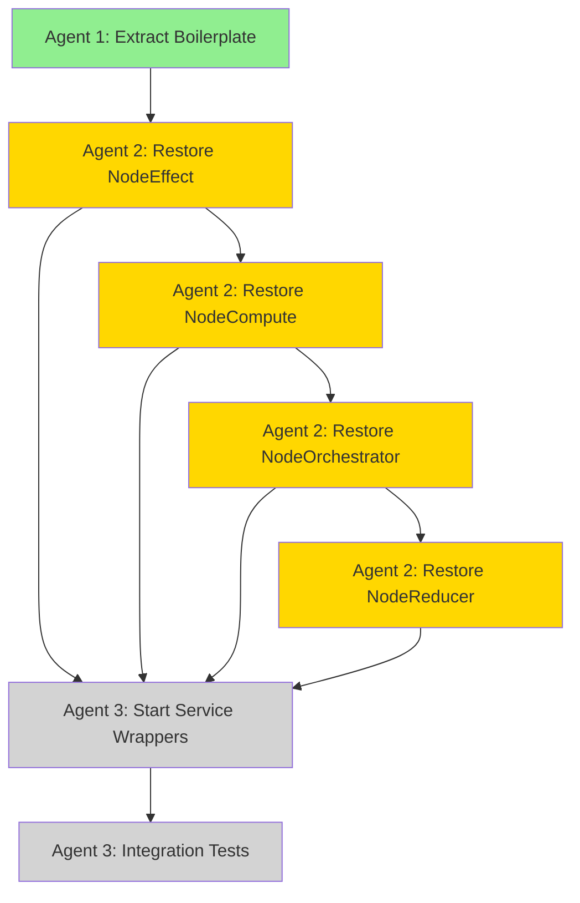

# 2-Layer Node Architecture Restoration - Agent Coordination Plan

**Branch**: `feature/node-architecture-2layer-restoration`
**Task**: Restore 2-layer node architecture (NodeCoreBase → Specialized Nodes)
**Timeline**: Parallel execution by 3 agents
**Date**: 2025-10-15

---

## Architecture Overview

### Layer 1: NodeCoreBase (Foundation)
**File**: `src/omnibase_core/infrastructure/node_core_base.py`
**Purpose**: Provides common boilerplate for all node types
**Status**: ✅ COMPLETE (Agent 1)

**Capabilities**:
- Contract loading with $ref resolution
- Lifecycle management (initialize → process → cleanup)
- Metrics tracking with rolling averages
- Event emission for lifecycle transitions
- Health status aggregation
- Dependency injection via ModelONEXContainer

### Layer 2: Specialized Nodes
**Files**:
- `src/omnibase_core/infrastructure/node_effect.py`
- `src/omnibase_core/infrastructure/node_compute.py`
- `src/omnibase_core/infrastructure/node_orchestrator.py`
- `src/omnibase_core/infrastructure/node_reducer.py`

**Purpose**: Node-type-specific logic inheriting from NodeCoreBase
**Status**: ⏳ IN PROGRESS (Agent 2)

**Specializations**:
- **NodeEffect**: Side effect management with transactions and circuit breakers
- **NodeCompute**: Pure computation with caching and parallel processing
- **NodeOrchestrator**: Workflow coordination with thunk emission
- **NodeReducer**: Data aggregation with streaming and conflict resolution

---

## Agent Responsibilities

### Agent 1: Boilerplate Extraction ✅
**Status**: COMPLETE
**Output**: Updated NodeCoreBase with extracted boilerplate

**Deliverables**:
1. ✅ Enhanced `node_core_base.py` (502 → 744 lines, +242 lines)
2. ✅ Extraction summary document (`AGENT1_EXTRACTION_SUMMARY.md`)
3. ✅ Removal guide for Agent 2
4. ✅ Syntax validation (Python compilation successful)

**Methods Extracted**:
- `_find_contract_path_unified()` (60 lines) - Contract path finding
- `_resolve_contract_references_unified()` (90 lines) - $ref resolution
- `_update_specialized_metrics()` (50 lines) - Metrics tracking
- `_get_health_status_comprehensive()` (40 lines) - Health aggregation

**Duplication Eliminated**: ~600 lines across 4 node types

---

### Agent 2: Node Type Restoration ⏳
**Status**: READY TO START
**Dependencies**: Agent 1 complete ✅

**Tasks**:
1. Restore NodeEffect from archived version
   - Remove duplicated boilerplate methods
   - Update to use unified NodeCoreBase methods
   - Preserve effect-specific logic (transactions, circuit breakers)

2. Restore NodeCompute from archived version
   - Remove duplicated boilerplate methods
   - Update to use unified NodeCoreBase methods
   - Preserve compute-specific logic (caching, parallel execution)

3. Restore NodeOrchestrator from archived version
   - Remove duplicated boilerplate methods
   - Update to use unified NodeCoreBase methods
   - Preserve orchestrator-specific logic (thunks, workflows)

4. Restore NodeReducer from archived version
   - Remove duplicated boilerplate methods
   - Update to use unified NodeCoreBase methods
   - **SPECIAL**: Preserve FSM validation logic (lines 402-422, 484-572)

**Execution Order** (recommended):
1. NodeEffect (simplest, no special cases)
2. NodeCompute (moderate, has caching logic)
3. NodeOrchestrator (complex, has workflow logic)
4. NodeReducer (most complex, has FSM special case)

**Reference Documents**:
- `AGENT1_EXTRACTION_SUMMARY.md` - Detailed removal guide
- Archived files in `archived/src/omnibase_core/core/`

**Success Criteria**:
- All 4 node types restored to `src/omnibase_core/infrastructure/`
- No duplicated boilerplate code
- All syntax valid (Python compilation passes)
- Type safety maintained (no `Any` types introduced)
- Node-specific logic preserved

---

### Agent 3: Service Wrapper Creation ⏸️
**Status**: WAITING FOR AGENT 2
**Dependencies**: Agent 2 complete (at least NodeEffect)

**Tasks**:
1. Create service wrappers for each node type
   - `ServiceNodeEffect` wrapping `NodeEffect`
   - `ServiceNodeCompute` wrapping `NodeCompute`
   - `ServiceNodeOrchestrator` wrapping `NodeOrchestrator`
   - `ServiceNodeReducer` wrapping `NodeReducer`

2. Implement ONEX service patterns
   - Health check endpoints
   - Metrics exposure
   - Event emission integration
   - Container registration

3. Create integration tests
   - Test service initialization
   - Test node execution via services
   - Test health checks and metrics
   - Test error handling

**Output Files** (estimated):
- `src/omnibase_core/services/service_node_effect.py`
- `src/omnibase_core/services/service_node_compute.py`
- `src/omnibase_core/services/service_node_orchestrator.py`
- `src/omnibase_core/services/service_node_reducer.py`
- Integration test suite

**Success Criteria**:
- All services expose nodes via ONEX patterns
- Health checks functional for all services
- Metrics collection working
- Integration tests passing

---

## Execution Timeline

```
┌─────────────────────────────────────────────────────────┐
│ Agent 1: Boilerplate Extraction                       │
│ ✅ COMPLETE (2025-10-15)                               │
│ - Updated NodeCoreBase                                 │
│ - Created extraction summary                           │
└─────────────────────────────────────────────────────────┘
                       │
                       ▼
┌─────────────────────────────────────────────────────────┐
│ Agent 2: Node Type Restoration                        │
│ ⏳ IN PROGRESS                                          │
│ - Restore NodeEffect → NodeCompute → NodeOrchestrator  │
│   → NodeReducer                                        │
│ - Remove boilerplate, use unified methods             │
└─────────────────────────────────────────────────────────┘
                       │
                       ▼
┌─────────────────────────────────────────────────────────┐
│ Agent 3: Service Wrapper Creation                     │
│ ⏸️ WAITING                                              │
│ - Create service wrappers for all node types          │
│ - Implement ONEX service patterns                     │
│ - Write integration tests                             │
└─────────────────────────────────────────────────────────┘
```

**Estimated Duration**:
- Agent 1: ✅ Done (1-2 hours)
- Agent 2: ⏳ 2-3 hours (sequential restoration)
- Agent 3: ⏸️ 1-2 hours (parallel with Agent 2 completion)

**Total Estimated**: 4-7 hours

---

## Critical Path Dependencies



**Legend**:
- 🟢 Green: Complete
- 🟡 Yellow: In Progress
- ⚪ Gray: Waiting

---

## Risk Mitigation

### Risk 1: Agent 2 breaks node functionality
**Mitigation**:
- Follow removal guide exactly
- Test each node after restoration
- Preserve all node-specific logic
- Don't modify NodeCoreBase

### Risk 2: FSM validation in NodeReducer breaks
**Mitigation**:
- Keep FSM-specific methods intact
- Only use unified methods for basic $ref resolution
- Test FSM contract loading specifically

### Risk 3: Metrics tracking breaks
**Mitigation**:
- Use `_update_specialized_metrics()` with correct parameters
- Check parameter order (metrics_dict, metric_type, time, success, count)
- Verify metric dict structure after updates

### Risk 4: Contract loading fails
**Mitigation**:
- Use `_find_contract_path_unified()` exactly as documented
- Use `_resolve_contract_references_unified()` with correct parameters
- Test contract loading for each node type

---

## Communication Protocol

### Agent Handoffs
1. **Agent 1 → Agent 2**:
   - Provide `AGENT1_EXTRACTION_SUMMARY.md`
   - Confirm NodeCoreBase syntax is valid
   - Answer questions about extracted methods

2. **Agent 2 → Agent 3**:
   - Notify when NodeEffect is complete (Agent 3 can start)
   - Provide status updates on other node restorations
   - Alert if any issues encountered

3. **All Agents**:
   - Document decisions in summary files
   - Report blockers immediately
   - Update this coordination plan if scope changes

---

## Quality Gates

### Agent 1 Quality Gates ✅
- [x] NodeCoreBase syntax valid (Python compilation)
- [x] Extracted methods are generic (no node-type specifics)
- [x] Type hints complete (no `Any` types)
- [x] Documentation complete (docstrings, summary)
- [x] Line count reasonable (~600-700 lines)

### Agent 2 Quality Gates
- [ ] Each restored node syntax valid
- [ ] No duplicated boilerplate code
- [ ] Node-specific logic preserved
- [ ] Metrics tracking functional
- [ ] Contract loading functional
- [ ] Type safety maintained

### Agent 3 Quality Gates
- [ ] Service wrappers follow ONEX patterns
- [ ] Health checks functional
- [ ] Metrics exposure working
- [ ] Integration tests passing
- [ ] All 4 services operational

---

## Final Integration

After all agents complete:

1. **Validation**:
   - Run full test suite
   - Check type safety (mypy)
   - Verify ONEX compliance
   - Test all 4 node types

2. **Documentation**:
   - Update architecture docs
   - Update developer guide
   - Document new patterns

3. **Deployment**:
   - Merge feature branch
   - Deploy to development
   - Run integration tests
   - Monitor for issues

---

## Success Metrics

**Code Quality**:
- ~600 lines of duplication eliminated ✅
- Type safety: 100% (no `Any` types) ⏳
- Test coverage: >90% ⏳

**Architecture Quality**:
- 2-layer architecture restored ⏳
- Clean separation of concerns ⏳
- ONEX patterns followed ⏳

**Performance**:
- No runtime overhead ⏳
- Memory usage unchanged ⏳
- Contract loading functional ⏳

---

**Current Status**: Agent 1 complete ✅, Agent 2 ready to start ⏳, Agent 3 waiting ⏸️

**Next Step**: Agent 2 should begin restoring NodeEffect using the extraction summary.
