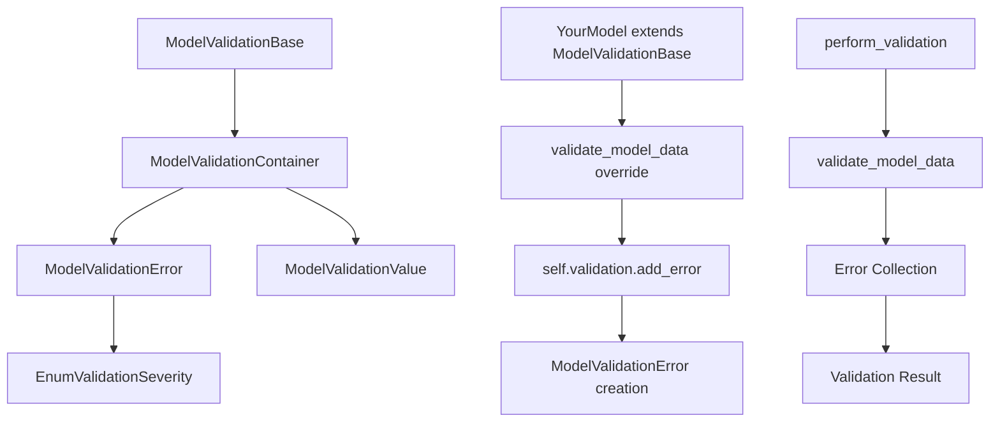

# Validation Hook System Documentation

## 🎯 Overview

The ONEX Validation Hook System provides a comprehensive, unified approach to validation across the entire omnibase_core codebase. This system replaces scattered validation logic with a centralized, extensible framework that ensures consistent validation patterns and error handling.

## 🏗️ Architecture

### System Components

```
Validation Hook System Architecture
├── ModelValidationContainer        # Central validation aggregator
├── ModelValidationBase            # Mixin for validation capabilities
├── ModelValidationError           # Structured error representation
├── ModelValidationValue           # Type-safe validation values
├── EnumValidationSeverity         # Error severity classification
└── Performance Testing Framework  # Resource monitoring and optimization
```

### Component Relationships



## 📝 Core API Reference

### 1. ModelValidationContainer

**Purpose**: Central aggregator for validation results with comprehensive error management.

#### Key Methods

```python
class ModelValidationContainer(BaseModel):
    """Generic container for validation results and error aggregation."""

    # Error Management
    def add_error(
        self,
        message: str,
        field: str | None = None,
        error_code: str | None = None,
        details: dict[str, ModelValidationValue] | None = None,
    ) -> None:
        """Add a standard validation error."""

    def add_critical_error(
        self,
        message: str,
        field: str | None = None,
        error_code: str | None = None,
        details: dict[str, ModelValidationValue] | None = None,
    ) -> None:
        """Add a critical validation error."""

    def add_warning(self, message: str) -> None:
        """Add a warning message (deduplicated)."""

    # Raw Details Conversion (for convenience)
    def add_error_with_raw_details(
        self,
        message: str,
        field: str | None = None,
        error_code: str | None = None,
        raw_details: dict[str, object] | None = None,
    ) -> None:
        """Add error with automatic conversion of raw details."""

    # Validation State Queries
    def has_errors(self) -> bool:
        """Check if there are any errors."""

    def has_critical_errors(self) -> bool:
        """Check if there are any critical errors."""

    def has_warnings(self) -> bool:
        """Check if there are any warnings."""

    def is_valid(self) -> bool:
        """Check if validation passed (no errors)."""

    # Error Reporting
    def get_error_count(self) -> int:
        """Get total error count."""

    def get_critical_error_count(self) -> int:
        """Get critical error count."""

    def get_warning_count(self) -> int:
        """Get warning count."""

    def get_error_summary(self) -> str:
        """Get formatted error summary."""

    def get_all_error_messages(self) -> list[str]:
        """Get all error messages as strings."""

    def get_critical_error_messages(self) -> list[str]:
        """Get all critical error messages."""

    def get_errors_by_field(self, field_name: str) -> list[ModelValidationError]:
        """Get all errors for a specific field."""

    # Container Management
    def clear_all(self) -> None:
        """Clear all errors and warnings."""

    def clear_errors(self) -> None:
        """Clear only errors, keep warnings."""

    def clear_warnings(self) -> None:
        """Clear only warnings, keep errors."""

    def merge_from(self, other: ModelValidationContainer) -> None:
        """Merge validation results from another container."""
```

#### Usage Examples

```python
# Basic error management
container = ModelValidationContainer()

# Add various types of errors
container.add_error("Invalid email format", field="email", error_code="INVALID_EMAIL")
container.add_critical_error("Database connection failed", error_code="DB_CONNECTION")
container.add_warning("Performance may be impacted with large datasets")

# Check validation state
if container.is_valid():
    print("All validations passed")
else:
    print(f"Validation failed: {container.get_error_summary()}")

# Get detailed error information
for error in container.errors:
    print(f"Error: {error.message} (Field: {error.field_display_name})")
```

### 2. ModelValidationBase (Validated Model Mixin)

**Purpose**: Mixin that provides validation capabilities to any Pydantic model.

#### Core Implementation

```python
class ModelValidationBase(BaseModel):
    """Mixin for models that need validation capabilities."""

    validation: ModelValidationContainer = Field(
        default_factory=lambda: ModelValidationContainer(),
        description="Validation results container",
    )

    # Core Validation Interface
    def validate_model_data(self) -> None:
        """
        Override in subclasses for custom validation logic.

        Base implementation performs fundamental validation:
        - Validation container integrity
        - Model field accessibility
        - Serialization integrity
        - Circular reference detection
        """

    def perform_validation(self) -> bool:
        """
        Perform validation and return success status.

        Process:
        1. Clear previous validation results
        2. Run validate_model_data()
        3. Return success status (True if no errors)
        """

    # Convenience Methods
    def is_valid(self) -> bool:
        """Check if model is valid (no validation errors)."""

    def has_validation_errors(self) -> bool:
        """Check if there are validation errors."""

    def has_critical_validation_errors(self) -> bool:
        """Check if there are critical validation errors."""

    def add_validation_error(
        self,
        message: str,
        field: str | None = None,
        error_code: str | None = None,
        critical: bool = False,
    ) -> None:
        """Add a validation error to this model."""

    def add_validation_warning(self, message: str) -> None:
        """Add a validation warning to this model."""

    def get_validation_summary(self) -> str:
        """Get validation summary for this model."""
```

#### Enhanced Base Validation (Auto-Applied)

The base `validate_model_data()` implementation provides comprehensive fundamental checks:

```python
def validate_model_data(self) -> None:
    """Base implementation with fundamental validation checks."""

    # 1. Validation Container Integrity
    if self.validation is None:
        self.add_validation_error(
            message="Validation container is not initialized",
            field="validation",
            critical=True
        )
        return

    # 2. Model Field Accessibility
    try:
        model_fields = self.model_fields
        if not model_fields:
            self.add_validation_warning(
                "Model has no defined fields - this may indicate a configuration issue"
            )
        else:
            # Check for required fields that are None
            for field_name, field_info in model_fields.items():
                if field_name == "validation":
                    continue

                field_value = getattr(self, field_name, None)

                if (hasattr(field_info, 'is_required') and
                    getattr(field_info, 'is_required', False) and
                    field_value is None):
                    self.add_validation_error(
                        message=f"Required field '{field_name}' is None or missing",
                        field=field_name
                    )
    except Exception as field_error:
        self.add_validation_error(
            message=f"Failed to access model fields: {str(field_error)}",
            field="model_structure"
        )

    # 3. Serialization Integrity Check
    try:
        model_dict = self.model_dump(exclude={"validation"})
        if not isinstance(model_dict, dict):
            self.add_validation_error(
                message="Model serialization failed",
                field="model_integrity"
            )
    except Exception as serialize_error:
        self.add_validation_error(
            message=f"Model serialization failed: {str(serialize_error)}",
            field="model_integrity"
        )

    # 4. Circular Reference Detection
    try:
        import json
        json.dumps(self.model_dump(exclude={"validation"}), default=str)
    except (ValueError, TypeError, RecursionError) as json_error:
        if "circular reference" in str(json_error).lower() or isinstance(json_error, RecursionError):
            self.add_validation_error(
                message="Model contains circular references",
                field="model_structure",
                critical=True
            )
        else:
            self.add_validation_warning(
                f"Model may have serialization issues: {str(json_error)}"
            )
```

#### Usage Pattern

```python
class UserModel(ModelValidationBase):
    """Example user model with validation."""

    name: str
    email: str
    age: int
    tags: list[str] = Field(default_factory=list)

    def validate_model_data(self) -> None:
        """Custom validation logic."""
        # Call base validation first (recommended)
        super().validate_model_data()

        # Custom validations
        if len(self.name) < 2:
            self.add_validation_error(
                message="Name must be at least 2 characters",
                field="name",
                error_code="NAME_TOO_SHORT"
            )

        if "@" not in self.email:
            self.add_validation_error(
                message="Invalid email format",
                field="email",
                error_code="INVALID_EMAIL"
            )

        if self.age < 0:
            self.add_validation_error(
                message="Age cannot be negative",
                field="age",
                error_code="INVALID_AGE",
                critical=True  # Critical error
            )
        elif self.age < 18:
            self.add_validation_warning(
                "User is under 18 years old"
            )

        if len(self.tags) > 10:
            self.add_validation_error(
                message="Too many tags (maximum 10 allowed)",
                field="tags",
                error_code="TOO_MANY_TAGS"
            )

# Usage
user = UserModel(name="Jo", email="invalid-email", age=-1, tags=["tag"] * 15)

# Perform validation
if user.perform_validation():
    print("User is valid!")
    # Process user...
else:
    print(f"Validation failed: {user.get_validation_summary()}")

    # Get detailed error information
    if user.has_critical_validation_errors():
        print("Critical errors found!")
        for msg in user.validation.get_critical_error_messages():
            print(f"  CRITICAL: {msg}")

    # Show all errors
    for error in user.validation.errors:
        severity = "CRITICAL" if error.is_critical() else "ERROR"
        print(f"  {severity}: {error.message} (Field: {error.field_display_name})")
```

### 3. ModelValidationError

**Purpose**: Structured representation of validation errors with comprehensive context.

#### Complete API

```python
class ModelValidationError(BaseModel):
    """Validation error information with comprehensive context."""

    # Core Fields
    message: str                        # Error description (1-1000 chars)
    severity: EnumValidationSeverity    # CRITICAL, ERROR, WARNING, INFO
    field_id: UUID | None              # Generated UUID for field identification
    field_display_name: str | None     # Human-readable field name
    error_code: str | None             # Programmatic error code (uppercase)
    details: dict[str, ModelValidationValue] | None  # Additional context
    line_number: int | None            # Source code location (1-1,000,000)
    column_number: int | None          # Source code location (1-10,000)

    # Classification Methods
    def is_critical(self) -> bool:
        """Check if this is a critical error."""

    def is_error(self) -> bool:
        """Check if this is an error (error or critical)."""

    def is_warning(self) -> bool:
        """Check if this is a warning."""

    def is_info(self) -> bool:
        """Check if this is an info message."""

    # Factory Methods
    @classmethod
    def create_error(
        cls,
        message: str,
        field_name: str | None = None,
        error_code: str | None = None,
    ) -> ModelValidationError:
        """Create a standard error."""

    @classmethod
    def create_critical(
        cls,
        message: str,
        field_name: str | None = None,
        error_code: str | None = None,
    ) -> ModelValidationError:
        """Create a critical error."""

    @classmethod
    def create_warning(
        cls,
        message: str,
        field_name: str | None = None,
        error_code: str | None = None,
    ) -> ModelValidationError:
        """Create a warning."""
```

#### Usage Examples

```python
# Direct error creation
error = ModelValidationError.create_error(
    message="Email format is invalid",
    field_name="email",
    error_code="INVALID_EMAIL_FORMAT"
)

# Critical error with additional context
critical_error = ModelValidationError.create_critical(
    message="Database connection failed",
    error_code="DB_CONNECTION_FAILED"
)

# Error classification
if error.is_critical():
    print("This is a critical error!")
elif error.is_error():
    print("This is a standard error")

# Field identification (automatically generated UUID)
print(f"Field ID: {error.field_id}")
print(f"Field Name: {error.field_display_name}")
```

### 4. EnumValidationSeverity

**Purpose**: Classification system for validation message severity levels.

```python
class EnumValidationSeverity(str, Enum):
    """Validation severity levels."""

    CRITICAL = "critical"    # System-breaking errors
    ERROR = "error"         # Standard validation failures
    WARNING = "warning"     # Non-blocking issues
    INFO = "info"          # Informational messages
```

#### Severity Guidelines

| Severity | Use Case | Example |
|----------|----------|---------|
| **CRITICAL** | System-breaking errors that prevent operation | Database connection failure, circular references |
| **ERROR** | Validation failures that should block processing | Required field missing, invalid format |
| **WARNING** | Non-blocking issues that may impact functionality | Performance concerns, deprecated usage |
| **INFO** | Informational messages for debugging/logging | Validation completed, field processed |

## 🎯 Integration Patterns

### 1. Basic Model Validation

```python
from omnibase_core.models.validation.model_validation_base import ModelValidationBase

class ProductModel(ModelValidationBase):
    """Product model with comprehensive validation."""

    name: str
    price: float
    category: str
    tags: list[str] = Field(default_factory=list)

    def validate_model_data(self) -> None:
        """Product-specific validation rules."""
        super().validate_model_data()  # Always call base validation

        # Business logic validation
        if not self.name.strip():
            self.add_validation_error(
                message="Product name cannot be empty",
                field="name",
                error_code="EMPTY_NAME"
            )

        if self.price < 0:
            self.add_validation_error(
                message="Price cannot be negative",
                field="price",
                error_code="NEGATIVE_PRICE"
            )

        if self.category not in ["electronics", "books", "clothing"]:
            self.add_validation_warning(
                f"Unknown category '{self.category}' - may impact categorization"
            )
```

### 2. Complex Validation Scenarios

```python
class OrderModel(ModelValidationBase):
    """Order model with cross-field validation."""

    customer_id: str
    products: list[ProductModel]
    discount_percent: float = 0.0
    tax_rate: float = 0.0

    def validate_model_data(self) -> None:
        """Order validation with cross-field checks."""
        super().validate_model_data()

        # Validate products collection
        if not self.products:
            self.add_validation_error(
                message="Order must contain at least one product",
                field="products",
                error_code="EMPTY_ORDER"
            )

        # Validate each product in the order
        for i, product in enumerate(self.products):
            if not product.perform_validation():
                # Merge product validation errors
                product_errors = product.validation.errors
                for error in product_errors:
                    self.validation.add_validation_error(
                        ModelValidationError.create_error(
                            message=f"Product {i+1}: {error.message}",
                            field_name=f"products[{i}].{error.field_display_name}",
                            error_code=error.error_code
                        )
                    )

        # Validate business rules
        if self.discount_percent > 50:
            self.add_validation_warning(
                "Large discount may impact profit margins"
            )

        # Cross-field validation
        total_value = sum(p.price for p in self.products)
        if total_value < 10 and self.discount_percent > 0:
            self.add_validation_error(
                message="Discount cannot be applied to orders under $10",
                field="discount_percent",
                error_code="INVALID_DISCOUNT"
            )
```

### 3. Validation Container Aggregation

```python
def validate_bulk_products(products: list[ProductModel]) -> ModelValidationContainer:
    """Validate multiple products and aggregate results."""

    aggregated_validation = ModelValidationContainer()

    for i, product in enumerate(products):
        if not product.perform_validation():
            # Add context to each error
            for error in product.validation.errors:
                aggregated_validation.add_error(
                    message=f"Product {i+1}: {error.message}",
                    field=f"products[{i}].{error.field_display_name}",
                    error_code=error.error_code
                )

            # Include warnings too
            for warning in product.validation.warnings:
                aggregated_validation.add_warning(
                    f"Product {i+1}: {warning}"
                )

    return aggregated_validation

# Usage
products = [ProductModel(name="", price=-10), ProductModel(name="Valid", price=25)]
validation = validate_bulk_products(products)

if validation.is_valid():
    print("All products are valid")
else:
    print(f"Validation failed: {validation.get_error_summary()}")
```

## 🔧 Advanced Features

### 1. Custom Error Details

```python
class FileUploadModel(ModelValidationBase):
    """File upload model with detailed validation."""

    filename: str
    size_bytes: int
    content_type: str

    def validate_model_data(self) -> None:
        """File validation with detailed error context."""
        super().validate_model_data()

        # Validate file size with detailed context
        if self.size_bytes > 10 * 1024 * 1024:  # 10MB limit
            size_mb = self.size_bytes / (1024 * 1024)
            self.validation.add_error_with_raw_details(
                message=f"File size {size_mb:.1f}MB exceeds limit of 10MB",
                field="size_bytes",
                error_code="FILE_TOO_LARGE",
                raw_details={
                    "actual_size_bytes": self.size_bytes,
                    "actual_size_mb": size_mb,
                    "max_size_bytes": 10 * 1024 * 1024,
                    "max_size_mb": 10.0
                }
            )

        # Validate file type
        allowed_types = ["image/jpeg", "image/png", "application/pdf"]
        if self.content_type not in allowed_types:
            self.validation.add_error_with_raw_details(
                message=f"Unsupported file type: {self.content_type}",
                field="content_type",
                error_code="UNSUPPORTED_FILE_TYPE",
                raw_details={
                    "provided_type": self.content_type,
                    "allowed_types": allowed_types
                }
            )
```

### 2. Conditional Validation Logic

```python
class PaymentModel(ModelValidationBase):
    """Payment model with conditional validation."""

    payment_method: str  # "credit_card" or "bank_transfer"
    credit_card_number: str | None = None
    bank_account_number: str | None = None
    amount: float

    def validate_model_data(self) -> None:
        """Payment validation with conditional logic."""
        super().validate_model_data()

        # Method-specific validation
        if self.payment_method == "credit_card":
            if not self.credit_card_number:
                self.add_validation_error(
                    message="Credit card number is required for credit card payments",
                    field="credit_card_number",
                    error_code="MISSING_CARD_NUMBER",
                    critical=True
                )
            elif len(self.credit_card_number.replace("-", "")) != 16:
                self.add_validation_error(
                    message="Credit card number must be 16 digits",
                    field="credit_card_number",
                    error_code="INVALID_CARD_NUMBER"
                )

        elif self.payment_method == "bank_transfer":
            if not self.bank_account_number:
                self.add_validation_error(
                    message="Bank account number is required for bank transfers",
                    field="bank_account_number",
                    error_code="MISSING_ACCOUNT_NUMBER",
                    critical=True
                )

        else:
            self.add_validation_error(
                message=f"Unsupported payment method: {self.payment_method}",
                field="payment_method",
                error_code="UNSUPPORTED_PAYMENT_METHOD"
            )

        # Universal validations
        if self.amount <= 0:
            self.add_validation_error(
                message="Payment amount must be positive",
                field="amount",
                error_code="INVALID_AMOUNT",
                critical=True
            )
```

## ⚡ Performance Considerations

### 1. Validation Performance Monitoring

The system includes comprehensive performance monitoring capabilities:

```python
import psutil
import time

class ValidationPerformanceMonitor:
    """Monitor validation performance and resource usage."""

    def __init__(self):
        self.process = psutil.Process()
        self.initial_memory = self.get_memory_usage()

    def get_memory_usage(self) -> float:
        """Get current memory usage in MB."""
        return self.process.memory_info().rss / 1024 / 1024

    def monitor_validation(self, model: ModelValidationBase):
        """Monitor a single model validation."""
        start_time = time.time()
        start_memory = self.get_memory_usage()

        # Perform validation
        result = model.perform_validation()

        # Calculate metrics
        duration = time.time() - start_time
        memory_delta = self.get_memory_usage() - start_memory

        return {
            "success": result,
            "duration_ms": duration * 1000,
            "memory_delta_mb": memory_delta,
            "error_count": model.validation.get_error_count(),
            "warning_count": model.validation.get_warning_count()
        }
```

### 2. Batch Validation Optimization

```python
def validate_models_batch(
    models: list[ModelValidationBase],
    max_errors: int = 100
) -> ModelValidationContainer:
    """Optimized batch validation with early termination."""

    aggregated = ModelValidationContainer()

    for i, model in enumerate(models):
        # Early termination if too many errors
        if aggregated.get_error_count() >= max_errors:
            aggregated.add_warning(
                f"Validation stopped early due to error limit ({max_errors})"
            )
            break

        # Quick validation check
        if not model.perform_validation():
            # Merge errors with batch context
            for error in model.validation.errors:
                aggregated.add_error(
                    message=f"Item {i+1}: {error.message}",
                    field=f"items[{i}].{error.field_display_name}",
                    error_code=error.error_code
                )

    return aggregated
```

### 3. Memory-Efficient Validation

```python
def validate_large_dataset(data_iterator) -> ModelValidationContainer:
    """Memory-efficient validation for large datasets."""

    validation = ModelValidationContainer()
    processed_count = 0

    for item_data in data_iterator:
        try:
            # Create model instance
            model = YourModel(**item_data)

            # Validate
            if not model.perform_validation():
                # Extract only essential error information
                for error in model.validation.errors:
                    validation.add_error(
                        message=f"Record {processed_count}: {error.message}",
                        field=error.field_display_name,
                        error_code=error.error_code
                    )

            processed_count += 1

            # Memory cleanup every 1000 items
            if processed_count % 1000 == 0:
                import gc
                gc.collect()

        except Exception as e:
            validation.add_critical_error(
                message=f"Record {processed_count}: Processing failed: {str(e)}",
                error_code="PROCESSING_ERROR"
            )

    return validation
```

## 🧪 Testing Integration

### 1. Validation Test Utilities

```python
import pytest
from omnibase_core.models.validation.model_validation_container import ModelValidationContainer

class ValidationTestHelper:
    """Helper utilities for testing validation logic."""

    @staticmethod
    def assert_no_validation_errors(model: ModelValidationBase):
        """Assert that model has no validation errors."""
        assert model.perform_validation(), f"Validation failed: {model.get_validation_summary()}"

    @staticmethod
    def assert_validation_error(model: ModelValidationBase, expected_error_code: str):
        """Assert that model has specific validation error."""
        assert not model.perform_validation(), "Expected validation to fail"

        error_codes = [error.error_code for error in model.validation.errors]
        assert expected_error_code in error_codes, \
            f"Expected error code '{expected_error_code}' not found in {error_codes}"

    @staticmethod
    def assert_critical_error(model: ModelValidationBase):
        """Assert that model has critical validation errors."""
        model.perform_validation()
        assert model.has_critical_validation_errors(), \
            "Expected critical validation errors but none found"

# Usage in tests
def test_user_validation():
    """Test user model validation."""

    # Valid user
    valid_user = UserModel(name="John Doe", email="john@example.com", age=25)
    ValidationTestHelper.assert_no_validation_errors(valid_user)

    # Invalid email
    invalid_user = UserModel(name="John", email="invalid-email", age=25)
    ValidationTestHelper.assert_validation_error(invalid_user, "INVALID_EMAIL")

    # Critical age error
    critical_user = UserModel(name="John", email="john@example.com", age=-1)
    ValidationTestHelper.assert_critical_error(critical_user)
```

### 2. Performance Testing Integration

```python
def test_validation_performance():
    """Test validation performance requirements."""

    monitor = ValidationPerformanceMonitor()

    # Create test model
    model = UserModel(name="John Doe", email="john@example.com", age=25)

    # Monitor validation
    metrics = monitor.monitor_validation(model)

    # Assert performance requirements
    assert metrics["duration_ms"] < 100, \
        f"Validation took {metrics['duration_ms']:.2f}ms (should be < 100ms)"

    assert metrics["memory_delta_mb"] < 10, \
        f"Validation used {metrics['memory_delta_mb']:.2f}MB (should be < 10MB)"

    assert metrics["success"] is True, "Validation should succeed"
```

## 🔄 Migration Guide

### From Legacy Validation

#### Before (Legacy Pattern)
```python
def validate_user_data(user_data: dict) -> tuple[bool, list[str]]:
    errors = []

    if not user_data.get("name"):
        errors.append("Name is required")

    if "@" not in user_data.get("email", ""):
        errors.append("Invalid email")

    return len(errors) == 0, errors
```

#### After (Validation Hook Pattern)
```python
class UserModel(ModelValidationBase):
    name: str
    email: str

    def validate_model_data(self) -> None:
        super().validate_model_data()

        if not self.name:
            self.add_validation_error(
                message="Name is required",
                field="name",
                error_code="MISSING_NAME"
            )

        if "@" not in self.email:
            self.add_validation_error(
                message="Invalid email format",
                field="email",
                error_code="INVALID_EMAIL"
            )

# Usage
user = UserModel(name="", email="invalid")
if user.perform_validation():
    print("User is valid")
else:
    print(f"Errors: {user.get_validation_summary()}")
```

## 📚 Additional Resources

### Related Files
- `src/omnibase_core/models/validation/model_validation_container.py`
- `src/omnibase_core/models/validation/model_validation_base.py`
- `src/omnibase_core/models/validation/model_validation_error.py`
- `tests/unit/validation/` - Complete test suite

### Performance Testing
- `tests/unit/validation/test_validation_performance.py`
- Memory monitoring utilities
- Scalability testing framework

### Documentation
- `ONEX_COMPLIANCE_CHANGES_DOCUMENTATION.md`
- ONEX architecture patterns
- Type safety guidelines

---

**Document Version**: 1.0
**Generated**: 2025-01-15
**Status**: Complete Implementation
**Next Review**: Monthly performance assessment
