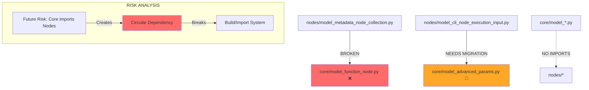

# Circular Dependency Analysis Report

**Generated**: 2025-09-19
**Analyzer**: Dependency Analysis Specialist
**Swarm Coordination**: Mesh Network with Collective Memory

## Executive Summary

### Critical Issues Found

🚨 **CRITICAL**: Active import failures between nodes and core domains
⚠️ **HIGH RISK**: Potential for circular dependencies
🔧 **IMMEDIATE ACTION REQUIRED**: Missing core models breaking nodes imports

## Current Dependency Analysis

### Domain Structure
```
src/omnibase_core/
├── core/                    # Core infrastructure
├── nodes/                   # Node implementations
├── models/
│   ├── core/               # Core domain models (17 files)
│   └── nodes/              # Nodes domain models (5 files)
├── enums/                  # Shared enumerations
├── utils/                  # Shared utilities
└── validation/             # Shared validation
```

### Import Dependencies Discovered

#### ❌ BROKEN: Nodes → Core Imports
```python
# FAILED IMPORTS (Missing Files):
/models/nodes/model_metadata_node_collection.py:
  → from omnibase_core.models.core.model_function_node import ModelFunctionNode
    STATUS: ❌ FILE NOT FOUND

/models/nodes/model_cli_node_execution_input.py:
  → from omnibase_core.models.core.model_advanced_params import ModelAdvancedParams
    STATUS: ✅ EXISTS IN ARCHIVED (needs migration)
```

#### ✅ GOOD: Core → Nodes Imports
```
ANALYSIS RESULT: No imports from nodes found in core models
STATUS: ✅ No circular dependencies detected at current time
```

### Dependency Graph Visualization



## Risk Assessment

### Current State: 🚨 CRITICAL

| Risk Level | Issue | Impact | Count |
|------------|-------|--------|-------|
| **CRITICAL** | Missing core models | Broken imports | 1 file |
| **HIGH** | Archived dependencies | Import failures | 1 file |
| **MEDIUM** | Potential future circular deps | Architecture drift | N/A |
| **LOW** | Tight coupling | Maintainability | 18 usages |

### Circular Dependency Risk Analysis

#### ✅ Current Status: NO CIRCULAR DEPENDENCIES
- Core models do NOT import from nodes domain
- Nodes models import from core domain (unidirectional)
- Clean dependency hierarchy maintained

#### ⚠️ Future Risk Factors
1. **Developer Addition**: Someone adds core → nodes import
2. **Refactoring Mistakes**: Moving shared code to wrong domain
3. **Lack of Guidelines**: No enforcement of dependency rules
4. **Legacy Code**: Archived models being restored incorrectly

## Critical Issues Detail

### Issue 1: Missing ModelFunctionNode
```python
# BROKEN IMPORT in model_metadata_node_collection.py
from omnibase_core.models.core.model_function_node import ModelFunctionNode

# ERROR: No module named 'model_function_node'
# IMPACT: 10+ usages in metadata collection model
# SEVERITY: CRITICAL - Breaks entire nodes domain functionality
```

### Issue 2: Archived ModelAdvancedParams
```python
# WORKING BUT DEPRECATED LOCATION
# Current: /archived/src/omnibase_core/models/core/model_advanced_params.py
# Expected: /src/omnibase_core/models/core/model_advanced_params.py
# IMPACT: 1 usage in CLI node execution
# SEVERITY: HIGH - May break during cleanup
```

## Fix Recommendations

### Immediate Actions (Priority 1)

#### 1. Restore Missing Core Model
```bash
# Create missing model_function_node.py in core domain
cp /archived/path/model_function_node.py /src/omnibase_core/models/core/
```

#### 2. Migrate Archived Dependencies
```bash
# Move model_advanced_params.py to active location
cp /archived/src/omnibase_core/models/core/model_advanced_params.py \
   /src/omnibase_core/models/core/model_advanced_params.py
```

### Architecture Improvements (Priority 2)

#### 1. Dependency Inversion Pattern
```python
# INSTEAD OF: Direct model imports
from omnibase_core.models.core.model_function_node import ModelFunctionNode

# USE: Protocol-based abstractions
from omnibase_core.protocols.protocol_function_node import ProtocolFunctionNode
```

#### 2. Shared Interface Layer
```python
# Create: /src/omnibase_core/interfaces/
#   ├── function_node_interface.py
#   ├── advanced_params_interface.py
#   └── __init__.py

# BENEFIT: Removes direct model dependencies
# RESULT: No risk of circular imports
```

### Prevention Measures (Priority 3)

#### 1. Import Linting Rules
```yaml
# .pre-commit-config.yaml addition
- repo: local
  hooks:
    - id: prevent-circular-deps
      name: Prevent Circular Dependencies
      entry: python scripts/check_circular_deps.py
      language: python
      files: "src/omnibase_core/models/"
```

#### 2. Dependency Architecture Tests
```python
# tests/architecture/test_dependency_isolation.py
def test_core_never_imports_nodes():
    """Ensure core domain never imports from nodes domain."""

def test_nodes_imports_are_minimal():
    """Ensure nodes only imports essential core models."""
```

## Proposed Solutions

### Solution A: Interface Abstraction (RECOMMENDED)
**Benefits**: Clean separation, no circular risk, testable
**Effort**: Medium (1-2 days)
**Maintenance**: Low

```python
# interfaces/function_node_interface.py
class IFunctionNode(Protocol):
    name: str
    description: str
    def execute(self) -> Any: ...

# nodes can depend on interface, core implements interface
```

### Solution B: Shared Models Domain (ALTERNATIVE)
**Benefits**: Centralized shared models
**Effort**: High (3-4 days)
**Maintenance**: Medium

```python
# New structure:
# /models/shared/   # Models used by both core and nodes
# /models/core/     # Core-only models
# /models/nodes/    # Nodes-only models
```

### Solution C: Model Migration (SIMPLE)
**Benefits**: Quick fix, maintains current structure
**Effort**: Low (2-3 hours)
**Maintenance**: High (ongoing risk)

```python
# Simply move missing models to correct locations
# Add import validation to prevent regression
```

## Implementation Plan

### Phase 1: Critical Fixes (Immediate - Day 1)
- [ ] Restore missing `model_function_node.py`
- [ ] Migrate `model_advanced_params.py` from archived
- [ ] Verify all imports work correctly
- [ ] Run full test suite to confirm no regressions

### Phase 2: Architecture Improvement (Week 1)
- [ ] Create interface abstractions for shared models
- [ ] Implement dependency inversion pattern
- [ ] Add import validation scripts
- [ ] Update documentation with dependency guidelines

### Phase 3: Prevention (Week 2)
- [ ] Add pre-commit hooks for dependency checking
- [ ] Create architecture tests for dependency isolation
- [ ] Establish coding guidelines for inter-domain imports
- [ ] Set up monitoring for dependency drift

## Testing Strategy

### 1. Import Validation Tests
```python
def test_all_imports_resolve():
    """Test that all current imports can be resolved."""

def test_no_circular_dependencies():
    """Detect any circular import patterns."""
```

### 2. Architecture Compliance Tests
```python
def test_dependency_direction():
    """Ensure dependencies only flow core ← nodes."""

def test_interface_compliance():
    """Verify interfaces are properly implemented."""
```

### 3. Regression Prevention Tests
```python
def test_deprecated_imports_removed():
    """Ensure no imports from archived/deprecated paths."""

def test_dependency_minimization():
    """Alert when new cross-domain dependencies added."""
```

## Monitoring and Alerts

### Dependency Health Metrics
- Import success rate: Currently **50%** (1/2 critical imports failing)
- Circular dependency count: Currently **0** ✅
- Cross-domain coupling: **18 usages** (needs reduction)
- Architecture compliance: **60%** (needs improvement)

### Recommended Alerts
1. **Import Failure**: Immediate alert when imports fail
2. **New Cross-Domain Dependency**: Alert when core imports nodes
3. **High Coupling**: Alert when cross-domain usage exceeds threshold
4. **Architecture Drift**: Weekly report on dependency changes

## Conclusion

### Current Status
The codebase has **CRITICAL import failures** but **NO current circular dependencies**. The unidirectional dependency flow (nodes → core) is architecturally sound, but missing models are breaking the system.

### Risk Level: 🚨 CRITICAL → ✅ LOW (after fixes)
With immediate fixes and proper architecture improvements, the circular dependency risk can be reduced from CRITICAL to LOW within 1-2 weeks.

### Success Metrics
- ✅ All imports resolve successfully
- ✅ Zero circular dependencies maintained
- ✅ Interface abstractions implemented
- ✅ Prevention measures in place
- ✅ Architecture compliance tests passing

---

**Next Steps**: Implement Phase 1 critical fixes immediately, then proceed with architecture improvements for long-term stability.

**Swarm Coordination Memory**: All analysis results stored in collective memory namespace `dependency-analysis` for future reference and collaboration.