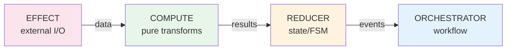

> **Navigation**: Home (You are here)

# ONEX Core Documentation

Welcome to the ONEX Core (`omnibase_core`) documentation.

## Documentation Authority Model

| Source | Purpose | Authority |
|--------|---------|-----------|
| **[CLAUDE.md](../CLAUDE.md)** | Coding standards, rules, conventions | **Authoritative** - definitive rules for agents and developers |
| **docs/** | Explanations, examples, tutorials, references | Supplementary - context and how-to guidance |

**When in conflict, CLAUDE.md takes precedence.** This separation ensures:
- Rules are concise and enforceable in CLAUDE.md
- Documentation provides depth without bloating the rules file
- Agents and developers have a single source of truth for coding standards

**Quick Reference:**
- Need a rule? Check [CLAUDE.md](../CLAUDE.md)
- Need an explanation? Check [docs/](.)
- Need an example? Check [docs/guides/](guides/node-building/README.md) or [docs/patterns/](patterns/CIRCUIT_BREAKER_PATTERN.md)

---

## How to Use These Docs

**New here?** Start with the [Quick Start Guide](getting-started/QUICK_START.md). It gets you running in 10 minutes.

**Building something?** The docs are organized by intent:
- **Getting Started** - Installation, first steps, first node
- **Guides** - Step-by-step tutorials (follow along)
- **Architecture** - How ONEX works (read when you need context)
- **Reference** - Look up syntax, templates, APIs (use as needed)
- **Patterns** - Battle-tested solutions (copy-paste encouraged)
- **Decisions** - Why things work this way (read when confused)
- **Standards** - Terminology and conventions (normative specifications)

**Found a gap?** File an issue. These docs grow from real usage, not speculation.

---

## Quick Navigation

| I want to... | Go to... |
|--------------|----------|
| Get started quickly | [Quick Start Guide](getting-started/QUICK_START.md) |
| Build my first node | [First Node Tutorial](getting-started/FIRST_NODE.md) |
| Understand node types | [Node Types Reference](guides/node-building/02_NODE_TYPES.md) |
| See a complete tutorial | [Node Building Guide](guides/node-building/README.md) |
| Use a production template | [Node Templates](guides/templates/COMPUTE_NODE_TEMPLATE.md) |
| Understand the architecture | [ONEX Four-Node Architecture](architecture/ONEX_FOUR_NODE_ARCHITECTURE.md) |
| Handle errors properly | [Error Handling Best Practices](conventions/ERROR_HANDLING_BEST_PRACTICES.md) |
| Find implementation patterns | [Patterns Catalog](guides/node-building/07_PATTERNS_CATALOG.md) |
| Run the demo system | [Beta Demo Guide](demo/BETA_DEMO_GUIDE.md) |

---

## Documentation Structure

### Getting Started

New to ONEX? Start here.

| Document | Description |
|----------|-------------|
| [Installation](getting-started/installation.md) | Environment setup with Poetry |
| [Quick Start](getting-started/QUICK_START.md) | First 10 minutes with omnibase_core |
| [First Node](getting-started/FIRST_NODE.md) | Build your first simple node |
| [README](../README.md) | Project overview and setup |
| [CONTRIBUTING](../CONTRIBUTING.md) | How to contribute |

### Guides

Step-by-step tutorials and examples.

#### Node Building Guide (10 tutorials)

| Document | Description |
|----------|-------------|
| [Overview](guides/node-building/README.md) | Guide navigation and overview |
| [What is a Node?](guides/node-building/01_WHAT_IS_A_NODE.md) | Fundamentals and concepts |
| [Node Types](guides/node-building/02_NODE_TYPES.md) | EFFECT, COMPUTE, REDUCER, ORCHESTRATOR |
| [COMPUTE Tutorial](guides/node-building/03_COMPUTE_NODE_TUTORIAL.md) | Build a price calculator |
| [EFFECT Tutorial](guides/node-building/04_EFFECT_NODE_TUTORIAL.md) | Build a file backup system |
| [REDUCER Tutorial](guides/node-building/05_REDUCER_NODE_TUTORIAL.md) | Build a metrics aggregator |
| [ORCHESTRATOR Tutorial](guides/node-building/06_ORCHESTRATOR_NODE_TUTORIAL.md) | Build a workflow coordinator |
| [Patterns Catalog](guides/node-building/07_PATTERNS_CATALOG.md) | Common patterns library |
| [Common Pitfalls](guides/node-building/08_COMMON_PITFALLS.md) | What to avoid |
| [Agent Templates](guides/node-building/10_AGENT_TEMPLATES.md) | AI-optimized templates |

#### Node Templates

| Document | Description |
|----------|-------------|
| [COMPUTE Template](guides/templates/COMPUTE_NODE_TEMPLATE.md) | Production-ready COMPUTE node |
| [EFFECT Template](guides/templates/EFFECT_NODE_TEMPLATE.md) | Production-ready EFFECT node |
| [REDUCER Template](guides/templates/REDUCER_NODE_TEMPLATE.md) | Production-ready REDUCER node |
| [ORCHESTRATOR Template](guides/templates/ORCHESTRATOR_NODE_TEMPLATE.md) | Production-ready ORCHESTRATOR node |

#### Other Guides

| Document | Description |
|----------|-------------|
| [Testing Guide](guides/TESTING_GUIDE.md) | Comprehensive testing strategies |
| [Threading Guide](guides/THREADING.md) | Thread safety and concurrency |
| [Migrating to Declarative Nodes](guides/MIGRATING_TO_DECLARATIVE_NODES.md) | v0.4.0 migration guide |
| [Handler Conversion Guide](guides/HANDLER_CONVERSION_GUIDE.md) | Mixin-to-handler conversion |
| [Execution Corpus Guide](guides/EXECUTION_CORPUS_GUIDE.md) | Test corpus usage |

### Architecture

Understand how ONEX works.

| Document | Description |
|----------|-------------|
| [Architecture Overview](architecture/overview.md) | High-level system design |
| [ONEX Four-Node Architecture](architecture/ONEX_FOUR_NODE_ARCHITECTURE.md) | Core ONEX node archetypes |
| [Canonical Execution Shapes](architecture/CANONICAL_EXECUTION_SHAPES.md) | Allowed/forbidden data flow patterns |
| [Execution Shape Examples](architecture/EXECUTION_SHAPE_EXAMPLES.md) | Practical shape examples |
| [Node Class Hierarchy](architecture/NODE_CLASS_HIERARCHY.md) | Class inheritance structure |
| [Container Types](architecture/CONTAINER_TYPES.md) | ModelContainer vs ModelONEXContainer |
| [Dependency Injection](architecture/DEPENDENCY_INJECTION.md) | DI patterns with ModelONEXContainer |
| [Contract System](architecture/CONTRACT_SYSTEM.md) | Contract architecture |
| [Subcontract Architecture](architecture/SUBCONTRACT_ARCHITECTURE.md) | Contract system design |
| [Protocol Architecture](architecture/PROTOCOL_ARCHITECTURE.md) | Protocol design and compliance |
| [Handler Architecture](architecture/HANDLER_ARCHITECTURE.md) | Handler system design and routing |
| [Mixin Architecture](architecture/MIXIN_ARCHITECTURE.md) | Mixin system design |
| [Message Topic Mapping](architecture/MESSAGE_TOPIC_MAPPING.md) | Event/Command/Intent routing |

### Contracts

Contract guides and DSL documentation.

| Document | Description |
|----------|-------------|
| [Handler Contract Guide](contracts/HANDLER_CONTRACT_GUIDE.md) | Handler contract structure, behavior descriptors, capabilities |
| [Operation Bindings DSL](contracts/OPERATION_BINDINGS_DSL.md) | Declarative handler wiring with expression syntax |
| [Introspection Subcontract Guide](contracts/INTROSPECTION_SUBCONTRACT_GUIDE.md) | Introspection and discovery configuration |

### Reference

Comprehensive reference documentation.

| Document | Description |
|----------|-------------|
| [API Documentation](reference/API_DOCUMENTATION.md) | Core API reference |
| [Nodes API](reference/api/nodes.md) | Node class APIs |
| [Models API](reference/api/models.md) | Model class APIs |
| [Enums API](reference/api/enums.md) | Enumeration reference |
| [Utils API](reference/api/utils.md) | Utility function reference |
| [Service Wrappers](reference/SERVICE_WRAPPERS.md) | Pre-composed node classes |
| [Validation Framework](reference/VALIDATION_FRAMEWORK.md) | Validation tools reference |
| [Contract Validator API](reference/CONTRACT_VALIDATOR_API.md) | Contract validation API |
| [CLAUDE.md](../CLAUDE.md) | Coding standards and rules |

### Patterns

Implementation patterns and best practices.

| Document | Description |
|----------|-------------|
| [Circuit Breaker](patterns/CIRCUIT_BREAKER_PATTERN.md) | Circuit breaker implementation |
| [Configuration Management](patterns/CONFIGURATION_MANAGEMENT.md) | Config patterns |
| [Custom Bool Pattern](patterns/CUSTOM_BOOL_PATTERN.md) | Result model truthiness |
| [Event-Driven Architecture](patterns/EVENT_DRIVEN_ARCHITECTURE.md) | Event-driven patterns |
| [Lease Management](patterns/LEASE_MANAGEMENT_PATTERN.md) | Lease-based coordination |
| [Pure FSM Reducer](patterns/PURE_FSM_REDUCER_PATTERN.md) | FSM-driven state management |
| [Approved Union Patterns](patterns/APPROVED_UNION_PATTERNS.md) | Type union patterns |
| [Anti-Patterns](patterns/ANTI_PATTERNS.md) | What to avoid |

### Decisions (ADRs)

Architecture Decision Records explaining why things work the way they do. [Full index](decisions/README.md).

| Document | Description |
|----------|-------------|
| [ADR Index](decisions/README.md) | All ADRs with categories |
| [ADR-001: Protocol-Based DI](decisions/ADR-001-protocol-based-di-architecture.md) | Dependency injection architecture |
| [ADR-002: Field Limit Constants](decisions/ADR-002-field-limit-constants.md) | Pydantic field limit constants |
| [ADR-003: Reducer Output Consistency](decisions/ADR-003-reducer-output-exception-consistency.md) | Exception handling strategy |
| [ADR-005: Core-Infra Boundary](decisions/ADR-005-core-infra-dependency-boundary.md) | Core-infra dependency boundary |
| [ADR-006: Status Taxonomy](decisions/ADR-006-status-taxonomy.md) | Status enum organization |
| [ADR-007: Context Mutability](decisions/ADR-007-context-mutability-design-decision.md) | Context design decisions |
| [ADR-012: Validator Error Handling](decisions/ADR-012-VALIDATOR-ERROR-HANDLING.md) | Error handling in validators |
| ADR-013: Status Taxonomy | Superseded — merged into ADR-006 |

### Conventions

Coding standards and naming conventions.

| Document | Description |
|----------|-------------|
| [Error Handling Best Practices](conventions/ERROR_HANDLING_BEST_PRACTICES.md) | Comprehensive error handling guide |
| [File Headers](conventions/FILE_HEADERS.md) | Python file header format |
| [Naming Conventions](conventions/NAMING_CONVENTIONS.md) | Naming standards |
| [Pydantic Best Practices](conventions/PYDANTIC_BEST_PRACTICES.md) | Pydantic model guidelines |
| [Terminology Guide](conventions/TERMINOLOGY_GUIDE.md) | Project terminology |

### Standards

Normative specifications and canonical references.

| Document | Description |
|----------|-------------|
| [CI/CD Standards](standards/CI_CD_STANDARDS.md) | CI/CD tier system, gate contracts, required-checks.yaml v2 schema |
| [ONEX Terminology](standards/onex_terminology.md) | Canonical ONEX definitions |
| [ONEX Topic Taxonomy](standards/onex_topic_taxonomy.md) | Kafka topic naming convention |

### Testing & CI

Testing documentation and CI/CD.

| Document | Description |
|----------|-------------|
| [Testing Guide](guides/TESTING_GUIDE.md) | Comprehensive testing strategies |
| [Integration Testing](testing/INTEGRATION_TESTING.md) | Integration test patterns |
| [CI Monitoring Guide](ci/CI_MONITORING_GUIDE.md) | CI performance monitoring |
| [Parallel Testing](testing/PARALLEL_TESTING.md) | Parallel test execution |
| [CI Test Strategy](testing/CI_TEST_STRATEGY.md) | CI/CD test strategy |
| [Core Purity Failure](ci/CORE_PURITY_FAILURE.md) | Fixing purity check failures |

### Demo

Demo scenarios and validation guides.

| Document | Description |
|----------|-------------|
| [Beta Demo Guide](demo/BETA_DEMO_GUIDE.md) | Comprehensive guide to the ONEX demo system |

---

## Core Concepts

### The Four Node Archetypes

#### ASCII Diagram

```text
┌─────────────┐    ┌─────────────┐    ┌─────────────┐    ┌─────────────┐
│   EFFECT    │───>│   COMPUTE   │───>│   REDUCER   │───>│ORCHESTRATOR │
│   (Input)   │    │ (Process)   │    │(Aggregate)  │    │(Coordinate) │
└─────────────┘    └─────────────┘    └─────────────┘    └─────────────┘
```

#### Mermaid Diagram



| Archetype | Purpose | Side Effects |
|-----------|---------|--------------|
| **EFFECT** | External I/O (databases, APIs, files) | Yes |
| **COMPUTE** | Pure transformations and validation | None (pure) |
| **REDUCER** | Manages state via FSM, emits intents | None (pure) |
| **ORCHESTRATOR** | Coordinates workflows, routes events | Publishes events |

### Contract-Driven Development

All behavior is declared in YAML contracts:
- Node configuration: Inputs, outputs, capabilities
- State machines: FSM transitions and actions
- Workflows: Execution graphs with dependencies
- I/O operations: External service interactions

### Key Design Rules

| Rule | Reason |
|------|--------|
| Always call `super().__init__(container)` | Base classes eliminate 80+ lines of boilerplate |
| Use protocol names for DI | `container.get_service("ProtocolLogger")` not `"LoggerService"` |
| No `dict[str, Any]` | Use TypedDict or Pydantic models for type safety |
| ORCHESTRATOR cannot return results | Only COMPUTE nodes return typed results |
| Always use Poetry | `uv run pytest`, never `python -m pytest` |

---

## Package Structure

```text
src/omnibase_core/
├── backends/               # Cache (Redis) and metrics (Prometheus, in-memory)
├── cli/                    # CLI commands
├── constants/              # Project constants
├── container/              # DI container implementation
├── context/                # Application context
├── contracts/              # Contract management
├── crypto/                 # Blake3 hashing, Ed25519 signing
├── decorators/             # Utility decorators (@standard_error_handling)
├── enums/                  # Core enumerations (300+ enums, 6 subdirectories)
├── errors/                 # Error handling (ModelOnexError)
├── factories/              # Contract and profile factories
├── infrastructure/         # Base node classes
├── integrations/           # External integrations
├── logging/                # Structured logging
├── merge/                  # Contract merge engine, conflict classifier
├── mixins/                 # Reusable behavior mixins (40+)
├── models/                 # Pydantic models (80+ subdirectories)
├── nodes/                  # EFFECT, COMPUTE, REDUCER, ORCHESTRATOR
├── pipeline/               # Execution plan builders, runners
├── protocols/              # Protocol definitions
├── rendering/              # Report renderers (CLI, HTML, JSON, Markdown, Diff)
├── resolution/             # Execution, handler, protocol dependency resolvers
├── runtime/                # Runtime components (FileRegistry)
├── schemas/                # JSON Schema definitions
├── services/               # Service implementations
├── tools/                  # Mypy plugins
├── types/                  # TypedDict definitions
├── utils/                  # Utility functions
└── validation/             # Validation framework + cross-repo validators + DB validators
```

---

## Getting Help

- **Code standards**: See [CLAUDE.md](../CLAUDE.md)
- **Patterns**: See [docs/patterns/](patterns/CIRCUIT_BREAKER_PATTERN.md)
- **Node building**: See [Node Building Guide](guides/node-building/README.md)
- **Issues**: Open an issue on GitHub

---

## Document Status

| Section | Status | Notes |
|---------|--------|-------|
| Getting Started | Complete | 3 guides available |
| Node Building | Complete | 10 tutorials |
| Architecture | Active | 40+ documents, growing with new subsystems |
| Contracts | Complete | 3 contract guides |
| Reference | Active | API docs, service wrappers, validation framework |
| Patterns | Complete | 8 pattern documents |
| Decisions | Active | 9+ ADRs in `decisions/` |
| Conventions | Complete | 5 convention docs |
| Standards | Complete | 3 normative specs |
| Testing | Complete | 7 testing guides |
