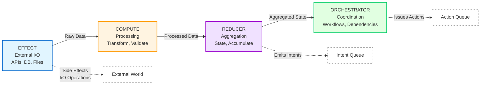
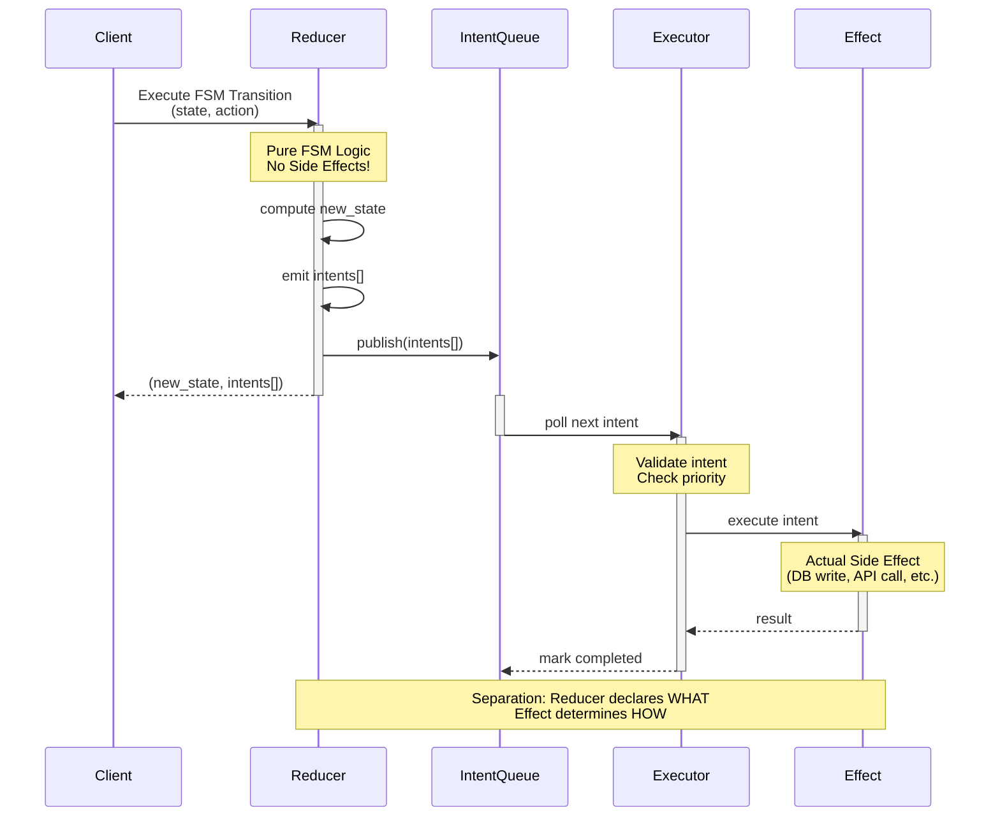
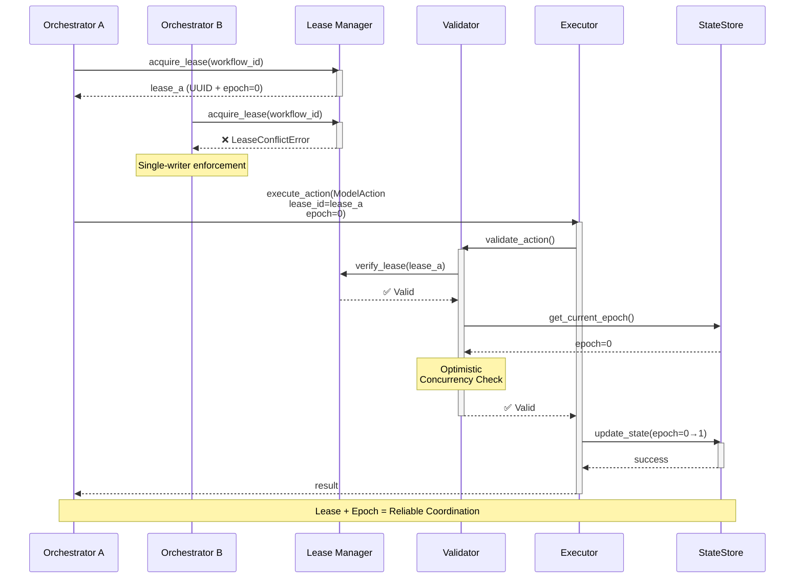

# ONEX Four-Node Architecture Documentation

> **Version**: 0.4.0
> **Last Updated**: 2025-12-05
> **Status**: Production

## Overview

The ONEX Four-Node Architecture is a foundational design pattern that provides structured, scalable, and maintainable microservice organization. Each node has specific responsibilities within the processing pipeline, enabling clear separation of concerns and optimal system performance.

### v0.4.0 Changes

In v0.4.0, the node architecture has been modernized:

- **NodeReducer**: Now FSM-driven via `MixinFSMExecution` (primary implementation)
- **NodeOrchestrator**: Now workflow-driven via `MixinWorkflowExecution` (primary implementation)
- **Legacy Implementations**: `NodeReducerLegacy` and `NodeOrchestratorLegacy` available in `nodes/legacy/` for backwards compatibility
- **Naming**: The "Declarative" suffix has been removed - FSM/workflow nodes ARE the standard implementation

## Architecture Pattern

### Visual Overview



### Data Flow Direction

The ONEX pattern enforces unidirectional data flow from left to right:
- **EFFECT** → **COMPUTE** → **REDUCER** → **ORCHESTRATOR**
- No backwards dependencies allowed
- Clear input/output contracts between nodes
- Deterministic processing pipeline

## Node Types and Responsibilities

### 1. EFFECT Node

**Primary Responsibility**: External system interactions and side effects

**Key Functions**:
- API calls to external services
- Database read/write operations
- File system operations
- Message queue interactions
- Third-party service integrations

**Design Principles**:
- Handle all external dependencies
- Implement retry logic and circuit breakers
- Provide idempotent operations where possible
- Maintain connection pooling and resource management
- Log all external interactions for audit trails

**Implementation Example**:

```
from omnibase_core.nodes.node_effect import NodeEffect
from omnibase_core.models.contracts.model_contract_effect import ModelContractEffect

class DatabaseEffectService(NodeEffect):
    """
    EFFECT node for database operations.

    Handles all database interactions with proper connection management,
    retry logic, and error handling.
    """

    def __init__(self, container: ModelONEXContainer):
        super().__init__(container)
        self.db_pool = container.get_service("ProtocolDatabasePool")
        self.logger = container.get_service("ProtocolLogger")

    async def execute_effect(self, contract: ModelContractEffect) -> ModelEffectOutput:
        """
        Execute database operation based on contract specification.

        Args:
            contract: Effect contract with operation details

        Returns:
            ModelEffectOutput: Operation results with metadata

        Raises:
            DatabaseConnectionError: If database is unreachable
            ModelOnexError: If contract validation fails
        """
        try:
            # Validate contract
            if not self._validate_database_contract(contract):
                raise ModelOnexError(
                    message="Invalid database contract",
                    correlation_id=contract.correlation_id
                )

            # Execute database operation with retry logic
            result = await self._execute_with_retry(contract)

            # Log successful operation
            self.logger.info(f"Database operation completed",
                           correlation_id=contract.correlation_id)

            return ModelEffectOutput(
                correlation_id=contract.correlation_id,
                operation_result=result,
                metadata=self._generate_metadata(contract)
            )

        except Exception as e:
            self.logger.error(f"Database operation failed: {e}",
                            correlation_id=contract.correlation_id)
            raise ModelOnexError(
                message="Database operation failed",
                correlation_id=contract.correlation_id
            ) from e

    async def _execute_with_retry(self, contract: ModelContractEffect):
        """Execute operation with exponential backoff retry."""
        for attempt in range(contract.retry_config.max_retries):
            try:
                async with self.db_pool.acquire() as conn:
                    return await self._perform_operation(conn, contract)
            except TemporaryDatabaseError as e:
                if attempt == contract.retry_config.max_retries - 1:
                    raise
                await asyncio.sleep(2 ** attempt)  # Exponential backoff

    def _validate_database_contract(self, contract: ModelContractEffect) -> bool:
        """Validate contract has required database operation parameters."""
        required_params = ["query", "parameters"]
        return all(param in contract.io_operation_config.parameters
                  for param in required_params)
```

**Best Practices**:
- Always include correlation IDs in external calls
- Implement comprehensive error handling and recovery
- Use connection pooling for database operations
- Cache responses when appropriate
- Monitor external service health and availability

### 2. COMPUTE Node

**Primary Responsibility**: Data processing and computational operations

**Key Functions**:
- Data transformation and manipulation
- Algorithm execution
- Business logic processing
- Validation and normalization
- Statistical computations

**Design Principles**:
- Pure functions where possible (no side effects)
- Optimized for CPU-intensive operations
- Scalable through parallel processing
- Memory-efficient processing patterns
- Comprehensive input validation

**Implementation Example**:

```
from omnibase_core.nodes.node_compute import NodeCompute
from omnibase_core.models.contracts.model_contract_compute import ModelContractCompute

class DataTransformationComputeService(NodeCompute):
    """
    COMPUTE node for data transformation operations.

    Processes input data according to algorithm specifications with
    optimized performance and parallel execution support.
    """

    def __init__(self, container: ModelONEXContainer):
        super().__init__(container)
        self.algorithm_registry = container.get_service("ProtocolAlgorithmRegistry")
        self.performance_monitor = container.get_service("ProtocolPerformanceMonitor")

    async def execute_compute(self, contract: ModelContractCompute) -> ModelComputeOutput:
        """
        Execute computational processing based on contract specification.

        Args:
            contract: Compute contract with algorithm and data specifications

        Returns:
            ModelComputeOutput: Processed data with performance metrics

        Raises:
            AlgorithmNotFoundError: If specified algorithm is not available
            ValidationError: If input data validation fails
            ModelOnexError: If computation fails
        """
        start_time = time.time()

        try:
            # Validate input data
            self._validate_input_data(contract)

            # Get algorithm implementation
            algorithm = self.algorithm_registry.get_algorithm(
                contract.algorithm_config.algorithm_type
            )

            # Configure parallel processing if specified
            if contract.parallel_config:
                result = await self._execute_parallel(algorithm, contract)
            else:
                result = await self._execute_sequential(algorithm, contract)

            # Apply output transformation
            transformed_result = self._transform_output(result, contract)

            # Record performance metrics
            execution_time = time.time() - start_time
            self._record_performance_metrics(contract, execution_time)

            return ModelComputeOutput(
                correlation_id=contract.correlation_id,
                processed_data=transformed_result,
                performance_metrics={
                    "execution_time": execution_time,
                    "data_size": len(transformed_result),
                    "algorithm_type": contract.algorithm_config.algorithm_type
                }
            )

        except Exception as e:
            execution_time = time.time() - start_time
            self.performance_monitor.record_error(contract.correlation_id, e, execution_time)
            raise ModelOnexError(
                message="Computation failed",
                correlation_id=contract.correlation_id
            ) from e

    async def _execute_parallel(self, algorithm, contract: ModelContractCompute):
        """Execute algorithm with parallel processing."""
        parallel_config = contract.parallel_config
        chunk_size = len(contract.input_data) // parallel_config.worker_count

        tasks = []
        for i in range(parallel_config.worker_count):
            start_idx = i * chunk_size
            end_idx = start_idx + chunk_size if i < parallel_config.worker_count - 1 else len(contract.input_data)
            chunk = contract.input_data[start_idx:end_idx]

            task = asyncio.create_task(algorithm.process_chunk(chunk))
            tasks.append(task)

        results = await asyncio.gather(*tasks)
        return self._merge_parallel_results(results, parallel_config)

    def _validate_input_data(self, contract: ModelContractCompute):
        """Validate input data against contract validation rules."""
        validation_config = contract.input_validation

        # Check required fields
        for field in validation_config.required_fields:
            if field not in contract.input_data:
                raise ValidationError(f"Missing required field: {field}")

        # Validate data types
        for field, expected_type in validation_config.data_types.items():
            if field in contract.input_data:
                actual_value = contract.input_data[field]
                if not isinstance(actual_value, self._get_python_type(expected_type)):
                    raise ValidationError(
                        f"Field {field} has incorrect type. Expected {expected_type}, "
                        f"got {type(actual_value).__name__}"
                    )

    def _transform_output(self, data, contract: ModelContractCompute):
        """Apply output transformation based on contract specifications."""
        transform_config = contract.output_transformation

        if transform_config.format == "json":
            return json.dumps(data, default=str)
        elif transform_config.format == "dataframe":
            return pd.DataFrame(data)
        elif transform_config.format == "array":
            return list(data)
        else:
            return data  # No transformation needed
```

**Best Practices**:
- Implement comprehensive input validation
- Use appropriate data structures for performance
- Consider memory usage for large datasets
- Implement progress tracking for long-running operations
- Provide detailed performance metrics

### 3. REDUCER Node

**Primary Responsibility**: FSM-driven state management and pure state transitions

**Key Functions**:
- Pure state transitions following FSM pattern: `delta(state, event) -> (new_state, intents[])`
- State aggregation and summarization without side effects
- Intent emission for all external operations
- YAML-driven state machine definitions
- Terminal state detection and state history tracking

**Design Principles**:
- **Pure FSM Pattern**: No mutable state, no direct side effects
- **Intent-Based Side Effects**: Emit intents instead of executing effects
- **YAML-Driven**: State transitions defined declaratively in contracts
- Deterministic state transitions for testability
- Zero custom code required for standard use cases

**v0.4.0 Implementation**: `NodeReducer` with `MixinFSMExecution`

The primary implementation uses FSM subcontracts for state management. All state
transitions, conditions, and actions are defined in YAML contracts.

**Import Path**:
```python
from omnibase_core.nodes.node_reducer import NodeReducer
from omnibase_core.mixins.mixin_fsm_execution import MixinFSMExecution
```

**Implementation Example**:

```python
from omnibase_core.nodes.node_reducer import NodeReducer
from omnibase_core.models.container.model_onex_container import ModelONEXContainer

class NodeMetricsAggregationReducer(NodeReducer):
    """
    FSM-driven reducer node for metrics aggregation.

    Zero custom Python code required - all state transitions defined
    declaratively in YAML contract with FSM subcontract.

    Example YAML Contract:
        ```yaml
        state_transitions:
          state_machine_name: metrics_aggregation_fsm
          initial_state: idle
          states:
            - state_name: idle
              entry_actions: []
              exit_actions: []
            - state_name: collecting
              entry_actions: ["start_collection"]
              exit_actions: ["finalize_collection"]
            - state_name: aggregating
              entry_actions: ["begin_aggregation"]
              exit_actions: []
            - state_name: completed
              is_terminal: true
          transitions:
            - from_state: idle
              to_state: collecting
              trigger: collect_metrics
              conditions:
                - expression: "data_sources min_length 1"
                  required: true
            - from_state: collecting
              to_state: aggregating
              trigger: start_aggregation
            - from_state: aggregating
              to_state: completed
              trigger: complete
          terminal_states: ["completed"]
        ```
    """

    def __init__(self, container: ModelONEXContainer) -> None:
        super().__init__(container)
        # FSM contract auto-loaded from node contract if present
        # No additional initialization needed for FSM-driven nodes


# Usage Example:
async def example_fsm_reducer_usage():
    from omnibase_core.models.model_reducer_input import ModelReducerInput
    from omnibase_core.enums.enum_reducer_types import EnumReductionType

    # Create node from container
    node = NodeMetricsAggregationReducer(container)

    # Initialize FSM state (if not auto-initialized from contract)
    # node.initialize_fsm_state(fsm_contract, context={"batch_size": 1000})

    # Execute transition via process method
    input_data = ModelReducerInput(
        data=[...],
        reduction_type=EnumReductionType.AGGREGATE,
        metadata={
            "trigger": "collect_metrics",
            "data_sources": ["db1", "db2", "api"],
        }
    )

    result = await node.process(input_data)
    print(f"New state: {result.metadata['fsm_state']}")
    print(f"Intents emitted: {len(result.intents)}")

    # Check current state
    current = node.get_current_state()
    history = node.get_state_history()
    is_done = node.is_complete()
```

**Key Features** (v0.4.0):
- Pure FSM pattern: `(state, event) -> (new_state, intents[])`
- All side effects emitted as intents for Effect nodes
- Complete Pydantic validation for contracts
- Zero custom code - entirely YAML-driven
- State persistence when enabled in contract
- Entry/exit actions for states
- Conditional transitions with expression evaluation
- Wildcard transitions for error handling
- Terminal state detection

**Best Practices**:
- Define state machines declaratively in YAML contracts
- Use FSM subcontracts for all state management
- Emit intents for side effects rather than direct execution
- Test pure FSM transitions without mocking external dependencies
- Use terminal states to signal workflow completion

## ModelIntent Architecture

**Purpose**: Separate side effect declaration (Reducer) from execution (Effect)

### Core Concept

ModelIntent represents a **declarative description** of a side effect that should be executed, emitted by a pure Reducer and executed by an Effect node. This pattern maintains the Reducer's purity while enabling complex side effects.

**Pure FSM Pattern**:
```
δ(state, action) → (new_state, intents[])
```

Where:
- `state`: Current immutable state
- `action`: Incoming action/command
- `new_state`: Next immutable state
- `intents[]`: List of side effects to execute

### Intent Emission and Execution Flow



### ModelIntent Structure

```
from uuid import UUID
from enum import Enum
from pydantic import BaseModel, Field
from typing import Any, Dict, Optional

class EnumIntentType(str, Enum):
    """Intent types for side effect execution."""
    DATABASE_WRITE = "database_write"
    API_CALL = "api_call"
    FILE_OPERATION = "file_operation"
    MESSAGE_PUBLISH = "message_publish"
    CACHE_UPDATE = "cache_update"
    NOTIFICATION = "notification"

class EnumIntentPriority(str, Enum):
    """Intent execution priority levels."""
    CRITICAL = "critical"
    HIGH = "high"
    NORMAL = "normal"
    LOW = "low"
    BACKGROUND = "background"

class ModelIntent(BaseModel):
    """
    Declarative side effect specification emitted by Reducer.

    The Reducer describes WHAT should happen, the Effect node
    determines HOW to execute it.
    """
    intent_id: UUID = Field(
        description="Unique identifier for this intent"
    )
    intent_type: EnumIntentType = Field(
        description="Type of side effect to execute"
    )
    target: str = Field(
        description="Target service, table, endpoint, or resource"
    )
    payload: Dict[str, Any] = Field(
        description="Data required for intent execution"
    )
    priority: EnumIntentPriority = Field(
        default=EnumIntentPriority.NORMAL,
        description="Execution priority for scheduling"
    )
    correlation_id: UUID = Field(
        description="Links intent to originating request"
    )
    idempotency_key: Optional[str] = Field(
        default=None,
        description="Key for idempotent execution"
    )
    retry_policy: Optional[Dict[str, Any]] = Field(
        default=None,
        description="Retry configuration for intent execution"
    )
    metadata: Dict[str, Any] = Field(
        default_factory=dict,
        description="Additional execution context"
    )

    class Config:
        frozen = True  # Intents are immutable
```

### Reducer Intent Emission Pattern

**Pure Reducer Implementation**:

```
from omnibase_core.nodes.node_reducer import NodeReducer
from omnibase_core.models.contracts.model_contract_reducer import ModelContractReducer
from omnibase_core.models.model_intent import ModelIntent, EnumIntentType, EnumIntentPriority
from uuid import uuid4

class OrderProcessingReducerService(NodeReducer):
    """
    Pure FSM Reducer that emits intents for side effects.

    NO direct database writes, API calls, or I/O operations.
    ALL side effects are declared as intents.
    """

    async def execute_reduction(self, contract: ModelContractReducer) -> ModelReducerOutput:
        """
        Execute pure state transition with intent emission.

        Pattern: δ(state, action) → (new_state, intents[])
        """
        # Load current state (read-only)
        current_state = await self._load_current_state(contract)

        # Parse incoming action
        action = contract.input_data.get("action")
        action_payload = contract.input_data.get("payload", {})

        # Execute pure state transition
        transition_result = self._apply_fsm_transition(
            current_state,
            action,
            action_payload
        )

        # Extract new state and intents
        new_state = transition_result.new_state
        intents = transition_result.intents

        return ModelReducerOutput(
            correlation_id=contract.correlation_id,
            aggregated_data=new_state,
            state_metadata={
                "previous_state": current_state.get("status"),
                "new_state": new_state.get("status"),
                "transition": action,
                "intents_emitted": len(intents)
            },
            intents=intents  # Intents passed to Effect node for execution
        )

    def _apply_fsm_transition(self, state: dict, action: str, payload: dict):
        """
        Pure FSM transition logic.

        Returns: (new_state, intents[])
        """
        if action == "PLACE_ORDER":
            return self._transition_place_order(state, payload)
        elif action == "CONFIRM_PAYMENT":
            return self._transition_confirm_payment(state, payload)
        elif action == "SHIP_ORDER":
            return self._transition_ship_order(state, payload)
        else:
            raise ValueError(f"Unknown action: {action}")

    def _transition_place_order(self, state: dict, payload: dict):
        """
        Transition: IDLE → ORDER_PLACED

        Emits intents for:
        1. Persist order to database
        2. Send confirmation email
        3. Publish order event
        """
        # Compute new state (pure)
        new_state = {
            **state,
            "status": "ORDER_PLACED",
            "order_id": str(uuid4()),
            "items": payload.get("items"),
            "total": self._calculate_total(payload.get("items")),
            "placed_at": datetime.now(UTC).isoformat()
        }

        # Emit intents for side effects
        intents = [
            # Intent 1: Persist order
            ModelIntent(
                intent_id=uuid4(),
                intent_type=EnumIntentType.DATABASE_WRITE,
                target="orders_table",
                payload={
                    "operation": "insert",
                    "data": new_state
                },
                priority=EnumIntentPriority.CRITICAL,
                correlation_id=state.get("correlation_id"),
                idempotency_key=f"order_{new_state['order_id']}"
            ),

            # Intent 2: Send confirmation email
            ModelIntent(
                intent_id=uuid4(),
                intent_type=EnumIntentType.NOTIFICATION,
                target="email_service",
                payload={
                    "template": "order_confirmation",
                    "to": payload.get("customer_email"),
                    "data": {
                        "order_id": new_state["order_id"],
                        "items": new_state["items"],
                        "total": new_state["total"]
                    }
                },
                priority=EnumIntentPriority.HIGH,
                correlation_id=state.get("correlation_id")
            ),

            # Intent 3: Publish order event
            ModelIntent(
                intent_id=uuid4(),
                intent_type=EnumIntentType.MESSAGE_PUBLISH,
                target="order_events_topic",
                payload={
                    "event_type": "ORDER_PLACED",
                    "order_id": new_state["order_id"],
                    "timestamp": new_state["placed_at"]
                },
                priority=EnumIntentPriority.NORMAL,
                correlation_id=state.get("correlation_id")
            )
        ]

        return FSMTransitionResult(new_state=new_state, intents=intents)

    def _calculate_total(self, items: list) -> float:
        """Pure calculation - no side effects."""
        return sum(item.get("price", 0) * item.get("quantity", 1) for item in items)
```

### Effect Node Intent Execution

**Intent Executor Implementation**:

```
from omnibase_core.nodes.node_effect import NodeEffect
from omnibase_core.models.model_intent import ModelIntent, EnumIntentType

class IntentExecutorEffectService(NodeEffect):
    """
    Effect node that executes intents emitted by Reducers.

    Translates declarative intents into concrete side effects.
    """

    async def execute_intents(self, intents: list[ModelIntent]) -> list[IntentExecutionResult]:
        """
        Execute all intents with priority-based scheduling.
        """
        # Sort by priority
        sorted_intents = sorted(
            intents,
            key=lambda i: self._priority_value(i.priority)
        )

        results = []
        for intent in sorted_intents:
            try:
                result = await self._execute_single_intent(intent)
                results.append(IntentExecutionResult(
                    intent_id=intent.intent_id,
                    status="completed",
                    result=result
                ))
            except Exception as e:
                if intent.retry_policy:
                    result = await self._retry_intent_execution(intent)
                    results.append(result)
                else:
                    results.append(IntentExecutionResult(
                        intent_id=intent.intent_id,
                        status="failed",
                        error=str(e)
                    ))

        return results

    async def _execute_single_intent(self, intent: ModelIntent):
        """
        Execute single intent based on type.
        """
        if intent.intent_type == EnumIntentType.DATABASE_WRITE:
            return await self._execute_database_write(intent)
        elif intent.intent_type == EnumIntentType.API_CALL:
            return await self._execute_api_call(intent)
        elif intent.intent_type == EnumIntentType.NOTIFICATION:
            return await self._execute_notification(intent)
        elif intent.intent_type == EnumIntentType.MESSAGE_PUBLISH:
            return await self._execute_message_publish(intent)
        else:
            raise ValueError(f"Unsupported intent type: {intent.intent_type}")

    async def _execute_database_write(self, intent: ModelIntent):
        """Execute database write intent."""
        async with self.db_pool.acquire() as conn:
            operation = intent.payload.get("operation")
            data = intent.payload.get("data")

            if operation == "insert":
                return await conn.execute_insert(intent.target, data)
            elif operation == "update":
                return await conn.execute_update(intent.target, data)
            # ... etc
```

### Key Benefits

**Separation of Concerns**:
- **Reducer**: Pure logic, deterministic, easy to test
- **Effect**: Handles complexity of execution, retries, errors

**Testability**:
```
# Test Reducer without mocking external dependencies
def test_place_order_transition():
    reducer = OrderProcessingReducerService()
    state = {"status": "IDLE", "correlation_id": uuid4()}
    action = "PLACE_ORDER"
    payload = {"items": [{"price": 10, "quantity": 2}]}

    result = reducer._apply_fsm_transition(state, action, payload)

    # Assert state transition
    assert result.new_state["status"] == "ORDER_PLACED"
    assert result.new_state["total"] == 20

    # Assert intents emitted
    assert len(result.intents) == 3
    assert result.intents[0].intent_type == EnumIntentType.DATABASE_WRITE
    assert result.intents[1].intent_type == EnumIntentType.NOTIFICATION
    assert result.intents[2].intent_type == EnumIntentType.MESSAGE_PUBLISH
```

**Flexibility**:
- Effect node can change implementation without affecting Reducer
- Easy to add new intent types
- Centralized retry/error handling logic

### Intent vs Direct Side Effects

**Anti-Pattern** (Direct side effects in Reducer):
```
# ❌ WRONG - Reducer directly executes side effects
async def execute_reduction(self, contract):
    new_state = self._calculate_new_state(contract)

    # Direct database write - NOT PURE!
    await self.db.insert("orders", new_state)

    # Direct API call - NOT PURE!
    await self.email_service.send_email(...)

    return ModelReducerOutput(aggregated_data=new_state)
```

**Correct Pattern** (Intent emission):
```
# ✅ CORRECT - Reducer emits intents
def execute_reduction(self, contract):
    new_state = self._calculate_new_state(contract)

    # Emit intents for side effects
    intents = [
        ModelIntent(intent_type=EnumIntentType.DATABASE_WRITE, ...),
        ModelIntent(intent_type=EnumIntentType.NOTIFICATION, ...)
    ]

    return ModelReducerOutput(
        aggregated_data=new_state,
        intents=intents  # Effect node executes these
    )
```

### 4. ORCHESTRATOR Node

**Primary Responsibility**: Workflow-driven coordination and service orchestration

**Key Functions**:
- Workflow coordination with declarative definitions
- Dependency-aware execution with topological ordering
- Sequential, parallel, and batch execution modes
- Action emission for deferred execution
- Cycle detection in workflow graphs

**Design Principles**:
- **YAML-Driven**: Workflow definitions declared in contracts
- **Action-Based**: Emit actions rather than execute directly
- Dependency-aware topological ordering
- Fault tolerance through declarative retry policies
- Zero custom code for standard workflows

**v0.4.0 Implementation**: `NodeOrchestrator` with `MixinWorkflowExecution`

The primary implementation uses workflow definitions for coordination. All workflow
steps, dependencies, and execution modes are defined in YAML contracts.

**Import Path**:
```python
from omnibase_core.nodes.node_orchestrator import NodeOrchestrator
from omnibase_core.mixins.mixin_workflow_execution import MixinWorkflowExecution
```

**Implementation Example**:

```python
from uuid import uuid4
from omnibase_core.nodes.node_orchestrator import NodeOrchestrator
from omnibase_core.models.container.model_onex_container import ModelONEXContainer
from omnibase_core.models.contracts.subcontracts.model_workflow_definition import (
    ModelWorkflowDefinition,
)

class NodeDataPipelineOrchestrator(NodeOrchestrator):
    """
    Workflow-driven orchestrator node for data pipeline coordination.

    Zero custom Python code required - all coordination logic defined
    declaratively in YAML contract with workflow definition.

    Example YAML Contract:
        ```yaml
        workflow_coordination:
          workflow_definition:
            workflow_metadata:
              workflow_name: data_processing_pipeline
              workflow_version: "1.0.0"
              execution_mode: parallel
              description: "Multi-stage data processing workflow"

            execution_graph:
              nodes:
                - node_id: "fetch_data"
                  node_type: effect
                  description: "Fetch data from sources"
                - node_id: "validate_schema"
                  node_type: compute
                  description: "Validate data schema"
                - node_id: "enrich_data"
                  node_type: compute
                  description: "Enrich with additional fields"
                - node_id: "persist_results"
                  node_type: effect
                  description: "Save to database"

            coordination_rules:
              parallel_execution_allowed: true
              failure_recovery_strategy: retry
              max_retries: 3
              timeout_ms: 300000
        ```
    """

    def __init__(self, container: ModelONEXContainer) -> None:
        super().__init__(container)
        # Workflow definition auto-loaded from node contract if present
        # No additional initialization needed for workflow-driven nodes


# Usage Example:
async def example_workflow_orchestrator_usage():
    from omnibase_core.models.model_orchestrator_input import ModelOrchestratorInput
    from omnibase_core.enums.enum_workflow_execution import EnumExecutionMode

    # Create node from container
    node = NodeDataPipelineOrchestrator(container)

    # CRITICAL: Set workflow definition (required before processing)
    # This can be done via:
    # 1. Auto-loading from contract YAML (recommended)
    # 2. Manual assignment: node.workflow_definition = ModelWorkflowDefinition(...)

    # Define workflow steps as dicts
    fetch_step_id = uuid4()
    process_step_id = uuid4()

    steps_config = [
        {
            "step_id": fetch_step_id,
            "step_name": "Fetch Data",
            "step_type": "effect",
            "timeout_ms": 10000,
        },
        {
            "step_id": process_step_id,
            "step_name": "Process Data",
            "step_type": "compute",
            "depends_on": [fetch_step_id],
            "timeout_ms": 15000,
        },
    ]

    # Execute workflow via process method
    input_data = ModelOrchestratorInput(
        workflow_id=uuid4(),
        steps=steps_config,
        execution_mode=EnumExecutionMode.PARALLEL,
    )

    result = await node.process(input_data)
    print(f"Status: {result.execution_status}")
    print(f"Completed steps: {len(result.completed_steps)}")
    print(f"Actions emitted: {len(result.actions_emitted)}")

    # Validate workflow before execution
    errors = await node.validate_contract()
    if errors:
        print(f"Contract validation failed: {errors}")
```

**Key Features** (v0.4.0):
- Pure workflow pattern: `(definition, steps) -> (result, actions[])`
- Actions emitted for deferred execution by target nodes
- Complete Pydantic validation for contracts
- Zero custom code - entirely YAML-driven
- Sequential/parallel/batch execution modes
- Dependency-aware execution with topological ordering
- Cycle detection in workflow graphs
- Disabled step handling
- Action metadata tracking

**Best Practices**:
- Define workflows declaratively in YAML contracts
- Use workflow definitions for all coordination logic
- Emit actions for cross-node operations rather than direct calls
- Leverage dependency resolution for execution ordering
- Use execution modes appropriate to workflow requirements

## ModelAction Architecture

**Purpose**: Orchestrator-issued commands with single-writer lease management

### Core Concept

ModelAction represents a **command issued by an Orchestrator** to coordinate work across nodes. Unlike generic "thunks" or arbitrary callbacks, Actions have strict ownership semantics enforced through lease management and optimistic concurrency control.

**Key Principle**: Only the lease-holding Orchestrator can issue Actions that modify shared state.

### Action Validation and Execution Flow



### ModelAction Structure

```
from uuid import UUID
from enum import Enum
from pydantic import BaseModel, Field
from typing import Any, Dict, Optional
from datetime import datetime

class EnumActionType(str, Enum):
    """Action types for orchestrated operations."""
    START_WORKFLOW = "start_workflow"
    DELEGATE_TASK = "delegate_task"
    UPDATE_STATE = "update_state"
    ABORT_WORKFLOW = "abort_workflow"
    CHECKPOINT_STATE = "checkpoint_state"
    ROLLBACK_STATE = "rollback_state"

class EnumActionStatus(str, Enum):
    """Action execution status."""
    PENDING = "pending"
    IN_PROGRESS = "in_progress"
    COMPLETED = "completed"
    FAILED = "failed"
    CANCELLED = "cancelled"

class ModelAction(BaseModel):
    """
    Orchestrator-issued command with lease-based ownership.

    Actions enforce single-writer semantics through lease_id validation
    and optimistic concurrency through epoch versioning.
    """
    action_id: UUID = Field(
        description="Unique identifier for this action"
    )
    action_type: EnumActionType = Field(
        description="Type of orchestrated operation"
    )
    lease_id: UUID = Field(
        description="UUID proving Orchestrator ownership - REQUIRED for validation"
    )
    epoch: int = Field(
        description="Monotonically increasing version for optimistic concurrency",
        ge=0
    )
    target_node: str = Field(
        description="Target node type (Effect, Compute, Reducer)"
    )
    command_payload: Dict[str, Any] = Field(
        description="Command data and parameters"
    )
    correlation_id: UUID = Field(
        description="Links action to workflow context"
    )
    issued_at: datetime = Field(
        description="Timestamp when action was issued"
    )
    expires_at: Optional[datetime] = Field(
        default=None,
        description="Action expiration for timeout enforcement"
    )
    status: EnumActionStatus = Field(
        default=EnumActionStatus.PENDING,
        description="Current action execution status"
    )
    parent_action_id: Optional[UUID] = Field(
        default=None,
        description="Parent action for hierarchical workflows"
    )
    metadata: Dict[str, Any] = Field(
        default_factory=dict,
        description="Additional orchestration context"
    )

    class Config:
        frozen = True  # Actions are immutable once issued
```

### Lease Management

**Lease Acquisition**:

```
from omnibase_core.nodes.node_orchestrator import NodeOrchestrator
from omnibase_core.models.model_action import ModelAction, EnumActionType
from uuid import uuid4
from datetime import datetime, timedelta, UTC

class LeaseAwareOrchestratorService(NodeOrchestrator):
    """
    Orchestrator with lease-based single-writer enforcement.
    """

    async def execute_orchestration(self, contract: ModelContractOrchestrator):
        """
        Execute orchestration with lease acquisition and action issuance.
        """
        # Acquire exclusive lease for this workflow
        lease = await self._acquire_workflow_lease(
            workflow_id=contract.workflow_id,
            lease_duration=timedelta(minutes=10)
        )

        try:
            # Issue actions with lease_id proof
            actions = await self._plan_workflow_actions(contract, lease)

            # Execute actions with lease validation
            results = await self._execute_actions_with_lease(actions, lease)

            return ModelOrchestratorOutput(
                correlation_id=contract.correlation_id,
                orchestration_result=results,
                lease_id=lease.lease_id
            )

        finally:
            # Release lease on completion or failure
            await self._release_workflow_lease(lease)

    async def _acquire_workflow_lease(self, workflow_id: UUID, lease_duration: timedelta):
        """
        Acquire exclusive lease for workflow coordination.

        Single-writer enforcement: Only one Orchestrator can hold lease.
        """
        lease_id = uuid4()
        expires_at = datetime.now(UTC) + lease_duration

        # Atomic lease acquisition with conflict detection
        acquired = await self.lease_manager.acquire_lease(
            resource_id=workflow_id,
            lease_id=lease_id,
            expires_at=expires_at
        )

        if not acquired:
            raise LeaseConflictError(
                f"Workflow {workflow_id} already has active lease"
            )

        return WorkflowLease(
            lease_id=lease_id,
            workflow_id=workflow_id,
            expires_at=expires_at,
            epoch=0  # Initial epoch
        )

    async def _plan_workflow_actions(self, contract: ModelContractOrchestrator, lease: WorkflowLease):
        """
        Plan workflow actions with lease ownership.
        """
        actions = []

        # Action 1: Start workflow
        actions.append(ModelAction(
            action_id=uuid4(),
            action_type=EnumActionType.START_WORKFLOW,
            lease_id=lease.lease_id,  # Prove ownership
            epoch=lease.epoch,
            target_node="reducer",
            command_payload={
                "workflow_type": contract.workflow_config.coordination_type,
                "initial_state": contract.initial_state
            },
            correlation_id=contract.correlation_id,
            issued_at=datetime.now(UTC),
            expires_at=lease.expires_at
        ))

        # Action 2: Delegate tasks to nodes
        for step in contract.workflow_config.steps:
            actions.append(ModelAction(
                action_id=uuid4(),
                action_type=EnumActionType.DELEGATE_TASK,
                lease_id=lease.lease_id,
                epoch=lease.epoch,
                target_node=step.target_node_type,
                command_payload=step.parameters,
                correlation_id=contract.correlation_id,
                issued_at=datetime.now(UTC),
                parent_action_id=actions[0].action_id  # Hierarchical
            ))

        return actions
```

### Action Validation and Execution

**Lease Validation**:

```
class ActionValidator:
    """
    Validates Actions against lease ownership and epoch consistency.
    """

    async def validate_action(self, action: ModelAction) -> bool:
        """
        Validate action has valid lease and correct epoch.
        """
        # Verify lease is active
        lease_valid = await self.lease_manager.verify_lease(
            resource_id=action.correlation_id,  # Or workflow_id
            lease_id=action.lease_id
        )

        if not lease_valid:
            raise LeaseExpiredError(
                f"Action {action.action_id} has invalid lease {action.lease_id}"
            )

        # Verify epoch for optimistic concurrency
        current_epoch = await self.state_manager.get_current_epoch(
            workflow_id=action.correlation_id
        )

        if action.epoch != current_epoch:
            raise EpochMismatchError(
                f"Action epoch {action.epoch} does not match current {current_epoch}"
            )

        # Check expiration
        if action.expires_at and datetime.now(UTC) > action.expires_at:
            raise ActionExpiredError(
                f"Action {action.action_id} expired at {action.expires_at}"
            )

        return True

    async def execute_validated_action(self, action: ModelAction):
        """
        Execute action after validation.
        """
        # Validation (throws on failure)
        await self.validate_action(action)

        # Route to target node
        if action.target_node == "effect":
            result = await self._execute_effect_action(action)
        elif action.target_node == "compute":
            result = await self._execute_compute_action(action)
        elif action.target_node == "reducer":
            result = await self._execute_reducer_action(action)
        else:
            raise ValueError(f"Unknown target node: {action.target_node}")

        # Increment epoch after successful execution
        await self.state_manager.increment_epoch(action.correlation_id)

        return result
```

### Optimistic Concurrency with Epochs

**Epoch-Based Conflict Detection**:

```
class WorkflowStateManager:
    """
    Manages workflow state with epoch-based optimistic concurrency.
    """

    async def update_state_with_action(self, action: ModelAction, new_state: dict):
        """
        Update state with epoch validation.
        """
        current_epoch = await self.get_current_epoch(action.correlation_id)

        # Optimistic concurrency check
        if action.epoch != current_epoch:
            raise ConcurrentModificationError(
                f"State was modified (epoch {current_epoch}) "
                f"since action was issued (epoch {action.epoch})"
            )

        # Atomic state update with epoch increment
        success = await self.atomic_update(
            workflow_id=action.correlation_id,
            expected_epoch=current_epoch,
            new_state=new_state,
            new_epoch=current_epoch + 1
        )

        if not success:
            raise StateUpdateConflictError(
                "Concurrent update detected during atomic operation"
            )

        return current_epoch + 1
```

### Action vs Generic "Thunk"

**Why Actions Are Not Thunks**:

| Aspect | ModelAction (Structured) | Generic Thunk (Anti-Pattern) |
|--------|--------------------------|------------------------------|
| **Ownership** | Lease-based proof of authority | No ownership enforcement |
| **Versioning** | Epoch-based optimistic concurrency | No version tracking |
| **Type Safety** | Strongly typed with validation | Arbitrary callbacks |
| **Traceability** | Full audit trail with correlation | Black box execution |
| **Expiration** | Built-in timeout enforcement | No timeout mechanism |
| **Testability** | Easy to mock and validate | Hard to test callbacks |
| **Serialization** | JSON-serializable for distributed systems | Cannot serialize closures |

**Anti-Pattern** (Generic Thunk):
```
# ❌ WRONG - No ownership, no versioning, not serializable
class GenericThunk:
    def __init__(self, callback):
        self.callback = callback  # Arbitrary function

    async def execute(self):
        return await self.callback()  # Who issued this? When? Why?

# Usage
thunk = GenericThunk(lambda: some_dangerous_operation())
await orchestrator.execute(thunk)  # No lease check, no epoch validation!
```

**Correct Pattern** (Structured Action):
```
# ✅ CORRECT - Lease-based ownership, epoch versioning, fully typed
action = ModelAction(
    action_id=uuid4(),
    action_type=EnumActionType.UPDATE_STATE,
    lease_id=lease.lease_id,  # Proves orchestrator ownership
    epoch=current_epoch,  # Optimistic concurrency
    target_node="reducer",
    command_payload={"operation": "update", "data": new_data},
    correlation_id=workflow_id,
    issued_at=datetime.now(UTC),
    expires_at=datetime.now(UTC) + timedelta(minutes=5)
)

# Validation happens automatically
await action_executor.execute_validated_action(action)
```

### Single-Writer Semantics Enforcement

**Lease Conflicts**:

```
# Scenario: Two orchestrators try to coordinate same workflow

# Orchestrator A acquires lease
lease_a = await orchestrator_a.acquire_lease(workflow_id)
# lease_a.lease_id = UUID("...")

# Orchestrator B tries to acquire lease - FAILS
try:
    lease_b = await orchestrator_b.acquire_lease(workflow_id)
except LeaseConflictError:
    # Expected: Only one orchestrator can hold lease
    print("Workflow already being coordinated")

# Orchestrator A issues action
action_a = ModelAction(
    lease_id=lease_a.lease_id,
    epoch=0,
    ...
)
await execute_action(action_a)  # ✅ Succeeds

# Orchestrator B tries to issue action without lease - FAILS
action_b = ModelAction(
    lease_id=uuid4(),  # Invalid lease ID
    epoch=0,
    ...
)
await execute_action(action_b)  # ❌ LeaseValidationError
```

### Key Benefits

**Reliability**:
- Single-writer enforcement prevents conflicting orchestration
- Optimistic concurrency detects and prevents lost updates
- Expiration ensures stuck workflows don't block forever

**Observability**:
- Every action traces back to issuing orchestrator
- Epoch history shows state evolution
- Full audit trail for debugging and compliance

**Testability**:
- Actions are pure data structures
- Easy to construct test actions with specific lease/epoch
- No callback mocking required

## Inter-Node Communication

### Contract-Based Communication

All communication between nodes uses typed contracts:

```
# EFFECT → COMPUTE
effect_output = await effect_node.execute_effect(effect_contract)
compute_contract = ModelContractCompute(
    correlation_id=effect_output.correlation_id,
    input_data=effect_output.operation_result,
    algorithm_config=algorithm_config
)
compute_output = await compute_node.execute_compute(compute_contract)
```

### Event-Driven Communication

Nodes can also communicate through events:

```
# Publish event from EFFECT node
await event_bus.publish(DataAvailableEvent(
    correlation_id=correlation_id,
    data_location=data_location,
    metadata=processing_metadata
))

# COMPUTE node subscribes to events
@event_handler("DataAvailableEvent")
async def handle_data_available(event: DataAvailableEvent):
    # Process data from EFFECT node
    pass
```

## Error Handling Patterns

### Node-Level Error Handling

Each node implements standardized error handling:

```
@standard_error_handling
async def execute_node_operation(self, contract):
    try:
        # Node-specific processing
        result = await self._process_contract(contract)
        return result
    except ValidationError as e:
        raise ModelOnexError(
            message="Contract validation failed",
            correlation_id=contract.correlation_id,
            context={
                "node_type": self.__class__.__name__,
                "validation_errors": e.errors()
            }
        ) from e
    except Exception as e:
        raise ModelOnexError(
            message=f"Node processing failed: {e}",
            correlation_id=contract.correlation_id,
            context={
                "node_type": self.__class__.__name__,
                "operation": "execute_node_operation"
            }
        ) from e
```

### Cross-Node Error Propagation

Errors propagate through the pipeline with context:

```
class PipelineErrorContext:
    """Track errors across the entire ONEX pipeline."""

    def __init__(self, correlation_id: UUID):
        self.correlation_id = correlation_id
        self.error_chain: List[ModelOnexError] = []
        self.failed_nodes: List[str] = []

    def add_error(self, error: ModelOnexError, node_type: str):
        """Add error to the chain with node context."""
        self.error_chain.append(error)
        self.failed_nodes.append(node_type)

    def create_pipeline_error(self) -> ModelOnexError:
        """Create comprehensive pipeline error."""
        return ModelOnexError(
            message=f"Pipeline failed at nodes: {', '.join(self.failed_nodes)}",
            correlation_id=self.correlation_id,
            error_context={
                "pipeline_errors": [str(e) for e in self.error_chain],
                "failed_nodes": self.failed_nodes,
                "total_errors": len(self.error_chain)
            }
        )
```

## Performance Optimization

### Parallel Processing

Nodes support parallel processing within their operations:

```
# COMPUTE node with parallel processing
class ParallelComputeService(ModelServiceCompute):
    async def execute_compute(self, contract: ModelContractCompute):
        if contract.parallel_config:
            # Split data into chunks for parallel processing
            chunks = self._split_data_into_chunks(
                contract.input_data,
                contract.parallel_config.worker_count
            )

            # Process chunks in parallel
            tasks = [self._process_chunk(chunk) for chunk in chunks]
            results = await asyncio.gather(*tasks)

            # Merge results
            final_result = self._merge_results(results)
            return final_result
```

### Resource Management

Nodes implement resource pooling and management:

```
class ResourceManagedEffectService(NodeEffect):
    def __init__(self, container: ModelONEXContainer):
        super().__init__(container)
        self.connection_pool = container.get_service("ProtocolConnectionPool")
        self.semaphore = asyncio.Semaphore(10)  # Limit concurrent operations

    async def execute_effect(self, contract: ModelContractEffect):
        async with self.semaphore:  # Control concurrency
            async with self.connection_pool.acquire() as connection:
                # Use pooled connection for operation
                return await self._execute_with_connection(connection, contract)
```

## Monitoring and Observability

### Performance Metrics

All nodes collect performance metrics:

```
class MonitoredNodeService:
    def __init__(self, container: ModelONEXContainer):
        self.metrics_collector = container.get_service("ProtocolMetricsCollector")

    async def execute_with_monitoring(self, contract):
        start_time = time.time()

        try:
            result = await self._execute_operation(contract)

            # Record success metrics
            execution_time = time.time() - start_time
            await self.metrics_collector.record_metric(
                metric_name="node_execution_time",
                value=execution_time,
                tags={
                    "node_type": self.__class__.__name__,
                    "correlation_id": str(contract.correlation_id),
                    "status": "success"
                }
            )

            return result

        except Exception as e:
            # Record error metrics
            execution_time = time.time() - start_time
            await self.metrics_collector.record_metric(
                metric_name="node_execution_time",
                value=execution_time,
                tags={
                    "node_type": self.__class__.__name__,
                    "correlation_id": str(contract.correlation_id),
                    "status": "error",
                    "error_type": e.__class__.__name__
                }
            )
            raise
```

### Health Checks

Nodes provide health check endpoints:

```
class HealthCheckMixin:
    async def health_check(self) -> NodeHealthStatus:
        """Perform comprehensive health check."""
        try:
            # Check dependencies
            dependencies_healthy = await self._check_dependencies()

            # Check resource utilization
            resource_usage = await self._get_resource_usage()

            # Check recent error rates
            error_rate = await self._get_error_rate()

            if dependencies_healthy and resource_usage < 0.9 and error_rate < 0.1:
                return NodeHealthStatus(
                    status=EnumHealthStatus.HEALTHY,
                    details={
                        "dependencies": "healthy",
                        "resource_usage": resource_usage,
                        "error_rate": error_rate
                    }
                )
            else:
                return NodeHealthStatus(
                    status=EnumHealthStatus.DEGRADED,
                    details={
                        "dependencies": "healthy" if dependencies_healthy else "unhealthy",
                        "resource_usage": resource_usage,
                        "error_rate": error_rate
                    }
                )
        except Exception as e:
            return NodeHealthStatus(
                status=EnumHealthStatus.UNHEALTHY,
                details={"error": str(e)}
            )
```

## Testing Strategies

### Unit Testing

Each node type has specific testing patterns:

```
class TestEffectNode(unittest.TestCase):
    async def test_external_service_interaction(self):
        """Test EFFECT node external service interaction."""
        # Mock external service
        mock_service = Mock()
        mock_service.call_api.return_value = {"result": "success"}

        # Create EFFECT node with mock
        effect_node = DatabaseEffectService(mock_container)
        effect_node.external_service = mock_service

        # Execute contract
        contract = ModelContractEffect(
            correlation_id=uuid4(),
            external_service_config=external_config,
            io_operation_config=io_config
        )

        result = await effect_node.execute_effect(contract)

        # Verify interaction
        mock_service.call_api.assert_called_once()
        self.assertEqual(result.operation_result["result"], "success")

class TestComputeNode(unittest.TestCase):
    async def test_algorithm_execution(self):
        """Test COMPUTE node algorithm execution."""
        compute_node = DataTransformationComputeService(mock_container)

        contract = ModelContractCompute(
            correlation_id=uuid4(),
            algorithm_config=ModelAlgorithmConfig(
                algorithm_type="sum",
                parameters={}
            ),
            input_data=[1, 2, 3, 4, 5]
        )

        result = await compute_node.execute_compute(contract)

        # Verify computation result
        self.assertEqual(result.processed_data, 15)
```

### Integration Testing

Test complete pipeline flows:

```
class TestPipelineIntegration(unittest.TestCase):
    async def test_complete_pipeline_flow(self):
        """Test complete EFFECT → COMPUTE → REDUCER → ORCHESTRATOR flow."""
        # Setup all nodes
        effect_node = create_effect_node()
        compute_node = create_compute_node()
        reducer_node = create_reducer_node()
        orchestrator_node = create_orchestrator_node()

        # Create initial contract
        initial_data = {"input": "test_data"}
        correlation_id = uuid4()

        # Execute EFFECT
        effect_contract = ModelContractEffect(
            correlation_id=correlation_id,
            external_service_config=test_config,
            io_operation_config=test_io_config
        )
        effect_result = await effect_node.execute_effect(effect_contract)

        # Execute COMPUTE
        compute_contract = ModelContractCompute(
            correlation_id=correlation_id,
            input_data=effect_result.operation_result,
            algorithm_config=test_algorithm_config
        )
        compute_result = await compute_node.execute_compute(compute_contract)

        # Execute REDUCER
        reducer_contract = ModelContractReducer(
            correlation_id=correlation_id,
            input_data=compute_result.processed_data,
            reduction_config=test_reduction_config
        )
        reducer_result = await reducer_node.execute_reduction(reducer_contract)

        # Execute ORCHESTRATOR
        orchestrator_contract = ModelContractOrchestrator(
            correlation_id=correlation_id,
            workflow_config=test_workflow_config,
            dependency_resolution=test_dependencies
        )
        final_result = await orchestrator_node.execute_orchestration(orchestrator_contract)

        # Verify complete pipeline
        self.assertEqual(final_result.correlation_id, correlation_id)
        self.assertIsNotNone(final_result.orchestration_result)
```

## Legacy Implementations (v0.4.0)

For backwards compatibility, legacy implementations of REDUCER and ORCHESTRATOR nodes
are available in `omnibase_core.nodes.legacy`:

### NodeReducerLegacy

**Location**: `omnibase_core.nodes.legacy.node_reducer_legacy`

**Status**: Deprecated in v0.4.0

**Purpose**: Imperative reducer implementation with custom reduction functions.

**When to Use**:
- Migrating existing code that uses custom reduction logic
- When FSM-based state management is not appropriate
- Complex streaming scenarios requiring fine-grained control

**Migration Path**: See `docs/guides/MIGRATING_TO_DECLARATIVE_NODES.md`

```python
# Legacy usage (deprecated)
from omnibase_core.nodes.legacy.node_reducer_legacy import NodeReducerLegacy

class MyLegacyReducer(NodeReducerLegacy):
    def __init__(self, container: ModelONEXContainer) -> None:
        super().__init__(container)
        # Register custom reduction functions
        self.register_reduction_function(
            EnumReductionType.AGGREGATE,
            self._custom_aggregate
        )
```

### NodeOrchestratorLegacy

**Location**: `omnibase_core.nodes.legacy.node_orchestrator_legacy`

**Status**: Deprecated in v0.4.0

**Purpose**: Imperative orchestrator with direct action execution.

**When to Use**:
- Migrating existing code with custom workflow logic
- When declarative workflows are too restrictive
- Complex conditional branching requiring custom condition functions

**Migration Path**: See `docs/guides/MIGRATING_TO_DECLARATIVE_NODES.md`

```python
# Legacy usage (deprecated)
from omnibase_core.nodes.legacy.node_orchestrator_legacy import NodeOrchestratorLegacy

class MyLegacyOrchestrator(NodeOrchestratorLegacy):
    def __init__(self, container: ModelONEXContainer) -> None:
        super().__init__(container)
        # Register custom condition functions
        self.register_condition_function(
            "custom_condition",
            self._evaluate_custom_condition
        )
```

### Node Type Summary (v0.4.0)

| Node Type | Primary Implementation | Legacy Implementation | Key Pattern |
|-----------|------------------------|----------------------|-------------|
| **EFFECT** | `NodeEffect` | `NodeEffectLegacy` | External I/O |
| **COMPUTE** | `NodeCompute` | `NodeComputeLegacy` | Data Processing |
| **REDUCER** | `NodeReducer` + `MixinFSMExecution` | `NodeReducerLegacy` | FSM State Management |
| **ORCHESTRATOR** | `NodeOrchestrator` + `MixinWorkflowExecution` | `NodeOrchestratorLegacy` | Workflow Coordination |

### Migration Recommendations

1. **New Projects**: Always use primary implementations (`NodeReducer`, `NodeOrchestrator`)
2. **Existing Projects**: Plan migration to primary implementations for v0.5.0
3. **Complex Scenarios**: Evaluate if FSM/workflow patterns can replace custom logic
4. **Gradual Migration**: Legacy and primary implementations can coexist during migration

---

## Best Practices Summary

### Architecture Principles
1. **Single Responsibility**: Each node has one clear purpose
2. **Unidirectional Flow**: Data flows left to right through the pipeline
3. **Contract-Based Communication**: All inter-node communication uses typed contracts
4. **Error Propagation**: Errors include correlation context and are properly chained
5. **Resource Management**: Proper resource pooling and cleanup

### Implementation Guidelines
1. **Comprehensive Documentation**: Every public method must have complete docstrings
2. **Type Safety**: Use specific types, avoid `Any` where possible
3. **Error Handling**: Always inherit from `ModelOnexError` for custom exceptions
4. **Performance Monitoring**: Collect metrics for all operations
5. **Health Checks**: Implement comprehensive health monitoring

### Testing Requirements
1. **Unit Tests**: Test each node independently with mocked dependencies
2. **Integration Tests**: Test complete pipeline flows
3. **Performance Tests**: Validate performance under load
4. **Error Tests**: Verify proper error handling and propagation
5. **Resource Tests**: Test resource management and cleanup

This architecture documentation provides comprehensive coverage of the ONEX Four-Node pattern with zero tolerance for incomplete specifications. All components are fully documented with examples, best practices, and implementation guidelines.

---

**Document Version**: 0.4.0
**Last Updated**: 2025-12-05
**Primary Maintainer**: ONEX Framework Team

**Related Documentation**:
- [Node Building Guide](../guides/node-building/README.md)
- [Node Class Hierarchy](NODE_CLASS_HIERARCHY.md)
- [Migration Guide](../guides/MIGRATING_TO_DECLARATIVE_NODES.md)
- [FSM Subcontract Reference](../reference/contracts/FSM_SUBCONTRACT.md)
- [Workflow Definition Reference](../reference/contracts/WORKFLOW_DEFINITION.md)
