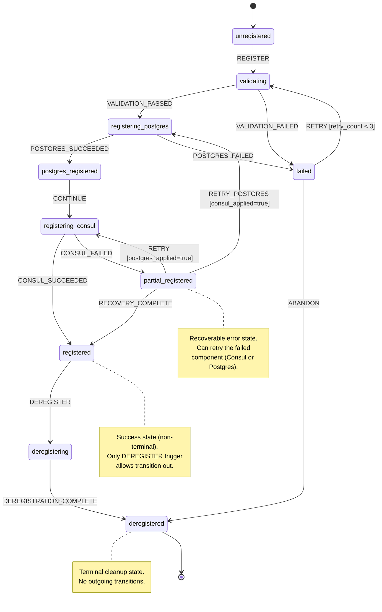

# Registration FSM Contract v1.0.0

> **Version**: 1.0.0
> **Ticket**: OMN-938
> **Related**: OMN-889 (Dual Registration Reducer), OMN-912 (Registration Intents), OMN-913 (Registration Payloads)
> **Status**: Specification
> **Last Updated**: 2025-12-19

## Overview

This document defines the formal Finite State Machine (FSM) contract for the **Dual Registration Reducer** (OMN-889). The Registration FSM manages the lifecycle of ONEX node registration to both Consul (service discovery) and PostgreSQL (source of truth).

### Purpose

The Registration FSM provides:
- **Deterministic state transitions** for node registration lifecycle
- **Pure FSM semantics** following the ONEX Reducer pattern: `delta(state, event) -> (new_state, intents[])`
- **Dual registration coordination** for Consul and PostgreSQL
- **Failure recovery** with partial registration handling
- **Graceful deregistration** with cleanup

### Workflow Pattern

```text
IntrospectionEvent -> Reducer (emits intents) -> Effects (execute) -> Orchestrator (aggregate)
```

The Reducer is **pure** - it describes what should happen via Intent emission without performing I/O.

---

## Table of Contents

1. [States](#states)
2. [Transitions](#transitions)
3. [Guards](#guards)
4. [State Diagram](#state-diagram)
5. [Intent Emission](#intent-emission)
6. [Validation Rules](#validation-rules)
7. [Implementation Notes](#implementation-notes)
8. [Error Handling](#error-handling)
9. [Related Documentation](#related-documentation)

---

## States

The Registration FSM defines 10 states across 4 categories:

### State Definitions

| State Name | Type | Terminal? | Recoverable? | Description |
|------------|------|-----------|--------------|-------------|
| `unregistered` | initial | No | Yes | Node has not initiated registration. Initial state before any registration attempt. |
| `validating` | operational | No | Yes | Validating registration payload. Checking node metadata, Consul config, and PostgreSQL record. |
| `registering_postgres` | operational | No | Yes | Emitting PostgreSQL upsert intent. First phase of dual registration. |
| `postgres_registered` | snapshot | No | Yes | PostgreSQL registration succeeded. Awaiting Consul registration. |
| `registering_consul` | operational | No | Yes | Emitting Consul register intent. Second phase of dual registration. |
| `registered` | terminal | No | No | Fully registered in both Consul and PostgreSQL. Success state allowing graceful shutdown. |
| `partial_registered` | error | No | Yes | Partial registration - one succeeded, one failed. Requires recovery. |
| `deregistering` | operational | No | Yes | Emitting deregistration intents for graceful shutdown. |
| `deregistered` | terminal | Yes | No | Fully deregistered from both systems. Terminal cleanup state. |
| `failed` | error | No | Yes | Registration failed completely. Both attempts failed or validation error. |

### State Details

#### `unregistered` (Initial State)

```yaml
state_name: unregistered
state_type: initial
description: "Node has not initiated registration. Awaiting introspection event."
is_terminal: false
is_recoverable: true
entry_actions: []
exit_actions:
  - "log_registration_start"
required_data: []
optional_data:
  - node_id
  - deployment_id
validation_rules: []
```

**Purpose**: Starting point for all registration workflows. Nodes enter this state on initial boot or after complete deregistration.

---

#### `validating` (Operational State)

```yaml
state_name: validating
state_type: operational
description: "Validating registration payload before initiating registration."
is_terminal: false
is_recoverable: true
timeout_ms: 5000
entry_actions:
  - "validate_payload"
exit_actions: []
required_data:
  - node_id
  - deployment_id
  - environment
  - network_id
  - consul_service_id
  - consul_service_name
  - postgres_record
optional_data:
  - consul_tags
  - consul_health_check
validation_rules:
  - "node_id != null"
  - "deployment_id != null"
  - "consul_service_id.length >= 1"
  - "consul_service_name.length >= 1"
```

**Purpose**: Validates `ModelRegistrationPayload` before proceeding. Catches configuration errors early.

---

#### `registering_postgres` (Operational State)

```yaml
state_name: registering_postgres
state_type: operational
description: "Emitting PostgreSQL upsert registration intent."
is_terminal: false
is_recoverable: true
timeout_ms: 10000
entry_actions:
  - "emit_postgres_upsert_intent"
exit_actions: []
required_data:
  - postgres_record
optional_data: []
validation_rules:
  - "postgres_record != null"
```

**Purpose**: Emits `ModelPostgresUpsertRegistrationIntent` for Effect node execution. PostgreSQL is registered first as the source of truth.

---

#### `postgres_registered` (Snapshot State)

```yaml
state_name: postgres_registered
state_type: snapshot
description: "PostgreSQL registration succeeded. Proceeding to Consul registration."
is_terminal: false
is_recoverable: true
entry_actions:
  - "log_postgres_success"
exit_actions: []
required_data:
  - postgres_applied
optional_data: []
validation_rules:
  - "postgres_applied == true"
```

**Purpose**: Intermediate checkpoint confirming PostgreSQL registration before Consul. Enables partial recovery if Consul fails.

---

#### `registering_consul` (Operational State)

```yaml
state_name: registering_consul
state_type: operational
description: "Emitting Consul register intent for service discovery."
is_terminal: false
is_recoverable: true
timeout_ms: 10000
entry_actions:
  - "emit_consul_register_intent"
exit_actions: []
required_data:
  - consul_service_id
  - consul_service_name
optional_data:
  - consul_tags
  - consul_health_check
validation_rules:
  - "consul_service_id.length >= 1"
  - "consul_service_name.length >= 1"
```

**Purpose**: Emits `ModelConsulRegisterIntent` for Effect node execution. Consul is registered second for service discovery.

---

#### `registered` (Success State)

```yaml
state_name: registered
state_type: terminal
description: "Fully registered in both Consul and PostgreSQL."
is_terminal: false
is_recoverable: false
entry_actions:
  - "log_registration_complete"
  - "emit_registration_success_metric"
exit_actions: []
required_data:
  - postgres_applied
  - consul_applied
optional_data: []
validation_rules:
  - "postgres_applied == true"
  - "consul_applied == true"
```

**Purpose**: Success state. Node is fully discoverable and registered. Allows transition to `deregistering` for graceful shutdown via `DEREGISTER` trigger.

---

#### `partial_registered` (Error State)

```yaml
state_name: partial_registered
state_type: error
description: "Partial registration - one system succeeded, one failed."
is_terminal: false
is_recoverable: true
entry_actions:
  - "log_partial_failure"
  - "emit_partial_registration_metric"
exit_actions: []
required_data:
  - postgres_applied
  - consul_applied
optional_data:
  - postgres_error
  - consul_error
validation_rules:
  - "postgres_applied != consul_applied"  # XOR condition
```

**Purpose**: Recoverable error state when only one registration succeeded. Enables targeted retry of the failed component.

---

#### `deregistering` (Operational State)

```yaml
state_name: deregistering
state_type: operational
description: "Emitting deregistration intents for graceful shutdown."
is_terminal: false
is_recoverable: true
timeout_ms: 15000
entry_actions:
  - "emit_consul_deregister_intent"
  - "emit_postgres_deregister_intent"
exit_actions: []
required_data:
  - node_id
  - consul_service_id
optional_data: []
validation_rules: []
```

**Purpose**: Graceful shutdown phase emitting deregistration intents. Cleans up both Consul and PostgreSQL.

**Note**: The `emit_consul_deregister_intent` and `emit_postgres_deregister_intent` entry actions are emitted in parallel. The Orchestrator aggregates both deregistration outcomes before transitioning to `deregistered`.

---

#### `deregistered` (Terminal Cleanup State)

```yaml
state_name: deregistered
state_type: terminal
description: "Fully deregistered from both systems."
is_terminal: true
is_recoverable: false
entry_actions:
  - "log_deregistration_complete"
  - "emit_deregistration_metric"
exit_actions: []
required_data: []
optional_data: []
validation_rules: []
```

**Purpose**: Terminal cleanup state. Node has been completely removed from service discovery and database.

---

#### `failed` (Error State)

```yaml
state_name: failed
state_type: error
description: "Registration failed completely. Both attempts failed or validation error."
is_terminal: false
is_recoverable: true
entry_actions:
  - "log_failure"
  - "emit_failure_metric"
exit_actions: []
required_data: []
optional_data:
  - postgres_error
  - consul_error
  - validation_error
validation_rules: []
```

**Purpose**: Complete failure state. The registration can be retried via the `RETRY` trigger.

---

## Transitions

The Registration FSM defines 16 transitions:

### Transition Table

| # | Transition Name | From State | To State | Trigger | Priority | Description |
|---|-----------------|------------|----------|---------|----------|-------------|
| 1 | `start_registration` | `unregistered` | `validating` | `REGISTER` | 10 | Initiate registration workflow |
| 2 | `validation_success` | `validating` | `registering_postgres` | `VALIDATION_PASSED` | 10 | Payload validated successfully |
| 3 | `validation_failure` | `validating` | `failed` | `VALIDATION_FAILED` | 10 | Payload validation failed |
| 4 | `postgres_success` | `registering_postgres` | `postgres_registered` | `POSTGRES_SUCCEEDED` | 10 | PostgreSQL upsert succeeded |
| 5 | `postgres_failure` | `registering_postgres` | `failed` | `POSTGRES_FAILED` | 10 | PostgreSQL upsert failed |
| 6 | `start_consul_registration` | `postgres_registered` | `registering_consul` | `CONTINUE` | 10 | Proceed to Consul registration |
| 7 | `consul_success` | `registering_consul` | `registered` | `CONSUL_SUCCEEDED` | 10 | Consul registration succeeded |
| 8 | `consul_failure` | `registering_consul` | `partial_registered` | `CONSUL_FAILED` | 10 | Consul failed after Postgres succeeded |
| 9 | `retry_consul` | `partial_registered` | `registering_consul` | `RETRY` | 10 | Retry Consul registration |
| 10 | `retry_postgres` | `partial_registered` | `registering_postgres` | `RETRY_POSTGRES` | 10 | Retry PostgreSQL registration |
| 11 | `partial_recovery_success` | `partial_registered` | `registered` | `RECOVERY_COMPLETE` | 10 | Both registrations now complete |
| 12 | `initiate_deregistration` | `registered` | `deregistering` | `DEREGISTER` | 10 | Start graceful shutdown |
| 13 | `deregistration_complete` | `deregistering` | `deregistered` | `DEREGISTRATION_COMPLETE` | 10 | Deregistration succeeded |
| 14 | `retry_from_failed` | `failed` | `validating` | `RETRY` | 10 | Retry full registration workflow |
| 15 | `abandon_registration` | `failed` | `deregistered` | `ABANDON` | 5 | Abandon failed registration |
| 16 | `global_error_handler` | `*` | `failed` | `FATAL_ERROR` | 0 | Handle unrecoverable errors from any state |

### Transition Details

#### Transition 1: `start_registration`

```yaml
transition_name: start_registration
from_state: unregistered
to_state: validating
trigger: REGISTER
priority: 10
is_atomic: true
conditions:
  - condition_name: has_registration_payload
    condition_type: expression
    expression: "payload exists true"
    required: true
actions:
  - action_name: log_registration_initiated
    action_type: emit_intent
    action_config:
      intent_type: log_event
      level: INFO
      message: "Registration workflow initiated"
```

**Trigger**: `IntrospectionEvent` with registration payload received.

---

#### Transition 2: `validation_success`

```yaml
transition_name: validation_success
from_state: validating
to_state: registering_postgres
trigger: VALIDATION_PASSED
priority: 10
is_atomic: true
conditions:
  - condition_name: payload_valid
    condition_type: expression
    expression: "validation_result == passed"
    required: true
actions:
  - action_name: log_validation_passed
    action_type: emit_intent
    action_config:
      intent_type: log_event
      level: INFO
      message: "Payload validation passed"
```

---

#### Transition 3: `validation_failure`

```yaml
transition_name: validation_failure
from_state: validating
to_state: failed
trigger: VALIDATION_FAILED
priority: 10
is_atomic: true
conditions:
  - condition_name: payload_invalid
    condition_type: expression
    expression: "validation_result == failed"
    required: true
actions:
  - action_name: log_validation_failed
    action_type: emit_intent
    action_config:
      intent_type: log_event
      level: ERROR
      message: "Payload validation failed"
```

---

#### Transition 4: `postgres_success`

```yaml
transition_name: postgres_success
from_state: registering_postgres
to_state: postgres_registered
trigger: POSTGRES_SUCCEEDED
priority: 10
is_atomic: true
conditions:
  - condition_name: postgres_applied
    condition_type: expression
    expression: "postgres_applied == true"
    required: true
actions:
  - action_name: record_postgres_success
    action_type: emit_intent
    action_config:
      intent_type: log_metric
      metric: registration_postgres_success
      value: 1
```

---

#### Transition 5: `postgres_failure`

```yaml
transition_name: postgres_failure
from_state: registering_postgres
to_state: failed
trigger: POSTGRES_FAILED
priority: 10
is_atomic: true
conditions:
  - condition_name: postgres_error
    condition_type: expression
    expression: "postgres_applied == false"
    required: true
actions:
  - action_name: record_postgres_failure
    action_type: emit_intent
    action_config:
      intent_type: log_metric
      metric: registration_postgres_failure
      value: 1
```

---

#### Transition 6: `start_consul_registration`

```yaml
transition_name: start_consul_registration
from_state: postgres_registered
to_state: registering_consul
trigger: CONTINUE
priority: 10
is_atomic: true
conditions: []
actions:
  - action_name: log_consul_start
    action_type: emit_intent
    action_config:
      intent_type: log_event
      level: INFO
      message: "Starting Consul registration"
```

**Note**: The `CONTINUE` trigger is automatically emitted by the Reducer when entering the `postgres_registered` state. This is an internal trigger that does not require an external event. The Reducer implementation uses `CONTINUE` to represent automatic progression when no external input is needed.

---

#### Transition 7: `consul_success`

```yaml
transition_name: consul_success
from_state: registering_consul
to_state: registered
trigger: CONSUL_SUCCEEDED
priority: 10
is_atomic: true
conditions:
  - condition_name: consul_applied
    condition_type: expression
    expression: "consul_applied == true"
    required: true
actions:
  - action_name: record_registration_complete
    action_type: emit_intent
    action_config:
      intent_type: log_metric
      metric: registration_complete
      value: 1
```

---

#### Transition 8: `consul_failure`

```yaml
transition_name: consul_failure
from_state: registering_consul
to_state: partial_registered
trigger: CONSUL_FAILED
priority: 10
is_atomic: true
conditions:
  - condition_name: consul_error
    condition_type: expression
    expression: "consul_applied == false"
    required: true
actions:
  - action_name: record_partial_registration
    action_type: emit_intent
    action_config:
      intent_type: log_metric
      metric: registration_partial
      value: 1
```

---

#### Transition 9: `retry_consul`

```yaml
transition_name: retry_consul
from_state: partial_registered
to_state: registering_consul
trigger: RETRY
priority: 10
is_atomic: true
conditions:
  - condition_name: consul_failed_postgres_ok
    condition_type: expression
    expression: "postgres_applied == true"
    required: true
  - condition_name: retry_count_valid
    condition_type: expression
    expression: "retry_count < 3"
    required: true
actions:
  - action_name: increment_retry_count
    action_type: emit_intent
    action_config:
      intent_type: log_event
      level: INFO
      message: "Retrying Consul registration"
```

---

#### Transition 10: `retry_postgres`

```yaml
transition_name: retry_postgres
from_state: partial_registered
to_state: registering_postgres
trigger: RETRY_POSTGRES
priority: 10
is_atomic: true
conditions:
  - condition_name: postgres_failed_consul_ok
    condition_type: expression
    expression: "consul_applied == true"
    required: true
  - condition_name: retry_count_valid
    condition_type: expression
    expression: "retry_count < 3"
    required: true
actions:
  - action_name: increment_retry_count
    action_type: emit_intent
    action_config:
      intent_type: log_event
      level: INFO
      message: "Retrying PostgreSQL registration"
```

---

#### Transition 11: `partial_recovery_success`

```yaml
transition_name: partial_recovery_success
from_state: partial_registered
to_state: registered
trigger: RECOVERY_COMPLETE
priority: 10
is_atomic: true
conditions:
  - condition_name: both_applied
    condition_type: expression
    expression: "postgres_applied == true"
    required: true
  - condition_name: consul_now_applied
    condition_type: expression
    expression: "consul_applied == true"
    required: true
actions:
  - action_name: record_recovery_success
    action_type: emit_intent
    action_config:
      intent_type: log_metric
      metric: registration_recovery_success
      value: 1
```

---

#### Transition 12: `initiate_deregistration`

```yaml
transition_name: initiate_deregistration
from_state: registered
to_state: deregistering
trigger: DEREGISTER
priority: 10
is_atomic: true
conditions: []
actions:
  - action_name: log_deregistration_start
    action_type: emit_intent
    action_config:
      intent_type: log_event
      level: INFO
      message: "Starting graceful deregistration"
```

**Note**: This is the ONLY valid outgoing transition from `registered` state, requiring an explicit `DEREGISTER` trigger. The `registered` state is a success state that allows graceful shutdown when needed.

---

#### Transition 13: `deregistration_complete`

```yaml
transition_name: deregistration_complete
from_state: deregistering
to_state: deregistered
trigger: DEREGISTRATION_COMPLETE
priority: 10
is_atomic: true
conditions: []
actions:
  - action_name: record_deregistration_complete
    action_type: emit_intent
    action_config:
      intent_type: log_metric
      metric: deregistration_complete
      value: 1
```

---

#### Transition 14: `retry_from_failed`

```yaml
transition_name: retry_from_failed
from_state: failed
to_state: validating
trigger: RETRY
priority: 10
is_atomic: true
conditions:
  - condition_name: retry_count_valid
    condition_type: expression
    expression: "retry_count < 3"
    required: true
actions:
  - action_name: log_retry_attempt
    action_type: emit_intent
    action_config:
      intent_type: log_event
      level: INFO
      message: "Retrying registration from failed state"
```

---

#### Transition 15: `abandon_registration`

```yaml
transition_name: abandon_registration
from_state: failed
to_state: deregistered
trigger: ABANDON
priority: 5
is_atomic: true
conditions: []
actions:
  - action_name: log_abandonment
    action_type: emit_intent
    action_config:
      intent_type: log_event
      level: WARNING
      message: "Registration abandoned after failures"
```

---

#### Transition 16: `global_error_handler`

```yaml
transition_name: global_error_handler
from_state: "*"
to_state: failed
trigger: FATAL_ERROR
priority: 0
is_atomic: true
conditions: []
actions:
  - action_name: log_fatal_error
    action_type: emit_intent
    action_config:
      intent_type: log_event
      level: CRITICAL
      message: "Fatal error during registration workflow"
```

**Note**: Wildcard `from_state: "*"` matches all non-terminal states. Terminal states (`deregistered`) cannot have outgoing transitions. The `registered` state is functionally terminal but has a single outgoing transition to `deregistering` for graceful shutdown, so it is still matched by the wildcard.

---

## Guards

Guards are conditions that must evaluate to `true` for a transition to occur.

### Guard Definitions

| Guard Name | Expression | Required? | Description |
|------------|------------|-----------|-------------|
| `has_registration_payload` | `payload exists true` | Yes | Payload must be present to start registration |
| `payload_valid` | `validation_result == passed` | Yes | Payload must pass validation |
| `payload_invalid` | `validation_result == failed` | Yes | Payload failed validation |
| `postgres_applied` | `postgres_applied == true` | Yes | PostgreSQL registration succeeded |
| `postgres_error` | `postgres_applied == false` | Yes | PostgreSQL registration failed |
| `consul_applied` | `consul_applied == true` | Yes | Consul registration succeeded |
| `consul_error` | `consul_applied == false` | Yes | Consul registration failed |
| `both_applied` | `postgres_applied == true` | Yes | Both registrations succeeded (checked with `consul_now_applied`) |
| `consul_now_applied` | `consul_applied == true` | Yes | Consul now succeeded after retry |
| `consul_failed_postgres_ok` | `postgres_applied == true` | Yes | Postgres OK but Consul failed |
| `postgres_failed_consul_ok` | `consul_applied == true` | Yes | Consul OK but Postgres failed |
| `retry_count_valid` | `retry_count < 3` | Yes | Haven't exceeded retry limit |

### Guard Expression Syntax

Guards use the 3-token expression format: `field operator value`

**Valid Operators**:
- Equality: `==`, `!=`, `equals`, `not_equals`
- Comparison: `<`, `>`, `<=`, `>=`
- Existence: `exists`, `not_exists`
- Containment: `in`, `not_in`, `contains`
- Pattern: `matches`

**Examples**:
```text
postgres_applied == true
retry_count < 3
validation_result == passed
consul_error exists true
```

### Trigger Catalog

The FSM uses the following triggers to drive state transitions:

| Trigger | Source | Description |
|---------|--------|-------------|
| `REGISTER` | External | `IntrospectionEvent` received with registration payload. Initiates the registration workflow. |
| `VALIDATION_PASSED` | Internal | Payload validation succeeded. Emitted by the Reducer after validating `ModelRegistrationPayload`. |
| `VALIDATION_FAILED` | Internal | Payload validation failed. Emitted when required fields are missing or invalid. |
| `POSTGRES_SUCCEEDED` | Effect | PostgreSQL Effect returned success. The upsert operation completed successfully. |
| `POSTGRES_FAILED` | Effect | PostgreSQL Effect returned failure. Database error or constraint violation. |
| `CONSUL_SUCCEEDED` | Effect | Consul Effect returned success. Service registration completed successfully. |
| `CONSUL_FAILED` | Effect | Consul Effect returned failure. Network error or Consul unavailable. |
| `CONTINUE` | Internal | Automatic transition trigger. Emitted by the Reducer when no external event is needed to progress. Used between `postgres_registered` and `registering_consul`. |
| `RECOVERY_COMPLETE` | Orchestrator | Both components now registered. Emitted when partial registration is resolved through retry. |
| `DEREGISTER` | External | Shutdown signal received. Initiates graceful deregistration from both systems. |
| `DEREGISTRATION_COMPLETE` | Orchestrator | Both deregistrations succeeded. Emitted after Consul and PostgreSQL cleanup complete. |
| `RETRY` | External/Internal | Retry after failure. Can be triggered by operator intervention or automatic retry policy. |
| `RETRY_POSTGRES` | External | Retry PostgreSQL specifically. Used when Consul succeeded but PostgreSQL failed. |
| `ABANDON` | External | Give up on registration. Transitions directly to `deregistered` without attempting cleanup. |
| `FATAL_ERROR` | Internal | Unrecoverable error detected. Catches unexpected failures from any non-terminal state. |

**Trigger Sources**:
- **External**: Triggered by events from outside the FSM (user actions, lifecycle signals, introspection events)
- **Internal**: Triggered by the Reducer itself based on internal logic or validation results
- **Effect**: Triggered by Effect nodes returning execution results
- **Orchestrator**: Triggered by the Orchestrator after aggregating multiple Effect outcomes

### Guard Implementation Details

#### Type Resolution

Guard field types are inferred from FSM context at runtime:
- **Boolean fields**: `postgres_applied`, `consul_applied` - direct boolean comparison
- **Numeric fields**: `retry_count` - supports numeric comparison operators
- **String fields**: `validation_result` - string equality comparison

#### Field Resolution

Guard fields are resolved from the FSM state context object:
```python
# Example context structure
fsm_context = {
    "postgres_applied": True,
    "consul_applied": False,
    "retry_count": 2,
    "validation_result": "passed",
}
```

#### Operator Semantics

| Operator | Behavior | Example |
|----------|----------|---------|
| `==`, `equals` | Strict equality | `retry_count == 0` |
| `!=`, `not_equals` | Strict inequality | `validation_result != failed` |
| `<`, `>`, `<=`, `>=` | Numeric comparison | `retry_count < 3` |
| `exists` | Field is present and not null | `consul_error exists true` |
| `not_exists` | Field is null or absent | `postgres_error not_exists true` |
| `in` | Value in array | `state in [registering_postgres, registering_consul]` |
| `contains` | Array contains value | `tags contains production` |
| `matches` | Regex pattern match | `service_name matches ^node-.*` |

#### Error Handling

- **Undefined field**: Guard evaluation returns `false`, transition blocked
- **Unsupported operator**: Raises `ModelOnexError` with `GUARD_EVALUATION_ERROR` code
- **Type mismatch**: Raises `ModelOnexError` with `GUARD_TYPE_ERROR` code

---

## State Diagram



### Simplified Flow Diagram

```text
                                    ┌────────────────────────────────────┐
                                    │        Registration FSM            │
                                    └────────────────────────────────────┘

    ┌─────────────┐     REGISTER     ┌─────────────┐   VALIDATION   ┌────────────────────┐
    │ unregistered │────────────────▶│  validating │───PASSED──────▶│ registering_postgres│
    └─────────────┘                  └─────────────┘                └────────────────────┘
                                            │                               │
                                     VALIDATION_FAILED               POSTGRES_SUCCEEDED
                                            │                               │
                                            ▼                               ▼
                                      ┌─────────┐                  ┌─────────────────┐
                                      │ failed  │◀──POSTGRES_FAILED│ postgres_registered│
                                      └─────────┘                  └─────────────────┘
                                            │                               │
                                        RETRY │                        CONTINUE
                                            │                               │
                                            ▼                               ▼
                                      ┌─────────────┐              ┌─────────────────┐
                                      │  validating │              │registering_consul│
                                      └─────────────┘              └─────────────────┘
                                                                           │
                              ┌────────────────────────────────────────────┼─────────────────┐
                              │                                            │                 │
                       CONSUL_FAILED                                CONSUL_SUCCEEDED         │
                              │                                            │                 │
                              ▼                                            ▼                 │
                   ┌──────────────────┐                          ┌────────────────┐         │
                   │partial_registered │─────RECOVERY_COMPLETE──▶│   registered   │         │
                   └──────────────────┘                          └────────────────┘         │
                              │                                            │                 │
                          RETRY │                                    DEREGISTER              │
                              │                                            │                 │
                              ▼                                            ▼                 │
                   ┌─────────────────┐                          ┌────────────────┐         │
                   │registering_consul│                          │  deregistering │         │
                   └─────────────────┘                          └────────────────┘         │
                                                                           │                 │
                                                               DEREGISTRATION_COMPLETE      │
                                                                           │                 │
                                                                           ▼                 │
                                                                ┌────────────────┐          │
                                                                │  deregistered  │◀─ABANDON─┘
                                                                └────────────────┘
```

---

## Intent Emission

The Reducer emits Intents based on state transitions and entry/exit actions.

### Intent Emission Matrix

| State/Transition | Intent Type | Intent Kind | Target | Description |
|-----------------|-------------|-------------|--------|-------------|
| `validating` entry | `log_event` | log | `logging_service` | Log validation start |
| `registering_postgres` entry | `postgres.upsert_registration` | registration | `postgres_effect` | Emit PostgreSQL upsert intent |
| `postgres_registered` entry | `log_metric` | metric | `metrics_service` | Record PostgreSQL success |
| `registering_consul` entry | `consul.register` | registration | `consul_effect` | Emit Consul register intent |
| `consul_success` transition | `log_metric` | metric | `metrics_service` | Record full registration success |
| `consul_failure` transition | `log_metric` | metric | `metrics_service` | Record partial registration |
| `partial_registered` entry | `log_event` | log | `logging_service` | Log partial failure with details |
| `registered` entry | `log_event` | log | `logging_service` | Log registration complete |
| `deregistering` entry | `consul.deregister` | registration | `consul_effect` | Emit Consul deregister intent |
| `deregistering` entry | `postgres.delete_registration` | registration | `postgres_effect` | Emit PostgreSQL delete intent |
| `deregistered` entry | `log_event` | log | `logging_service` | Log deregistration complete |
| `failed` entry | `log_event` | log | `logging_service` | Log failure with error details |

### Core Registration Intents

The following intents are emitted during registration:

#### 1. `ModelConsulRegisterIntent`

```python
ModelConsulRegisterIntent(
    kind="consul.register",
    service_id=payload.consul_service_id,
    service_name=payload.consul_service_name,
    tags=payload.consul_tags,
    health_check=payload.consul_health_check,
    correlation_id=context.correlation_id,
)
```

**Emitted**: On entry to `registering_consul` state
**Executed by**: Consul Effect Node

#### 2. `ModelConsulDeregisterIntent`

```python
ModelConsulDeregisterIntent(
    kind="consul.deregister",
    service_id=payload.consul_service_id,
    correlation_id=context.correlation_id,
)
```

**Emitted**: On entry to `deregistering` state
**Executed by**: Consul Effect Node

#### 3. `ModelPostgresUpsertRegistrationIntent`

```python
ModelPostgresUpsertRegistrationIntent(
    kind="postgres.upsert_registration",
    record=payload.postgres_record,
    correlation_id=context.correlation_id,
)
```

**Emitted**: On entry to `registering_postgres` state
**Executed by**: PostgreSQL Effect Node

---

## Validation Rules

### Contract-Level Validation

The FSM contract is validated at load time:

1. **Initial state exists**: `unregistered` must be in states list
2. **Terminal states exist**: `registered`, `deregistered` must be in states list
3. **Error states exist**: `partial_registered`, `failed` must be in states list
4. **No orphan states**: All states must have at least one incoming or outgoing transition
5. **No transitions from terminal states**: `registered` and `deregistered` have no outgoing transitions (except `registered` -> `deregistering` for graceful shutdown)
6. **Unique transition names**: All transition names must be unique
7. **Valid from/to states**: All transition `from_state` and `to_state` must exist in states list

### Runtime Validation

During execution, the Reducer validates:

1. **Payload completeness**: Required fields present before state transitions
2. **Guard satisfaction**: All required guards must pass
3. **State consistency**: Current state must match expected `from_state`
4. **Retry limits**: Retry count must not exceed maximum

### Validation Errors

| Error Code | Description | Recovery |
|------------|-------------|----------|
| `VALIDATION_ERROR` | Payload failed validation | Fix payload, retry |
| `INVALID_TRANSITION` | No valid transition from current state | Check guards, fix state |
| `STATE_MISMATCH` | Current state doesn't match expected | Reset FSM |
| `RETRY_EXHAUSTED` | Maximum retry count exceeded | Manual intervention |
| `GUARD_FAILED` | Required guard condition not satisfied | Fix context, retry |

---

## Implementation Notes

### For OMN-889 (Dual Registration Reducer)

1. **Reducer Purity**: The Reducer must be pure - no I/O, no logging directly. All side effects via Intent emission.

2. **State Storage**: FSM state should be stored in the Reducer's internal state, passed through `ModelReducerInput`.

3. **Intent Batching**: When entering `deregistering`, emit both deregistration intents atomically.

4. **Outcome Handling**: Use `ModelDualRegistrationOutcome` to aggregate Effect results:
   ```python
   outcome = ModelDualRegistrationOutcome(
       node_id=payload.node_id,
       status="success" | "partial" | "failed",
       postgres_applied=True,
       consul_applied=True,
       correlation_id=context.correlation_id,
   )
   ```

5. **Retry Logic**: Implement exponential backoff in Effect nodes, not Reducer. Reducer just emits retry intents with incremented counter.

6. **Correlation Tracking**: All intents must include `correlation_id` from the originating event for distributed tracing.

### Retry Counter Management

The FSM uses a retry counter to limit retry attempts and prevent infinite loops.

```yaml
retry_counter:
  storage: fsm_state_context.retry_count
  increment_on: [RETRY, RETRY_POSTGRES]
  reset_on: [POSTGRES_SUCCEEDED, CONSUL_SUCCEEDED, VALIDATION_PASSED]
  max_value: 3
```

**Semantics**:

1. **Storage**: The retry counter is stored in `fsm_state_context.retry_count` and passed through `ModelReducerInput`.

2. **Increment**: The counter is incremented by the Reducer when processing `RETRY` or `RETRY_POSTGRES` triggers, before emitting the retry intent.

3. **Reset**: The counter is reset to 0 on successful operations (`POSTGRES_SUCCEEDED`, `CONSUL_SUCCEEDED`, `VALIDATION_PASSED`).

4. **Guard Check**: Transitions 9, 10, and 14 include the guard `retry_count < 3` which prevents retry if the limit has been reached.

5. **Exhaustion Handling**: When `retry_count >= 3`, the guard fails and no transition occurs. The caller should then trigger `ABANDON` to move to `deregistered` state.

### FSM Subcontract Configuration

```yaml
fsm_subcontract:
  version: { major: 1, minor: 0, patch: 0 }
  state_machine_name: "registration_fsm"
  state_machine_version: { major: 1, minor: 0, patch: 0 }
  description: "Dual Registration FSM for Consul and PostgreSQL"
  initial_state: "unregistered"
  terminal_states:
    - "registered"
    - "deregistered"
  error_states:
    - "partial_registered"
    - "failed"
  persistence_enabled: true
  checkpoint_interval_ms: 5000
  recovery_enabled: true
  rollback_enabled: true
  strict_validation_enabled: true
  conflict_resolution_strategy: "priority_based"
  concurrent_transitions_allowed: false
  transition_timeout_ms: 10000
```

---

## Error Handling

### Error Categories

| Category | States | Recovery Strategy |
|----------|--------|-------------------|
| **Validation Errors** | `validating` -> `failed` | Fix payload, retry via `RETRY` |
| **PostgreSQL Errors** | `registering_postgres` -> `failed` | Check database, retry via `RETRY` |
| **Consul Errors** | `registering_consul` -> `partial_registered` | Retry Consul via `RETRY` |
| **Partial Failures** | `partial_registered` | Retry failed component |
| **Fatal Errors** | Any -> `failed` | Manual intervention or `ABANDON` |

### Recovery Flows

#### Scenario 1: PostgreSQL Fails First

```text
unregistered -> validating -> registering_postgres -> failed
                                                        |
                                                      RETRY
                                                        |
                                                        v
                                                   validating -> ...
```

#### Scenario 2: Consul Fails After PostgreSQL

```text
unregistered -> validating -> registering_postgres -> postgres_registered ->
    registering_consul -> partial_registered
                              |
                            RETRY (retry Consul only)
                              |
                              v
                         registering_consul -> registered
```

#### Scenario 3: Graceful Shutdown

```text
registered -> deregistering -> deregistered
```

---

## Related Documentation

| Document | Purpose |
|----------|---------|
| [ONEX Four-Node Architecture](ONEX_FOUR_NODE_ARCHITECTURE.md) | Complete architecture overview |
| [Canonical Execution Shapes](CANONICAL_EXECUTION_SHAPES.md) | Allowed/forbidden data flows |
| [ModelIntent Architecture](MODEL_INTENT_ARCHITECTURE.md) | Intent pattern for Reducer -> Effect |
| [CONTRACT_DRIVEN_NODEREDUCER_V1_0.md](CONTRACT_DRIVEN_NODEREDUCER_V1_0.md) | Reducer contract specification |
| [Node Purity Guarantees](NODE_PURITY_GUARANTEES.md) | Purity enforcement for Reducer |
| [ONEX Terminology Guide](../standards/onex_terminology.md) | Canonical definitions |

### Implementation Tickets

| Ticket | Description |
|--------|-------------|
| OMN-889 | Dual Registration Reducer implementation |
| OMN-912 | Core Registration Intents |
| OMN-913 | Registration Payload and Outcome models |
| OMN-938 | This FSM Contract (you are here) |

---

**Document Version**: 1.0.0
**Last Updated**: 2025-12-19
**Primary Maintainer**: ONEX Framework Team
