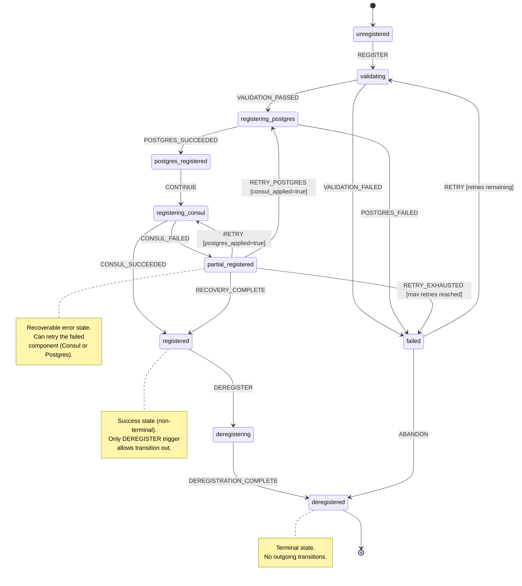

> **Navigation**: [Home](../INDEX.md) > [Architecture](./overview.md) > Registration FSM Contract

# Registration FSM Contract v1.0.0

> **Version**: 1.0.0
> **Ticket**: OMN-938
> **Related**: OMN-889 (Dual Registration Reducer), OMN-912 (Registration Intents), OMN-913 (Registration Payloads)
> **Status**: Specification
> **Last Updated**: 2025-12-19

## Overview

This document defines the formal Finite State Machine (FSM) contract for the **Dual Registration Reducer** (OMN-889). The Registration FSM manages the lifecycle of ONEX node registration to both Consul (service discovery) and PostgreSQL (source of truth).

### Purpose

The Registration FSM provides:
- **Deterministic state transitions** for node registration lifecycle
- **Pure FSM semantics** following the ONEX Reducer pattern: `delta(state, event) -> (new_state, intents[])`
- **Dual registration coordination** for Consul and PostgreSQL
- **Failure recovery** with partial registration handling
- **Graceful deregistration** with cleanup

### Document Organization

> **v1.0 Scope**: This document is comprehensive by design, providing a complete FSM contract specification for the Dual Registration Reducer.
> **Future Enhancement**: If the patterns in this document are reused across multiple FSMs, consider extracting reusable subsections into standalone guides:
> - `docs/patterns/GUARD_EXPRESSION_REFERENCE.md` - Reusable guard syntax guide
> - `docs/patterns/FSM_TIMEOUT_PATTERNS.md` - Reusable timeout handling patterns
> - `docs/patterns/RETRY_LIMIT_ENFORCEMENT.md` - Reusable retry limit patterns

### Workflow Pattern

```text
IntrospectionEvent -> Reducer (emits intents) -> Effects (execute) -> Orchestrator (aggregate)
```

The Reducer is **pure** - it describes what should happen via Intent emission without performing I/O.

### Dual Registration Order

The FSM enforces a specific registration order:

1. **PostgreSQL First** (source of truth): The node is registered in PostgreSQL first because it serves as the authoritative source of truth for node state. If PostgreSQL registration fails, no Consul registration is attempted.

2. **Consul Second** (service discovery): After PostgreSQL succeeds, the node is registered in Consul for service discovery. If Consul fails after PostgreSQL succeeds, the FSM enters `partial_registered` state, allowing targeted retry of just the Consul component.

This ordering ensures that:
- The database always has an accurate record before the node becomes discoverable
- Partial failures can be recovered with targeted retries
- Service discovery only advertises nodes that are properly tracked in the database

---

## Table of Contents

1. [States](#states)
   - [State Type Terminology](#state-type-terminology)
   - [Recovery Terminology Disambiguation](#recovery-terminology-disambiguation)
   - [State Definitions](#state-definitions)
2. [Transitions](#transitions)
3. [Guards](#guards)
4. [State Diagram](#state-diagram)
5. [Intent Emission](#intent-emission)
6. [Validation Rules](#validation-rules)
7. [Implementation Notes](#implementation-notes)
   - [Retry Limit Enforcement](#retry-limit-enforcement)
   - [Timeout Handling](#timeout-handling)
8. [Error Handling](#error-handling)
9. [Related Documentation](#related-documentation)

---

## States

The Registration FSM defines 10 states across 6 state types.

### State Type Terminology

This FSM uses a **three-dimensional state classification system** to precisely describe state behavior:

| Dimension | Field | Question It Answers |
|-----------|-------|---------------------|
| **Semantic Role** | `state_type` | What is this state's purpose in the workflow? |
| **Transition Finality** | `is_terminal` | Can the FSM leave this state? |
| **Error Recovery** | `is_recoverable` | Does this state support retry/recovery operations? |

#### State Type Values (Semantic Role)

| `state_type` | Meaning | Examples |
|--------------|---------|----------|
| `initial` | Entry point for the FSM | `unregistered` |
| `operational` | In-progress work (transient) | `validating`, `registering_postgres`, `registering_consul`, `deregistering` |
| `snapshot` | Intermediate checkpoint | `postgres_registered` |
| `success` | Workflow goal achieved | `registered` |
| `error` | Failure requiring recovery | `partial_registered`, `failed` |
| `terminal` | Final state, no exit | `deregistered` |

#### Key Distinctions

> **Success vs Terminal**: A **success state** (`state_type: success`) indicates the workflow goal was achieved, but the FSM may still allow lifecycle transitions (e.g., graceful shutdown). A **terminal state** (`state_type: terminal`) has no outgoing transitions whatsoever.
> **Terminal vs Recoverable**: The `is_terminal` field indicates whether transitions OUT of a state exist. The `is_recoverable` field indicates whether ERROR RECOVERY (retry) is meaningful. These are independent concepts.

#### Understanding `registered` vs `deregistered`

| Field | `registered` | `deregistered` | Explanation |
|-------|-------------|----------------|-------------|
| `state_type` | `success` | `terminal` | `registered` is a workflow success; `deregistered` is a lifecycle endpoint |
| `is_terminal` | `false` | `true` | `registered` has one outgoing transition (`DEREGISTER`); `deregistered` has none |
| `is_recoverable` | `false` | `false` | Neither state allows error recovery (both are "final" in different senses) |

#### Why `registered` Has `is_recoverable: false`

The `is_recoverable` field specifically indicates whether **error recovery mechanisms** (like `RETRY`) are applicable to a state. It does NOT indicate whether the state has outgoing transitions.

**Key insight**: `is_recoverable` answers the question "Is there an error to fix?" not "Can the FSM transition from here?"

| State Category | `is_recoverable` | Rationale |
|----------------|------------------|-----------|
| Success states | `false` | No error exists; nothing to recover from |
| Terminal states | `false` | FSM has ended; no transitions possible |
| Error states | `true` | Error exists that can be corrected via retry |
| Operational states | `true` | Transient failures can be recovered |

Since `registered` is a **success state** (not an error state), recovery is not meaningful - there is nothing to recover from. The node has successfully completed registration. The only valid transition out of `registered` is **intentional deregistration** via `DEREGISTER`, which is a lifecycle operation, not error recovery.

#### Why `registered` Has `is_terminal: false`

Although `registered` is a "final" success state for the registration workflow, it is NOT terminal in the FSM sense because it permits **graceful lifecycle management**. A fully registered node can still receive a shutdown signal (`DEREGISTER`) and transition to `deregistering`.

This design is intentional: success states should allow graceful shutdown without requiring error-based transitions.

#### Complete State Classification Reference

| State | `state_type` | `is_terminal` | `is_recoverable` | Outgoing Transitions |
|-------|--------------|---------------|------------------|---------------------|
| `unregistered` | initial | false | true | `REGISTER` |
| `validating` | operational | false | true | `VALIDATION_PASSED`, `VALIDATION_FAILED` |
| `registering_postgres` | operational | false | true | `POSTGRES_SUCCEEDED`, `POSTGRES_FAILED` |
| `postgres_registered` | snapshot | false | true | `CONTINUE` |
| `registering_consul` | operational | false | true | `CONSUL_SUCCEEDED`, `CONSUL_FAILED` |
| `registered` | success | false | false | `DEREGISTER` (lifecycle, not recovery) |
| `partial_registered` | error | false | true | `RETRY`, `RETRY_POSTGRES`, `RETRY_EXHAUSTED`, `ABANDON` |
| `deregistering` | operational | false | true | `DEREGISTRATION_COMPLETE` |
| `deregistered` | terminal | true | false | (none) |
| `failed` | error | false | true | `RETRY`, `ABANDON` |

### Recovery Terminology Disambiguation

The term "recovery" appears in multiple contexts within this FSM contract. This section clarifies the distinct meanings to avoid confusion.

| Context | Meaning | Mechanism | Example |
|---------|---------|-----------|---------|
| **Error Recovery** (`is_recoverable`) | State supports retry/recovery from failure | `RETRY`, `RETRY_POSTGRES` triggers with guard-limited attempts | `partial_registered` -> `registering_consul` via `RETRY` |
| **Crash Recovery** (FSM Persistence) | Resuming FSM after process crash | State persistence + Orchestrator replay | Node restarts, FSM resumes from `postgres_registered` |
| **Partial Recovery** | Completing registration after partial failure | Targeted retry of failed component only | `partial_registered` -> `registered` via `RECOVERY_COMPLETE` |
| **Timeout Recovery** | Handling state timeout gracefully | Orchestrator timeout detection + failure trigger | `registering_consul` timeout -> `CONSUL_FAILED` |

**Key Distinctions**:

1. **`is_recoverable` vs Crash Recovery**: The `is_recoverable` field indicates whether **error recovery mechanisms** (retry triggers) are applicable to a state. It does NOT relate to crash recovery, which is an Orchestrator-level concern involving FSM state persistence and replay.

2. **Retry-After-Failure vs Crash-After-Failure**:
   - **Retry-After-Failure**: The FSM receives a failure trigger (e.g., `CONSUL_FAILED`), transitions to an error state, and can be retried via `RETRY` trigger. The process remains running.
   - **Crash-After-Failure**: The process crashes. On restart, the Orchestrator reads persisted FSM state and replays from the last checkpoint. This is independent of `is_recoverable`.

3. **Partial vs Full Recovery**: `partial_registered` state enables **partial recovery** - retrying only the failed component (Consul or PostgreSQL) rather than restarting the entire workflow. The `failed` state requires **full recovery** - restarting from `validating`.

> **See Also**:
> - [Crash Recovery Considerations](#transition-6-start_consul_registration) for crash recovery during CONTINUE processing
> - [Retry Limit Enforcement](#retry-limit-enforcement) for retry-after-failure mechanics
> - [Deregistration Failure Handling](#deregistering-operational-state) for timeout recovery during shutdown

### State Definitions

| State Name | Type | Terminal? | Recoverable? | Description |
|------------|------|-----------|--------------|-------------|
| `unregistered` | initial | No | Yes | Node has not initiated registration. Initial state before any registration attempt. |
| `validating` | operational | No | Yes | Validating registration payload. Checking node metadata, Consul config, and PostgreSQL record. |
| `registering_postgres` | operational | No | Yes | Emitting PostgreSQL upsert intent. First phase of dual registration. |
| `postgres_registered` | snapshot | No | Yes | PostgreSQL registration succeeded. Awaiting Consul registration. |
| `registering_consul` | operational | No | Yes | Emitting Consul register intent. Second phase of dual registration. |
| `registered` | success | No | No | Fully registered in both Consul and PostgreSQL. Success state allowing graceful shutdown. |
| `partial_registered` | error | No | Yes | Partial registration - one succeeded, one failed. Requires recovery. |
| `deregistering` | operational | No | Yes | Emitting deregistration intents for graceful shutdown. |
| `deregistered` | terminal | Yes | No | Fully deregistered from both systems. Terminal state. |
| `failed` | error | No | Yes | Registration failed completely because either both registration attempts failed or a validation error occurred. This state allows retry via the `RETRY` trigger. |

### State Details

#### `unregistered` (Initial State)

```yaml
state_name: unregistered
state_type: initial
description: "Node has not initiated registration. Awaiting introspection event."
is_terminal: false
is_recoverable: true
entry_actions: []
exit_actions:
  - "log_registration_start"
required_data: []
optional_data:
  - node_id
  - deployment_id
validation_rules: []
```

**Purpose**: Starting point for all registration workflows. Nodes enter this state on initial boot or after complete deregistration.

---

#### `validating` (Operational State)

```yaml
state_name: validating
state_type: operational
description: "Validating registration payload before initiating registration."
is_terminal: false
is_recoverable: true
timeout_ms: 5000
entry_actions:
  - "validate_payload"
exit_actions: []
required_data:
  - node_id
  - deployment_id
  - environment
  - network_id
  - consul_service_id
  - consul_service_name
  - postgres_record
optional_data:
  - consul_tags
  - consul_health_check
validation_rules:
  - "node_id != null"
  - "deployment_id != null"
  - "consul_service_id.length >= 1"
  - "consul_service_name.length >= 1"
```

**Purpose**: This state validates the `ModelRegistrationPayload` before proceeding with registration. Validation catches configuration errors early, ensuring that required fields are present and correctly formatted before attempting any external registrations.

---

#### `registering_postgres` (Operational State)

```yaml
state_name: registering_postgres
state_type: operational
description: "Emitting PostgreSQL upsert registration intent."
is_terminal: false
is_recoverable: true
timeout_ms: 10000
entry_actions:
  - "emit_postgres_upsert_intent"
exit_actions: []
required_data:
  - postgres_record
optional_data: []
validation_rules:
  - "postgres_record != null"
```

**Purpose**: Emits `ModelPostgresUpsertRegistrationIntent` for Effect node execution. PostgreSQL is registered first as the source of truth.

---

#### `postgres_registered` (Snapshot State)

```yaml
state_name: postgres_registered
state_type: snapshot
description: "PostgreSQL registration succeeded. Proceeding to Consul registration."
is_terminal: false
is_recoverable: true
entry_actions:
  - "log_postgres_success"
exit_actions: []
required_data:
  - postgres_applied
optional_data: []
validation_rules:
  - "postgres_applied == true"
```

**Purpose**: This is an intermediate checkpoint state that confirms PostgreSQL registration succeeded before proceeding to Consul. The checkpoint enables partial recovery if Consul registration subsequently fails, as the FSM knows that PostgreSQL was successfully registered and can retry only the Consul component.

---

#### `registering_consul` (Operational State)

```yaml
state_name: registering_consul
state_type: operational
description: "Emitting Consul register intent for service discovery."
is_terminal: false
is_recoverable: true
timeout_ms: 10000
entry_actions:
  - "emit_consul_register_intent"
exit_actions: []
required_data:
  - consul_service_id
  - consul_service_name
optional_data:
  - consul_tags
  - consul_health_check
validation_rules:
  - "consul_service_id.length >= 1"
  - "consul_service_name.length >= 1"
```

**Purpose**: Emits `ModelConsulRegisterIntent` for Effect node execution. Consul is registered second for service discovery.

---

#### `registered` (Success State)

```yaml
state_name: registered
state_type: success
description: "Fully registered in both Consul and PostgreSQL."
is_terminal: false
is_recoverable: false
entry_actions:
  - "log_registration_complete"
  - "emit_registration_success_metric"
exit_actions: []
required_data:
  - postgres_applied
  - consul_applied
optional_data: []
validation_rules:
  - "postgres_applied == true"
  - "consul_applied == true"
```

**Purpose**: Success state. Node is fully discoverable and registered. Allows transition to `deregistering` for graceful shutdown via `DEREGISTER` trigger.

> **Clarification**: The `registered` state is a **success state**, not a terminal state. It has `state_type: success` and `is_terminal: false` because it allows one outgoing transition (`DEREGISTER`) for graceful shutdown. This distinguishes it from the `deregistered` state, which is the true **terminal state** with `state_type: terminal` and `is_terminal: true` (no outgoing transitions). See [State Type Terminology](#state-type-terminology) for the full distinction.

#### Why `is_recoverable: false` for a Success State?

The `registered` state has `is_recoverable: false`, which may seem counterintuitive since it allows the `DEREGISTER` transition. The key distinction:

- **`is_recoverable`** answers: "Is there an error to fix?"
- **`is_terminal`** answers: "Can the FSM transition from here?"

For `registered`:
- `is_recoverable: false` because there is no error - the workflow succeeded
- `is_terminal: false` because the `DEREGISTER` transition exists for graceful shutdown

The `DEREGISTER` transition is a **lifecycle operation** (graceful shutdown), not a **recovery operation**. Recovery implies fixing something that went wrong; deregistration is a normal operational flow.

> **See Also**: [State Type Terminology](#state-type-terminology) for the complete three-dimensional classification system and comparison tables.

---

#### `partial_registered` (Error State)

```yaml
state_name: partial_registered
state_type: error
description: "Partial registration - one system succeeded, one failed."
is_terminal: false
is_recoverable: true
entry_actions:
  - "log_partial_failure"
  - "emit_partial_registration_metric"
exit_actions: []
required_data:
  - postgres_applied
  - consul_applied
optional_data:
  - postgres_error
  - consul_error
validation_rules:
  - "postgres_applied != consul_applied"  # XOR condition
```

**Purpose**: This is a recoverable error state indicating that exactly one registration succeeded while the other failed. The state enables targeted retry of only the failed component, avoiding redundant re-registration of the already-successful component. From this state, use `RETRY` to retry Consul (if PostgreSQL succeeded) or `RETRY_POSTGRES` to retry PostgreSQL (if Consul succeeded).

---

#### `deregistering` (Operational State)

```yaml
state_name: deregistering
state_type: operational
description: "Emitting deregistration intents for graceful shutdown."
is_terminal: false
is_recoverable: true
timeout_ms: 15000
entry_actions:
  - "emit_consul_deregister_intent"
  - "emit_postgres_deregister_intent"
exit_actions: []
required_data:
  - node_id
  - consul_service_id
optional_data: []
validation_rules: []
```

**Purpose**: This is the graceful shutdown phase where deregistration intents are emitted for both Consul and PostgreSQL. The FSM cleans up both systems in parallel, with the Orchestrator aggregating both deregistration outcomes before transitioning to the terminal `deregistered` state.

**Note**: The `emit_consul_deregister_intent` and `emit_postgres_deregister_intent` entry actions are emitted in parallel. The Orchestrator aggregates both deregistration outcomes before transitioning to `deregistered`.

#### Deregistration Failure Handling

> **CRITICAL**: Deregistration uses a **best-effort cleanup strategy** that may create orphaned resources. This section documents the failure modes, potential orphaned resources, and required cleanup mechanisms.

**Timeout Behavior**: If deregistration times out (exceeds `timeout_ms: 15000`), the FSM uses a **best-effort cleanup strategy**:

1. **Proceed to Terminal State**: The Orchestrator emits `DEREGISTRATION_COMPLETE` even if one or both deregistrations failed or timed out. The FSM transitions to `deregistered` to allow the node to complete shutdown.

2. **Rationale**: During graceful shutdown, blocking indefinitely on cleanup failures is counterproductive. The node needs to stop running regardless of cleanup success. Retrying deregistration during shutdown would:
   - Delay the shutdown process indefinitely if the external system is unavailable
   - Consume resources on a node that is trying to terminate
   - Create unpredictable shutdown timing, complicating orchestration (e.g., Kubernetes pod termination)
   - Risk leaving the node in a zombie state where it's neither running nor cleanly terminated

**Potential Orphaned Resources**:

When deregistration fails or times out, the following orphaned resources may exist:

| Resource | Location | Symptoms | Detection | Remediation |
|----------|----------|----------|-----------|-------------|
| Service advertisement | Consul | Traffic routed to stopped node; health checks fail; 503/504 errors in downstream services | `consul catalog services` shows node; health checks critical | Manual `consul services deregister <service-id>` or wait for health check TTL expiry (default: 60s) |
| Node registration record | PostgreSQL | Node appears in database with stale `last_heartbeat`; dashboard shows phantom nodes | Query: `SELECT * FROM node_registrations WHERE last_heartbeat < NOW() - INTERVAL '5 minutes'` | Garbage collection job (see below) |
| Consul session | Consul | Orphaned session locks; blocked leader elections | `consul session list` shows sessions for non-existent nodes | Session TTL expiry (default: 10s) or manual `consul session destroy` |
| Health check definition | Consul | Consul continues polling non-existent endpoint | `consul catalog checks` shows critical checks for unknown services | Automatic cleanup with service deregistration |

**Failure Scenarios**:

| Scenario | Consul State | PostgreSQL State | Impact |
|----------|--------------|------------------|--------|
| Both deregistrations succeed | Removed | Removed | Clean shutdown (expected case) |
| Consul deregistration times out | **Still advertising** | Removed | Traffic routed to dead node until health check TTL expires |
| PostgreSQL deregistration times out | Removed | **Record persists** | Phantom node in database; affects node count metrics |
| Both deregistrations time out | **Still advertising** | **Record persists** | Maximum orphan exposure; requires both cleanup mechanisms |
| Network partition during shutdown | Unknown | Unknown | Indeterminate state; garbage collection resolves eventually |

**Why No Automatic Retry for Deregistration**:

Unlike the `partial_registered` state which supports `RETRY` and `RETRY_POSTGRES` triggers, the `deregistering` state intentionally **does not support retry mechanisms**:

1. **Shutdown Context**: The node is terminating. Retrying would delay shutdown and consume resources on a dying process.

2. **No Return Path**: Once deregistration is initiated, the node cannot meaningfully "go back" to `registered` - it's already shutting down.

3. **External Cleanup Preferred**: Orphaned resources are better handled by external garbage collection jobs that run on healthy nodes, not by a terminating node.

4. **Graceful Degradation**: Consul health checks naturally expire (TTL-based), providing automatic eventual consistency without node participation.

**Garbage Collection Implementation**:

Production systems **MUST** implement garbage collection for orphaned registrations. This is not optional - it's required to maintain system integrity after deregistration failures.

**PostgreSQL Garbage Collection Job**:

```python
# Example: PostgreSQL garbage collection for orphaned node registrations
# Run this as a periodic job (e.g., every 5 minutes via cron or Kubernetes CronJob)

import asyncio
from datetime import timedelta
from typing import NamedTuple

class CleanupResult(NamedTuple):
    """Result of garbage collection run."""
    nodes_cleaned: int
    node_ids: list[str]
    duration_ms: float


async def cleanup_orphaned_postgres_registrations(
    db_pool: "asyncpg.Pool",
    max_age: timedelta = timedelta(hours=1),
    batch_size: int = 100,
) -> CleanupResult:
    """
    Remove PostgreSQL registration records for nodes that have been
    offline longer than max_age.

    This handles orphaned records from:
    - Deregistration timeouts
    - Node crashes without graceful shutdown
    - Network partitions during shutdown

    Args:
        db_pool: AsyncPG connection pool
        max_age: Maximum age before considering a registration orphaned
        batch_size: Maximum records to delete per run (prevents long transactions)

    Returns:
        CleanupResult with count and IDs of cleaned records
    """
    import time
    start_time = time.monotonic()

    # Use a transaction with row locking to prevent race conditions
    async with db_pool.acquire() as conn:
        async with conn.transaction():
            # Find and lock orphaned records
            query = """
                WITH orphaned AS (
                    SELECT node_id, last_heartbeat, status
                    FROM node_registrations
                    WHERE last_heartbeat < NOW() - $1::interval
                      AND status NOT IN ('deregistered', 'unregistered')
                    ORDER BY last_heartbeat ASC
                    LIMIT $2
                    FOR UPDATE SKIP LOCKED
                )
                DELETE FROM node_registrations
                WHERE node_id IN (SELECT node_id FROM orphaned)
                RETURNING node_id, last_heartbeat
            """
            results = await conn.fetch(
                query,
                max_age,
                batch_size,
            )

            node_ids = [str(row["node_id"]) for row in results]

            # Log for observability
            if node_ids:
                # Emit metric: registration_gc_cleaned_total
                await conn.execute(
                    """
                    INSERT INTO registration_gc_log (
                        run_timestamp, nodes_cleaned, node_ids
                    ) VALUES (NOW(), $1, $2)
                    """,
                    len(node_ids),
                    node_ids,
                )

    duration_ms = (time.monotonic() - start_time) * 1000
    return CleanupResult(
        nodes_cleaned=len(node_ids),
        node_ids=node_ids,
        duration_ms=duration_ms,
    )


# Example: Kubernetes CronJob specification
# apiVersion: batch/v1
# kind: CronJob
# metadata:
#   name: registration-gc
# spec:
#   schedule: "*/5 * * * *"  # Every 5 minutes
#   jobTemplate:
#     spec:
#       template:
#         spec:
#           containers:
#           - name: gc
#             image: omninode/registration-gc:latest
#             command: ["python", "-m", "registration_gc"]
#           restartPolicy: OnFailure
```

**Consul Garbage Collection Job**:

```python
# Example: Consul garbage collection for orphaned service registrations
# This complements the PostgreSQL GC by ensuring Consul consistency

import httpx
from typing import NamedTuple


class ConsulCleanupResult(NamedTuple):
    """Result of Consul garbage collection run."""
    services_deregistered: int
    service_ids: list[str]
    already_healthy: int


async def cleanup_orphaned_consul_services(
    consul_addr: str = "http://localhost:8500",
    service_name: str = "onex-node",
    critical_duration_seconds: int = 300,
) -> ConsulCleanupResult:
    """
    Deregister Consul services that have been in critical health state
    longer than the specified duration.

    This handles:
    - Services where the node crashed without deregistration
    - Services orphaned by deregistration timeout
    - Services with expired health check TTLs

    Args:
        consul_addr: Consul HTTP API address
        service_name: Name of the service to check
        critical_duration_seconds: How long a service must be critical before cleanup

    Returns:
        ConsulCleanupResult with cleanup statistics
    """
    async with httpx.AsyncClient() as client:
        # Get all health checks for the service
        response = await client.get(
            f"{consul_addr}/v1/health/checks/{service_name}"
        )
        response.raise_for_status()
        checks = response.json()

        services_to_deregister = []
        already_healthy = 0

        for check in checks:
            if check["Status"] == "critical":
                # Check how long it's been critical
                # Note: Consul doesn't expose duration directly;
                # use check output or external tracking
                service_id = check["ServiceID"]
                services_to_deregister.append(service_id)
            else:
                already_healthy += 1

        # Deregister orphaned services
        deregistered = []
        for service_id in services_to_deregister:
            try:
                await client.put(
                    f"{consul_addr}/v1/agent/service/deregister/{service_id}"
                )
                deregistered.append(service_id)
            except httpx.HTTPError:
                # Log but continue - service may have been cleaned up already
                pass

        return ConsulCleanupResult(
            services_deregistered=len(deregistered),
            service_ids=deregistered,
            already_healthy=already_healthy,
        )
```

**Garbage Collection Metrics**:

The garbage collection jobs should emit the following metrics for observability:

| Metric | Type | Description |
|--------|------|-------------|
| `registration_gc_run_total` | counter | Number of GC runs executed |
| `registration_gc_cleaned_total` | counter | Total orphaned records cleaned |
| `registration_gc_duration_ms` | histogram | GC job execution duration |
| `registration_gc_errors_total` | counter | GC job failures |
| `consul_gc_deregistered_total` | counter | Consul services force-deregistered |

**v1.0 Limitations**:

> **v1.0 Limitation - No `partial_deregistered` State**:
> This FSM does not implement a `partial_deregistered` error state (analogous to `partial_registered`). In v1.0, deregistration failures proceed directly to `deregistered` with best-effort cleanup.
> **Rationale**: A `partial_deregistered` state would require:
> - The node to remain alive to process retry transitions
> - Complex logic to determine which cleanup succeeded
> - A mechanism to eventually force-terminate if cleanup never succeeds
> These requirements conflict with the shutdown context. External garbage collection is more appropriate.
> **Future Enhancement**: A future version may add `partial_deregistered` for use cases requiring guaranteed cleanup before process termination (e.g., when releasing exclusive resources like distributed locks).
> **v1.0 Limitation - No `RETRY_DEREGISTRATION` Trigger**:
> This FSM does not implement a `RETRY_DEREGISTRATION` trigger for the `deregistering` state. Unlike registration retries (`RETRY`, `RETRY_POSTGRES`), deregistration retries are not supported.
> **Rationale**: Retry mechanisms assume the node remains operational to process retry outcomes. During shutdown:
> - Process may be killed by orchestrator (SIGKILL) before retry completes
> - Resources are being released, making retries unreliable
> - External garbage collection provides eventual consistency without node participation
> **Recommended Alternative**: Implement robust garbage collection jobs as documented above rather than in-process retry mechanisms.

---

#### `deregistered` (Terminal State)

```yaml
state_name: deregistered
state_type: terminal
description: "Fully deregistered from both systems."
is_terminal: true
is_recoverable: false
entry_actions:
  - "log_deregistration_complete"
  - "emit_deregistration_metric"
exit_actions: []
required_data: []
optional_data: []
validation_rules: []
```

**Purpose**: This is the terminal state of the FSM, indicating that the node has been completely removed from both service discovery (Consul) and the database (PostgreSQL). Once the FSM reaches this state, no further transitions are possible, and the registration lifecycle is complete.

> **Clarification**: The `deregistered` state is the **only true terminal state** in this FSM. It has `state_type: terminal` and `is_terminal: true`, meaning there are no outgoing transitions. Once the FSM reaches this state, the registration lifecycle is complete. This contrasts with `registered`, which is a success state that still allows graceful shutdown via `DEREGISTER`. See [State Type Terminology](#state-type-terminology) for the full distinction.

---

#### `failed` (Error State)

```yaml
state_name: failed
state_type: error
description: "Registration failed completely. Either both registration attempts failed, or a validation error occurred."
is_terminal: false
is_recoverable: true
entry_actions:
  - "log_failure"
  - "emit_failure_metric"
exit_actions: []
required_data: []
optional_data:
  - postgres_error
  - consul_error
  - validation_error
validation_rules: []
```

**Purpose**: This is the complete failure state for the registration workflow, entered when any of the following occur: (1) validation fails, (2) PostgreSQL registration fails before Consul is attempted, (3) both registrations fail, or (4) retry attempts in `partial_registered` state are exhausted (via `RETRY_EXHAUSTED` trigger from Transition 17). Unlike `partial_registered`, this state indicates that the FSM cannot make forward progress without operator intervention. The registration workflow can be retried from the beginning via the `RETRY` trigger (subject to the `retry_count < 3` guard), or the registration can be abandoned entirely via the `ABANDON` trigger.

---

## Transitions

The Registration FSM defines 17 transitions:

### Transition Table

| # | Transition Name | From State | To State | Trigger | Priority | Description |
|---|-----------------|------------|----------|---------|----------|-------------|
| 1 | `start_registration` | `unregistered` | `validating` | `REGISTER` | 10 | Initiate registration workflow |
| 2 | `validation_success` | `validating` | `registering_postgres` | `VALIDATION_PASSED` | 10 | Payload validated successfully |
| 3 | `validation_failure` | `validating` | `failed` | `VALIDATION_FAILED` | 10 | Payload validation failed |
| 4 | `postgres_success` | `registering_postgres` | `postgres_registered` | `POSTGRES_SUCCEEDED` | 10 | PostgreSQL upsert succeeded |
| 5 | `postgres_failure` | `registering_postgres` | `failed` | `POSTGRES_FAILED` | 10 | PostgreSQL upsert failed |
| 6 | `start_consul_registration` | `postgres_registered` | `registering_consul` | `CONTINUE` | 10 | Proceed to Consul registration |
| 7 | `consul_success` | `registering_consul` | `registered` | `CONSUL_SUCCEEDED` | 10 | Consul registration succeeded |
| 8 | `consul_failure` | `registering_consul` | `partial_registered` | `CONSUL_FAILED` | 10 | Consul failed after Postgres succeeded |
| 9 | `retry_consul` | `partial_registered` | `registering_consul` | `RETRY` | 10 | Retry Consul registration |
| 10 | `retry_postgres` | `partial_registered` | `registering_postgres` | `RETRY_POSTGRES` | 10 | Retry PostgreSQL registration |
| 11 | `partial_recovery_success` | `partial_registered` | `registered` | `RECOVERY_COMPLETE` | 10 | Both registrations now complete |
| 12 | `initiate_deregistration` | `registered` | `deregistering` | `DEREGISTER` | 10 | Start graceful shutdown |
| 13 | `deregistration_complete` | `deregistering` | `deregistered` | `DEREGISTRATION_COMPLETE` | 10 | Deregistration succeeded |
| 14 | `retry_from_failed` | `failed` | `validating` | `RETRY` | 10 | Retry full registration workflow |
| 15 | `abandon_registration` | `failed` | `deregistered` | `ABANDON` | 5 | Abandon failed registration |
| 16 | `global_error_handler` | `*` | `failed` | `FATAL_ERROR` | 0 | Handle unrecoverable errors from any state |
| 17 | `retry_exhausted` | `partial_registered` | `failed` | `RETRY_EXHAUSTED` | 10 | Retry limit reached in partial_registered |

### Transition Details

#### Transition 1: `start_registration`

```yaml
transition_name: start_registration
from_state: unregistered
to_state: validating
trigger: REGISTER
priority: 10
is_atomic: true
conditions:
  - condition_name: has_registration_payload
    condition_type: expression
    expression: "payload exists true"
    required: true
actions:
  - action_name: log_registration_initiated
    action_type: emit_intent
    action_config:
      intent_type: log_event
      level: INFO
      message: "Registration workflow initiated"
```

**Trigger**: `IntrospectionEvent` with registration payload received.

---

#### Transition 2: `validation_success`

```yaml
transition_name: validation_success
from_state: validating
to_state: registering_postgres
trigger: VALIDATION_PASSED
priority: 10
is_atomic: true
conditions:
  - condition_name: payload_valid
    condition_type: expression
    expression: "validation_result == passed"
    required: true
actions:
  - action_name: log_validation_passed
    action_type: emit_intent
    action_config:
      intent_type: log_event
      level: INFO
      message: "Payload validation passed"
```

---

#### Transition 3: `validation_failure`

```yaml
transition_name: validation_failure
from_state: validating
to_state: failed
trigger: VALIDATION_FAILED
priority: 10
is_atomic: true
conditions:
  - condition_name: payload_invalid
    condition_type: expression
    expression: "validation_result == failed"
    required: true
actions:
  - action_name: log_validation_failed
    action_type: emit_intent
    action_config:
      intent_type: log_event
      level: ERROR
      message: "Payload validation failed"
```

---

#### Transition 4: `postgres_success`

```yaml
transition_name: postgres_success
from_state: registering_postgres
to_state: postgres_registered
trigger: POSTGRES_SUCCEEDED
priority: 10
is_atomic: true
conditions:
  - condition_name: postgres_applied
    condition_type: expression
    expression: "postgres_applied == true"
    required: true
actions:
  - action_name: record_postgres_success
    action_type: emit_intent
    action_config:
      intent_type: log_metric
      metric: registration_postgres_success
      value: 1
```

---

#### Transition 5: `postgres_failure`

```yaml
transition_name: postgres_failure
from_state: registering_postgres
to_state: failed
trigger: POSTGRES_FAILED
priority: 10
is_atomic: true
conditions:
  - condition_name: postgres_error
    condition_type: expression
    expression: "postgres_applied == false"
    required: true
actions:
  - action_name: record_postgres_failure
    action_type: emit_intent
    action_config:
      intent_type: log_metric
      metric: registration_postgres_failure
      value: 1
```

---

#### Transition 6: `start_consul_registration`

```yaml
transition_name: start_consul_registration
from_state: postgres_registered
to_state: registering_consul
trigger: CONTINUE
priority: 10
is_atomic: true
conditions: []
actions:
  - action_name: log_consul_start
    action_type: emit_intent
    action_config:
      intent_type: log_event
      level: INFO
      message: "Starting Consul registration"
```

**CONTINUE Trigger Semantics**: The `CONTINUE` trigger enables automatic state progression without requiring an external event. Unlike external triggers (e.g., `REGISTER`, `DEREGISTER`) or Effect-sourced triggers (e.g., `POSTGRES_SUCCEEDED`), `CONTINUE` is a **synthetic internal trigger** that the Reducer emits to itself.

> **TL;DR**: Use single-step execution (recommended for production, <10ms latency). Use two-step only for debugging (adds 50-100ms but makes checkpoint observable).
> **CRITICAL - Error Handling**: CONTINUE failures MUST trigger `FATAL_ERROR` transition to `failed` state. Since CONTINUE is internal with no external retry mechanism, failures indicate system-level issues requiring investigation. See [CONTINUE Trigger Failure Handling](#continue-trigger-failure-handling) for detailed implementation patterns and recovery strategies.

**Implementation Pattern**:

1. **When Emitted**: The Reducer emits `CONTINUE` synchronously as part of processing the `POSTGRES_SUCCEEDED` trigger. After transitioning to `postgres_registered`, the Reducer immediately evaluates if `CONTINUE` should fire.

2. **Not an External Event**: `CONTINUE` is never received from the event bus, Effect nodes, or external sources. It exists solely as an internal FSM mechanism for automatic progression.

3. **Single-Step vs Two-Step Execution**: Implementations may choose between:
   - **Single-step** (recommended): Process `POSTGRES_SUCCEEDED`, transition to `postgres_registered`, then immediately process `CONTINUE` and transition to `registering_consul` in one `delta()` call. This approach returns `registering_consul` as the final state with Consul registration intents.
   - **Two-step**: Return from `delta()` at `postgres_registered`, then have the runtime invoke `delta()` again with `CONTINUE`. This approach makes the checkpoint state observable but adds latency.

4. **Implementation Example** (single-step pattern):
   ```python
   async def delta(
       self, state: str, trigger: str, context: ModelFSMContext
   ) -> tuple[str, list[ModelIntent]]:
       if state == "registering_postgres" and trigger == "POSTGRES_SUCCEEDED":
           # Transition through postgres_registered checkpoint, then immediately
           # process CONTINUE to reach registering_consul (single-step pattern)
           return "registering_consul", [
               ModelLogIntent(kind="log_event", level="INFO",
                   message="PostgreSQL succeeded, proceeding to Consul"),
               ModelConsulRegisterIntent(
                   kind="consul.register",
                   service_id=context.consul_service_id,
                   correlation_id=context.correlation_id,
               )
           ]
   ```

5. **Why Use CONTINUE**: The `postgres_registered` state exists as a **checkpoint for observability and recovery**. If Consul registration fails, the FSM knows PostgreSQL succeeded (enabling targeted retry). The `CONTINUE` mechanism allows this checkpoint state to exist in the state diagram while enabling automatic progression in the happy path. Without `CONTINUE`, the FSM would require an explicit external trigger to proceed from `postgres_registered` to `registering_consul`.

6. **Observability Note**: Even with single-step execution, implementations should log the transition through `postgres_registered` for debugging and audit purposes. The checkpoint state is logically traversed even if not externally observable as a pause point.

7. **Error Handling**: If CONTINUE trigger processing fails (e.g., intent emission error during transition to `registering_consul`), the FSM should transition to `failed` state via `FATAL_ERROR`. Since CONTINUE is an internal mechanism with no external event to retry, failure during CONTINUE processing indicates a system-level issue that requires investigation. The Orchestrator should log the failure with full context including the `postgres_registered` checkpoint state.

8. **Observability vs Latency Tradeoff**: Implementations must choose between single-step and two-step execution patterns. This choice involves a tradeoff between observability and latency:

   **Latency Comparison**:

   | Execution Pattern | Typical Latency | Event Bus Round-Trips |
   |-------------------|-----------------|----------------------|
   | **Single-step** | <10ms | 0 (internal) |
   | **Two-step** | 50-100ms | 1 (additional round-trip) |

   The latency difference comes from the additional event bus round-trip in two-step mode. In single-step mode, the `CONTINUE` trigger is processed synchronously within the same `delta()` call. In two-step mode, the Reducer returns at `postgres_registered`, an event is published to the event bus, and the runtime must invoke `delta()` again with the `CONTINUE` trigger.

   **Crash Recovery Considerations**:

   If a crash occurs between `postgres_registered` and `registering_consul` in two-step mode:
   - The FSM state is persisted at `postgres_registered` (if `persistence_enabled: true`)
   - On recovery, the FSM resumes from `postgres_registered` and awaits `CONTINUE`
   - The Orchestrator must detect the recovery scenario and re-emit `CONTINUE`
   - PostgreSQL registration is already complete (idempotent, so retry is safe)

   In single-step mode, crashes during CONTINUE processing result in:
   - FSM state remains at `registering_postgres` (pre-transition)
   - On recovery, the entire transition is replayed from `registering_postgres`
   - PostgreSQL upsert is re-attempted (idempotent operation)

   **When to Choose Each Approach**:

   | Approach | Environment | Priority | Rationale |
   |----------|-------------|----------|-----------|
   | **Single-step** (recommended) | Production | Latency > Observability | Lower latency (<10ms vs 50-100ms), simpler crash recovery (replay from `registering_postgres`), fewer moving parts, atomic transition semantics |
   | **Two-step** | Development/Debugging | Observability > Latency | Observable checkpoint state aids debugging; step-by-step FSM tracing; can pause at `postgres_registered` for inspection |
   | **Two-step** | Staging/QA | Observability > Latency | Validate FSM behavior before production; verify checkpoint persistence works correctly |
   | **Two-step** | High-reliability/Audit | Compliance > Latency | External checkpoint enables third-party monitoring; audit trail shows explicit intermediate states; crash recovery preserves exact checkpoint |

   **Decision Matrix**:

   | Your Priority | Choose | Latency Impact | Crash Recovery Behavior |
   |---------------|--------|----------------|------------------------|
   | **Minimize latency** | Single-step | <10ms | Replay from `registering_postgres`; PostgreSQL upsert re-attempted (idempotent) |
   | **Maximize observability** | Two-step | 50-100ms | Resume from `postgres_registered`; Orchestrator re-emits `CONTINUE` |
   | **Audit/compliance requirements** | Two-step | 50-100ms | Persisted checkpoint provides audit trail; third-party systems can observe intermediate state |
   | **Debug FSM issues** | Two-step | 50-100ms | Can inspect state at `postgres_registered` before Consul registration |

   **Recommendation**: Use single-step execution in production. The latency savings (40-90ms per registration) compound across high-throughput systems. Two-step execution is valuable during development or when debugging FSM behavior, as it makes the `postgres_registered` checkpoint externally observable.

9. **CONTINUE Trigger Recovery Disambiguation**:

   > **IMPORTANT**: The term "recovery" in the CONTINUE trigger context has a **specific, narrow meaning** that differs from general FSM error recovery. This disambiguation is critical for correct implementation.

   The CONTINUE trigger interacts with recovery in two distinct scenarios:

   | Scenario | Type | When It Occurs | Mechanism | Recovery Source |
   |----------|------|----------------|-----------|-----------------|
   | **CONTINUE Processing Failure** | Retry-after-failure | Exception during CONTINUE processing while process is running | Transition to `failed` via `FATAL_ERROR`; then `RETRY` or `ABANDON` | Operator triggers `RETRY` (external) |
   | **Crash During CONTINUE** | Crash-recovery | Process crashes between `postgres_registered` and `registering_consul` | FSM persistence + Orchestrator replay | Orchestrator detects recovery scenario (automatic) |

   **Retry-After-Failure (CONTINUE Processing Failure)**:
   - **Trigger**: Exception thrown during CONTINUE processing (e.g., intent construction fails)
   - **Process State**: Running (not crashed)
   - **FSM Behavior**: Immediately transition to `failed` via `FATAL_ERROR`
   - **Recovery**: Operator investigates logs, then triggers `RETRY` (restarts from `validating`) or `ABANDON`
   - **Why FATAL_ERROR?**: CONTINUE is internal - there is no external event to replay. The failure indicates a system-level bug requiring investigation.

   **Crash-Recovery (Crash During CONTINUE)**:
   - **Trigger**: Process terminates unexpectedly (SIGKILL, OOM, hardware failure)
   - **Process State**: Dead; new process starts
   - **FSM Behavior**: Depends on execution mode:
     - **Single-step**: FSM state remains at `registering_postgres`; replay entire transition including PostgreSQL upsert (idempotent)
     - **Two-step**: FSM state persisted at `postgres_registered`; Orchestrator re-emits `CONTINUE` to resume
   - **Recovery**: Automatic via Orchestrator state replay; no operator intervention needed
   - **Why Automatic?**: Crash recovery is infrastructure-level; the Orchestrator is designed to resume interrupted workflows.

   **Key Distinction**: CONTINUE "recovery" is **never** about retrying the CONTINUE trigger itself. Either:
   1. The process is running and CONTINUE failed -> `FATAL_ERROR` -> operator-driven `RETRY` from `validating`
   2. The process crashed -> automatic Orchestrator replay based on persisted state

   There is no mechanism to "retry just CONTINUE" because:
   - CONTINUE is synthetic (not sourced from an external event that can be replayed)
   - CONTINUE failures indicate bugs, not transient errors
   - Crash recovery replays the entire transition, not individual triggers

---

#### Transition 7: `consul_success`

```yaml
transition_name: consul_success
from_state: registering_consul
to_state: registered
trigger: CONSUL_SUCCEEDED
priority: 10
is_atomic: true
conditions:
  - condition_name: consul_applied
    condition_type: expression
    expression: "consul_applied == true"
    required: true
actions:
  - action_name: record_registration_complete
    action_type: emit_intent
    action_config:
      intent_type: log_metric
      metric: registration_complete
      value: 1
```

---

#### Transition 8: `consul_failure`

```yaml
transition_name: consul_failure
from_state: registering_consul
to_state: partial_registered
trigger: CONSUL_FAILED
priority: 10
is_atomic: true
conditions:
  - condition_name: consul_error
    condition_type: expression
    expression: "consul_applied == false"
    required: true
actions:
  - action_name: record_partial_registration
    action_type: emit_intent
    action_config:
      intent_type: log_metric
      metric: registration_partial
      value: 1
```

---

#### Transition 9: `retry_consul`

```yaml
transition_name: retry_consul
from_state: partial_registered
to_state: registering_consul
trigger: RETRY
priority: 10
is_atomic: true
conditions:
  - condition_name: consul_failed_postgres_ok
    condition_type: expression
    expression: "postgres_applied == true"
    required: true
  - condition_name: retry_count_valid
    condition_type: expression
    expression: "retry_count < 3"
    required: true
actions:
  - action_name: increment_retry_count
    action_type: emit_intent
    action_config:
      intent_type: log_event
      level: INFO
      message: "Retrying Consul registration"
```

**Guard Cross-Reference**: The `retry_count < 3` guard enforces the retry limit (maximum 3 attempts). See [Retry Limit Enforcement](#retry-limit-enforcement) for detailed enforcement behavior, counter increment semantics, reset events, and exhaustion handling.

---

#### Transition 10: `retry_postgres`

```yaml
transition_name: retry_postgres
from_state: partial_registered
to_state: registering_postgres
trigger: RETRY_POSTGRES
priority: 10
is_atomic: true
conditions:
  - condition_name: postgres_failed_consul_ok
    condition_type: expression
    expression: "consul_applied == true"
    required: true
  - condition_name: retry_count_valid
    condition_type: expression
    expression: "retry_count < 3"
    required: true
actions:
  - action_name: increment_retry_count
    action_type: emit_intent
    action_config:
      intent_type: log_event
      level: INFO
      message: "Retrying PostgreSQL registration"
```

**Guard Cross-Reference**: The `retry_count < 3` guard enforces the retry limit (maximum 3 attempts). See [Retry Limit Enforcement](#retry-limit-enforcement) for detailed enforcement behavior, counter increment semantics, reset events, and exhaustion handling.

---

#### Transition 11: `partial_recovery_success`

```yaml
transition_name: partial_recovery_success
from_state: partial_registered
to_state: registered
trigger: RECOVERY_COMPLETE
priority: 10
is_atomic: true
conditions:
  - condition_name: both_applied
    condition_type: expression
    expression: "postgres_applied == true"
    required: true
  - condition_name: consul_now_applied
    condition_type: expression
    expression: "consul_applied == true"
    required: true
actions:
  - action_name: record_recovery_success
    action_type: emit_intent
    action_config:
      intent_type: log_metric
      metric: registration_recovery_success
      value: 1
```

---

#### Transition 12: `initiate_deregistration`

```yaml
transition_name: initiate_deregistration
from_state: registered
to_state: deregistering
trigger: DEREGISTER
priority: 10
is_atomic: true
conditions: []
actions:
  - action_name: log_deregistration_start
    action_type: emit_intent
    action_config:
      intent_type: log_event
      level: INFO
      message: "Starting graceful deregistration"
```

**Note**: This is the ONLY valid outgoing transition from `registered` state, requiring an explicit `DEREGISTER` trigger. The `registered` state is a success state that allows graceful shutdown when needed.

---

#### Transition 13: `deregistration_complete`

```yaml
transition_name: deregistration_complete
from_state: deregistering
to_state: deregistered
trigger: DEREGISTRATION_COMPLETE
priority: 10
is_atomic: true
conditions: []
actions:
  - action_name: record_deregistration_complete
    action_type: emit_intent
    action_config:
      intent_type: log_metric
      metric: deregistration_complete
      value: 1
```

---

#### Transition 14: `retry_from_failed`

```yaml
transition_name: retry_from_failed
from_state: failed
to_state: validating
trigger: RETRY
priority: 10
is_atomic: true
conditions:
  - condition_name: retry_count_valid
    condition_type: expression
    expression: "retry_count < 3"
    required: true
actions:
  - action_name: log_retry_attempt
    action_type: emit_intent
    action_config:
      intent_type: log_event
      level: INFO
      message: "Retrying registration from failed state"
```

**Guard Cross-Reference**: The `retry_count < 3` guard enforces the retry limit (maximum 3 attempts). See [Retry Limit Enforcement](#retry-limit-enforcement) for detailed enforcement behavior, counter increment semantics, reset events, and exhaustion handling.

---

#### Transition 15: `abandon_registration`

```yaml
transition_name: abandon_registration
from_state: failed
to_state: deregistered
trigger: ABANDON
priority: 5
is_atomic: true
conditions: []
actions:
  - action_name: log_abandonment
    action_type: emit_intent
    action_config:
      intent_type: log_event
      level: WARNING
      message: "Registration abandoned after failures"
```

---

#### Transition 16: `global_error_handler`

```yaml
transition_name: global_error_handler
from_state: "*"
to_state: failed
trigger: FATAL_ERROR
priority: 0
is_atomic: true
conditions: []
actions:
  - action_name: log_fatal_error
    action_type: emit_intent
    action_config:
      intent_type: log_event
      level: CRITICAL
      message: "Fatal error during registration workflow"
```

**Note**: Wildcard `from_state: "*"` matches all non-terminal states. The only true terminal state is `deregistered`, which has no outgoing transitions and cannot receive this global error handler. The `registered` state is a **success state** (not terminal) with a single outgoing transition to `deregistering` for graceful shutdown, so it is still matched by the wildcard and can transition to `failed` on `FATAL_ERROR`.

---

#### Transition 17: `retry_exhausted`

```yaml
transition_name: retry_exhausted
from_state: partial_registered
to_state: failed
trigger: RETRY_EXHAUSTED
priority: 10
is_atomic: true
conditions:
  - condition_name: retry_limit_reached
    condition_type: expression
    expression: "retry_count >= 3"
    required: true
actions:
  - action_name: log_retry_exhausted
    action_type: emit_intent
    action_config:
      intent_type: log_event
      level: ERROR
      message: "Retry limit exhausted in partial_registered state"
```

**Note**: This transition handles the case when retry attempts in `partial_registered` state have been exhausted. When `retry_count >= 3`, the guard on the `retry_consul` (Transition 9) and `retry_postgres` (Transition 10) transitions will fail. The **Orchestrator** (not the Reducer) must then emit a `RETRY_EXHAUSTED` trigger to move to the `failed` state, from which the operator can either retry the full workflow or abandon the registration. See [Retry Limit Enforcement](#retry-limit-enforcement) for the detection mechanism and implementation details.

---

## Guards

Guards are conditions that must evaluate to `true` for a transition to occur.

### Guard Definitions

| Guard Name | Expression | Required? | Description |
|------------|------------|-----------|-------------|
| `has_registration_payload` | `payload exists true` | Yes | Payload must be present to start registration |
| `payload_valid` | `validation_result == passed` | Yes | Payload must pass validation |
| `payload_invalid` | `validation_result == failed` | Yes | Payload failed validation |
| `postgres_applied` | `postgres_applied == true` | Yes | PostgreSQL registration succeeded |
| `postgres_error` | `postgres_applied == false` | Yes | PostgreSQL registration failed |
| `consul_applied` | `consul_applied == true` | Yes | Consul registration succeeded |
| `consul_error` | `consul_applied == false` | Yes | Consul registration failed |
| `both_applied` | `postgres_applied == true` | Yes | Both registrations succeeded (checked with `consul_now_applied`) |
| `consul_now_applied` | `consul_applied == true` | Yes | Consul now succeeded after retry |
| `consul_failed_postgres_ok` | `postgres_applied == true` | Yes | Postgres OK but Consul failed |
| `postgres_failed_consul_ok` | `consul_applied == true` | Yes | Consul OK but Postgres failed |
| `retry_count_valid` | `retry_count < 3` | Yes | Haven't exceeded retry limit |
| `retry_limit_reached` | `retry_count >= 3` | Yes | Retry limit has been reached |

**Cross-Reference**: For retry limit guard (`retry_count < 3`) enforcement details including counter increment semantics, reset events, and exhaustion handling, see [Retry Limit Enforcement](#retry-limit-enforcement).

> **See Also - Retry Transitions**: The `retry_count < 3` guard is used in:
> - [Transition 9: retry_consul](#transition-9-retry_consul) - Retrying Consul from `partial_registered`
> - [Transition 10: retry_postgres](#transition-10-retry_postgres) - Retrying PostgreSQL from `partial_registered`
> - [Transition 14: retry_from_failed](#transition-14-retry_from_failed) - Retrying full workflow from `failed`
> When this guard fails (i.e., `retry_count >= 3`), the **Orchestrator** (not the Reducer) must detect the guard failure and emit the `RETRY_EXHAUSTED` trigger to transition to `failed` state. See [Exhaustion Handling](#retry-limit-enforcement) for implementation details.

### Guard Expression Syntax

Guards use a **strict 3-token expression format**:

```text
<field> <operator> <value>
```

> **CRITICAL - WHITESPACE IS MANDATORY**: Operators MUST be surrounded by whitespace. Expressions like `retry_count<3` or `postgres_applied==true` are **INVALID** and will fail with `GUARD_SYNTAX_ERROR`. This is a strict, non-negotiable requirement of the parser.

**Format Requirements**:
- The expression format is EXACTLY 3 tokens separated by whitespace
- Whitespace around operators is **REQUIRED**, not optional
- This is a strict requirement, not a flexible format

Where:
- **`<field>`**: Context field name (alphanumeric with underscores, must not start with a digit)
- **`<operator>`**: One of the supported operators listed below
- **`<value>`**: Literal value (boolean, number, string, or array)

#### Token Separation Rules

> **MANDATORY**: Whitespace (spaces or tabs) MUST separate all three tokens. The parser splits on whitespace first, then validates exactly 3 tokens. Expressions without whitespace around operators are treated as a single token and rejected.

**Whitespace Requirements**:
- **REQUIRED**: At least one space or tab between field and operator
- **REQUIRED**: At least one space or tab between operator and value
- Multiple consecutive whitespace characters are treated as a single delimiter
- Leading and trailing whitespace is trimmed before parsing
- Tabs and spaces are equivalent whitespace delimiters

**Valid Format Examples**:
```text
retry_count < 3                    # Standard spacing (CORRECT)
retry_count  <  3                  # Multiple spaces (valid, treated as single delimiter)
  retry_count < 3                  # Leading whitespace (trimmed)
retry_count	<	3                  # Tabs as delimiters (valid)
postgres_applied == true           # Whitespace around == (CORRECT)
```

**Invalid Format Examples** (Common Mistakes):
```text
retry_count<3                      # INVALID: No whitespace around operator (1 token)
                                   #   → Error: GUARD_SYNTAX_ERROR
                                   #   → Message: "Expression 'retry_count<3' has 1 token(s), expected 3"

postgres_applied==true             # INVALID: No whitespace around operator (1 token)
                                   #   → Error: GUARD_SYNTAX_ERROR
                                   #   → Message: "Expression 'postgres_applied==true' has 1 token(s), expected 3"

retry_count< 3                     # INVALID: Operator attached to field (2 tokens)
                                   #   → Error: GUARD_SYNTAX_ERROR
                                   #   → Message: "Expression has 2 token(s), expected 3"

retry_count <3                     # INVALID: Operator attached to value (2 tokens)
                                   #   → Error: GUARD_SYNTAX_ERROR
                                   #   → Message: "Expression has 2 token(s), expected 3"

consul_applied!=false              # INVALID: No whitespace around != (1 token)
                                   #   → Error: GUARD_SYNTAX_ERROR

retry_count>=3                     # INVALID: No whitespace around >= (1 token)
                                   #   → Error: GUARD_SYNTAX_ERROR

retry_count < 3 extra              # INVALID: Too many tokens (4 tokens)
                                   #   → Error: GUARD_SYNTAX_ERROR
                                   #   → Message: "Expression has 4 token(s), expected 3"

retry_count                        # INVALID: Missing operator and value (1 token)
retry_count <                      # INVALID: Missing value (2 tokens)
< 3                                # INVALID: Missing field (2 tokens)
```

**Why Whitespace is Mandatory**: The parser uses a simple whitespace-split tokenization strategy. Without whitespace, the entire expression becomes a single token (e.g., `retry_count<3` is one token, not three). This design ensures:
1. **Unambiguous parsing**: No complex operator detection needed
2. **Predictable behavior**: Same tokenization rules for all operators
3. **Clear error messages**: Token count immediately reveals the problem

The parser rejects any expression that does not split into exactly 3 whitespace-delimited tokens.

**Valid Operators**:

| Category | Operators | Value Types |
|----------|-----------|-------------|
| Equality | `==`, `!=`, `equals`, `not_equals` | boolean, number, string |
| Comparison | `<`, `>`, `<=`, `>=` | number |
| Existence | `exists`, `not_exists` | `true` or `false` |
| Containment | `in`, `not_in` | array (e.g., `[a, b, c]`) |
| Containment | `contains` | scalar value |
| Pattern | `matches` | regex pattern (unquoted) |

**Value Literal Syntax**:

| Type | Format | Examples | Notes |
|------|--------|----------|-------|
| **Boolean** | Lowercase `true` or `false` | `true`, `false` | Must be lowercase; `True`, `FALSE` are invalid |
| **Number** | Integer or decimal, optional sign | `3`, `3.14`, `-1`, `0`, `-0.5` | Scientific notation not supported |
| **String** | Unquoted alphanumeric with underscores | `passed`, `failed`, `in_progress` | No whitespace or special characters allowed |
| **Array** | Bracket-enclosed, comma-separated | `[a, b, c]`, `[registering_postgres]` | Whitespace around brackets/commas is ignored |
| **Pattern** | Unquoted regex (Python `re` flavor) | `^node-.*`, `^v[0-9]+\.[0-9]+$` | PCRE-compatible; see regex details below |

**Regex Pattern Syntax**:
- **Flavor**: Python `re` module (PCRE-compatible regular expressions)
- **Anchoring**: Patterns are NOT automatically anchored. Use `^` for start-of-string and `$` for end-of-string.
- **Case Sensitivity**: Patterns are case-sensitive by default. Use `(?i)` prefix for case-insensitive matching.
- **Escaping**: Backslashes in YAML require double-escaping (e.g., `\\d` to match digits). In Python contract definitions, use raw strings or single escapes.
- **Common Pattern Examples**:
  ```text
  ^node-.*                    # Starts with "node-"
  .*_test$                    # Ends with "_test"
  ^v[0-9]+\.[0-9]+\.[0-9]+$   # Semantic version (v1.2.3)
  (?i)^production             # Case-insensitive prefix match
  ^[a-z][a-z0-9_]*$           # Valid identifier format
  ```

**Case Sensitivity**: Field names and string values are case-sensitive. `Passed` != `passed`. Pattern matching is also case-sensitive unless the `(?i)` flag is used.

**Examples by Operator Category**:
```text
# Equality operators
postgres_applied == true
validation_result != failed
status equals active
error_code not_equals E001

# Comparison operators (numeric only)
retry_count < 3
retry_count >= 0
priority <= 5

# Existence operators
consul_error exists true
optional_field not_exists true

# Containment operators
state in [registering_postgres, registering_consul, partial_registered]
tags contains production
environment not_in [dev, test]

# Pattern matching
service_name matches ^node-.*
version matches ^v[0-9]+\\.[0-9]+$
```

#### Nested Field Limitation (v1.0)

> **v1.0 Limitation**: Guard expressions support only top-level field references. This is a **design decision for v1.0**, not a permanent restriction. Future versions may add nested field access if requirements emerge.

Guard expressions support only top-level field references (e.g., `postgres_applied`). Nested field access (e.g., `context.retry_count` or `payload.node_id`) is NOT supported in guard expressions.

**What Does NOT Work** (v1.0):

```text
# These expressions will fail contract validation with GUARD_INVALID_FIELD
context.retry_count < 3              # Nested access via dot notation
payload.node_id exists true          # Nested access via dot notation
response.status_code == 200          # Nested access via dot notation
config["timeout_ms"] > 5000          # Bracket notation not supported
```

**Workaround - Flatten Context Before Guard Evaluation**:

The Reducer should flatten any nested structures into top-level fields in the FSM context before guard evaluation. This is the recommended pattern:

```python
# Example: Flattening context before guard evaluation
def prepare_context_for_guards(
    raw_context: ModelRegistrationContext,
) -> dict[str, Any]:
    """Flatten nested structures for guard evaluation."""
    return {
        # Top-level fields (guards can reference these)
        "postgres_applied": raw_context.postgres_result.applied,
        "consul_applied": raw_context.consul_result.applied,
        "retry_count": raw_context.retry_state.count,
        "validation_result": raw_context.validation.status,
        "node_id": raw_context.payload.node_id,
        "deployment_id": raw_context.payload.deployment_id,
        # Error fields (flattened from nested error objects)
        "postgres_error": raw_context.postgres_result.error_message,
        "consul_error": raw_context.consul_result.error_message,
    }
```

**Why This Limitation Exists**:

1. **Simplicity**: 3-token format (`field operator value`) is easy to parse, validate, and reason about
2. **Performance**: No need for recursive field resolution at runtime
3. **Predictability**: All guard fields are explicit and visible at contract load time
4. **Debugging**: Flattened context is easier to log and inspect

**Future Enhancement** (post-v1.0): If nested field access becomes a strong requirement, a future version may introduce:
- Dot notation support: `payload.node_id exists true`
- JSONPath-like syntax: `$.context.retry_count < 3`
- Bracket notation: `response["status"] == "ok"`

> **Tracking**: Nested field access enhancement is tracked for v2.0 consideration. If this becomes a strong requirement for your use case, please file an issue referencing OMN-938 to help prioritize this enhancement.

This would require updates to the guard parser and contract validation logic.

### Guard Validation Rules

Guards are validated at two phases to ensure correctness and provide clear error messages.

#### Contract Load-Time Validation

When the FSM contract is loaded, all guard expressions are validated for syntactic correctness:

1. **Syntax validation**: Expression must follow `field operator value` format (exactly 3 tokens)
2. **Operator validation**: Operator must be in the supported operator set
3. **Field reference validation**: Field names must be valid identifiers (alphanumeric with underscores, not starting with a number)
4. **Value format validation**: Values must be parseable (booleans, numbers, strings, arrays)

**Contract Load-Time Validation Errors**:

| Error Code | Description | Example |
|------------|-------------|---------|
| `GUARD_SYNTAX_ERROR` | Expression doesn't follow 3-token format | `"postgres_applied"` (missing operator and value) |
| `GUARD_INVALID_OPERATOR` | Operator not in supported set | `"retry_count ~= 3"` (invalid operator `~=`) |
| `GUARD_INVALID_FIELD` | Field name is not a valid identifier | `"123field == true"` (starts with number) |
| `GUARD_INVALID_VALUE` | Value cannot be parsed | `"count < [invalid"` (malformed array) |

**Contract Validation Example**:
```python
# Valid guards - pass contract validation
"postgres_applied == true"      # Boolean comparison
"retry_count < 3"               # Numeric comparison
"validation_result == passed"   # String comparison
"tags contains production"      # Containment check
"state in [active, pending]"    # Array containment
"version matches ^v[0-9]+"      # Pattern matching

# Invalid guards - fail contract validation
"postgres_applied"              # GUARD_SYNTAX_ERROR: missing operator/value
"count <=> 5"                   # GUARD_INVALID_OPERATOR: unknown operator
"2fast == true"                 # GUARD_INVALID_FIELD: invalid identifier
"retry_count < "                # GUARD_SYNTAX_ERROR: missing value token
"field == == true"              # GUARD_SYNTAX_ERROR: too many tokens (4)
"count < [a, b"                 # GUARD_INVALID_VALUE: unclosed array bracket
```

**Edge Case Examples with Error Codes**:

The following comprehensive examples show exactly what error code is returned for each type of syntax error. This is the definitive reference for guard expression validation behavior.

```python
# ═══════════════════════════════════════════════════════════════════════════════
# WHITESPACE HANDLING - VALID EXAMPLES
# ═══════════════════════════════════════════════════════════════════════════════

"retry_count < 3"               # VALID - Standard single-space separation
"  retry_count   <   3  "       # VALID - Leading/trailing whitespace is trimmed
"retry_count    <    3"         # VALID - Multiple spaces treated as single delimiter
"retry_count\t<\t3"             # VALID - Tabs are equivalent to spaces
"retry_count < 3\n"             # VALID - Trailing newline is trimmed
"retry_count < 3 "              # VALID - Trailing space is trimmed
"\tretry_count < 3\t"           # VALID - Leading/trailing tabs are trimmed
"postgres_applied == true"      # VALID - Whitespace around == operator

# ═══════════════════════════════════════════════════════════════════════════════
# WHITESPACE HANDLING - INVALID EXAMPLES (GUARD_SYNTAX_ERROR)
# All of these fail because whitespace around operators is MANDATORY
# ═══════════════════════════════════════════════════════════════════════════════

"retry_count<3"
    # → Error Code: GUARD_SYNTAX_ERROR
    # → Token Count: 1 (entire string is one token)
    # → Message: "Expression 'retry_count<3' has 1 token(s), expected exactly 3"

"postgres_applied==true"
    # → Error Code: GUARD_SYNTAX_ERROR
    # → Token Count: 1 (entire string is one token)
    # → Message: "Expression 'postgres_applied==true' has 1 token(s), expected exactly 3"

"retry_count< 3"
    # → Error Code: GUARD_SYNTAX_ERROR
    # → Token Count: 2 (tokens: ["retry_count<", "3"])
    # → Message: "Expression has 2 token(s), expected exactly 3"

"retry_count <3"
    # → Error Code: GUARD_SYNTAX_ERROR
    # → Token Count: 2 (tokens: ["retry_count", "<3"])
    # → Message: "Expression has 2 token(s), expected exactly 3"

"consul_applied!=false"
    # → Error Code: GUARD_SYNTAX_ERROR
    # → Token Count: 1 (entire string is one token)
    # → Message: "Expression 'consul_applied!=false' has 1 token(s), expected exactly 3"

"retry_count>=3"
    # → Error Code: GUARD_SYNTAX_ERROR
    # → Token Count: 1 (entire string is one token)
    # → Message: "Expression 'retry_count>=3' has 1 token(s), expected exactly 3"

"priority<=5"
    # → Error Code: GUARD_SYNTAX_ERROR
    # → Token Count: 1 (entire string is one token)
    # → Message: "Expression 'priority<=5' has 1 token(s), expected exactly 3"

"status!= active"
    # → Error Code: GUARD_SYNTAX_ERROR
    # → Token Count: 2 (tokens: ["status!=", "active"])
    # → Message: "Expression has 2 token(s), expected exactly 3"

# ═══════════════════════════════════════════════════════════════════════════════
# TOKEN COUNT ERRORS (GUARD_SYNTAX_ERROR)
# ═══════════════════════════════════════════════════════════════════════════════

"retry_count < 3 extra"
    # → Error Code: GUARD_SYNTAX_ERROR
    # → Token Count: 4 (tokens: ["retry_count", "<", "3", "extra"])
    # → Message: "Expression has 4 token(s), expected exactly 3"

"retry_count"
    # → Error Code: GUARD_SYNTAX_ERROR
    # → Token Count: 1 (only field name present)
    # → Message: "Expression 'retry_count' has 1 token(s), expected exactly 3"

"retry_count <"
    # → Error Code: GUARD_SYNTAX_ERROR
    # → Token Count: 2 (missing value)
    # → Message: "Expression has 2 token(s), expected exactly 3"

"< 3"
    # → Error Code: GUARD_SYNTAX_ERROR
    # → Token Count: 2 (missing field)
    # → Message: "Expression has 2 token(s), expected exactly 3"

""
    # → Error Code: GUARD_SYNTAX_ERROR
    # → Token Count: 0 (empty expression)
    # → Message: "Expression is empty"

"   "
    # → Error Code: GUARD_SYNTAX_ERROR
    # → Token Count: 0 (whitespace-only expression)
    # → Message: "Expression is empty after trimming whitespace"

# ═══════════════════════════════════════════════════════════════════════════════
# FIELD NAME ERRORS (GUARD_INVALID_FIELD)
# ═══════════════════════════════════════════════════════════════════════════════

"2fast == true"
    # → Error Code: GUARD_INVALID_FIELD
    # → Reason: Field name starts with a digit
    # → Message: "Field name '2fast' is not a valid identifier (cannot start with digit)"

"123 < 5"
    # → Error Code: GUARD_INVALID_FIELD
    # → Reason: Field name is entirely numeric
    # → Message: "Field name '123' is not a valid identifier"

"field-name == true"
    # → Error Code: GUARD_INVALID_FIELD
    # → Reason: Hyphens are not allowed in field names
    # → Message: "Field name 'field-name' contains invalid character '-'"

"field.nested == true"
    # → Error Code: GUARD_INVALID_FIELD
    # → Reason: Dots are not allowed (nested access not supported in v1.0)
    # → Message: "Field name 'field.nested' contains invalid character '.'"

# ═══════════════════════════════════════════════════════════════════════════════
# OPERATOR ERRORS (GUARD_INVALID_OPERATOR)
# ═══════════════════════════════════════════════════════════════════════════════

"count <=> 5"
    # → Error Code: GUARD_INVALID_OPERATOR
    # → Reason: <=> is not a valid operator
    # → Message: "Unknown operator '<=>' (valid: ==, !=, <, >, <=, >=, equals, ...)"

"status === active"
    # → Error Code: GUARD_INVALID_OPERATOR
    # → Reason: === is not a valid operator (use ==)
    # → Message: "Unknown operator '==='"

"count ~= 5"
    # → Error Code: GUARD_INVALID_OPERATOR
    # → Reason: ~= is not a valid operator
    # → Message: "Unknown operator '~='"

"status like pattern"
    # → Error Code: GUARD_INVALID_OPERATOR
    # → Reason: Use 'matches' for pattern matching, not 'like'
    # → Message: "Unknown operator 'like' (did you mean 'matches'?)"

# ═══════════════════════════════════════════════════════════════════════════════
# VALUE ERRORS (GUARD_INVALID_VALUE)
# ═══════════════════════════════════════════════════════════════════════════════

"postgres_applied == True"
    # → Error Code: GUARD_INVALID_VALUE
    # → Reason: Boolean must be lowercase
    # → Message: "Invalid boolean value 'True' (must be lowercase 'true' or 'false')"

"consul_applied == FALSE"
    # → Error Code: GUARD_INVALID_VALUE
    # → Reason: Boolean must be lowercase
    # → Message: "Invalid boolean value 'FALSE' (must be lowercase 'true' or 'false')"

"count < [a, b"
    # → Error Code: GUARD_INVALID_VALUE
    # → Reason: Malformed array literal
    # → Message: "Unclosed array bracket in value '[a, b'"

"field == null"
    # → Error Code: GUARD_INVALID_VALUE
    # → Reason: null is not a valid literal
    # → Message: "Invalid value 'null' (use 'exists' operator for null checks)"

"field == undefined"
    # → Error Code: GUARD_INVALID_VALUE
    # → Reason: undefined is not a valid literal
    # → Message: "Invalid value 'undefined' (use 'exists' operator for presence checks)"

"field == 'quoted'"
    # → Error Code: GUARD_INVALID_VALUE
    # → Reason: Quotes are not supported in string values
    # → Message: "Invalid value ''quoted'' (string values should not be quoted)"

# ═══════════════════════════════════════════════════════════════════════════════
# CASE SENSITIVITY
# ═══════════════════════════════════════════════════════════════════════════════

"PostgresApplied == true"       # VALID syntax, but field name is case-sensitive
                                # (will match 'PostgresApplied', not 'postgres_applied')

"postgres_applied == TRUE"      # GUARD_INVALID_VALUE: boolean must be lowercase

"status EQUALS active"          # GUARD_INVALID_OPERATOR: operators are case-sensitive
                                # (use lowercase 'equals')

# ═══════════════════════════════════════════════════════════════════════════════
# BOUNDARY VALUES (ALL VALID)
# ═══════════════════════════════════════════════════════════════════════════════

"retry_count >= 0"              # VALID - zero is allowed
"retry_count < -1"              # VALID - negative numbers allowed
"priority <= 999999999"         # VALID - large numbers supported
"count == 0"                    # VALID - zero comparison
"value > -999"                  # VALID - negative comparison

# ═══════════════════════════════════════════════════════════════════════════════
# EXISTENCE AND NULL HANDLING
# ═══════════════════════════════════════════════════════════════════════════════

"field exists true"             # VALID - checks if field is present and non-null
"field exists false"            # VALID - checks if field is absent or null
"field not_exists true"         # VALID - checks if field is absent or null
"field not_exists false"        # VALID - checks if field is present and non-null
```

#### Runtime Validation

At runtime, guards are validated when evaluated against the FSM context:

1. **Field resolution**: Field must exist in the FSM context (or be handled by `exists`/`not_exists`)
2. **Type compatibility**: Field value type must be compatible with the operator
3. **Value coercion**: Value must be coercible to the expected type for comparison

**Runtime Validation Errors** (see also "Error Handling" subsection below):

| Error Code | Description | Recovery |
|------------|-------------|----------|
| `GUARD_EVALUATION_ERROR` | Unsupported operator at runtime | Fix guard expression in contract |
| `GUARD_TYPE_ERROR` | Type mismatch during evaluation | Fix context data or guard expression |
| `GUARD_FIELD_UNDEFINED` | Referenced field not in context | Ensure context populated before transition |

**Runtime Behavior for Undefined Fields**:
- For `exists`/`not_exists` operators: Undefined fields return appropriate boolean
- For other operators: Guard evaluation returns `false`, transition is blocked
- No exception is raised for undefined fields (fail-safe behavior)

#### Guard Validation Flow Diagram

The following diagram shows the complete validation flow for guard expressions, from input parsing through acceptance or rejection.

> **CRITICAL**: The "Split on whitespace" step is why whitespace around operators is MANDATORY. Expressions like `retry_count<3` remain as a single token after splitting, causing validation to fail with `GUARD_SYNTAX_ERROR`.

```text
Expression Input (e.g., "retry_count < 3")
     │
     ▼
┌──────────────────────┐
│ Trim leading/trailing│
│ whitespace           │
└──────────┬───────────┘
           │
           ▼
┌──────────────────────┐
│ Split on whitespace  │◀──── WHITESPACE IS REQUIRED
│ (spaces/tabs)        │      between all 3 tokens!
│                      │
│ "retry_count < 3"    │      ✓ → ["retry_count", "<", "3"]
│ "retry_count<3"      │      ✗ → ["retry_count<3"] (1 token!)
└──────────┬───────────┘
           │
           ▼
┌──────────────────────┐
│ Exactly 3 tokens?    │──No──▶ GUARD_SYNTAX_ERROR
└──────────┬───────────┘        "Expression must have exactly
           │ Yes                 3 whitespace-separated tokens"
           ▼
┌──────────────────────┐
│ Token 1: Valid       │
│ field name?          │──No──▶ GUARD_INVALID_FIELD
│ (alphanumeric/_,     │        "Field name must be valid
│  no leading digit)   │         identifier"
└──────────┬───────────┘
           │ Yes
           ▼
┌──────────────────────┐
│ Token 2: Valid       │
│ operator?            │──No──▶ GUARD_INVALID_OPERATOR
│ (==,!=,<,>,<=,>=,    │        "Unknown operator"
│  exists, in, etc.)   │
└──────────┬───────────┘
           │ Yes
           ▼
┌──────────────────────┐
│ Token 3: Valid       │
│ value literal?       │──No──▶ GUARD_INVALID_VALUE
│ (bool/num/str/array) │        "Cannot parse value"
└──────────┬───────────┘
           │ Yes
           ▼
  Contract Load: Guard Accepted
           │
           ▼ (at runtime)
┌──────────────────────┐
│ Field exists in      │
│ FSM context?         │──No──▶ Guard returns false
└──────────┬───────────┘        (transition blocked)
           │ Yes
           ▼
┌──────────────────────┐
│ Type compatible      │
│ with operator?       │──No──▶ GUARD_TYPE_ERROR
└──────────┬───────────┘
           │ Yes
           ▼
┌──────────────────────┐
│ Evaluate expression  │
│ against context      │
└──────────┬───────────┘
           │
           ▼
     true / false
     (transition allowed / blocked)
```

**Validation Phases**:
1. **Contract Load-Time** (top section): Validates syntax, operator, field name format, and value format. Errors here prevent the FSM contract from loading.
2. **Runtime** (bottom section): Validates field existence in context and type compatibility. Errors here block the transition but allow the FSM to continue operating.

### Trigger Catalog

The FSM uses the following triggers to drive state transitions:

| Trigger | Source | Description |
|---------|--------|-------------|
| `REGISTER` | External | This trigger indicates an `IntrospectionEvent` was received with registration payload. It initiates the registration workflow. |
| `VALIDATION_PASSED` | Internal | This trigger indicates payload validation succeeded. It is emitted by the Reducer after validating `ModelRegistrationPayload`. |
| `VALIDATION_FAILED` | Internal | This trigger indicates payload validation failed. It is emitted when required fields are missing or invalid. |
| `POSTGRES_SUCCEEDED` | Effect | This trigger indicates the PostgreSQL Effect returned success and the upsert operation completed successfully. |
| `POSTGRES_FAILED` | Effect | This trigger indicates the PostgreSQL Effect returned failure due to database error or constraint violation. |
| `CONSUL_SUCCEEDED` | Effect | This trigger indicates the Consul Effect returned success and service registration completed successfully. |
| `CONSUL_FAILED` | Effect | This trigger indicates the Consul Effect returned failure due to network error or Consul unavailability. |
| `CONTINUE` | Internal | This is a **synthetic internal trigger** for automatic state progression. It is emitted by the Reducer itself during `POSTGRES_SUCCEEDED` processing to advance from `postgres_registered` to `registering_consul`. It is never received from external sources. See [Transition 6](#transition-6-start_consul_registration) for detailed implementation semantics including single-step vs two-step execution patterns. |
| `RECOVERY_COMPLETE` | Orchestrator | This trigger indicates both components are now registered. It is emitted when partial registration is resolved through retry. |
| `DEREGISTER` | External | This trigger indicates a shutdown signal was received. It initiates graceful deregistration from both systems. |
| `DEREGISTRATION_COMPLETE` | Orchestrator | This trigger indicates both deregistrations succeeded. It is emitted after Consul and PostgreSQL cleanup is complete. |
| `RETRY` | External/Internal | This trigger initiates a retry after failure. It can be invoked from `partial_registered` state (retries Consul registration via Transition 9) or from `failed` state (restarts full registration from `validating` via Transition 14). The trigger can be invoked by operator intervention or by an automatic retry policy, and is subject to the `retry_count < 3` guard. |
| `RETRY_POSTGRES` | External | This trigger retries PostgreSQL registration specifically from the `partial_registered` state via Transition 10. It is used when Consul succeeded but PostgreSQL failed (an unusual scenario that can occur during recovery operations). The trigger is subject to the `retry_count < 3` guard. |
| `ABANDON` | External | This trigger gives up on registration. It transitions directly to `deregistered` without attempting cleanup. |
| `FATAL_ERROR` | Internal | This trigger indicates an unrecoverable error was detected. It catches unexpected failures from any non-terminal state. |
| `RETRY_EXHAUSTED` | Orchestrator | This trigger indicates the retry limit has been reached. It is **generated by the Orchestrator** (not the Reducer) when it detects that the Reducer returned without state change due to guard failure on retry transitions (Transitions 9, 10, or 14). The Orchestrator emits this trigger when `retry_count >= 3` to transition to `failed` state for operator intervention. See [Retry Limit Enforcement](#retry-limit-enforcement) for detection logic and implementation examples. |

**Trigger Sources**:
- **External**: Triggered by events from outside the FSM (user actions, lifecycle signals, introspection events)
- **Internal**: Triggered by the Reducer itself based on internal logic or validation results
- **Effect**: Triggered by Effect nodes returning execution results
- **Orchestrator**: Triggered by the Orchestrator after aggregating multiple Effect outcomes or detecting guard failures

> **Why RETRY_EXHAUSTED is Orchestrator-Generated**: The Reducer is pure and stateless regarding time and external conditions. When a retry guard (`retry_count < 3`) fails, the Reducer simply returns the current state unchanged with no intents. The Orchestrator detects this "no-op" response pattern (same state, RETRY trigger) and generates `RETRY_EXHAUSTED` to drive the FSM to `failed` state. This separation of concerns maintains Reducer purity while enabling proper exhaustion handling.

### Guard Implementation Details

#### Type Resolution

Guard field types are inferred from FSM context at runtime:
- **Boolean fields**: `postgres_applied`, `consul_applied` - direct boolean comparison
- **Numeric fields**: `retry_count` - supports numeric comparison operators
- **String fields**: `validation_result` - string equality comparison

#### Field Resolution

Guard fields are resolved from the FSM state context object:
```python
# Example context structure
fsm_context = {
    "postgres_applied": True,
    "consul_applied": False,
    "retry_count": 2,
    "validation_result": "passed",
}
```

#### Operator Semantics

| Operator | Behavior | Example |
|----------|----------|---------|
| `==`, `equals` | Strict equality | `retry_count == 0` |
| `!=`, `not_equals` | Strict inequality | `validation_result != failed` |
| `<`, `>`, `<=`, `>=` | Numeric comparison | `retry_count < 3` |
| `exists` | Field is present and not null | `consul_error exists true` |
| `not_exists` | Field is null or absent | `postgres_error not_exists true` |
| `in` | Value in array | `state in [registering_postgres, registering_consul]` |
| `contains` | Array contains value | `tags contains production` |
| `matches` | Regex pattern match | `service_name matches ^node-.*` |

#### Error Handling

- **Undefined field**: Guard evaluation returns `false`, transition blocked
- **Unsupported operator**: Raises `ModelOnexError` with `GUARD_EVALUATION_ERROR` code
- **Type mismatch**: Raises `ModelOnexError` with `GUARD_TYPE_ERROR` code

---

## State Diagram

> **Rendering Note**: This diagram uses Mermaid `stateDiagram-v2` syntax, which renders correctly in GitHub's Markdown viewer. If rendering issues occur in other viewers, refer to the [Simplified Flow Diagram](#simplified-flow-diagram) below as a fallback.



### Simplified Flow Diagram

```text
                                    ┌────────────────────────────────────┐
                                    │        Registration FSM            │
                                    └────────────────────────────────────┘

    ┌─────────────┐     REGISTER     ┌─────────────┐   VALIDATION   ┌────────────────────┐
    │ unregistered │────────────────▶│  validating │───PASSED──────▶│ registering_postgres│
    └─────────────┘                  └─────────────┘                └────────────────────┘
                                            │                               │
                                     VALIDATION_FAILED               POSTGRES_SUCCEEDED
                                            │                               │
                                            ▼                               ▼
                                      ┌─────────┐                  ┌─────────────────┐
                                      │ failed  │◀──POSTGRES_FAILED│ postgres_registered│
                                      └─────────┘                  └─────────────────┘
                                            │                               │
                                        RETRY │                        CONTINUE
                                            │                               │
                                            ▼                               ▼
                                      ┌─────────────┐              ┌─────────────────┐
                                      │  validating │              │registering_consul│
                                      └─────────────┘              └─────────────────┘
                                                                           │
                              ┌────────────────────────────────────────────┼─────────────────┐
                              │                                            │                 │
                       CONSUL_FAILED                                CONSUL_SUCCEEDED         │
                              │                                            │                 │
                              ▼                                            ▼                 │
                   ┌──────────────────┐                          ┌────────────────┐         │
                   │partial_registered │─────RECOVERY_COMPLETE──▶│   registered   │         │
                   └──────────────────┘                          └────────────────┘         │
                         │    │                                          │                 │
                     RETRY│    │RETRY_EXHAUSTED                    DEREGISTER              │
                         │    │[retry_count>=3]                          │                 │
                         ▼    ▼                                          ▼                 │
                   ┌─────────────────┐  ┌─────────┐             ┌────────────────┐         │
                   │registering_consul│  │ failed  │             │  deregistering │         │
                   └─────────────────┘  └─────────┘             └────────────────┘         │
                                                                           │                 │
                                                               DEREGISTRATION_COMPLETE      │
                                                                           │                 │
                                                                           ▼                 │
                                                                ┌────────────────┐          │
                                                                │  deregistered  │◀─ABANDON─┘
                                                                └────────────────┘
```

---

## Intent Emission

The Reducer emits Intents based on state transitions and entry/exit actions.

### Intent Emission Matrix

| State/Transition | Intent Type | Intent Kind | Target | Description |
|-----------------|-------------|-------------|--------|-------------|
| `validating` entry | `log_event` | log | `logging_service` | Log validation start |
| `registering_postgres` entry | `postgres.upsert_registration` | registration | `postgres_effect` | Emit PostgreSQL upsert intent |
| `postgres_registered` entry | `log_metric` | metric | `metrics_service` | Record PostgreSQL success |
| `registering_consul` entry | `consul.register` | registration | `consul_effect` | Emit Consul register intent |
| `consul_success` transition | `log_metric` | metric | `metrics_service` | Record full registration success |
| `consul_failure` transition | `log_metric` | metric | `metrics_service` | Record partial registration |
| `partial_registered` entry | `log_event` | log | `logging_service` | Log partial failure with details |
| `registered` entry | `log_event` | log | `logging_service` | Log registration complete |
| `deregistering` entry | `consul.deregister` | registration | `consul_effect` | Emit Consul deregister intent |
| `deregistering` entry | `postgres.delete_registration` | registration | `postgres_effect` | Emit PostgreSQL delete intent |
| `deregistered` entry | `log_event` | log | `logging_service` | Log deregistration complete |
| `failed` entry | `log_event` | log | `logging_service` | Log failure with error details |

### Core Registration Intents

The following intents are emitted during registration:

#### 1. `ModelConsulRegisterIntent`

```python
ModelConsulRegisterIntent(
    kind="consul.register",
    service_id=payload.consul_service_id,
    service_name=payload.consul_service_name,
    tags=payload.consul_tags,
    health_check=payload.consul_health_check,
    correlation_id=context.correlation_id,
)
```

**Emitted**: On entry to `registering_consul` state
**Executed by**: Consul Effect Node

#### 2. `ModelConsulDeregisterIntent`

```python
ModelConsulDeregisterIntent(
    kind="consul.deregister",
    service_id=payload.consul_service_id,
    correlation_id=context.correlation_id,
)
```

**Emitted**: On entry to `deregistering` state
**Executed by**: Consul Effect Node

#### 3. `ModelPostgresUpsertRegistrationIntent`

```python
ModelPostgresUpsertRegistrationIntent(
    kind="postgres.upsert_registration",
    record=payload.postgres_record,
    correlation_id=context.correlation_id,
)
```

**Emitted**: On entry to `registering_postgres` state
**Executed by**: PostgreSQL Effect Node

---

## Validation Rules

### Contract-Level Validation

The FSM contract is validated at load time:

1. **Initial state exists**: `unregistered` must be in states list
2. **Success states exist**: `registered` must be in states list (success state allowing graceful shutdown)
3. **Terminal states exist**: `deregistered` must be in states list (true terminal with no outgoing transitions)
4. **Error states exist**: `partial_registered`, `failed` must be in states list
5. **No orphan states**: All states must have at least one incoming or outgoing transition
6. **No transitions from terminal states**: `deregistered` has no outgoing transitions; `registered` (success state) has one outgoing transition to `deregistering` for graceful shutdown
7. **Unique transition names**: All transition names must be unique
8. **Valid from/to states**: All transition `from_state` and `to_state` must exist in states list

### Runtime Validation

During execution, the Reducer validates:

1. **Payload completeness**: Required fields present before state transitions
2. **Guard satisfaction**: All required guards must pass
3. **State consistency**: Current state must match expected `from_state`
4. **Retry limits**: Retry count must not exceed maximum

### Validation Errors

| Error Code | Phase | Severity | Description | Recovery |
|------------|-------|----------|-------------|----------|
| `VALIDATION_ERROR` | Runtime | Error | Payload failed validation | Fix payload, retry |
| `INVALID_TRANSITION` | Runtime | Error | No valid transition from current state | Check guards, fix state |
| `STATE_MISMATCH` | Runtime | Error | Current state doesn't match expected | Reset FSM |
| `RETRY_EXHAUSTED` | Runtime | Warning | Maximum retry count exceeded | Manual intervention |
| `GUARD_FAILED` | Runtime | Warning | Required guard condition not satisfied | Fix context, retry |
| `GUARD_SYNTAX_ERROR` | Contract Load | Critical | Expression doesn't follow 3-token format | Fix guard expression syntax in contract |
| `GUARD_INVALID_OPERATOR` | Contract Load | Critical | Operator not in supported set | Use supported operator from operator set |
| `GUARD_INVALID_FIELD` | Contract Load | Critical | Field name is not a valid identifier | Fix field name (alphanumeric, underscores, no leading digits) |
| `GUARD_INVALID_VALUE` | Contract Load | Critical | Value cannot be parsed | Fix value format (boolean, number, string, or array literal) |
| `GUARD_EVALUATION_ERROR` | Runtime | Error | Unsupported operator at runtime | Fix guard expression in contract |
| `GUARD_TYPE_ERROR` | Runtime | Error | Type mismatch during evaluation | Ensure field type matches operator expectations |
| `GUARD_FIELD_UNDEFINED` | Runtime | Warning | Referenced field not in context | Ensure context populated before transition (see note) |
| `TIMEOUT_EXCEEDED` | Runtime | Error | State timeout exceeded | Check Effect execution time, increase timeout or fix blocking issue |
| `INTENT_EMISSION_FAILED` | Runtime | Error | Failed to emit intent during transition | Check intent payload, verify target Effect exists |
| `INTENT_PAYLOAD_ERROR` | Runtime | Error | Intent payload is invalid or malformed | Fix payload construction in Reducer; verify required fields are present |
| `EFFECT_NOT_FOUND` | Runtime | Critical | Target Effect node is unavailable or not registered | Verify Effect registration in container; check service discovery |
| `INTENT_SERIALIZATION_ERROR` | Runtime | Error | Intent cannot be serialized for transmission | Check intent model compatibility; ensure all fields are serializable |
| `INTERNAL_TRANSITION_ERROR` | Runtime | Critical | Error during internal transitions (e.g., CONTINUE) | Transition to `failed` via `FATAL_ERROR`; requires investigation |

**Severity Level Definitions**:

| Severity | Meaning | Behavior | Action Required |
|----------|---------|----------|-----------------|
| **Warning** | Non-blocking issue | Logged but does not prevent transition; FSM continues operating | Monitor logs; address at convenience |
| **Error** | Blocking issue | Prevents the specific transition but allows retry; FSM remains operational | Fix the issue and retry the transition |
| **Critical** | System failure | Prevents FSM from loading (Contract Load) or indicates fundamental system failure (Runtime) | Immediate investigation and remediation required |

**Note on `GUARD_FIELD_UNDEFINED`**: This error code is available for strict mode implementations. By default, undefined fields cause guard evaluation to return `false` (fail-safe behavior) rather than raising an exception. Implementations may choose to raise `GUARD_FIELD_UNDEFINED` in strict validation mode when `strict_validation_enabled: true` is set in the FSM subcontract.

---

## Implementation Notes

### For OMN-889 (Dual Registration Reducer)

1. **Reducer Purity**: The Reducer must be pure - no I/O, no logging directly. All side effects via Intent emission.

2. **State Storage**: FSM state should be stored in the Reducer's internal state, passed through `ModelReducerInput`.

3. **Intent Batching**: When entering `deregistering`, emit both deregistration intents atomically.

4. **Outcome Handling**: Use `ModelDualRegistrationOutcome` to aggregate Effect results:
   ```python
   outcome = ModelDualRegistrationOutcome(
       node_id=payload.node_id,
       status="success" | "partial" | "failed",
       postgres_applied=True,
       consul_applied=True,
       correlation_id=context.correlation_id,
   )
   ```

5. **Retry Logic**: Implement exponential backoff in Effect nodes, not Reducer. Reducer just emits retry intents with incremented counter.

6. **Correlation Tracking**: All intents must include `correlation_id` from the originating event for distributed tracing.

7. **Orphaned Resource Cleanup**: Implement garbage collection for orphaned registrations as described in the [Deregistration Failure Handling](#deregistration-failure-handling) section. This is critical for production systems where deregistration may time out during node shutdown.

### Retry Counter Management

The FSM uses a retry counter to limit retry attempts and prevent infinite loops.

```yaml
retry_counter:
  storage: fsm_state_context.retry_count
  increment_on: [RETRY, RETRY_POSTGRES]
  reset_on: [POSTGRES_SUCCEEDED, CONSUL_SUCCEEDED, VALIDATION_PASSED]
  max_value: 3
```

**Semantics**:

1. **Storage**: The retry counter is stored in `fsm_state_context.retry_count` and passed through `ModelReducerInput`.

2. **Increment**: The counter is incremented by the Reducer when processing `RETRY` or `RETRY_POSTGRES` triggers, before emitting the retry intent.

3. **Reset**: The counter is reset to 0 on successful operations (`POSTGRES_SUCCEEDED`, `CONSUL_SUCCEEDED`, `VALIDATION_PASSED`).

4. **Guard Check**: Transitions 9, 10, and 14 include the guard `retry_count < 3` which prevents retry if the limit has been reached.

5. **Exhaustion Handling**: When `retry_count >= 3` in `partial_registered` state, the guard on `RETRY` and `RETRY_POSTGRES` transitions fails. The **Orchestrator** (not the Reducer) must then detect this guard failure and emit a `RETRY_EXHAUSTED` trigger (Transition 17) to move to the `failed` state. See [Retry Limit Enforcement](#retry-limit-enforcement) for the detection mechanism. From `failed`, the operator can either:
   - Trigger `RETRY` to restart the full workflow from `validating` (if retry_count allows)
   - Trigger `ABANDON` to move to `deregistered` state and give up on registration

#### Retry Limit Enforcement

The retry limit is enforced through the guard condition `retry_count < 3` on retry transitions. This section provides detailed enforcement behavior documentation.

**Maximum Retry Value**: `3`

The FSM allows a maximum of 3 retry attempts before considering the registration permanently failed. This value balances recovery resilience with avoiding infinite retry loops.

**Guard Semantics**: The guard `retry_count < 3` permits attempts when `retry_count` is 0, 1, or 2. This means:
- **Attempt 0**: First retry (`retry_count = 0` before increment, `retry_count = 1` after)
- **Attempt 1**: Second retry (`retry_count = 1` before increment, `retry_count = 2` after)
- **Attempt 2**: Third and final retry (`retry_count = 2` before increment, `retry_count = 3` after)
- **Attempt 3+**: Guard fails, no retry allowed (`retry_count >= 3`)

The counter is incremented **during** the retry transition (not before the guard check). Thus, after 3 successful retry transitions, `retry_count = 3` and subsequent RETRY triggers are blocked.

**Triggers That Increment the Counter**:

| Trigger | Transition | Effect |
|---------|------------|--------|
| `RETRY` | Transitions 9 and 14 | Increments `retry_count` before retrying Consul or full registration |
| `RETRY_POSTGRES` | Transition 10 | Increments `retry_count` before retrying PostgreSQL |

**When the Limit Is Reached**:

When `retry_count >= 3`, the guard condition `retry_count < 3` evaluates to `false`. This causes:

1. **Transition Blocked**: The retry transition (9, 10, or 14) cannot fire
2. **State Unchanged**: The FSM remains in current state (`partial_registered` or `failed`)
3. **No Intent Emitted**: No retry intent is emitted since no transition occurs
4. **Manual Intervention Required**: The Orchestrator or operator must trigger `RETRY_EXHAUSTED` or `ABANDON`

**Counter Reset Events**:

The counter resets to 0 when any of these success events occur:

| Event | States Where Reset Occurs |
|-------|--------------------------|
| `POSTGRES_SUCCEEDED` | After `registering_postgres` |
| `CONSUL_SUCCEEDED` | After `registering_consul` |
| `VALIDATION_PASSED` | After `validating` |

This allows fresh retry attempts if a later phase fails after an earlier retry succeeded.

**Implementation Example**:

The Reducer should implement retry limit handling as follows:

```python
async def handle_retry_trigger(
    self,
    current_state: str,
    context: ModelFSMContext,
) -> tuple[str, list[ModelIntent]]:
    """Handle RETRY trigger with limit enforcement."""
    retry_count = context.retry_count

    # Check guard condition
    if retry_count >= 3:
        # Guard failed - cannot transition
        # Emit exhaustion intent for Orchestrator awareness
        return current_state, [
            ModelLogIntent(
                kind="log_event",
                level="WARNING",
                message=f"Retry limit exhausted (count={retry_count}). "
                        "Trigger RETRY_EXHAUSTED or ABANDON to proceed.",
                correlation_id=context.correlation_id,
            )
        ]

    # Guard passed - proceed with retry transition
    new_context = context.model_copy(
        update={"retry_count": retry_count + 1}
    )

    if current_state == "partial_registered":
        # Transition 9: retry_consul
        return "registering_consul", [
            ModelConsulRegisterIntent(
                kind="consul.register",
                service_id=context.consul_service_id,
                correlation_id=context.correlation_id,
            )
        ]
    elif current_state == "failed":
        # Transition 14: retry_from_failed
        return "validating", [
            ModelLogIntent(
                kind="log_event",
                level="INFO",
                message="Retrying registration from failed state",
                correlation_id=context.correlation_id,
            )
        ]

    # Invalid state for RETRY trigger
    raise ModelOnexError(
        message=f"RETRY trigger invalid in state: {current_state}",
        error_code=EnumCoreErrorCode.INVALID_TRANSITION,
    )
```

**Orchestrator Responsibility**:

When the Reducer returns without a state change (guard failed), the Orchestrator should:

1. Detect the retry exhaustion condition
2. Log the exhaustion event with context
3. Either:
   - Trigger `RETRY_EXHAUSTED` to move to `failed` state (Transition 17)
   - Trigger `ABANDON` to move to `deregistered` (automatic cleanup)
   - Alert operators for manual intervention

**Detecting Guard Failure**: The Orchestrator detects guard failure by comparing the state before and after invoking the Reducer's `delta()` function:

```python
async def handle_retry_with_exhaustion_detection(
    self,
    reducer: ProtocolReducer,
    current_state: str,
    trigger: str,
    context: ModelFSMContext,
) -> tuple[str, list[ModelIntent]]:
    """Handle RETRY trigger with guard failure detection."""
    # Invoke Reducer
    new_state, intents = await reducer.delta(current_state, trigger, context)

    # Detect guard failure: state unchanged after RETRY trigger
    if new_state == current_state and trigger in ("RETRY", "RETRY_POSTGRES"):
        # Guard likely failed - check if retry exhausted
        if context.retry_count >= 3:
            self.logger.warning(
                "Retry exhausted detected",
                current_state=current_state,
                retry_count=context.retry_count,
                correlation_id=str(context.correlation_id),
            )
            # Emit RETRY_EXHAUSTED to transition to failed state
            return await reducer.delta(
                current_state, "RETRY_EXHAUSTED", context
            )

    return new_state, intents
```

**Key Detection Points**:
1. **State unchanged**: `new_state == current_state` after `RETRY` or `RETRY_POSTGRES`
2. **Counter at limit**: `retry_count >= 3` in context
3. **Action**: Orchestrator emits `RETRY_EXHAUSTED` trigger to invoke Transition 17

### Timeout Handling

Several operational states define `timeout_ms` values that specify the maximum time allowed for state completion. This section documents timeout behavior and recovery strategies.

#### Timeout Configuration

The following states have timeout values defined:

| State | Timeout (ms) | Timeout (s) | Purpose |
|-------|-------------|-------------|---------|
| `validating` | 5000 | 5s | Payload validation should complete quickly |
| `registering_postgres` | 10000 | 10s | Database upsert with network latency |
| `registering_consul` | 10000 | 10s | Service registration with network latency |
| `deregistering` | 15000 | 15s | Cleanup of both systems (longer for graceful shutdown) |

**Note**: States without explicit `timeout_ms` (such as `unregistered`, `registered`, `failed`, `partial_registered`, `deregistered`) can remain in that state indefinitely until an external trigger is received.

#### Timeout Semantics

**What `timeout_ms` Represents**:

The `timeout_ms` value is the maximum wall-clock time the FSM should remain in an operational state awaiting an effect result or external trigger. If this duration elapses without a valid transition trigger, the state is considered timed out.

**Timeout Detection**:

Timeout detection is the responsibility of the **Orchestrator**, not the Reducer. The Reducer is pure and has no concept of wall-clock time. The Orchestrator must:

1. Record entry timestamp when the FSM enters a state with `timeout_ms`
2. Monitor elapsed time while awaiting Effect results
3. Emit appropriate timeout trigger when `timeout_ms` is exceeded

**Timeout Trigger Emission**:

When a timeout occurs, the Orchestrator should emit one of the following triggers based on severity:

| State | Timeout | On Timeout | Rationale |
|-------|---------|------------|-----------|
| `validating` | 5s | Emit `FATAL_ERROR` -> `failed` | Validation should be fast; timeout indicates system issue |
| `registering_postgres` | 10s | Emit `POSTGRES_FAILED` -> `failed` | Database unreachable; treat as failure |
| `registering_consul` | 10s | Emit `CONSUL_FAILED` -> `partial_registered` | Consul unreachable; PostgreSQL already succeeded |
| `deregistering` | 15s | Emit `DEREGISTRATION_COMPLETE` -> `deregistered` | Best-effort cleanup; proceed to terminal state |

#### Orchestrator Timeout Monitoring

The Orchestrator should implement timeout monitoring as follows:

```python
async def monitor_state_timeout(
    self,
    fsm_state: str,
    state_entered_at: datetime,
    timeout_ms: int | None,
) -> str | None:
    """
    Monitor for state timeout and return appropriate trigger if exceeded.

    Returns:
        Trigger name if timeout exceeded, None otherwise.
    """
    if timeout_ms is None:
        # No timeout configured for this state
        return None

    elapsed_ms = (datetime.now(timezone.utc) - state_entered_at).total_seconds() * 1000

    if elapsed_ms < timeout_ms:
        # Still within timeout window
        return None

    # Timeout exceeded - determine appropriate trigger
    timeout_triggers: dict[str, str] = {
        "validating": "FATAL_ERROR",
        "registering_postgres": "POSTGRES_FAILED",
        "registering_consul": "CONSUL_FAILED",
        "deregistering": "DEREGISTRATION_COMPLETE",
    }

    trigger = timeout_triggers.get(fsm_state, "FATAL_ERROR")

    self.logger.warning(
        f"State timeout exceeded: state={fsm_state}, "
        f"timeout_ms={timeout_ms}, elapsed_ms={elapsed_ms}, "
        f"emitting_trigger={trigger}"
    )

    return trigger
```

#### Timeout Recovery Strategies

**Strategy 1: Immediate Failure (Recommended for `validating`)**

Validation timeouts indicate a fundamental system issue (CPU overload, memory exhaustion). The FSM should transition to `failed` immediately and await manual intervention or retry.

```text
validating --[timeout]--> FATAL_ERROR --> failed
```

**Strategy 2: Retry-Eligible Failure (Recommended for `registering_postgres`)**

PostgreSQL timeouts are often transient (network blip, database restart). The FSM transitions to `failed` but can be retried.

```text
registering_postgres --[timeout]--> POSTGRES_FAILED --> failed --[RETRY]--> validating
```

**Strategy 3: Partial Registration (Recommended for `registering_consul`)**

If Consul times out after PostgreSQL succeeded, the node is partially registered. This allows targeted retry of just the Consul component.

```text
registering_consul --[timeout]--> CONSUL_FAILED --> partial_registered --[RETRY]--> registering_consul
```

**Strategy 4: Best-Effort Cleanup (Recommended for `deregistering`)**

During graceful shutdown, cleanup timeouts should not block the shutdown process. The FSM proceeds to terminal state with a warning.

```text
deregistering --[timeout]--> DEREGISTRATION_COMPLETE --> deregistered
```

#### Timeout vs. Failure Distinction

| Scenario | Trigger | Recovery Path |
|----------|---------|---------------|
| Effect returns error | `*_FAILED` | Normal retry logic applies |
| Effect times out | `*_FAILED` (via Orchestrator) | Same retry logic, but may need longer timeout |
| Effect hangs indefinitely | Orchestrator timeout trigger | Cancel pending effect, transition to failure |

**Important**: The Reducer cannot distinguish between a timeout and an explicit failure - both result in the same trigger. The Orchestrator should log timeout events distinctly for observability.

#### Timeout Metrics

The Orchestrator should emit metrics for timeout events:

```yaml
metrics:
  - name: registration_state_timeout_total
    type: counter
    labels: [state, trigger_emitted]
    description: "Count of state timeout events by state and resulting trigger"

  - name: registration_state_duration_ms
    type: histogram
    labels: [state, outcome]
    description: "Duration spent in each state, labeled by outcome (success/timeout/failure)"
```

### Comprehensive Metrics Reference

This section documents all metrics emitted by the Registration FSM, including their types, emission points, and alerting thresholds.

#### Metric Definitions

| Metric Name | Type | Emission Point | Description |
|-------------|------|----------------|-------------|
| `registration_postgres_success` | counter | `postgres_success` transition (Transition 4) | PostgreSQL upsert succeeded |
| `registration_postgres_failure` | counter | `postgres_failure` transition (Transition 5) | PostgreSQL upsert failed |
| `registration_complete` | counter | `consul_success` transition entry to `registered` (Transition 7) | Full dual registration succeeded |
| `registration_partial` | counter | `consul_failure` transition entry to `partial_registered` (Transition 8) | Consul failed after PostgreSQL succeeded |
| `registration_recovery_success` | counter | `partial_recovery_success` transition (Transition 11) | Recovered from partial registration |
| `deregistration_complete` | counter | `deregistration_complete` transition entry to `deregistered` (Transition 13) | Full deregistration succeeded |
| `registration_internal_error` | counter | CONTINUE processing failure or other internal errors | Fatal internal error during registration |
| `registration_state_timeout_total` | counter | Orchestrator timeout detection | State exceeded configured `timeout_ms` |
| `registration_state_duration_ms` | histogram | State exit (any transition) | Time spent in each state |
| `registration_validation_error_total` | counter | `validation_failure` transition (Transition 3) | Payload validation failed |
| `registration_consul_error_total` | counter | `consul_failure` transition (Transition 8) | Consul registration failed (alternative to `registration_partial`) |
| `registration_retry_exhausted_total` | counter | `retry_exhausted` transition (Transition 17) | Maximum retry attempts exceeded |
| `registration_timeout_total` | counter | Any operational state timeout | State timeout exceeded `timeout_ms` |
| `registration_fatal_error_total` | counter | `global_error_handler` transition (Transition 16) | Unrecoverable error from any state |
| `registration_gc_run_total` | counter | Garbage collection job execution | GC job started |
| `registration_gc_cleaned_total` | counter | Garbage collection cleanup | Orphaned records removed |
| `registration_gc_duration_ms` | histogram | Garbage collection completion | GC job execution duration |
| `registration_gc_errors_total` | counter | Garbage collection failure | GC job execution failed |
| `consul_gc_deregistered_total` | counter | Consul garbage collection | Consul services force-deregistered |
| `deregistration_consul_timeout_total` | counter | Consul deregistration timeout | Consul deregistration exceeded timeout during shutdown |
| `deregistration_postgres_timeout_total` | counter | PostgreSQL deregistration timeout | PostgreSQL deregistration exceeded timeout during shutdown |
| `deregistration_consul_failure_total` | counter | Consul deregistration Effect error | Consul deregistration returned an explicit error |
| `deregistration_postgres_failure_total` | counter | PostgreSQL deregistration Effect error | PostgreSQL deregistration returned an explicit error |
| `deregistration_partial_cleanup_total` | counter | Partial deregistration completion | One deregistration succeeded, one failed |
| `orphan_resource_detected_total` | counter | GC job orphan detection | Orphaned resource detected before cleanup |
| `orphan_resource_age_seconds` | gauge | GC job orphan detection | Age of orphaned resource in seconds |
| `orphan_cleanup_success_total` | counter | GC job cleanup success | Successfully cleaned orphaned resource |
| `orphan_cleanup_failure_total` | counter | GC job cleanup failure | Failed to clean orphaned resource |

#### Metric Details

##### `registration_postgres_success` (counter)

```yaml
name: registration_postgres_success
type: counter
labels: [node_id, deployment_id, environment]
emitted_by: Reducer (via intent) -> Orchestrator -> Metrics Effect
emission_point: Entry action on `postgres_registered` state (after POSTGRES_SUCCEEDED trigger)
description: "Incremented when PostgreSQL upsert registration succeeds"
```

**When Emitted**: After the PostgreSQL Effect returns success and the FSM transitions from `registering_postgres` to `postgres_registered`.

---

##### `registration_postgres_failure` (counter)

```yaml
name: registration_postgres_failure
type: counter
labels: [node_id, deployment_id, environment, error_type]
emitted_by: Reducer (via intent) -> Orchestrator -> Metrics Effect
emission_point: Transition action on `postgres_failure` transition (Transition 5)
description: "Incremented when PostgreSQL upsert registration fails"
```

**When Emitted**: After the PostgreSQL Effect returns failure and the FSM transitions from `registering_postgres` to `failed`.

---

##### `registration_complete` (counter)

```yaml
name: registration_complete
type: counter
labels: [node_id, deployment_id, environment]
emitted_by: Reducer (via intent) -> Orchestrator -> Metrics Effect
emission_point: Entry action on `registered` state (after CONSUL_SUCCEEDED trigger)
description: "Incremented when full dual registration (PostgreSQL + Consul) succeeds"
```

**When Emitted**: After the Consul Effect returns success and the FSM transitions from `registering_consul` to `registered`.

---

##### `registration_partial` (counter)

```yaml
name: registration_partial
type: counter
labels: [node_id, deployment_id, environment, failed_component]
emitted_by: Reducer (via intent) -> Orchestrator -> Metrics Effect
emission_point: Entry action on `partial_registered` state (after CONSUL_FAILED trigger)
description: "Incremented when Consul registration fails after PostgreSQL succeeded"
```

**When Emitted**: After the Consul Effect returns failure and the FSM transitions from `registering_consul` to `partial_registered`.

**Alerting Threshold**:
- **Warning**: `registration_partial` > 5 per minute indicates systematic Consul connectivity issues

---

##### `registration_recovery_success` (counter)

```yaml
name: registration_recovery_success
type: counter
labels: [node_id, deployment_id, environment, recovered_component]
emitted_by: Reducer (via intent) -> Orchestrator -> Metrics Effect
emission_point: Transition action on `partial_recovery_success` transition (Transition 11)
description: "Incremented when partial registration is recovered via retry"
```

**When Emitted**: After a successful retry from `partial_registered` results in both components being registered.

---

##### `deregistration_complete` (counter)

```yaml
name: deregistration_complete
type: counter
labels: [node_id, deployment_id, environment]
emitted_by: Reducer (via intent) -> Orchestrator -> Metrics Effect
emission_point: Entry action on `deregistered` state (after DEREGISTRATION_COMPLETE trigger)
description: "Incremented when full deregistration succeeds"
```

**When Emitted**: After both Consul and PostgreSQL deregistration Effects complete and the FSM transitions to `deregistered`.

---

##### `registration_internal_error` (counter)

```yaml
name: registration_internal_error
type: counter
labels: [node_id, deployment_id, environment, phase, error_type]
emitted_by: Reducer (via intent) -> Orchestrator -> Metrics Effect
emission_point: CONTINUE processing failure, intent emission failure, or other internal errors
description: "Incremented when an internal error occurs during registration (not external Effect failure)"
```

**When Emitted**: When internal FSM processing fails (e.g., CONTINUE trigger fails, intent construction fails). This is distinct from external Effect failures.

**Alerting Threshold**:
- **Critical**: `registration_internal_error` > 0 requires immediate investigation (indicates code bug or system issue)

---

##### `registration_state_timeout_total` (counter)

```yaml
name: registration_state_timeout_total
type: counter
labels: [state, trigger_emitted, node_id, deployment_id]
emitted_by: Orchestrator (directly)
emission_point: When Orchestrator detects state timeout exceeded
description: "Count of state timeout events by state and resulting trigger"
```

**When Emitted**: When the Orchestrator detects that a state has exceeded its configured `timeout_ms` value.

**Alerting Threshold**:
- **Warning**: `registration_state_timeout_total` > 10 per minute indicates infrastructure issues (network, database, Consul)

---

##### `registration_state_duration_ms` (histogram)

```yaml
name: registration_state_duration_ms
type: histogram
labels: [state, outcome, node_id]
buckets: [10, 50, 100, 250, 500, 1000, 2500, 5000, 10000, 30000]
emitted_by: Orchestrator (directly)
emission_point: On every state exit (successful transition or timeout)
description: "Duration spent in each state, labeled by outcome (success/timeout/failure)"
```

**When Emitted**: Every time the FSM exits a state (via any transition, timeout, or error).

**Outcome Labels**:
- `success`: Normal transition to next state
- `timeout`: State exceeded `timeout_ms`
- `failure`: Transition to error state (`failed` or `partial_registered`)

---

##### `registration_validation_error_total` (counter)

```yaml
name: registration_validation_error_total
type: counter
labels: [node_id, deployment_id, environment, validation_error_type]
emitted_by: Reducer (via intent) -> Orchestrator -> Metrics Effect
emission_point: Transition action on `validation_failure` transition (Transition 3)
description: "Incremented when payload validation fails"
```

**When Emitted**: After the `validate_payload` entry action fails and the FSM transitions from `validating` to `failed`.

**Alerting Threshold**:
- **Warning**: `registration_validation_error_total` > 10 per minute indicates systematic configuration issues

---

##### `registration_consul_error_total` (counter)

```yaml
name: registration_consul_error_total
type: counter
labels: [node_id, deployment_id, environment, consul_error_type]
emitted_by: Reducer (via intent) -> Orchestrator -> Metrics Effect
emission_point: Transition action on `consul_failure` transition (Transition 8)
description: "Incremented when Consul registration fails (alternative view of registration_partial)"
```

**When Emitted**: After the Consul Effect returns failure. This metric provides an error-centric view complementing `registration_partial`.

**Note**: This metric may be emitted alongside `registration_partial` for the same failure event, providing different aggregation dimensions.

---

##### `registration_retry_exhausted_total` (counter)

```yaml
name: registration_retry_exhausted_total
type: counter
labels: [node_id, deployment_id, environment, last_state]
emitted_by: Reducer (via intent) -> Orchestrator -> Metrics Effect
emission_point: Transition action on `retry_exhausted` transition (Transition 17)
description: "Incremented when maximum retry attempts (3) are exceeded"
```

**When Emitted**: After `retry_count >= 3` and the FSM transitions from `partial_registered` to `failed` via the `RETRY_EXHAUSTED` trigger.

**Alerting Threshold**:
- **Critical**: `registration_retry_exhausted_total` > 0 indicates nodes that failed registration after 3 retry attempts

---

##### `registration_timeout_total` (counter)

```yaml
name: registration_timeout_total
type: counter
labels: [node_id, deployment_id, environment, state, timeout_ms]
emitted_by: Orchestrator (directly)
emission_point: When any operational state exceeds its configured timeout_ms
description: "Count of state timeouts by state (alternative view of registration_state_timeout_total)"
```

**When Emitted**: When the Orchestrator detects that a state has exceeded its configured `timeout_ms` value.

**Note**: This metric provides an error-centric view complementing `registration_state_timeout_total`.

---

##### `registration_fatal_error_total` (counter)

```yaml
name: registration_fatal_error_total
type: counter
labels: [node_id, deployment_id, environment, from_state, error_type]
emitted_by: Reducer (via intent) -> Orchestrator -> Metrics Effect
emission_point: Transition action on `global_error_handler` transition (Transition 16)
description: "Incremented when unrecoverable errors trigger FATAL_ERROR from any state"
```

**When Emitted**: After the `FATAL_ERROR` trigger is processed and the FSM transitions from any state to `failed`.

**Alerting Threshold**:
- **Critical**: `registration_fatal_error_total` > 0 requires immediate investigation (indicates system-level failures)

---

##### `registration_gc_run_total` (counter)

```yaml
name: registration_gc_run_total
type: counter
labels: [gc_type]  # postgres, consul
emitted_by: Garbage Collection Job (external to FSM)
emission_point: Start of each garbage collection run
description: "Count of garbage collection job executions"
```

**When Emitted**: At the start of each garbage collection run (PostgreSQL cleanup, Consul cleanup).

**Note**: This metric is emitted by the garbage collection job, not the FSM itself. See [Deregistration Failure Handling](#deregistration-failure-handling) for GC implementation details.

---

##### `registration_gc_cleaned_total` (counter)

```yaml
name: registration_gc_cleaned_total
type: counter
labels: [gc_type, resource_type]  # postgres/node_record, consul/service
emitted_by: Garbage Collection Job (external to FSM)
emission_point: After successful cleanup of orphaned resources
description: "Count of orphaned resources cleaned by garbage collection"
```

**When Emitted**: After each successful resource cleanup during garbage collection.

---

##### `registration_gc_duration_ms` (histogram)

```yaml
name: registration_gc_duration_ms
type: histogram
labels: [gc_type]  # postgres, consul
buckets: [100, 500, 1000, 5000, 10000, 30000, 60000]
emitted_by: Garbage Collection Job (external to FSM)
emission_point: At completion of each garbage collection run
description: "Duration of garbage collection job execution"
```

**When Emitted**: At the completion of each garbage collection run.

**Alerting Threshold**:
- **Warning**: `registration_gc_duration_ms` p99 > 30000ms indicates GC performance issues

---

##### `registration_gc_errors_total` (counter)

```yaml
name: registration_gc_errors_total
type: counter
labels: [gc_type, error_type]
emitted_by: Garbage Collection Job (external to FSM)
emission_point: When garbage collection job fails
description: "Count of garbage collection job failures"
```

**When Emitted**: When the garbage collection job encounters an error.

**Alerting Threshold**:
- **Warning**: `registration_gc_errors_total` > 0 indicates GC job failures requiring investigation

---

##### `consul_gc_deregistered_total` (counter)

```yaml
name: consul_gc_deregistered_total
type: counter
labels: [environment, datacenter]
emitted_by: Consul Garbage Collection Job (external to FSM)
emission_point: After force-deregistering orphaned Consul services
description: "Count of Consul services force-deregistered by garbage collection"
```

**When Emitted**: After successfully force-deregistering an orphaned Consul service.

**Note**: This metric tracks Consul-specific cleanup distinct from PostgreSQL garbage collection.

---

##### `deregistration_consul_timeout_total` (counter)

```yaml
name: deregistration_consul_timeout_total
type: counter
labels: [node_id, deployment_id, environment]
emitted_by: Orchestrator (directly)
emission_point: When Consul deregistration exceeds timeout during graceful shutdown
description: "Count of Consul deregistration timeouts during graceful shutdown"
```

**When Emitted**: When the Orchestrator detects that Consul deregistration has exceeded its timeout (part of the 15000ms `deregistering` state timeout).

**Alerting Threshold**:
- **Warning**: `deregistration_consul_timeout_total` > 3/min indicates Consul connectivity issues during shutdown

**Note**: This metric indicates orphaned Consul service advertisements. See [Deregistration Failure Handling](#deregistration-failure-handling) for cleanup guidance.

---

##### `deregistration_postgres_timeout_total` (counter)

```yaml
name: deregistration_postgres_timeout_total
type: counter
labels: [node_id, deployment_id, environment]
emitted_by: Orchestrator (directly)
emission_point: When PostgreSQL deregistration exceeds timeout during graceful shutdown
description: "Count of PostgreSQL deregistration timeouts during graceful shutdown"
```

**When Emitted**: When the Orchestrator detects that PostgreSQL deregistration has exceeded its timeout (part of the 15000ms `deregistering` state timeout).

**Alerting Threshold**:
- **Warning**: `deregistration_postgres_timeout_total` > 3/min indicates PostgreSQL connectivity issues during shutdown

**Note**: This metric indicates orphaned PostgreSQL registration records. See [Deregistration Failure Handling](#deregistration-failure-handling) for cleanup guidance.

---

##### `deregistration_consul_failure_total` (counter)

```yaml
name: deregistration_consul_failure_total
type: counter
labels: [node_id, deployment_id, environment, error_type]
emitted_by: Orchestrator (directly)
emission_point: When Consul deregistration Effect returns an error
description: "Count of Consul deregistration failures (non-timeout)"
```

**When Emitted**: When the Consul deregistration Effect returns an explicit error (distinct from timeout).

**Alerting Threshold**:
- **Warning**: `deregistration_consul_failure_total` > 3/min indicates Consul API errors during shutdown

---

##### `deregistration_postgres_failure_total` (counter)

```yaml
name: deregistration_postgres_failure_total
type: counter
labels: [node_id, deployment_id, environment, error_type]
emitted_by: Orchestrator (directly)
emission_point: When PostgreSQL deregistration Effect returns an error
description: "Count of PostgreSQL deregistration failures (non-timeout)"
```

**When Emitted**: When the PostgreSQL deregistration Effect returns an explicit error (distinct from timeout).

**Alerting Threshold**:
- **Warning**: `deregistration_postgres_failure_total` > 3/min indicates PostgreSQL API errors during shutdown

---

##### `deregistration_partial_cleanup_total` (counter)

```yaml
name: deregistration_partial_cleanup_total
type: counter
labels: [node_id, deployment_id, environment, failed_component]
emitted_by: Orchestrator (directly)
emission_point: When one deregistration succeeds but the other fails or times out
description: "Count of partial deregistration completions (one success, one failure)"
```

**When Emitted**: When the FSM transitions to `deregistered` with only one of the two deregistrations successful.

**Alerting Threshold**:
- **Warning**: `deregistration_partial_cleanup_total` > 0 indicates orphaned resources requiring garbage collection

**Labels**:
- `failed_component`: `consul` or `postgres` indicating which deregistration failed

---

##### `orphan_resource_detected_total` (counter)

```yaml
name: orphan_resource_detected_total
type: counter
labels: [resource_type, detection_method, environment]
emitted_by: Garbage Collection Job (external to FSM)
emission_point: When GC job detects an orphaned resource before cleanup
description: "Count of orphaned resources detected by garbage collection"
```

**When Emitted**: When the garbage collection job identifies an orphaned resource (before attempting cleanup).

**Labels**:
- `resource_type`: `consul_service`, `postgres_node_record`, `consul_session`, `consul_health_check`
- `detection_method`: `stale_heartbeat`, `critical_health_check`, `orphan_session`, `missing_node`

**Alerting Threshold**:
- **Warning**: `orphan_resource_detected_total` > 5/hour indicates frequent deregistration failures

---

##### `orphan_resource_age_seconds` (gauge)

```yaml
name: orphan_resource_age_seconds
type: gauge
labels: [resource_type, node_id, environment]
emitted_by: Garbage Collection Job (external to FSM)
emission_point: When GC job detects an orphaned resource
description: "Age of orphaned resources in seconds since last heartbeat/activity"
```

**When Emitted**: When the garbage collection job identifies an orphaned resource.

**Alerting Threshold**:
- **Warning**: `orphan_resource_age_seconds` > 3600 (1 hour) indicates GC job may not be running
- **Critical**: `orphan_resource_age_seconds` > 86400 (24 hours) indicates GC job is broken

---

##### `orphan_cleanup_success_total` (counter)

```yaml
name: orphan_cleanup_success_total
type: counter
labels: [resource_type, environment]
emitted_by: Garbage Collection Job (external to FSM)
emission_point: After successful cleanup of an orphaned resource
description: "Count of successfully cleaned orphaned resources"
```

**When Emitted**: After each successful orphan resource cleanup.

---

##### `orphan_cleanup_failure_total` (counter)

```yaml
name: orphan_cleanup_failure_total
type: counter
labels: [resource_type, error_type, environment]
emitted_by: Garbage Collection Job (external to FSM)
emission_point: When cleanup of an orphaned resource fails
description: "Count of failed orphan cleanup attempts"
```

**When Emitted**: When the garbage collection job fails to clean up an orphaned resource.

**Alerting Threshold**:
- **Warning**: `orphan_cleanup_failure_total` > 0 indicates cleanup issues requiring investigation


#### Alerting Thresholds Summary

| Metric | Threshold | Severity | Action |
|--------|-----------|----------|--------|
| `registration_partial` | > 5/min | Warning | Investigate Consul connectivity |
| `registration_internal_error` | > 0 | Critical | Immediate investigation required |
| `registration_state_timeout_total` | > 10/min | Warning | Check infrastructure health |
| `registration_postgres_failure` | > 10/min | Warning | Check PostgreSQL health |
| `registration_state_duration_ms` p99 | > 5000ms | Warning | Performance degradation |
| `registration_validation_error_total` | > 10/min | Warning | Check configuration issues |
| `registration_retry_exhausted_total` | > 0 | Critical | Nodes failed after 3 retries |
| `registration_fatal_error_total` | > 0 | Critical | System-level failure |
| `registration_gc_errors_total` | > 0 | Warning | GC job failures |
| `registration_gc_duration_ms` p99 | > 30000ms | Warning | GC performance issues |
| `deregistration_consul_timeout_total` | > 3/min | Warning | Consul connectivity issues during shutdown |
| `deregistration_postgres_timeout_total` | > 3/min | Warning | PostgreSQL connectivity issues during shutdown |
| `deregistration_consul_failure_total` | > 3/min | Warning | Consul API errors during shutdown |
| `deregistration_postgres_failure_total` | > 3/min | Warning | PostgreSQL API errors during shutdown |
| `deregistration_partial_cleanup_total` | > 0 | Warning | Orphaned resources exist |
| `orphan_resource_detected_total` | > 5/hour | Warning | Frequent deregistration failures |
| `orphan_resource_age_seconds` | > 3600 | Warning | GC job may not be running |
| `orphan_resource_age_seconds` | > 86400 | Critical | GC job is broken |
| `orphan_cleanup_failure_total` | > 0 | Warning | Cleanup issues requiring investigation |


### FSM Subcontract Configuration

```yaml
fsm_subcontract:
  version: { major: 1, minor: 0, patch: 0 }
  state_machine_name: "registration_fsm"
  state_machine_version: { major: 1, minor: 0, patch: 0 }
  description: "Dual Registration FSM for Consul and PostgreSQL"
  initial_state: "unregistered"
  success_states:
    - "registered"
  terminal_states:
    - "deregistered"
  error_states:
    - "partial_registered"
    - "failed"
  persistence_enabled: true
  checkpoint_interval_ms: 5000
  recovery_enabled: true
  rollback_enabled: true
  strict_validation_enabled: true
  conflict_resolution_strategy: "priority_based"
  concurrent_transitions_allowed: false
  transition_timeout_ms: 10000
```

---

## Error Handling

### Error Categories

| Category | States | Recovery Strategy |
|----------|--------|-------------------|
| **Validation Errors** | `validating` -> `failed` | Fix payload, retry via `RETRY` |
| **PostgreSQL Errors** | `registering_postgres` -> `failed` | Check database, retry via `RETRY` |
| **Consul Errors** | `registering_consul` -> `partial_registered` | Retry Consul via `RETRY` |
| **Partial Failures** | `partial_registered` | Retry failed component |
| **CONTINUE Errors** | `postgres_registered` -> `failed` | **CRITICAL**: Internal trigger failure; requires investigation then `RETRY` or `ABANDON`. See [CONTINUE Trigger Failure Handling](#continue-trigger-failure-handling) |
| **Fatal Errors** | Any -> `failed` | Manual intervention or `ABANDON` |
| **Guard Errors** | Any (contract load or runtime) | Fix guard expression or context data |
| **Timeout Errors** | Operational states with `timeout_ms` | Increase timeout, fix blocking Effect, or manual intervention |
| **Intent Emission Errors** | Any state with entry actions | Verify intent payload and target Effect availability |
| **Retry Exhaustion Errors** | `partial_registered` -> `failed` | Retry limit reached; `ABANDON` or investigate root cause |

### Severity Level Definitions

Error severity levels are used consistently across the Registration FSM for logging, metrics, and alerting. Each level indicates the urgency and impact of the error condition.

| Severity | Symbol | Meaning | FSM Impact | Examples |
|----------|--------|---------|------------|----------|
| **DEBUG** | - | Diagnostic information | None - purely informational | Checkpoint traversal logs, guard evaluation traces |
| **INFO** | - | Normal operational events | None - expected behavior | Registration started, PostgreSQL succeeded, retry initiated |
| **WARNING** | - | Non-blocking issues | Logs warning but allows transition to proceed | Registration abandoned, non-critical intent emission failed, approaching retry limit |
| **ERROR** | - | Blocking issues | Prevents specific transition; allows retry | PostgreSQL failed, Consul failed, guard blocked transition, timeout exceeded |
| **CRITICAL** | - | System-level failures | Triggers `FATAL_ERROR` transition to `failed` state | CONTINUE processing failure, intent serialization failure, corrupted FSM context |

#### Severity Guidelines

**WARNING** (Non-blocking):
- The operation completed but with suboptimal conditions
- User/operator attention is recommended but not urgent
- FSM can continue normal operation
- Example: `ABANDON` trigger received (intentional, but worth noting)

**ERROR** (Blocking, Recoverable):
- The specific operation failed
- FSM remains in current state or transitions to an error state (`failed`, `partial_registered`)
- Retry is possible via `RETRY`, `RETRY_POSTGRES`, or external intervention
- Example: PostgreSQL connection timeout, Consul service registration rejected

**CRITICAL** (System Failure):
- Indicates a fundamental system problem beyond transient failures
- FSM transitions to `failed` via `FATAL_ERROR`
- Requires investigation before retry
- May indicate bugs in Reducer logic, infrastructure failures, or corrupted state
- Example: Exception during CONTINUE processing, failed to construct required intents

#### Severity in Guards

Guard failures do not have a severity level per se - they either block the transition (guard evaluates to `false`) or raise an exception (malformed expression). The logging severity for guard-related events:

| Guard Scenario | Log Severity | Reason |
|----------------|--------------|--------|
| Guard evaluates to `false` | DEBUG or INFO | Normal guard behavior - transition not applicable |
| Guard blocked retry (limit reached) | WARNING | Operator should consider `ABANDON` or investigate |
| Guard syntax error (load-time) | ERROR | Contract cannot load; must fix before deployment |
| Guard evaluation exception (runtime) | ERROR | Unexpected runtime error; investigate context |

### FATAL_ERROR Path

The `FATAL_ERROR` trigger provides a global error handler that can transition the FSM from **any non-terminal state** to the `failed` state. This section documents when to use `FATAL_ERROR`, how it differs from other error handling, and the recovery strategies available.

#### When to Trigger FATAL_ERROR

| Condition | Source State | Trigger Mechanism | Why FATAL_ERROR |
|-----------|--------------|-------------------|-----------------|
| CONTINUE processing failure | `postgres_registered` (logically) | Reducer catches exception | No external event to retry; system-level bug |
| Intent construction failure | Any operational state | Reducer catches exception | Intent creation is Reducer logic; failure indicates bug |
| Intent serialization failure | Any operational state | Orchestrator catches exception | Model compatibility issue; requires fix |
| Corrupted FSM context | Any state | Reducer detects invalid context | State machine cannot proceed safely |
| Unrecoverable infrastructure failure | Any operational state | Effect reports unrecoverable error | External system fundamentally unavailable |
| Timeout with no recovery path | Operational states | Orchestrator timeout handler | State timeout exceeded with no viable retry |

#### FATAL_ERROR vs Regular Error Transitions

| Aspect | Regular Error Transition | FATAL_ERROR |
|--------|-------------------------|-------------|
| **Source** | Specific state (e.g., `registering_consul`) | Any non-terminal state (wildcard `*`) |
| **Trigger** | Specific trigger (e.g., `CONSUL_FAILED`) | Global `FATAL_ERROR` trigger |
| **Cause** | Expected failure mode (network issue, timeout) | Unexpected system-level failure |
| **Severity** | ERROR | CRITICAL |
| **Investigation** | May not be needed (transient) | Always required before retry |
| **Example** | Consul returns 503 -> `CONSUL_FAILED` | Exception in intent construction -> `FATAL_ERROR` |

#### States Subject to FATAL_ERROR

The wildcard `from_state: "*"` in Transition 16 (`global_error_handler`) matches all non-terminal states:

| State | Subject to FATAL_ERROR? | Notes |
|-------|------------------------|-------|
| `unregistered` | Yes | Initial state; rare but possible |
| `validating` | Yes | Validation logic exception |
| `registering_postgres` | Yes | PostgreSQL intent construction failure |
| `postgres_registered` | Yes | CONTINUE processing failure |
| `registering_consul` | Yes | Consul intent construction failure |
| `registered` | Yes | Unlikely but allowed (success state, not terminal) |
| `partial_registered` | Yes | Exception during retry evaluation |
| `deregistering` | Yes | Deregistration intent construction failure |
| `failed` | Yes | Recursive failure (already failed, then another error) |
| `deregistered` | **No** | Terminal state; no outgoing transitions |

#### Recovery Strategies After FATAL_ERROR

Once in the `failed` state via `FATAL_ERROR`, the following recovery options exist:

**Option 1: Investigate and RETRY**

```python
# After FATAL_ERROR, operator investigates logs
# If issue is resolved (e.g., bug fixed, infrastructure restored):
await reducer.delta("failed", "RETRY", context)
# FSM transitions to `validating` and restarts registration workflow
```

**When to use**: Root cause identified and fixed; transient infrastructure issue resolved.

**Option 2: ABANDON**

```python
# After FATAL_ERROR, if recovery is not feasible:
await reducer.delta("failed", "ABANDON", context)
# FSM transitions to `deregistered` (terminal)
```

**When to use**: Node is being decommissioned; repeated failures indicate fundamental issue.

**Option 3: Manual State Reset** (Emergency)

In extreme cases where the FSM is in an inconsistent state:

```python
# Direct state override (bypasses FSM logic)
# Use with extreme caution - only for emergency recovery
await state_store.set_state(node_id, "unregistered")
# Then trigger new registration
```

**When to use**: Only when FSM is corrupted and normal transitions fail.

#### FATAL_ERROR Implementation Pattern

```python
async def delta(
    self, state: str, trigger: str, context: ModelFSMContext
) -> tuple[str, list[ModelIntent]]:
    try:
        # Normal transition logic
        return await self._process_transition(state, trigger, context)
    except Exception as e:
        # Any unhandled exception triggers FATAL_ERROR
        self.logger.critical(
            "Unhandled exception during transition - triggering FATAL_ERROR",
            from_state=state,
            trigger=trigger,
            error=str(e),
            error_type=type(e).__name__,
            correlation_id=str(context.correlation_id),
        )
        return "failed", [
            ModelLogIntent(
                kind="log_event",
                level="CRITICAL",
                message=f"FATAL_ERROR from {state} on {trigger}: {e}",
                correlation_id=context.correlation_id,
            ),
            ModelMetricIntent(
                kind="log_metric",
                metric="registration_fatal_error_total",
                value=1,
                labels={
                    "from_state": state,
                    "trigger": trigger,
                    "error_type": type(e).__name__,
                },
            ),
        ]
```

#### Recovery Strategy Selection Guide

| Scenario | Investigation Required | Recommended Action | Urgency |
|----------|----------------------|-------------------|---------|
| CONTINUE processing exception | Yes - check Reducer logic | Fix bug, then `RETRY` | High |
| Intent serialization failure | Yes - check model compatibility | Fix models, then `RETRY` | High |
| Infrastructure unavailable | Maybe - check external system | Wait for restoration, then `RETRY` | Medium |
| Repeated FATAL_ERROR (>3) | Yes - fundamental issue | `ABANDON` and escalate | Critical |
| Node decommissioning | No | `ABANDON` immediately | Low |
| Corrupted context | Yes - check data sources | Fix data, manual reset if needed | High |

#### Advanced Recovery Patterns

For production systems requiring higher reliability, consider implementing these advanced recovery patterns:

**Event Sourcing for Recovery**

Store all triggers and context changes as events. On FATAL_ERROR recovery:

```python
# Replay events to reconstruct state
events = await event_store.get_events(node_id, since=last_checkpoint)
for event in events:
    context = await apply_event(context, event)
# Now have reconstructed context for investigation
```

**Two-Phase Commit for Critical Transitions**

For transitions with external side effects (PostgreSQL, Consul):

```python
# Phase 1: Prepare
prepare_result = await effect.prepare(intent)
if not prepare_result.success:
    # Abort without side effects
    return await self._handle_prepare_failure(prepare_result)

# Phase 2: Commit
try:
    commit_result = await effect.commit(prepare_result.prepare_id)
except Exception as e:
    # Rollback if commit fails
    await effect.rollback(prepare_result.prepare_id)
    raise
```

**At-Least-Once Semantics with Idempotency**

Ensure all Effects are idempotent so retries are safe:

```python
# PostgreSQL: Use ON CONFLICT DO UPDATE
# Consul: Re-registration updates existing entry
# Both operations are safe to retry after FATAL_ERROR
```

### Guard Error Details

Guard errors can occur at two phases:

1. **Contract Load-Time**: Malformed guard expressions (`GUARD_SYNTAX_ERROR`, `GUARD_INVALID_OPERATOR`, `GUARD_INVALID_FIELD`, `GUARD_INVALID_VALUE`) prevent the FSM contract from loading. These must be fixed in the contract definition before the FSM can be used.

2. **Runtime**: Guard evaluation errors occur during transition attempts. The transition is blocked and the FSM remains in its current state. Check the error context to identify the problematic guard and fix either the expression or the context data.
   - `GUARD_EVALUATION_ERROR`: Unsupported operator encountered at runtime
   - `GUARD_TYPE_ERROR`: Type mismatch during evaluation (e.g., comparing string to number)
   - `GUARD_FIELD_UNDEFINED`: Referenced field not found in context (only raised in strict mode when `strict_validation_enabled: true`; default behavior returns `false` and blocks transition without raising an exception)

#### Context Preprocessing for Nested Fields

Guard expressions only support top-level field references. If your data model contains nested fields that need to be evaluated in guards, the Reducer must flatten the context before guard evaluation.

**Problem**: Nested field access is NOT supported in guard expressions.

```python
# NOT SUPPORTED - will fail guard parsing
"context.retry_count < 3"          # Nested via dot notation
"payload.node_id exists true"      # Nested via dot notation
"event.payload.status == active"   # Deep nesting
```

**Solution**: Flatten nested context before guard evaluation.

```python
# BEFORE (nested structure - cannot be used in guards):
context = ModelFSMContext(
    payload=ModelRegistrationPayload(
        node_id="node-123",
        consul_service_id="svc-456",
    ),
    retry_count=2,
)

# AFTER (flattened for guard evaluation):
flattened_context = {
    "node_id": context.payload.node_id,           # Extracted from nested payload
    "consul_service_id": context.payload.consul_service_id,
    "retry_count": context.retry_count,           # Already top-level
    "postgres_applied": context.postgres_applied,
    "consul_applied": context.consul_applied,
}

# Now guards can reference these directly:
# "node_id exists true"       - WORKS
# "retry_count < 3"           - WORKS
# "postgres_applied == true"  - WORKS
```

**Implementation Pattern**:

The Reducer should implement a `flatten_context()` method that extracts all guard-relevant fields to top-level keys before invoking the FSM transition logic:

```python
def flatten_context(self, context: ModelFSMContext) -> dict[str, Any]:
    """Flatten nested context for guard evaluation."""
    flattened = {
        # Extract from nested payload
        "node_id": context.payload.node_id if context.payload else None,
        "consul_service_id": context.payload.consul_service_id if context.payload else None,
        "postgres_record": context.payload.postgres_record if context.payload else None,
        # Top-level state fields
        "retry_count": context.retry_count,
        "postgres_applied": context.postgres_applied,
        "consul_applied": context.consul_applied,
        "validation_result": context.validation_result,
        # Error fields (optional)
        "postgres_error": context.postgres_error,
        "consul_error": context.consul_error,
    }
    return {k: v for k, v in flattened.items() if v is not None}
```

**When to Flatten**: Context should be flattened at the entry point of the `delta()` function, before any guard conditions are evaluated. This ensures all guards have access to the expected fields.

#### Guard Validation Error Handling

This section provides a consolidated reference for handling guard validation errors at both contract load-time and runtime.

**Contract Load-Time Error Handling**:

When the FSM contract fails to load due to guard validation errors, the system cannot start. Handle these errors as follows:

| Error Code | Detection Time | Handling Strategy |
|------------|---------------|-------------------|
| `GUARD_SYNTAX_ERROR` | Contract load | Log error with full expression; reject contract; require fix before deployment |
| `GUARD_INVALID_OPERATOR` | Contract load | Log unsupported operator; suggest valid operators; reject contract |
| `GUARD_INVALID_FIELD` | Contract load | Log invalid field name; check for typos or naming conventions; reject contract |
| `GUARD_INVALID_VALUE` | Contract load | Log malformed value; verify literal syntax; reject contract |

**Best Practice**: Validate contracts in CI/CD pipeline before deployment:

```python
def validate_contract_guards(contract: ModelFSMContract) -> list[str]:
    """Validate all guard expressions in contract. Returns list of errors."""
    errors = []
    for transition in contract.transitions:
        for condition in transition.conditions:
            try:
                validate_guard_expression(condition.expression)
            except GuardValidationError as e:
                errors.append(f"{transition.transition_name}: {e}")
    return errors
```

**Runtime Error Handling**:

When guard evaluation fails at runtime, the transition is blocked but the FSM remains operational. Handle these errors as follows:

| Error Code | Cause | Handling Strategy |
|------------|-------|-------------------|
| `GUARD_EVALUATION_ERROR` | Unsupported operator at runtime | Log with full context; investigate contract definition; may require redeployment |
| `GUARD_TYPE_ERROR` | Type mismatch (e.g., string vs number) | Log actual vs expected types; fix context data source |
| `GUARD_FIELD_UNDEFINED` | Field missing from context (strict mode) | Log missing field name; verify context preparation; check `flatten_context()` |

**Implementation Pattern**:

```python
async def evaluate_guard_with_error_handling(
    guard: str,
    context: dict[str, Any],
    correlation_id: UUID,
) -> bool:
    """Evaluate guard with structured error handling."""
    try:
        return evaluate_guard(guard, context)
    except GuardEvaluationError as e:
        # Log with full context for debugging
        logger.error(
            "Guard evaluation failed",
            guard_expression=guard,
            error_code=e.error_code.value,
            error_message=str(e),
            context_keys=list(context.keys()),
            correlation_id=str(correlation_id),
        )
        # Emit metric for alerting
        emit_metric("guard_evaluation_error_total", 1, labels={
            "error_code": e.error_code.value,
        })
        # Return False to block transition (fail-safe)
        return False
```

**Error Recovery Flowchart**:

```text
Guard Error Detected
        |
        v
+------------------+
| Contract Load or |
|     Runtime?     |
+--------+---------+
         |
    +----+----+
    |         |
    v         v
Contract   Runtime
  Load       Error
    |          |
    v          v
+--------+ +----------+
| Fix    | | Check    |
| guard  | | context  |
| syntax | | data     |
+--------+ +----------+
    |          |
    v          v
+--------+ +----------+
|Redeploy| |Retry with|
|contract| |fixed data|
+--------+ +----------+
```

> **See Also**: [Guard Validation Rules](#guard-validation-rules) for expression syntax requirements, [Guard Error Details](#guard-error-details) for error code definitions.

### Timeout Error Details

States with `timeout_ms` configured (`validating`: 5000ms, `registering_postgres`: 10000ms, `registering_consul`: 10000ms, `deregistering`: 15000ms) will trigger a `TIMEOUT_EXCEEDED` error if the state is not exited within the configured time.

**Recovery**:
- Check Effect node execution time and optimize if needed
- Increase `timeout_ms` in state configuration if timeouts are legitimate
- Investigate network or database connectivity issues for external dependencies
- Consider triggering `FATAL_ERROR` if timeout indicates an unrecoverable condition

### Intent Emission Error Details

Intent emission errors occur when the Reducer fails to emit intents during a transition. This can happen during:
- Entry actions on the target state
- Exit actions on the source state
- Transition actions (executed between exit and entry)
- **CONTINUE trigger processing** (internal automatic progression)

**Error Scenarios**:

| Scenario | Trigger Context | Error Code | Recovery |
|----------|-----------------|------------|----------|
| Invalid intent payload | Any transition | `INTENT_PAYLOAD_ERROR` | Fix payload construction in Reducer |
| Target Effect unavailable | Any transition | `EFFECT_NOT_FOUND` | Verify Effect registration in container |
| Intent serialization failure | Any transition | `INTENT_SERIALIZATION_ERROR` | Check intent model compatibility |
| CONTINUE processing failure | `POSTGRES_SUCCEEDED` -> `registering_consul` | `INTERNAL_TRANSITION_ERROR` | Transition to `failed` via `FATAL_ERROR` |

#### CONTINUE Trigger Failure Handling

The `CONTINUE` trigger is a special case for intent emission errors because it is an internal mechanism with no external retry source. This section details the specific error handling requirements for CONTINUE failures.

**Why CONTINUE Failures Are Special**:

1. **No External Retry Available**: Unlike `POSTGRES_FAILED` or `CONSUL_FAILED` which can be retried via `RETRY` trigger from an external source, `CONTINUE` is internally generated by the Reducer itself. There is no external event to replay that would re-trigger CONTINUE processing.

2. **Indicates System-Level Issue**: Failure during `CONTINUE` processing (after successfully completing `POSTGRES_SUCCEEDED` and transitioning through `postgres_registered`) suggests a fundamental system problem rather than a transient error:
   - Intent construction logic bug in the Reducer
   - Memory exhaustion during intent creation
   - Corrupted FSM context preventing proper intent building
   - Unexpected exception in intent serialization

3. **PostgreSQL Already Succeeded**: At the point CONTINUE fails, PostgreSQL registration has already completed successfully. The system is in an inconsistent state where the database knows about the node but Consul does not.

**Recovery Strategy**:

When CONTINUE processing fails, the FSM should:

1. **Transition to `failed` state via `FATAL_ERROR`**: Since CONTINUE is internal, the only appropriate response is to treat this as a fatal error requiring investigation.

2. **Log comprehensive failure context**: The Orchestrator should capture:
   - The `postgres_registered` checkpoint state (logically traversed even in single-step execution)
   - The specific intent that failed to emit (e.g., `ModelConsulRegisterIntent`)
   - FSM context at time of failure including `correlation_id`
   - Exception details and stack trace

3. **Emit failure metric**: Record `registration_internal_error` metric for alerting and dashboards.

4. **Require operator intervention**: From `failed` state, operator can:
   - Investigate the root cause of CONTINUE failure
   - Trigger `RETRY` to restart full registration from `validating`
   - Trigger `ABANDON` to give up and transition to `deregistered`

**Implementation Pattern**:

```python
async def delta(
    self, state: str, trigger: str, context: ModelFSMContext
) -> tuple[str, list[ModelIntent]]:
    if state == "registering_postgres" and trigger == "POSTGRES_SUCCEEDED":
        try:
            # Log checkpoint traversal (observability requirement)
            checkpoint_log = ModelLogIntent(
                kind="log_event",
                level="DEBUG",
                message="Checkpoint: postgres_registered (proceeding via CONTINUE)",
                correlation_id=context.correlation_id,
            )

            # Build Consul registration intent for CONTINUE progression
            consul_intent = ModelConsulRegisterIntent(
                kind="consul.register",
                service_id=context.consul_service_id,
                service_name=context.consul_service_name,
                correlation_id=context.correlation_id,
            )

            return "registering_consul", [
                checkpoint_log,
                ModelLogIntent(
                    kind="log_event",
                    level="INFO",
                    message="PostgreSQL succeeded, proceeding to Consul",
                ),
                consul_intent,
            ]

        except Exception as e:
            # CONTINUE processing failed - this is a fatal error
            # Log with full context for debugging
            self.logger.error(
                "CONTINUE processing failed during POSTGRES_SUCCEEDED",
                error=str(e),
                error_type=type(e).__name__,
                checkpoint_state="postgres_registered",
                correlation_id=str(context.correlation_id),
            )

            # Transition to failed state with diagnostic intents
            return "failed", [
                ModelLogIntent(
                    kind="log_event",
                    level="CRITICAL",
                    message=f"Internal transition error during CONTINUE: {e}",
                    correlation_id=context.correlation_id,
                ),
                ModelMetricIntent(
                    kind="log_metric",
                    metric="registration_internal_error",
                    value=1,
                    labels={"phase": "continue_processing", "error_type": type(e).__name__},
                ),
            ]
```

**Observability Requirements**:

Even with single-step execution (where `postgres_registered` is not externally observable as a pause point), implementations must:

1. **Log checkpoint traversal**: Emit a DEBUG or INFO log when transitioning through `postgres_registered`. This creates an audit trail showing the logical state progression.

2. **Log CONTINUE initiation**: Emit a log when CONTINUE processing begins. This helps distinguish between "never reached CONTINUE" and "CONTINUE processing failed".

3. **Log failure with full context**: If CONTINUE fails, emit a CRITICAL log with:
   - Checkpoint state (`postgres_registered`)
   - Correlation ID for distributed tracing
   - Exception type and message
   - Relevant context fields

4. **Emit metrics**: Record `registration_internal_error` counter with labels for phase and error type.

**Logging Is Always Safe**: Since logging is performed through intent emission (not direct I/O), the Reducer remains pure. Log intents are processed by the Orchestrator and forwarded to the logging Effect. If even the log intent emission fails, the exception bubbles up and triggers the FATAL_ERROR path.

### Error Handling Best Practices

This section documents robust error handling patterns for Registration FSM implementations.

#### 1. Always Check Guard Conditions Before Attempting Transitions

Before attempting a transition, validate that all guard conditions will pass. This prevents wasted work and provides clearer error messages:

```python
async def safe_transition(
    self,
    current_state: str,
    trigger: str,
    context: ModelFSMContext,
) -> tuple[str, list[ModelIntent]]:
    """Attempt transition with pre-validation of guards."""
    # Pre-check guards for retry transitions
    if trigger in ("RETRY", "RETRY_POSTGRES"):
        if context.retry_count >= 3:
            self.logger.warning(
                "Transition blocked by guard",
                trigger=trigger,
                guard="retry_count < 3",
                actual_value=context.retry_count,
                correlation_id=str(context.correlation_id),
            )
            # Return early with informative intent
            return current_state, [
                ModelLogIntent(
                    kind="log_event",
                    level="WARNING",
                    message=f"Guard blocked {trigger}: retry_count={context.retry_count} >= 3",
                    correlation_id=context.correlation_id,
                )
            ]

    # Proceed with transition
    return await self.delta(current_state, trigger, context)
```

#### 2. Log Errors with Correlation IDs for Distributed Tracing

All error logs must include the `correlation_id` from the FSM context to enable distributed tracing across the system:

```python
# CORRECT: Include correlation_id in all error logs
self.logger.error(
    "PostgreSQL registration failed",
    error=str(exception),
    error_type=type(exception).__name__,
    current_state=current_state,
    node_id=context.node_id,
    correlation_id=str(context.correlation_id),  # REQUIRED
)

# INCORRECT: Missing correlation_id breaks distributed tracing
self.logger.error(
    "PostgreSQL registration failed",
    error=str(exception),
)
```

**Correlation ID Guidelines**:
- Always preserve the `correlation_id` from the originating `IntrospectionEvent`
- Pass `correlation_id` through all intents for Effect node logging
- Include `correlation_id` in metrics labels where possible
- Use `correlation_id` as the primary key for log aggregation queries

#### Correlation ID Propagation Through FSM Lifecycle

This section provides detailed examples showing how `correlation_id` flows through the entire registration lifecycle, enabling end-to-end distributed tracing.

##### Initial Event to FSM Context

When an `IntrospectionEvent` arrives, the Orchestrator extracts the `correlation_id` and injects it into the FSM context:

```python
async def handle_introspection_event(
    self,
    event: ModelIntrospectionEvent,
) -> None:
    """Handle incoming introspection event and initiate FSM processing."""
    # Extract correlation_id from event envelope
    correlation_id = event.envelope.correlation_id

    # Create FSM context with correlation_id
    fsm_context = ModelFSMContext(
        node_id=event.payload.node_id,
        deployment_id=event.payload.deployment_id,
        environment=event.payload.environment,
        correlation_id=correlation_id,  # Preserved from event
        retry_count=0,
        postgres_applied=False,
        consul_applied=False,
    )

    # Log with correlation_id for tracing
    self.logger.info(
        "Registration workflow initiated",
        node_id=fsm_context.node_id,
        correlation_id=str(correlation_id),
    )

    # Initiate FSM with REGISTER trigger
    new_state, intents = await self.reducer.delta(
        "unregistered", "REGISTER", fsm_context
    )
```

##### FSM Context to Intents

Every intent emitted by the Reducer includes the `correlation_id` for downstream tracing:

```python
async def delta(
    self,
    current_state: str,
    trigger: str,
    context: ModelFSMContext,
) -> tuple[str, list[ModelIntent]]:
    """FSM transition with correlation_id propagation."""
    if current_state == "registering_postgres" and trigger == "POSTGRES_SUCCEEDED":
        return "postgres_registered", [
            # Log intent with correlation_id
            ModelLogIntent(
                kind="log_event",
                level="INFO",
                message="PostgreSQL registration succeeded",
                correlation_id=context.correlation_id,  # Propagated
            ),
            # Metric intent with correlation_id in labels
            ModelMetricIntent(
                kind="log_metric",
                metric="registration_postgres_success",
                value=1,
                labels={
                    "node_id": context.node_id,
                    "correlation_id": str(context.correlation_id),  # Propagated
                },
            ),
        ]
```

##### Intents to Effect Nodes

Effect nodes receive intents with `correlation_id` and include it in all external calls:

```python
class NodeConsulRegistrationEffect(NodeEffect):
    """Effect node for Consul registration with correlation_id tracing."""

    async def execute_effect(
        self,
        intent: ModelConsulRegisterIntent,
    ) -> ModelEffectResult:
        """Execute Consul registration with correlation_id in headers."""
        # Include correlation_id in Consul registration metadata
        registration_payload = {
            "ID": intent.service_id,
            "Name": intent.service_name,
            "Tags": intent.tags or [],
            "Meta": {
                "correlation_id": str(intent.correlation_id),  # Tracing metadata
                "node_id": intent.node_id,
            },
        }

        try:
            async with httpx.AsyncClient() as client:
                response = await client.put(
                    f"{self.consul_addr}/v1/agent/service/register",
                    json=registration_payload,
                    headers={
                        "X-Correlation-ID": str(intent.correlation_id),  # HTTP header
                    },
                )
                response.raise_for_status()

            self.logger.info(
                "Consul registration succeeded",
                service_id=intent.service_id,
                correlation_id=str(intent.correlation_id),  # Always log with ID
            )

            return ModelEffectResult(
                success=True,
                correlation_id=intent.correlation_id,  # Returned for aggregation
            )

        except Exception as e:
            self.logger.error(
                "Consul registration failed",
                service_id=intent.service_id,
                error=str(e),
                correlation_id=str(intent.correlation_id),  # Error tracing
            )
            raise
```

##### Effect Results Back to Orchestrator

Effect results include `correlation_id` for result aggregation and tracing:

```python
async def aggregate_effect_results(
    self,
    results: list[ModelEffectResult],
    context: ModelFSMContext,
) -> str:
    """Aggregate Effect results and determine next FSM trigger."""
    # Verify all results have matching correlation_id
    for result in results:
        if result.correlation_id != context.correlation_id:
            self.logger.warning(
                "Correlation ID mismatch in effect result",
                expected=str(context.correlation_id),
                actual=str(result.correlation_id),
            )

    # Determine trigger based on aggregated results
    if all(r.success for r in results):
        return "DEREGISTRATION_COMPLETE"
    else:
        failed_effects = [r for r in results if not r.success]
        self.logger.warning(
            "Some effects failed during deregistration",
            failed_count=len(failed_effects),
            correlation_id=str(context.correlation_id),
        )
        # Still emit DEREGISTRATION_COMPLETE for best-effort cleanup
        return "DEREGISTRATION_COMPLETE"
```

##### Debugging with Correlation IDs

Use `correlation_id` as the primary key for log aggregation and debugging:

```sql
-- PostgreSQL query to trace a registration workflow
SELECT
    timestamp,
    level,
    message,
    node_id,
    state,
    trigger
FROM registration_logs
WHERE correlation_id = 'abc123-def456-ghi789'
ORDER BY timestamp ASC;

-- Grafana/Loki query
{job="registration-fsm"} |= "correlation_id=abc123-def456-ghi789"

-- Jaeger trace lookup
jaeger-query --trace-id=abc123-def456-ghi789
```

##### Correlation ID Lifecycle Summary

```text
IntrospectionEvent (correlation_id: uuid)
    |
    v
Orchestrator.handle_event()
    |-- Extract correlation_id from event.envelope
    |-- Create FSM context with correlation_id
    |
    v
Reducer.delta(current_state, trigger, context)
    |-- Emit intents with context.correlation_id
    |
    v
Orchestrator.process_intents(intents)
    |-- Dispatch to Effect nodes with correlation_id
    |
    v
Effect.execute_effect(intent)
    |-- Include correlation_id in external calls (HTTP headers, DB metadata)
    |-- Log all operations with correlation_id
    |
    v
Orchestrator.aggregate_results(results)
    |-- Verify correlation_id consistency
    |-- Determine next trigger
    |
    v
Reducer.delta(new_state, trigger, context)
    |-- Continue FSM with same correlation_id
    |
    v
(repeat until terminal state)
    |
    v
Final Log Entry:
    "Registration complete, correlation_id=abc123, duration=1234ms"
```

**Key Principle**: The same `correlation_id` flows from the initial `IntrospectionEvent` through every log entry, metric emission, and external call, enabling complete end-to-end tracing of any registration workflow.


#### 3. Emit Metrics for All Error Conditions

Every error condition should emit a metric for alerting and dashboards:

```python
# Define standard error metrics
ERROR_METRICS = {
    "validation_failed": "registration_validation_error_total",
    "postgres_failed": "registration_postgres_error_total",
    "consul_failed": "registration_consul_error_total",
    "retry_exhausted": "registration_retry_exhausted_total",
    "timeout_exceeded": "registration_timeout_total",
    "fatal_error": "registration_fatal_error_total",
}

async def emit_error_metric(
    self,
    error_type: str,
    context: ModelFSMContext,
    labels: dict[str, str] | None = None,
) -> ModelMetricIntent:
    """Emit standardized error metric."""
    metric_name = ERROR_METRICS.get(error_type, "registration_unknown_error_total")
    default_labels = {
        "node_id": context.node_id or "unknown",
        "deployment_id": context.deployment_id or "unknown",
        "environment": context.environment or "unknown",
        "error_type": error_type,
    }
    if labels:
        default_labels.update(labels)

    return ModelMetricIntent(
        kind="log_metric",
        metric=metric_name,
        value=1,
        labels=default_labels,
        correlation_id=context.correlation_id,
    )
```

#### 4. Use Structured Error Context

When logging errors, include all relevant context as structured fields (not embedded in the message string):

```python
# CORRECT: Structured error context
self.logger.error(
    "Registration transition failed",
    from_state=current_state,
    trigger=trigger,
    to_state=target_state,
    error_code=error.error_code.value,
    error_message=str(error),
    retry_count=context.retry_count,
    postgres_applied=context.postgres_applied,
    consul_applied=context.consul_applied,
    correlation_id=str(context.correlation_id),
)

# INCORRECT: Unstructured error context (harder to query)
self.logger.error(
    f"Registration transition failed from {current_state} to {target_state} "
    f"on trigger {trigger}: {error}"
)
```

#### 5. Graceful Degradation Patterns

When non-critical operations fail, degrade gracefully rather than failing the entire workflow:

```python
async def emit_intents_with_fallback(
    self,
    intents: list[ModelIntent],
    context: ModelFSMContext,
) -> list[ModelIntent]:
    """Emit intents with graceful degradation for non-critical failures."""
    emitted = []
    for intent in intents:
        try:
            emitted.append(intent)
        except Exception as e:
            if intent.kind.startswith("log_"):
                # Logging failures are non-critical - continue
                self.logger.warning(
                    "Non-critical intent emission failed",
                    intent_kind=intent.kind,
                    error=str(e),
                    correlation_id=str(context.correlation_id),
                )
            else:
                # Critical intents (registration, etc.) must not be swallowed
                raise
    return emitted
```

#### 6. Idempotent Error Recovery

Design error recovery to be idempotent, allowing safe retries:

```python
# PostgreSQL upsert is idempotent - safe to retry
# The Effect should use ON CONFLICT DO UPDATE semantics
INSERT INTO node_registry (node_id, deployment_id, ...)
VALUES ($1, $2, ...)
ON CONFLICT (node_id) DO UPDATE SET
    deployment_id = EXCLUDED.deployment_id,
    updated_at = NOW();

# Consul registration is idempotent - safe to retry
# Re-registering the same service_id updates the existing registration
```

### Recovery Flows

#### Scenario 1: PostgreSQL Fails First

```text
unregistered -> validating -> registering_postgres -> failed
                                                        |
                                                      RETRY
                                                        |
                                                        v
                                                   validating -> ...
```

#### Scenario 2: Consul Fails After PostgreSQL

```text
unregistered -> validating -> registering_postgres -> postgres_registered ->
    registering_consul -> partial_registered
                              |
                            RETRY (retry Consul only)
                              |
                              v
                         registering_consul -> registered
```

#### Scenario 3: Graceful Shutdown

```text
registered -> deregistering -> deregistered
```

#### Scenario 4: Validation Failure

```text
unregistered -> validating -> failed
                                |
                              RETRY
                                |
                                v
                           validating -> ... (if payload fixed)
```

#### Scenario 5: Retry Exhaustion in Partial State

```text
partial_registered (retry_count >= 3)
        |
   RETRY_EXHAUSTED
        |
        v
      failed
        |
     ABANDON
        |
        v
   deregistered
```

#### Scenario 6: Fatal Error from Any State

```text
Any non-terminal state (e.g., registering_consul)
        |
   FATAL_ERROR
        |
        v
      failed
        |
   RETRY or ABANDON
        |
        v
   validating or deregistered
```

#### Scenario 7: Timeout Recovery (Consul)

```text
registering_consul --[timeout, 10s]--> CONSUL_FAILED --> partial_registered
                                                              |
                                                            RETRY
                                                              |
                                                              v
                                                       registering_consul -> ...
```

#### Scenario 8: CONTINUE Processing Failure

```text
registering_postgres -> [POSTGRES_SUCCEEDED] -> postgres_registered (checkpoint)
                                                        |
                                               [CONTINUE processing fails]
                                                        |
                                                   FATAL_ERROR
                                                        |
                                                        v
                                                     failed
                                                        |
                                       +----------------+----------------+
                                       |                                 |
                                     RETRY                            ABANDON
                                       |                                 |
                                       v                                 v
                                  validating                       deregistered
```

#### Scenario 9: Guard Evaluation Error (Runtime)

```text
Any state with guarded transition (e.g., partial_registered)
        |
   [Guard evaluation throws exception]
        |
   Transition blocked, FSM remains in current state
        |
        v
   [Investigate error context, fix guard or context data]
        |
        v
   [Re-attempt transition with corrected data]
```

**Context**: Runtime guard errors occur when:
- Type mismatch during comparison (e.g., comparing string to number)
- Unsupported operator encountered at runtime
- Referenced field undefined in context (strict mode only)

**Recovery Options**:
1. **Fix Context Data**: If the guard expression is correct but context data is malformed, fix the data source (e.g., ensure `retry_count` is a number, not a string)
2. **Fix Guard Expression**: If the guard expression has a runtime issue, update the contract and redeploy
3. **FATAL_ERROR**: If the guard error indicates corrupted FSM state, trigger `FATAL_ERROR` to transition to `failed` and investigate

**Prevention**: Validate context data before passing to the FSM. Use the `flatten_context()` pattern documented in [Context Preprocessing for Nested Fields](#context-preprocessing-for-nested-fields).

#### Scenario 10: Contract Load-Time Guard Error

```text
FSM initialization
        |
   [Load contract from YAML/Python]
        |
   [Guard expression parsing fails]
        |
        v
   Contract rejected - FSM does not load
        |
        v
   [Fix guard syntax in contract definition]
        |
        v
   [Redeploy with corrected contract]
```

**Context**: Contract load-time errors prevent the FSM from initializing:
- `GUARD_SYNTAX_ERROR`: Expression doesn't follow `field operator value` format
- `GUARD_INVALID_OPERATOR`: Operator not in supported set
- `GUARD_INVALID_FIELD`: Field name is not a valid identifier
- `GUARD_INVALID_VALUE`: Value cannot be parsed

**Recovery**: These errors are caught during deployment/startup. Fix the contract definition and redeploy. No runtime recovery is possible because the FSM never loads.

**Prevention**: Use contract validation tools before deployment. See [Guard Validation Rules](#guard-validation-rules) for complete syntax requirements.

---

## Related Documentation

| Document | Purpose |
|----------|---------|
| [ONEX Four-Node Architecture](ONEX_FOUR_NODE_ARCHITECTURE.md) | Complete architecture overview |
| [Canonical Execution Shapes](CANONICAL_EXECUTION_SHAPES.md) | Allowed/forbidden data flows |
| [ModelIntent Architecture](MODEL_INTENT_ARCHITECTURE.md) | Intent pattern for Reducer -> Effect |
| [CONTRACT_DRIVEN_NODEREDUCER_V1_0.md](CONTRACT_DRIVEN_NODEREDUCER_V1_0.md) | Reducer contract specification |
| [Node Purity Guarantees](NODE_PURITY_GUARANTEES.md) | Purity enforcement for Reducer |
| [ONEX Terminology Guide](../standards/onex_terminology.md) | Canonical definitions |

### Implementation Tickets

| Ticket | Description |
|--------|-------------|
| OMN-889 | Dual Registration Reducer implementation |
| OMN-912 | Core Registration Intents |
| OMN-913 | Registration Payload and Outcome models |
| OMN-938 | This FSM Contract (you are here) |

---

**Document Version**: 1.0.0
**Last Updated**: 2025-12-19
**Primary Maintainer**: ONEX Framework Team
