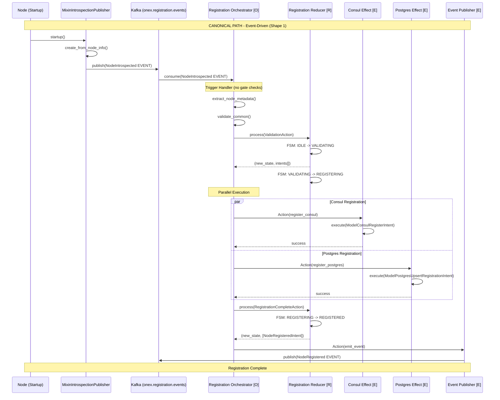
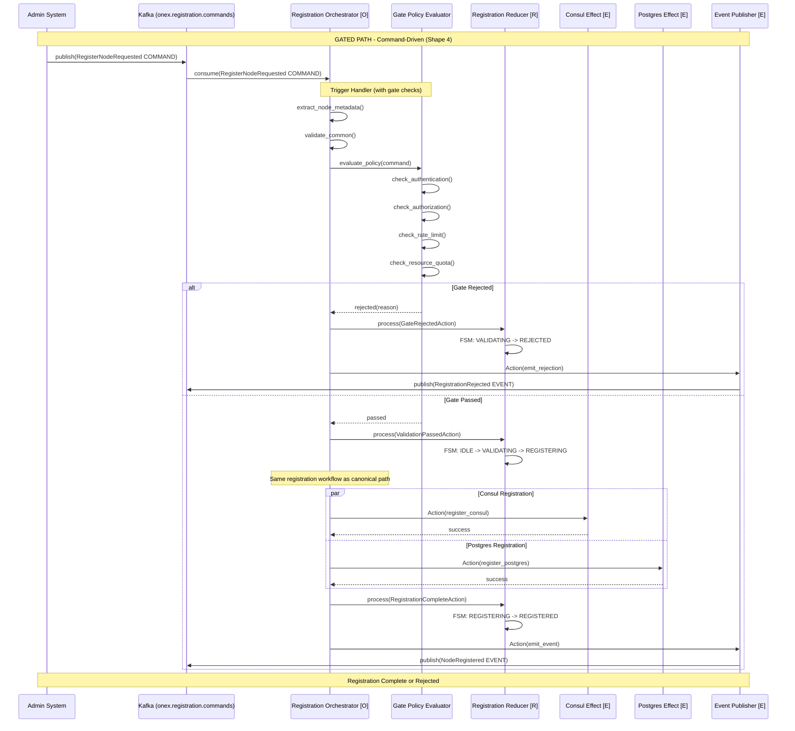
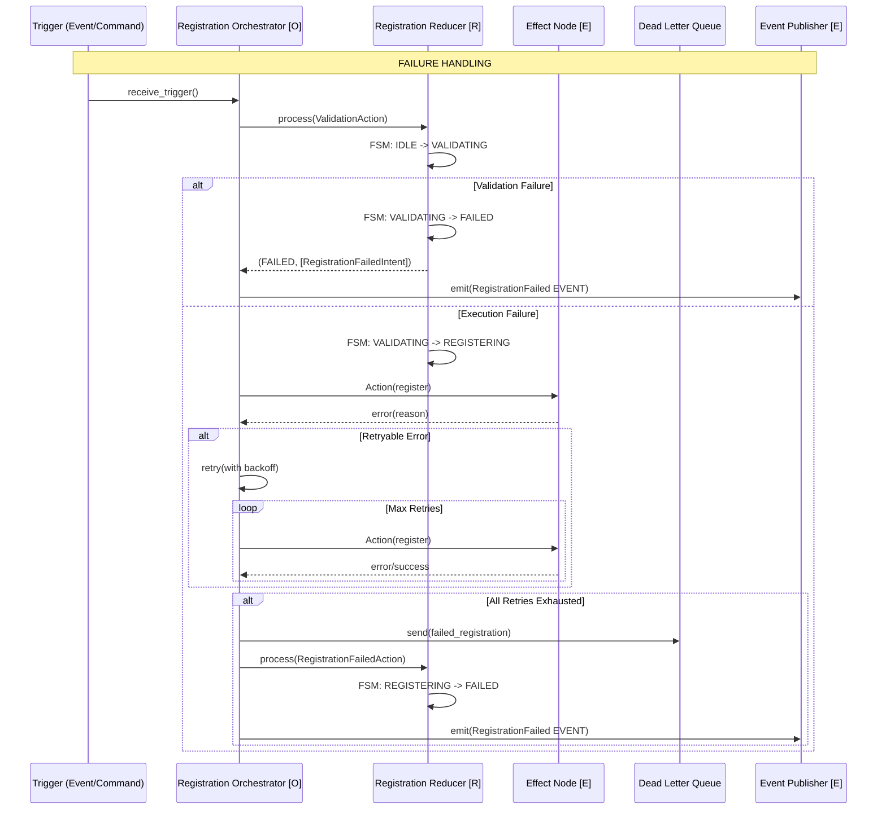

# Registration Trigger Design

> **Version**: 1.0.0
> **Ticket**: OMN-943
> **Status**: Specification
> **Last Updated**: 2025-12-19
> **Related ADR**: [ADR-004: Registration Trigger Architecture](decisions/ADR-004-registration-trigger-architecture.md)

---

## Table of Contents

1. [Overview](#overview)
2. [Registration Trigger Types](#registration-trigger-types)
3. [Canonical Path: NodeIntrospected EVENT](#canonical-path-nodeintrospected-event)
4. [Gated Path: RegisterNodeRequested COMMAND](#gated-path-registernoderequested-command)
5. [Registration Orchestrator Design](#registration-orchestrator-design)
6. [FSM State Machine](#fsm-state-machine)
7. [Sequence Diagrams](#sequence-diagrams)
8. [Topic Mappings](#topic-mappings)
9. [Intent Models](#intent-models)
10. [Implementation Status](#implementation-status)
11. [Related Documentation](#related-documentation)

---

## Overview

ONEX node registration supports **two distinct trigger paths** that initiate the registration workflow. This design supports both automatic discovery and controlled administrative registration. It maintains architectural purity through the Event/Command to Orchestrator execution shapes.

For the architectural decision rationale behind this design, see [ADR-004: Registration Trigger Architecture](decisions/ADR-004-registration-trigger-architecture.md).

### Design Principles

1. **Event-Driven as Default**: Automatic registration via events is the canonical path, aligning with ONEX philosophy
2. **Command-Driven for Control**: Administrative and gated scenarios use explicit commands
3. **Single Orchestrator**: One `NodeRegistrationOrchestrator` handles both trigger types
4. **Pure FSM**: Registration state managed by FSM-driven Reducer with Intent emission
5. **Intent-Based Side Effects**: Reducers emit Intents; Effect nodes execute I/O
6. **Separation of Concerns**: Orchestrator coordinates; Effect nodes execute

### High-Level Architecture

```text
                        REGISTRATION TRIGGERS
                        =====================

    +---------------------------------------------------------------------------+
    |                                                                           |
    |   CANONICAL PATH (Event-Driven)         GATED PATH (Command-Driven)      |
    |   =============================         ===========================       |
    |                                                                           |
    |   +-------------------+                 +---------------------+           |
    |   |      Node         |                 |   Admin System      |           |
    |   |     Startup       |                 |   or API Client     |           |
    |   +---------+---------+                 +----------+----------+           |
    |             |                                      |                      |
    |             | MixinIntrospection                   | API/CLI              |
    |             | Publisher (automatic)                | (explicit)           |
    |             v                                      v                      |
    |   +-------------------+                 +---------------------+           |
    |   | NodeIntrospected  |                 | RegisterNodeRequested|          |
    |   | EVENT             |                 | COMMAND              |          |
    |   |                   |                 |                      |          |
    |   | Topic:            |                 | Topic:               |          |
    |   | onex.registration.|                 | onex.registration.   |          |
    |   | events            |                 | commands             |          |
    |   +---------+---------+                 +----------+-----------+          |
    |             |                                      |                      |
    |             |  Shape 1:                            |  Shape 4:            |
    |             |  Event -> Orchestrator               |  Command ->          |
    |             |                                      |  Orchestrator        |
    |             +------------------+-------------------+                      |
    |                                |                                          |
    |                                v                                          |
    |                  +---------------------------+                            |
    |                  |   REGISTRATION            |                            |
    |                  |   ORCHESTRATOR [O]        |                            |
    |                  |                           |                            |
    |                  |   - Validates trigger     |                            |
    |                  |   - Applies policy        |                            |
    |                  |   - Emits Actions to      |                            |
    |                  |     downstream nodes      |                            |
    |                  +-------------+-------------+                            |
    |                                |                                          |
    +---------------------------------------------------------------------------+
                                     |
                                     v
                          REGISTRATION WORKFLOW
                          (See detailed design below)
```

---

## Registration Trigger Types

### Summary Table

| Trigger | Message Category | Execution Shape | Canonical/Gated | Use Case |
|---------|------------------|-----------------|-----------------|----------|
| `NodeIntrospected` | EVENT | Shape 1: Event -> Orchestrator | **Canonical** | Automatic node startup |
| `RegisterNodeRequested` | COMMAND | Shape 4: Command -> Orchestrator | Gated/Optional | Administrative control |

### Semantic Distinction

| Aspect | EVENT (NodeIntrospected) | COMMAND (RegisterNodeRequested) |
|--------|--------------------------|--------------------------------|
| **Semantics** | Fact (past tense): "Node announced itself" | Request (imperative): "Please register this node" |
| **Source** | Node itself (automatic) | External system (explicit) |
| **May Fail?** | No (event is immutable fact) | Yes (command may be rejected) |
| **Requires Auth?** | No (self-announcement) | May require authorization |
| **Timing** | At node startup | Any time (pre-registration, re-registration) |

### When to Use Each Path

| Scenario | Trigger Path | Rationale |
|----------|--------------|-----------|
| Normal node startup | Canonical (EVENT) | Automatic, zero-touch registration |
| Manual node onboarding | Gated (COMMAND) | Admin control over registration |
| Re-registration after failure | Either | Canonical if automatic retry; Gated if manual intervention |
| Bulk node provisioning | Gated (COMMAND) | Batch control with admin approval |
| Development/testing | Either | Canonical for integration tests; Gated for unit tests |

---

## Canonical Path: NodeIntrospected EVENT

The **canonical path** is the default registration mechanism, triggered automatically when a node starts up and publishes its introspection event.

### Trigger Model

**Model**: `ModelNodeIntrospectionEvent`
**Location**: `src/omnibase_core/models/discovery/model_nodeintrospectionevent.py`
**Event Type**: `NODE_INTROSPECTION_EVENT` (from `src/omnibase_core/constants/event_types.py`)

```python
class ModelNodeIntrospectionEvent(ModelOnexEvent):
    """Event published by nodes to announce their capabilities for discovery."""

    event_type: str = Field(default=NODE_INTROSPECTION_EVENT)
    node_name: str = Field(...)
    version: ModelSemVer = Field(...)
    node_type: str = Field(...)  # effect, compute, reducer, orchestrator
    node_role: str | None = Field(default=None)  # Optional specialization
    capabilities: ModelNodeCapability = Field(...)
    health_endpoint: str | None = Field(default=None)
    tags: list[str] = Field(default_factory=list)
    service_id: UUID | None = Field(default=None)  # Consul compatibility
    datacenter: str | None = Field(default=None)   # Multi-DC discovery
```

### Publishing Mechanism

**Mixin**: `MixinIntrospectionPublisher`
**Location**: `src/omnibase_core/mixins/mixin_introspection_publisher.py`

The mixin automatically:
1. Gathers node introspection data (name, version, capabilities, protocols)
2. Creates `ModelNodeIntrospectionEvent` with extracted metadata
3. Wraps in `ModelEventEnvelope` with correlation ID
4. Publishes to event bus with retry logic

```python
# Factory method for creating events
event = ModelNodeIntrospectionEvent.create_from_node_info(
    node_id=node_id,
    node_name="MyComputeNode",
    version=ModelSemVer(major=1, minor=0, patch=0),
    node_type="compute",
    actions=["transform", "validate"],
    tags=["env:production"],
    node_role="transformer",  # Optional
)
```

### Execution Shape

This follows the **Event -> Orchestrator** canonical execution shape (Shape 1):

```text
    +-------------------------------------------------------------+
    |                    Event -> Orchestrator                     |
    |                    (Shape 1 - Canonical)                     |
    +-------------------------------------------------------------+

    +--------------+     +--------------------+     +------------------------+
    |    Node      |     |  NodeIntrospected  |     |    Registration        |
    |   Startup    |---->|      EVENT         |---->|  Orchestrator [O]      |
    |              |     |                    |     |                        |
    | MixinIntro-  |     | onex.registration. |     | Coordinates workflow   |
    | spection     |     | events             |     | via ModelAction        |
    | Publisher    |     |                    |     |                        |
    +--------------+     +--------------------+     +------------+-----------+
                                                                |
                                                                v
                                                   +--------------------+
                                                   | Emits Actions to   |
                                                   | downstream nodes   |
                                                   +--------------------+
```

### Characteristics

| Aspect | Description |
|--------|-------------|
| **Automation** | Zero-touch; happens automatically on node startup |
| **Source** | `MixinIntrospectionPublisher` in node base classes |
| **Topic** | `onex.registration.events` |
| **Validation** | Node-side validation before publish |
| **Idempotency** | Upsert semantics; re-registration updates existing |
| **Gate Checks** | None required for event-driven registration |

---

## Gated Path: RegisterNodeRequested COMMAND

The **gated path** is reserved for administrative or exceptional registration flows requiring explicit operator intervention.

### Trigger Model

**Model**: `ModelRegisterNodeCommand` (planned, not yet implemented)
**Topic**: `onex.registration.commands`

```python
# Future: src/omnibase_core/models/registration/model_register_node_command.py
class ModelRegisterNodeCommand(BaseModel):
    """Command to request node registration via administrative flow."""

    model_config = ConfigDict(frozen=True, extra="forbid")

    # Command identification
    command_id: UUID = Field(default_factory=uuid4)
    command_type: Literal["REGISTER_NODE"] = Field(default="REGISTER_NODE")
    correlation_id: UUID = Field(default_factory=uuid4)

    # Node information (same as introspection event)
    node_id: UUID = Field(...)
    node_name: str = Field(...)
    node_type: str = Field(...)  # effect, compute, reducer, orchestrator
    version: ModelSemVer = Field(...)
    capabilities: ModelNodeCapability = Field(...)

    # Registration context
    environment: str = Field(...)
    network_id: str = Field(...)
    tags: list[str] = Field(default_factory=list)

    # Administrative metadata
    requested_by: str = Field(...)  # Admin user/system
    reason: str | None = Field(default=None)  # Audit trail
    bypass_policy: bool = Field(default=False)  # Emergency override
    priority: int = Field(default=5)  # 1-10 scale
```

### Execution Shape

This follows the **Command -> Orchestrator** canonical execution shape (Shape 4):

```text
    +-------------------------------------------------------------+
    |                  Command -> Orchestrator                     |
    |                  (Shape 4 - Gated)                           |
    +-------------------------------------------------------------+

    +--------------+     +----------------------+     +------------------------+
    |   Admin      |     | RegisterNodeRequested|     |    Registration        |
    |   System     |---->|      COMMAND         |---->|  Orchestrator [O]      |
    |              |     |                      |     |                        |
    | API, CLI,    |     | onex.registration.   |     | Validates auth,        |
    | Scheduler    |     | commands             |     | applies policy,        |
    |              |     |                      |     | coordinates workflow   |
    +--------------+     +----------------------+     +------------+-----------+
                                                                  |
                                                                  v
                                                     +--------------------+
                                                     | Emits Actions to   |
                                                     | downstream nodes   |
                                                     | (gated)            |
                                                     +--------------------+
```

### Gating Logic

The Registration Orchestrator applies additional checks for command-driven registration:

```text
Command-Driven Registration Gate Checks:
+---------------------------------------------------------------------------+
| 1. Authentication: Verify requester identity                              |
| 2. Authorization: Check registration permissions                          |
| 3. Rate Limiting: Prevent registration flooding                           |
| 4. Policy Check: Validate against registration policy                     |
| 5. Duplicate Check: Prevent re-registration conflicts                     |
| 6. Resource Quota: Check namespace/tenant limits                          |
+---------------------------------------------------------------------------+

Gate Pass -> Proceed to common registration logic
Gate Fail -> Emit RegistrationRejected event with reason
```

### Characteristics

| Aspect | Description |
|--------|-------------|
| **Control** | Explicit administrative action required |
| **Source** | Admin API, CLI, provisioning scripts |
| **Topic** | `onex.registration.commands` |
| **Validation** | Command-level validation + orchestrator validation + gate checks |
| **Authorization** | May require admin credentials or approval |
| **Audit** | Full audit trail via `requested_by` and `reason` fields |

### Use Cases for Gated Path

1. **Manual Node Onboarding**: Register nodes in environments where automatic discovery is disabled
2. **Pre-Production Provisioning**: Register nodes before they are deployed
3. **Disaster Recovery**: Re-register nodes after infrastructure failures
4. **Compliance Requirements**: Audit trail of explicit registration actions
5. **Batch Operations**: Register multiple nodes with administrative oversight

---

## Registration Orchestrator Design

The `NodeRegistrationOrchestrator` is the single entry point for all registration triggers.

### Responsibilities

1. **Accepts both triggers**: Handles `NodeIntrospected` events and `RegisterNodeRequested` commands
2. **Applies trigger-specific gates**: Commands may have additional authorization checks
3. **Validates node metadata**: Common validation regardless of trigger source
4. **Coordinates registration workflow**: Emits Actions to downstream nodes
5. **Handles failures**: Retry logic, dead-letter handling, error events

### Architecture

```text
+---------------------------------------------------------------------------+
|                    REGISTRATION ORCHESTRATOR                               |
|                    NodeRegistrationOrchestrator [O]                        |
+---------------------------------------------------------------------------+
|                                                                           |
|  +---------------------------------------------------------------------+ |
|  |                      TRIGGER HANDLER                                | |
|  |                                                                     | |
|  |   NodeIntrospected EVENT ---+                                       | |
|  |                             +---> Extract Node Metadata             | |
|  |   RegisterNodeRequested ----+         |                             | |
|  |   COMMAND (+ gate checks)             v                             | |
|  |                            +-------------------+                    | |
|  |                            | Common Validation |                    | |
|  |                            +---------+---------+                    | |
|  +--------------------------------------+------------------------------+ |
|                                         |                                |
|  +--------------------------------------+------------------------------+ |
|  |                      WORKFLOW ENGINE                                | |
|  |                                      v                              | |
|  |  +----------------------------------------------------------------+ | |
|  |  |                  WORKFLOW DEFINITION                           | | |
|  |  |                                                                | | |
|  |  |  Step 1: Validate ----> Step 2: Register ----> Step 3:        | | |
|  |  |  (COMPUTE)               Consul (EFFECT)        Register       | | |
|  |  |                              |                  Postgres       | | |
|  |  |                              |                  (EFFECT)       | | |
|  |  |                              v                      |          | | |
|  |  |                    +-------------------+            |          | | |
|  |  |                    | Parallel Execution|<-----------+          | | |
|  |  |                    +---------+---------+                       | | |
|  |  |                              |                                 | | |
|  |  |                              v                                 | | |
|  |  |                    Step 4: Emit NodeRegistered EVENT           | | |
|  |  |                    (EFFECT)                                    | | |
|  |  |                                                                | | |
|  |  +----------------------------------------------------------------+ | |
|  |                                                                     | |
|  +---------------------------------------------------------------------+ |
|                                                                           |
|  +---------------------------------------------------------------------+ |
|  |                      ACTION EMITTER                                 | |
|  |                                                                     | |
|  |  ModelAction {                     Target Nodes:                    | |
|  |    action_type: EFFECT,           +-----------------------------+  | |
|  |    target_node_type: "...",       | NodeConsulRegistrarEffect   |  | |
|  |    lease_id: workflow_lease,      | NodePostgresRegistrarEffect |  | |
|  |    epoch: current_epoch,          | NodeEventPublisherEffect    |  | |
|  |    payload: {...}                 +-----------------------------+  | |
|  |  }                                                                  | |
|  +---------------------------------------------------------------------+ |
|                                                                           |
+---------------------------------------------------------------------------+
```

### Workflow Definition (YAML Contract)

```yaml
# contracts/node_registration_orchestrator.yaml
metadata:
  name: NodeRegistrationOrchestrator
  version: 1.0.0
  node_kind: orchestrator

triggers:
  events:
    - topic: onex.registration.events
      event_type: node_introspection_event
      handler: handle_introspection_event
  commands:
    - topic: onex.registration.commands
      command_type: REGISTER_NODE
      handler: handle_register_command
      gate_required: true

workflow:
  name: registration_workflow
  description: Node registration workflow handling both canonical and gated paths
  execution_mode: parallel  # Consul and Postgres run in parallel

  steps:
    - step_id: validate
      step_name: ValidateRegistration
      step_type: compute
      target_node_type: NodeRegistrationValidatorCompute
      required: true
      timeout_ms: 5000

    - step_id: consul_register
      step_name: RegisterWithConsul
      step_type: effect
      target_node_type: NodeConsulRegistrarEffect
      dependencies: [validate]
      required: true
      timeout_ms: 10000

    - step_id: postgres_upsert
      step_name: UpsertToPostgres
      step_type: effect
      target_node_type: NodePostgresRegistrarEffect
      dependencies: [validate]  # Parallel with consul_register
      required: true
      timeout_ms: 10000

    - step_id: emit_completed
      step_name: EmitCompletedEvent
      step_type: effect
      target_node_type: NodeEventPublisherEffect
      dependencies: [consul_register, postgres_upsert]
      required: true
      timeout_ms: 5000

  error_handling:
    on_failure: emit_failure_event
    max_retries: 2
    retry_delay_ms: 1000
```

### Implementation Sketch

```python
from omnibase_core.nodes import NodeOrchestrator, ModelOrchestratorInput
from omnibase_core.models.container.model_onex_container import ModelONEXContainer

class NodeRegistrationOrchestrator(NodeOrchestrator):
    """
    Orchestrator for node registration workflow.

    Handles both trigger paths:
    - EVENT: NodeIntrospected (automatic, canonical)
    - COMMAND: RegisterNodeRequested (administrative, gated)
    """

    def __init__(self, container: ModelONEXContainer) -> None:
        super().__init__(container)
        # Workflow definition loaded from YAML contract

    async def handle_introspection_event(
        self,
        event: ModelNodeIntrospectionEvent
    ) -> None:
        """Handle canonical registration via introspection event."""
        # No gate checks for event-driven registration
        workflow_input = self._create_workflow_input_from_event(event)
        await self._execute_registration_workflow(workflow_input)

    async def handle_register_command(
        self,
        command: ModelRegisterNodeCommand
    ) -> None:
        """Handle gated registration via admin command."""
        # Apply gate checks for command-driven registration
        gate_result = await self._evaluate_gate_policy(command)
        if not gate_result.passed:
            await self._emit_rejection_event(command, gate_result.reason)
            return

        workflow_input = self._create_workflow_input_from_command(command)
        await self._execute_registration_workflow(workflow_input)
```

---

## FSM State Machine

The registration workflow uses an FSM-driven Reducer to manage state transitions.

### State Definitions

| State | Type | Description |
|-------|------|-------------|
| `idle` | Initial | Awaiting registration trigger |
| `validating` | Transient | Validating registration payload and gate checks |
| `registering` | Transient | Executing Consul and PostgreSQL registration |
| `registered` | Terminal (Success) | Registration completed successfully |
| `failed` | Terminal (Error) | Registration failed (validation or execution) |
| `rejected` | Terminal (Gated) | Command-driven registration rejected by gate |

### State Transition Diagram

```text
                    Registration FSM States
                    =======================

    +---------------------------------------------------------------------------+
    |                                                                           |
    |                          +-------+                                        |
    |                          | IDLE  |                                        |
    |                          +---+---+                                        |
    |                              |                                            |
    |                   receive_trigger                                         |
    |                   (event or command)                                      |
    |                              |                                            |
    |                              v                                            |
    |                       +------------+                                      |
    |            +----------|  VALIDATING |----------+                          |
    |            |          +------+-----+          |                           |
    |            |                 |                |                           |
    |   validation_failed   validation_passed    gate_rejected                  |
    |            |                 |                |                           |
    |            v                 v                v                           |
    |     +----------+      +------------+    +----------+                      |
    |     |  FAILED  |      | REGISTERING|    | REJECTED |                      |
    |     |          |      +------+-----+    | (gated   |                      |
    |     | (terminal)|            |          |  only)   |                      |
    |     +----------+      +------+-----+    +----------+                      |
    |                       |            |         |                            |
    |          registration_success   registration_failed                       |
    |                       |            |         |                            |
    |                       v            v         |                            |
    |               +------------+  +----------+   |                            |
    |               | REGISTERED |  |  FAILED  |<--+                            |
    |               |            |  |          |                                |
    |               | (terminal) |  | (terminal)|                               |
    |               +------------+  +----------+                                |
    |                                                                           |
    +---------------------------------------------------------------------------+
```

### State Transitions

| Current State | Trigger | Next State | Intent Emitted |
|---------------|---------|------------|----------------|
| idle | `receive_introspection_event` | validating | None |
| idle | `receive_register_command` | validating | None |
| validating | `validation_passed` | registering | `ModelRegistrationPayload` |
| validating | `validation_failed` | failed | `RegistrationFailedIntent` |
| validating | `gate_rejected` | rejected | `RegistrationRejectedIntent` |
| registering | `registration_success` | registered | `NodeRegisteredIntent` |
| registering | `registration_failed` | failed | `RegistrationFailedIntent` |

### FSM Contract (YAML)

```yaml
# contracts/registration_fsm.yaml
fsm:
  name: registration_state_machine
  initial_state: idle
  terminal_states: [registered, failed, rejected]

  states:
    idle:
      type: initial
      on_enter: log_awaiting_trigger

    validating:
      type: transient
      on_enter: start_validation_timer
      on_exit: stop_validation_timer
      timeout_ms: 10000

    registering:
      type: transient
      on_enter: start_registration_timer
      on_exit: stop_registration_timer
      timeout_ms: 30000

    registered:
      type: terminal
      on_enter: emit_success_metrics

    failed:
      type: terminal
      on_enter: emit_failure_metrics

    rejected:
      type: terminal
      on_enter: emit_rejection_metrics

  transitions:
    - from: idle
      to: validating
      trigger: receive_trigger
      guard: payload_present

    - from: validating
      to: registering
      trigger: validation_passed
      guard: is_gate_passed

    - from: validating
      to: failed
      trigger: validation_failed
      actions:
        - emit_validation_failure_intent

    - from: validating
      to: rejected
      trigger: gate_rejected
      guard: is_command_trigger
      actions:
        - emit_rejection_intent

    - from: registering
      to: registered
      trigger: registration_success
      actions:
        - emit_registration_success_intent

    - from: registering
      to: failed
      trigger: registration_failed
      actions:
        - emit_registration_failure_intent
```

---

## Sequence Diagrams

### Canonical Path: Event-Driven Registration



### Gated Path: Command-Driven Registration



### Registration Failure Flow



---

## Topic Mappings

### Registration Domain Topics

Per the [ONEX Topic Taxonomy](../standards/onex_topic_taxonomy.md):

| Topic | Type | Purpose | Retention |
|-------|------|---------|-----------|
| `onex.registration.commands` | commands | Registration commands (gated path) | 7 days |
| `onex.registration.events` | events | Registration lifecycle events (including NodeIntrospected) | 30 days |
| `onex.registration.intents` | intents | Side-effect coordination (Reducer -> Effect) | 1 day |
| `onex.registration.snapshots` | snapshots | Node state snapshots (recovery) | 7 days, compacted |

### Topic Configuration

```yaml
# Kafka topic configuration
onex.registration.commands:
  cleanup.policy: delete
  retention.ms: 604800000  # 7 days
  partition_key: entity_id

onex.registration.events:
  cleanup.policy: delete
  retention.ms: 2592000000  # 30 days
  partition_key: entity_id

onex.registration.intents:
  cleanup.policy: delete
  retention.ms: 86400000  # 1 day
  partition_key: entity_id

onex.registration.snapshots:
  cleanup.policy: compact,delete
  retention.ms: 604800000  # 7 days
  min.compaction.lag.ms: 3600000  # 1 hour
  partition_key: entity_id
```

### Event Type Constants

From `src/omnibase_core/constants/event_types.py`:

```python
# Introspection and discovery events
NODE_INTROSPECTION_EVENT = "node_introspection_event"

# Registration events (to be added)
NODE_REGISTRATION_REQUESTED = "node_registration_requested"
NODE_REGISTRATION_COMPLETED = "node_registration_completed"
NODE_REGISTRATION_FAILED = "node_registration_failed"
NODE_REGISTRATION_REJECTED = "node_registration_rejected"
```

### Message Flow by Path

```text
CANONICAL PATH (Event-Driven):
+---------------------------------------------------------------------------+
|  Node Startup                                                             |
|       |                                                                   |
|       v                                                                   |
|  onex.registration.events --------> NodeIntrospected EVENT                |
|       |                                                                   |
|       v                                                                   |
|  Registration Orchestrator                                                |
|       |                                                                   |
|       +---> onex.registration.intents --------> ModelConsulRegisterIntent |
|       |                                                                   |
|       +---> onex.registration.intents --------> ModelPostgresUpsertIntent |
|       |                                                                   |
|       v                                                                   |
|  onex.registration.events --------> NodeRegistered EVENT                  |
|       |                                                                   |
|       v                                                                   |
|  onex.registration.snapshots --------> RegistrationStateSnapshot          |
+---------------------------------------------------------------------------+

GATED PATH (Command-Driven):
+---------------------------------------------------------------------------+
|  Admin System                                                             |
|       |                                                                   |
|       v                                                                   |
|  onex.registration.commands --------> RegisterNodeRequested COMMAND       |
|       |                                                                   |
|       v                                                                   |
|  Registration Orchestrator (+ Gate Checks)                                |
|       |                                                                   |
|       +--[PASS]---> Same flow as canonical path                           |
|       |                                                                   |
|       +--[FAIL]---> onex.registration.events --------> RegistrationRejected|
+---------------------------------------------------------------------------+
```

---

## Intent Models

### Existing Intent Models

The following intent models are already implemented:

#### ModelConsulRegisterIntent

**Location**: `src/omnibase_core/models/intents/model_consul_register_intent.py`

```python
class ModelConsulRegisterIntent(ModelCoreIntent):
    """Intent to register a service with Consul service discovery."""

    kind: Literal["consul.register"] = "consul.register"
    service_id: str      # Unique within Consul datacenter
    service_name: str    # Logical service name for discovery
    tags: list[str]      # Service filtering metadata
    health_check: dict[str, Any] | None  # Consul health check config
```

#### ModelPostgresUpsertRegistrationIntent

**Location**: `src/omnibase_core/models/intents/model_postgres_upsert_registration_intent.py`

```python
class ModelPostgresUpsertRegistrationIntent(ModelCoreIntent):
    """Intent to upsert a node registration in PostgreSQL."""

    kind: Literal["postgres.upsert_registration"] = "postgres.upsert_registration"
    record: BaseModel  # Registration record to persist
```

#### ModelRegistrationPayload

**Location**: `src/omnibase_core/models/registration/model_registration_payload.py`

```python
class ModelRegistrationPayload(BaseModel):
    """Typed payload containing all registration data."""

    # Node Identity
    node_id: UUID
    deployment_id: UUID

    # Environment Context
    environment: str
    network_id: str

    # Consul Projection (Deterministic)
    consul_service_id: str
    consul_service_name: str
    consul_tags: list[str]
    consul_health_check: dict[str, Any] | None

    # PostgreSQL Record (Source of Truth)
    postgres_record: ModelRegistrationRecordBase
```

### Intent Emission Pattern

The Registration Reducer emits intents that Effect nodes execute:

```text
Registration Reducer (Pure FSM):
+---------------------------------------------------------------------------+
|                                                                           |
|   delta(state, action) -> (new_state, intents[])                          |
|                                                                           |
|   Input: NodeIntrospectionEvent (from trigger)                            |
|   +---------------------------------------------------------------+       |
|   | State: VALIDATING                                             |       |
|   | Action: VALIDATION_PASSED                                     |       |
|   +---------------------------------------------------------------+       |
|                                    |                                      |
|                                    v                                      |
|   +---------------------------------------------------------------+       |
|   | New State: REGISTERING                                        |       |
|   | Intents:                                                      |       |
|   |   - ModelConsulRegisterIntent(                               |       |
|   |       service_id="node-{node_id}",                           |       |
|   |       service_name="onex-compute",                           |       |
|   |       tags=["node_type:compute"]                             |       |
|   |     )                                                         |       |
|   |   - ModelPostgresUpsertRegistrationIntent(                   |       |
|   |       record=NodeRegistrationRecord(...)                     |       |
|   |     )                                                         |       |
|   +---------------------------------------------------------------+       |
|                                                                           |
+---------------------------------------------------------------------------+

Effect Node (Executes Intents):
+---------------------------------------------------------------------------+
|   match intent:                                                           |
|       case ModelConsulRegisterIntent():                                   |
|           await consul_client.register(...)                               |
|       case ModelPostgresUpsertRegistrationIntent():                       |
|           await db.execute("INSERT ... ON CONFLICT UPDATE ...")           |
+---------------------------------------------------------------------------+
```

---

## Implementation Status

### Implemented

| Component | Location | Status |
|-----------|----------|--------|
| `NODE_INTROSPECTION_EVENT` constant | `src/omnibase_core/constants/event_types.py` | Implemented |
| `ModelNodeIntrospectionEvent` model | `src/omnibase_core/models/discovery/model_nodeintrospectionevent.py` | Implemented |
| `MixinIntrospectionPublisher` mixin | `src/omnibase_core/mixins/mixin_introspection_publisher.py` | Implemented |
| `ModelConsulRegisterIntent` | `src/omnibase_core/models/intents/model_consul_register_intent.py` | Implemented |
| `ModelConsulDeregisterIntent` | `src/omnibase_core/models/intents/model_consul_deregister_intent.py` | Implemented |
| `ModelPostgresUpsertRegistrationIntent` | `src/omnibase_core/models/intents/model_postgres_upsert_registration_intent.py` | Implemented |
| `ModelRegistrationPayload` | `src/omnibase_core/models/registration/model_registration_payload.py` | Implemented |
| `ModelRegistrationRecordBase` | `src/omnibase_core/models/intents/model_registration_record_base.py` | Implemented |
| `ProtocolRegistrationRecord` | `src/omnibase_core/protocols/intents/protocol_registration_record.py` | Implemented |
| Topic taxonomy | `docs/standards/onex_topic_taxonomy.md` | Documented |
| ADR-004 | `docs/architecture/decisions/ADR-004-registration-trigger-architecture.md` | Documented |

### Planned / Reserved

| Component | Description | Priority | Status |
|-----------|-------------|----------|--------|
| `ModelRegisterNodeCommand` | Command model for gated registration | Medium | Reserved |
| `NodeRegistrationOrchestrator` | Registration workflow coordinator | High | Planned |
| `NodeRegistrationReducer` | FSM for registration state | High | Planned |
| `NodeConsulRegistrarEffect` | Consul registration execution | High | Planned |
| `NodePostgresRegistrarEffect` | PostgreSQL registration execution | High | Planned |
| `NodeEventPublisherEffect` | Event emission execution | High | Planned |
| Gate policy evaluator | Authorization for command-driven registration | Medium | Planned |
| Admin API endpoint | REST API for command-driven registration | Medium | Planned |

### Implementation Roadmap

**Phase 1 - Core Orchestrator** (Priority: High)
- Implement `NodeRegistrationOrchestrator`
- Implement `NodeRegistrationReducer` with FSM
- Wire up event consumption from `onex.registration.events`
- Support canonical path (event-driven registration)

**Phase 2 - Effect Nodes** (Priority: High)
- Implement `NodeConsulRegistrarEffect`
- Implement `NodePostgresRegistrarEffect`
- Implement `NodeEventPublisherEffect`
- Wire up intent consumption from `onex.registration.intents`

**Phase 3 - Command Path** (Priority: Medium)
- Implement `ModelRegisterNodeCommand` model
- Implement gate policy evaluator
- Wire up command consumption from `onex.registration.commands`
- Support gated path (command-driven registration)

**Phase 4 - Observability** (Priority: Medium)
- Add registration metrics (success/failure rates, latency)
- Add distributed tracing (correlation IDs)
- Add registration dashboard
- Add alerting for registration failures

### Error Handling

Both paths use **upsert semantics** for registration:
- Consul: Service ID uniqueness constraint
- PostgreSQL: `INSERT ... ON CONFLICT (node_id) DO UPDATE`

Re-registration of an existing node updates the record rather than failing.

Failures are handled by:
1. Retry with exponential backoff (up to max_retries)
2. Dead-letter queue for exhausted retries
3. Emit `RegistrationFailed` event with error details

---

## Related Documentation

| Document | Purpose |
|----------|---------|
| [ADR-004: Registration Trigger Architecture](decisions/ADR-004-registration-trigger-architecture.md) | Architectural decision rationale |
| [Canonical Execution Shapes](CANONICAL_EXECUTION_SHAPES.md) | Allowed data flow patterns |
| [ONEX Topic Taxonomy](../standards/onex_topic_taxonomy.md) | Kafka topic naming standard |
| [ONEX Terminology](../standards/onex_terminology.md) | Core concept definitions |
| [ONEX Four-Node Architecture](ONEX_FOUR_NODE_ARCHITECTURE.md) | Architecture overview |
| [ModelIntent Architecture](MODEL_INTENT_ARCHITECTURE.md) | Intent pattern documentation |
| [Node Building Guide](../guides/node-building/README.md) | Node implementation guide |

### Code References

| Component | Location |
|-----------|----------|
| `ModelNodeIntrospectionEvent` | `src/omnibase_core/models/discovery/model_nodeintrospectionevent.py` |
| `MixinIntrospectionPublisher` | `src/omnibase_core/mixins/mixin_introspection_publisher.py` |
| `ModelRegistrationPayload` | `src/omnibase_core/models/registration/model_registration_payload.py` |
| `ModelConsulRegisterIntent` | `src/omnibase_core/models/intents/model_consul_register_intent.py` |
| `ModelPostgresUpsertRegistrationIntent` | `src/omnibase_core/models/intents/model_postgres_upsert_registration_intent.py` |
| `ModelRegistrationRecordBase` | `src/omnibase_core/models/intents/model_registration_record_base.py` |
| `ProtocolRegistrationRecord` | `src/omnibase_core/protocols/intents/protocol_registration_record.py` |
| Event Type Constants | `src/omnibase_core/constants/event_types.py` |

---

**Document Version**: 1.0.0
**Last Updated**: 2025-12-19
**Primary Maintainer**: ONEX Architecture Team
**Linear Ticket**: OMN-943
