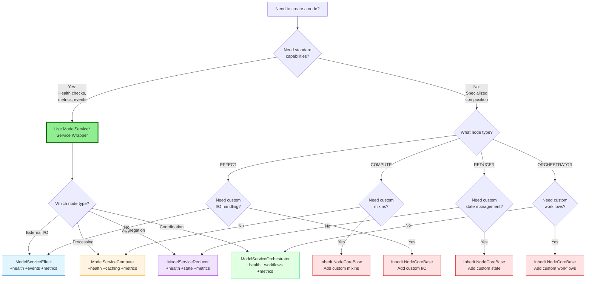

# Node Types

**Reading Time**: 10 minutes
**Prerequisites**: [What is a Node?](01_WHAT_IS_A_NODE.md)
**Next**: [COMPUTE Node Tutorial](03_COMPUTE_NODE_TUTORIAL.md)

## Overview

The ONEX framework defines **four fundamental node types**, each designed for a specific category of operations. Understanding when to use each type is essential for building well-architected systems.

## The Four Node Types

```
┌────────────────────────────────────────────────────────────────┐
│                    ONEX Four-Node Architecture                 │
├────────────────────────────────────────────────────────────────┤
│                                                                │
│  EFFECT         COMPUTE         REDUCER       ORCHESTRATOR    │
│  ═══════        ════════        ════════      ══════════════   │
│  External       Transform       Aggregate     Coordinate       │
│  I/O            Data            State         Workflows        │
│                                                                │
│  Examples:      Examples:       Examples:     Examples:        │
│  • API calls    • Calculate     • Sum values  • Multi-step     │
│  • Database     • Validate      • Merge data  • Dependencies   │
│  • File I/O     • Transform     • Reduce      • Parallel work  │
│  • Messages     • Filter        • Group       • Error recovery │
│                                                                │
└────────────────────────────────────────────────────────────────┘
```

## EFFECT Node

### Purpose

**Interface with the external world** - APIs, databases, file systems, message queues, and any I/O operations.

### Characteristics

- **Side effects allowed**: Can modify external state
- **I/O operations**: Network, disk, message queues
- **Error handling crucial**: External systems can fail
- **Idempotency important**: Same input → same result (when possible)
- **Resource management**: Connections, file handles, etc.

### When to Use EFFECT

Use an EFFECT node when you need to:

✅ Call an external API
✅ Read from or write to a database
✅ Read from or write to files
✅ Send messages to a queue
✅ Interact with external services
✅ Perform any I/O operation

### Real-World Examples

```
# Example 1: Database read operation
class NodeUserFetcherEffect(NodeCoreBase):
    """Fetch user data from database."""

    async def process(
        self,
        input_data: ModelEffectInput
    ) -> ModelEffectOutput:
        """Fetch user by ID from PostgreSQL."""
        user_id = input_data.user_id

        # External I/O: Database query
        async with self.db_pool.acquire() as conn:
            user_data = await conn.fetchrow(
                "SELECT * FROM users WHERE id = $1",
                user_id
            )

        return ModelEffectOutput(
            result=dict(user_data) if user_data else None,
            success=user_data is not None
        )

# Example 2: External API call
class NodeWeatherFetcherEffect(NodeCoreBase):
    """Fetch weather data from external API."""

    async def process(
        self,
        input_data: ModelEffectInput
    ) -> ModelEffectOutput:
        """Get weather for location."""
        location = input_data.location

        # External I/O: HTTP API call
        async with aiohttp.ClientSession() as session:
            async with session.get(
                f"https://api.weather.com/forecast",
                params={"location": location}
            ) as response:
                weather_data = await response.json()

        return ModelEffectOutput(
            result=weather_data,
            success=response.status == 200
        )
```

### Key Patterns

**Connection Pooling**:
```
def __init__(self, container: ModelONEXContainer):
    super().__init__(container)
    # Use connection pooling for efficiency
    self.db_pool = container.db_pool
    self.http_client = container.http_client
```

**Retry Logic**:
```
async def process(self, input_data):
    for attempt in range(3):  # Retry up to 3 times
        try:
            return await self._external_call(input_data)
        except TemporaryError:
            if attempt == 2:  # Last attempt
                raise
            await asyncio.sleep(2 ** attempt)  # Exponential backoff
```

**Idempotency**:
```
# Same input always produces same result (when possible)
async def process(self, input_data):
    # Use idempotency key for operations
    idempotency_key = input_data.operation_id

    # Check if already processed
    if await self.check_processed(idempotency_key):
        return await self.get_previous_result(idempotency_key)

    # Process and store result with key
    result = await self._do_operation(input_data)
    await self.store_result(idempotency_key, result)
    return result
```

---

## COMPUTE Node

### Purpose

**Transform data through pure computation** - calculations, validations, transformations, and algorithm execution.

### Characteristics

- **No side effects**: Pure functions preferred
- **Deterministic**: Same input → same output
- **Performance focused**: Caching, parallel processing
- **CPU-intensive**: Optimized for computation
- **Stateless**: No persistent state

### When to Use COMPUTE

Use a COMPUTE node when you need to:

✅ Calculate or compute values
✅ Validate data structures
✅ Transform data formats
✅ Execute algorithms
✅ Filter or process collections
✅ Any pure computation

### Real-World Examples

```
# Example 1: Data validation
class NodeDataValidatorCompute(NodeCoreBase):
    """Validate data structure and business rules."""

    async def process(
        self,
        input_data: ModelComputeInput
    ) -> ModelComputeOutput:
        """Validate user registration data."""
        data = input_data.data

        errors = []

        # Validation computations (no I/O)
        if not self._valid_email(data.get("email")):
            errors.append("Invalid email format")

        if not self._valid_password(data.get("password")):
            errors.append("Password too weak")

        if data.get("age", 0) < 18:
            errors.append("Must be 18+")

        return ModelComputeOutput(
            result={"valid": len(errors) == 0, "errors": errors},
            success=True
        )

# Example 2: Price calculation
class NodePriceCalculatorCompute(NodeCoreBase):
    """Calculate total price with tax and discounts."""

    async def process(
        self,
        input_data: ModelComputeInput
    ) -> ModelComputeOutput:
        """Calculate final price."""
        cart = input_data.cart_items
        discount_code = input_data.discount_code

        # Pure computation
        subtotal = sum(item.price * item.quantity for item in cart)
        discount = self._calculate_discount(subtotal, discount_code)
        tax = (subtotal - discount) * 0.08  # 8% tax
        total = subtotal - discount + tax

        return ModelComputeOutput(
            result={
                "subtotal": subtotal,
                "discount": discount,
                "tax": tax,
                "total": total
            },
            processing_time_ms=5.2,
            cache_hit=False
        )
```

### Key Patterns

**Caching**:
```
def __init__(self, container: ModelONEXContainer):
    super().__init__(container)
    # Cache expensive computations
    self.computation_cache = ModelComputeCache(
        max_size=1000,
        ttl_seconds=300  # 5 minutes
    )

async def process(self, input_data):
    cache_key = self._generate_cache_key(input_data)

    # Check cache first
    cached = self.computation_cache.get(cache_key)
    if cached:
        return ModelComputeOutput(result=cached, cache_hit=True)

    # Compute and cache
    result = await self._compute(input_data)
    self.computation_cache.set(cache_key, result)

    return ModelComputeOutput(result=result, cache_hit=False)
```

**Parallel Processing**:
```
async def process(self, input_data):
    """Process items in parallel for performance."""
    items = input_data.items

    # Process in parallel
    tasks = [self._process_item(item) for item in items]
    results = await asyncio.gather(*tasks)

    return ModelComputeOutput(
        result=results,
        parallel_execution_used=True
    )
```

---

## REDUCER Node

### Purpose

**Aggregate and consolidate data** - combining, merging, accumulating data from multiple sources.

### When to Use REDUCER

Use a REDUCER node when you need to:

✅ Sum, average, or aggregate values
✅ Merge data from multiple sources
✅ Consolidate state across operations
✅ Group or categorize data
✅ Build summary statistics
✅ Combine partial results

### Design Principles

**Key Principles**:
- **Pure FSM Pattern** ⭐ **RECOMMENDED** - No mutable state, no direct side effects
- **Intent Emission** - Emit intents for side effects instead of executing directly
- **Aggregation Operations** - Fold, reduce, accumulate data
- **State Management** - Can maintain state across operations (legacy pattern)
- **Streaming Support** - Process large datasets incrementally
- **Conflict Resolution** - Handle data conflicts during merging

> **Note**: New implementations should use the Pure FSM pattern with intent emission (see below). Traditional aggregation patterns are still supported but considered legacy. See [MIGRATING_TO_DECLARATIVE_NODES.md](../MIGRATING_TO_DECLARATIVE_NODES.md) for migration guidance.

---

### Modern Pure FSM Pattern ⭐ **RECOMMENDED**

The recommended approach for REDUCER nodes is the **pure FSM pattern** with intent emission.

**Modern REDUCER Pattern**: REDUCER nodes should follow the **Pure Finite State Machine (FSM)** pattern:

```
δ(state, action) → (new_state, intents[])
```

**Key Principles**:
- **Pure Function**: No side effects, deterministic state transitions
- **Intent Emission**: Instead of executing side effects directly, emit `ModelIntent` objects
- **Testability**: Easy to test without mocking external systems

**Example: Order Processing FSM**

```
from omnibase_core.models.model_intent import ModelIntent, EnumIntentType

class NodeOrderProcessingReducer(NodeCoreBase):
    """Pure FSM reducer for order processing."""

    def _apply_fsm_transition(self, state: dict, action: str, payload: dict):
        """
        Pure state transition with intent emission.

        Returns: (new_state, intents[])
        """
        if action == "PLACE_ORDER":
            # Compute new state (pure)
            new_state = {
                **state,
                "status": "ORDER_PLACED",
                "order_id": str(uuid4()),
                "items": payload.get("items"),
                "total": self._calculate_total(payload.get("items"))
            }

            # Emit intents for side effects
            intents = [
                ModelIntent(
                    intent_type=EnumIntentType.DATABASE_WRITE,
                    target="orders_table",
                    payload={"operation": "insert", "data": new_state}
                ),
                ModelIntent(
                    intent_type=EnumIntentType.NOTIFICATION,
                    target="email_service",
                    payload={"template": "order_confirmation"}
                )
            ]

            return FSMTransitionResult(new_state=new_state, intents=intents)
```

> **Learn More**: See [ONEX_FOUR_NODE_ARCHITECTURE.md](../../architecture/ONEX_FOUR_NODE_ARCHITECTURE.md#modelintent-architecture) for complete Intent/Action patterns and FSM implementation details.

---

### Traditional Aggregation Patterns

**Note**: The following patterns are still supported but new implementations should migrate to the pure FSM pattern with intent emission (see above). See [MIGRATING_TO_DECLARATIVE_NODES.md](../MIGRATING_TO_DECLARATIVE_NODES.md) for step-by-step migration guidance.

#### Real-World Examples

```
# Example 1: Aggregate user statistics
class NodeUserStatsReducer(NodeCoreBase):
    """Aggregate user activity statistics."""

    async def process(
        self,
        input_data: ModelReducerInput
    ) -> ModelReducerOutput:
        """Reduce user events into statistics."""
        events = input_data.events

        # Aggregate operations
        stats = {
            "total_events": len(events),
            "unique_users": len(set(e.user_id for e in events)),
            "events_by_type": {},
            "events_by_hour": {}
        }

        # Reduce: Count by type
        for event in events:
            event_type = event.event_type
            stats["events_by_type"][event_type] = \
                stats["events_by_type"].get(event_type, 0) + 1

        # Reduce: Count by hour
        for event in events:
            hour = event.timestamp.hour
            stats["events_by_hour"][hour] = \
                stats["events_by_hour"].get(hour, 0) + 1

        return ModelReducerOutput(
            result=stats,
            items_processed=len(events),
            reduction_ratio=len(events) / len(stats)
        )

# Example 2: Merge data from multiple sources
class NodeDataMergerReducer(NodeCoreBase):
    """Merge user data from multiple systems."""

    async def process(
        self,
        input_data: ModelReducerInput
    ) -> ModelReducerOutput:
        """Merge user profiles from CRM, billing, support."""
        user_id = input_data.user_id
        sources = input_data.data_sources

        # Merge with conflict resolution
        merged_profile = {}

        for source in sources:
            for key, value in source.items():
                if key not in merged_profile:
                    merged_profile[key] = value
                elif self._should_override(merged_profile[key], value):
                    merged_profile[key] = value
                    # Conflict resolution logic

        return ModelReducerOutput(
            result=merged_profile,
            sources_processed=len(sources),
            conflicts_resolved=self.conflicts_count
        )
```

### Key Patterns

**Streaming Reduction**:
```
async def process(self, input_data):
    """Process large dataset incrementally."""
    stream = input_data.data_stream
    accumulator = self._initialize_accumulator()

    # Process in chunks to manage memory
    async for chunk in stream.chunks(size=1000):
        accumulator = self._reduce_chunk(accumulator, chunk)

    return ModelReducerOutput(
        result=accumulator,
        streaming_mode=True
    )
```

**Conflict Resolution**:
```
def _resolve_conflict(self, value_a, value_b, field_name):
    """Resolve conflicts when merging data."""
    if field_name in self.priority_fields:
        # Use priority source
        return value_a if value_a.priority > value_b.priority else value_b

    if isinstance(value_a, dict) and isinstance(value_b, dict):
        # Deep merge objects
        return {**value_a, **value_b}

    # Default: most recent
    return max(value_a, value_b, key=lambda v: v.timestamp)
```

---

## ORCHESTRATOR Node

### Purpose

**Coordinate workflows and manage dependencies** - orchestrating multiple nodes, managing complex workflows, handling sequences and parallel operations.

### Characteristics

- **Workflow coordination**: Manage multi-step processes
- **Dependency management**: Handle execution order
- **Error recovery**: Retry, fallback, compensation
- **Parallel execution**: Coordinate concurrent operations
- **Service integration**: Tie multiple nodes together

### When to Use ORCHESTRATOR

Use an ORCHESTRATOR node when you need to:

✅ Coordinate multi-step workflows
✅ Manage dependencies between operations
✅ Execute operations in sequence or parallel
✅ Handle complex error recovery
✅ Implement saga patterns
✅ Coordinate multiple services

### ORCHESTRATOR and ModelAction Pattern 🎯

**Modern ORCHESTRATOR Pattern**: ORCHESTRATOR nodes use **ModelAction** for command issuance with **lease-based ownership** and **optimistic concurrency**:

**Key Principles**:
- **Single-Writer Semantics**: Only lease-holding orchestrator can issue actions
- **Epoch Versioning**: Optimistic concurrency prevents lost updates
- **Action Queue**: Structured command execution with validation
- **Traceability**: Full audit trail of orchestration decisions

**Example: Workflow Coordination with Lease Management**

```
from omnibase_core.models.model_action import ModelAction, EnumActionType

class NodeWorkflowOrchestrator(NodeCoreBase):
    """Orchestrator with lease-based coordination."""

    async def execute_orchestration(self, contract):
        # Acquire exclusive lease
        lease = await self._acquire_workflow_lease(
            workflow_id=contract.workflow_id,
            lease_duration=timedelta(minutes=10)
        )

        try:
            # Issue action with lease proof
            action = ModelAction(
                action_id=uuid4(),
                action_type=EnumActionType.START_WORKFLOW,
                lease_id=lease.lease_id,  # Proves ownership
                epoch=lease.epoch,  # Optimistic concurrency
                target_node="reducer",
                command_payload={"workflow_type": "order_processing"},
                correlation_id=contract.correlation_id
            )

            # Execute with validation
            result = await self._execute_validated_action(action)

            return ModelOrchestratorOutput(result=result)

        finally:
            # Release lease on completion
            await self._release_workflow_lease(lease)
```

> **Learn More**: See [ONEX_FOUR_NODE_ARCHITECTURE.md](../../architecture/ONEX_FOUR_NODE_ARCHITECTURE.md#modelaction-architecture) for complete Action patterns, lease management, and orchestration details.

### Real-World Examples

```
# Example 1: User registration workflow
class NodeUserRegistrationOrchestrator(NodeCoreBase):
    """Orchestrate complete user registration flow."""

    def __init__(self, container: ModelONEXContainer):
        super().__init__(container)
        # Inject dependent nodes
        self.validator = NodeDataValidatorCompute(container)
        self.email_sender = NodeEmailSenderEffect(container)
        self.db_saver = NodeUserSaverEffect(container)

    async def process(
        self,
        input_data: ModelOrchestratorInput
    ) -> ModelOrchestratorOutput:
        """Orchestrate user registration."""
        user_data = input_data.user_data

        # Step 1: Validate data
        validation = await self.validator.process(
            ModelComputeInput(data=user_data)
        )

        if not validation.result["valid"]:
            return ModelOrchestratorOutput(
                success=False,
                errors=validation.result["errors"]
            )

        # Step 2: Save to database
        save_result = await self.db_saver.process(
            ModelEffectInput(user=user_data)
        )

        # Step 3: Send welcome email (don't block on this)
        asyncio.create_task(
            self.email_sender.process(
                ModelEffectInput(
                    email=user_data.email,
                    template="welcome"
                )
            )
        )

        return ModelOrchestratorOutput(
            success=True,
            user_id=save_result.result["user_id"],
            steps_completed=["validation", "database", "email_queued"]
        )

# Example 2: Parallel data fetching
class NodeDataAggregatorOrchestrator(NodeCoreBase):
    """Fetch and combine data from multiple sources in parallel."""

    def __init__(self, container: ModelONEXContainer):
        super().__init__(container)
        self.user_fetcher = NodeUserFetcherEffect(container)
        self.orders_fetcher = NodeOrdersFetcherEffect(container)
        self.analytics_fetcher = NodeAnalyticsFetcherEffect(container)
        self.merger = NodeDataMergerReducer(container)

    async def process(
        self,
        input_data: ModelOrchestratorInput
    ) -> ModelOrchestratorOutput:
        """Fetch all data in parallel and merge."""
        user_id = input_data.user_id

        # Execute in parallel for performance
        user_task = self.user_fetcher.process(
            ModelEffectInput(user_id=user_id)
        )
        orders_task = self.orders_fetcher.process(
            ModelEffectInput(user_id=user_id)
        )
        analytics_task = self.analytics_fetcher.process(
            ModelEffectInput(user_id=user_id)
        )

        # Wait for all to complete
        user, orders, analytics = await asyncio.gather(
            user_task,
            orders_task,
            analytics_task
        )

        # Merge all data
        merged = await self.merger.process(
            ModelReducerInput(
                data_sources=[user.result, orders.result, analytics.result]
            )
        )

        return ModelOrchestratorOutput(
            result=merged.result,
            sources_fetched=3,
            parallel_execution=True
        )
```

### Key Patterns

**Sequential Workflow**:
```
async def process(self, input_data):
    """Execute steps in sequence with dependency management."""
    # Step 1
    result_1 = await self.step_1.process(input_data)

    # Step 2 depends on Step 1
    result_2 = await self.step_2.process(result_1)

    # Step 3 depends on Step 2
    result_3 = await self.step_3.process(result_2)

    return ModelOrchestratorOutput(result=result_3)
```

**Parallel Workflow**:
```
async def process(self, input_data):
    """Execute independent operations in parallel."""
    # All these can run concurrently
    results = await asyncio.gather(
        self.operation_a.process(input_data),
        self.operation_b.process(input_data),
        self.operation_c.process(input_data)
    )

    return ModelOrchestratorOutput(results=results)
```

**Error Recovery**:
```
async def process(self, input_data):
    """Workflow with error handling and compensation."""
    try:
        # Main workflow
        result_1 = await self.step_1.process(input_data)
        result_2 = await self.step_2.process(result_1)
        return ModelOrchestratorOutput(result=result_2)

    except Step2Error as e:
        # Compensate for step 1 (undo)
        await self.step_1_compensate.process(result_1)
        raise ModelOnexError("Workflow failed, compensated")
```

---

## Decision Matrix

Use this table to choose the right node type:

| Question | EFFECT | COMPUTE | REDUCER | ORCHESTRATOR |
|----------|--------|---------|---------|--------------|
| Does it interact with external systems? | ✅ Yes | ❌ No | ❌ No | ⚠️ Indirectly |
| Does it transform data? | ⚠️ Minimal | ✅ Yes | ⚠️ Via aggregation | ❌ No |
| Does it aggregate/combine data? | ❌ No | ❌ No | ✅ Yes | ❌ No |
| Does it coordinate other nodes? | ❌ No | ❌ No | ❌ No | ✅ Yes |
| Can it have side effects? | ✅ Yes | ❌ No (prefer pure) | ⚠️ State only | ⚠️ Via delegation |
| Is it deterministic? | ⚠️ Depends | ✅ Yes | ✅ Yes | ⚠️ Depends |
| Does it need caching? | ⚠️ Sometimes | ✅ Often | ⚠️ Sometimes | ❌ Rare |
| Typical performance? | Slow (I/O) | Fast (CPU) | Medium | Varies |

## Decision Flowchart

```
Start: What does this node need to do?
│
├─ Interact with external systems? ────────────────────────────────▶ EFFECT
│   (APIs, databases, files, queues)
│
├─ Calculate or transform data? ───────────────────────────────────▶ COMPUTE
│   (Pure computation, validation, algorithms)
│
├─ Aggregate or combine data? ─────────────────────────────────────▶ REDUCER
│   (Sum, merge, consolidate, group)
│
└─ Coordinate multiple operations? ────────────────────────────────▶ ORCHESTRATOR
    (Workflows, dependencies, sequences)
```

## Common Patterns

### Pattern 1: Fetch-Transform-Save

```
# EFFECT: Fetch from API
fetched = await effect_fetch.process(input)

# COMPUTE: Transform data
transformed = await compute_transform.process(fetched)

# EFFECT: Save to database
saved = await effect_save.process(transformed)

# ORCHESTRATOR: Coordinate workflow
result = await orchestrator.process(input)
```

### Pattern 2: Parallel Fetch-Merge

```
# EFFECT: Fetch from multiple sources (parallel)
source_a, source_b, source_c = await asyncio.gather(
    effect_a.process(input),
    effect_b.process(input),
    effect_c.process(input)
)

# REDUCER: Merge all sources
merged = await reducer_merge.process([source_a, source_b, source_c])

# ORCHESTRATOR: Coordinate
result = await orchestrator.process(input)
```

### Pattern 3: Validate-Process-Aggregate

```
# COMPUTE: Validate input
validated = await compute_validate.process(input)

# COMPUTE: Process each item
processed = [await compute_process.process(item) for item in validated]

# REDUCER: Aggregate results
aggregated = await reducer_aggregate.process(processed)

# ORCHESTRATOR: Coordinate
result = await orchestrator.process(input)
```

## Summary

### EFFECT Node
- **Purpose**: External I/O
- **Use when**: Talking to APIs, databases, files
- **Key trait**: Side effects allowed
- **Example**: Database query, API call

### COMPUTE Node
- **Purpose**: Pure computation
- **Use when**: Transforming or calculating data
- **Key trait**: Deterministic, no side effects
- **Example**: Validation, price calculation

### REDUCER Node
- **Purpose**: Data aggregation & state management
- **Use when**: Combining or summarizing data, FSM state transitions
- **Key trait**: Pure FSM pattern ⭐ (fold, merge, accumulate for legacy)
- **Example**: Order processing FSM, statistics, data merging

### ORCHESTRATOR Node
- **Purpose**: Workflow coordination
- **Use when**: Managing multi-step processes
- **Key trait**: Coordinates other nodes
- **Example**: User registration flow

## What's Next?

Ready to build your first node? Start with a COMPUTE node tutorial:

→ [Next: COMPUTE Node Tutorial](03_COMPUTE_NODE_TUTORIAL.md)

Or jump to a specific tutorial:
- [EFFECT Node Tutorial](04_EFFECT_NODE_TUTORIAL.md)
- [REDUCER Node Tutorial](05_REDUCER_NODE_TUTORIAL.md)
- [ORCHESTRATOR Node Tutorial](06_ORCHESTRATOR_NODE_TUTORIAL.md)

## Service Wrapper Decision Guide

### When to Use Service Wrappers vs Custom Nodes



### Why Service Wrappers? 🎯

**Service Wrappers** (ModelService\*) are pre-configured node implementations that combine:
- Base node functionality (EFFECT/COMPUTE/REDUCER/ORCHESTRATOR)
- Essential mixins (health checks, metrics, caching, events)
- Production-ready patterns (error handling, logging, observability)
- Correct mixin ordering and composition

**Benefits**:
- ✅ **Less Code**: 80+ lines of boilerplate eliminated
- ✅ **Best Practices**: Vetted patterns and configurations
- ✅ **Consistency**: Same structure across all nodes
- ✅ **Maintainability**: Framework updates benefit all wrappers
- ✅ **Testing**: Pre-tested integration and composition

**When to Use Custom Nodes**:
- ❌ Need specialized mixin composition
- ❌ Unusual mixin ordering required
- ❌ Custom base class needed
- ❌ Experimental features

**Rule of Thumb**: Start with `ModelService*` wrappers. Only create custom nodes when you have a clear reason why the wrapper doesn't fit your needs.

> See [MIXIN_ARCHITECTURE.md](../../architecture/MIXIN_ARCHITECTURE.md#service-wrappers-and-mixin-mapping) for detailed wrapper composition and MRO information.

## Quick Reference

```
# RECOMMENDED: Use service wrappers for production
from omnibase_core.models.service.model_service_effect import ModelServiceEffect
from omnibase_core.models.service.model_service_compute import ModelServiceCompute
from omnibase_core.models.service.model_service_reducer import ModelServiceReducer
from omnibase_core.models.service.model_service_orchestrator import ModelServiceOrchestrator

class MyProductionService(ModelServiceCompute):
    """Production-ready COMPUTE node with standard mixins."""
    async def process(self, input_data):
        # Your business logic here
        return self.calculate(input_data)

# ADVANCED: Custom nodes only when needed
from omnibase_core.infrastructure.node_core_base import NodeCoreBase

class MyCustomNode(NodeCoreBase):
    """Custom node with specialized composition."""
    async def process(self, input_data):
        # Specialized implementation
        return custom_logic(input_data)
```
