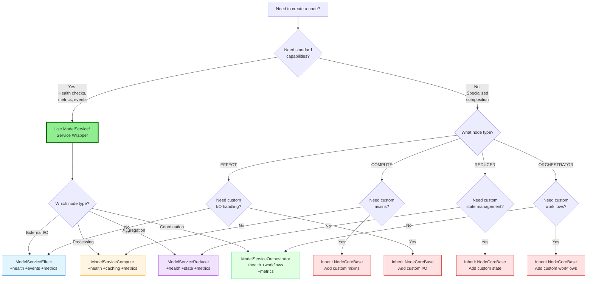

> **Navigation**: [Home](../../INDEX.md) > [Guides](../README.md) > [Node Building](./README.md) > Node Types

> **Note**: For authoritative coding standards, see [CLAUDE.md](../../../CLAUDE.md).

# Node Types

**Reading Time**: 10 minutes
**Prerequisites**: [What is a Node?](01_WHAT_IS_A_NODE.md)
**Next**: [COMPUTE Node Tutorial](03_COMPUTE_NODE_TUTORIAL.md)

## Overview

The ONEX framework defines **four fundamental node types**, each designed for a specific category of operations. Understanding when to use each type is essential for building well-architected systems.

> **v0.4.0 Architecture Update**: `NodeReducer` and `NodeOrchestrator` are now the PRIMARY implementations using FSM-driven state management and workflow-driven coordination respectively. The "Declarative" suffix has been removed. Legacy implementations have been removed from the codebase.

## Handler Delegation

All four node types follow the same fundamental pattern: **nodes are thin shells that delegate to handlers**. The handler contains the business logic. The node provides lifecycle management, dependency injection, and contract enforcement.

```text
Node (thin shell)  -->  Handler (business logic)  -->  Output
        ^                        ^
        |                        |
   ModelONEXContainer       YAML Contract
   (dependency injection)   (declares behavior + handler)
```

Each node type enforces strict output constraints on its handler:

| Node Kind | Allowed Output | Forbidden Output |
|-----------|---------------|-----------------|
| **EFFECT** | `events[]` | `intents[]`, `projections[]`, `result` |
| **COMPUTE** | `result` (required) | `events[]`, `intents[]`, `projections[]` |
| **REDUCER** | `projections[]` | `events[]`, `intents[]`, `result` |
| **ORCHESTRATOR** | `events[]`, `intents[]` | `projections[]`, `result` |

## The Four Node Types

```text
┌────────────────────────────────────────────────────────────────┐
│                    ONEX Four-Node Architecture                 │
├────────────────────────────────────────────────────────────────┤
│                                                                │
│  EFFECT         COMPUTE         REDUCER       ORCHESTRATOR    │
│  ═══════        ════════        ════════      ══════════════   │
│  External       Transform       Aggregate     Coordinate       │
│  I/O            Data            State         Workflows        │
│                                                                │
│  Examples:      Examples:       Examples:     Examples:        │
│  • API calls    • Calculate     • Sum values  • Multi-step     │
│  • Database     • Validate      • Merge data  • Dependencies   │
│  • File I/O     • Transform     • Reduce      • Parallel work  │
│  • Messages     • Filter        • Group       • Error recovery │
│                                                                │
└────────────────────────────────────────────────────────────────┘
```

## EFFECT Node

### Purpose

**Interface with the external world** - APIs, databases, file systems, message queues, and any I/O operations.

### Characteristics

- **Side effects allowed**: Can modify external state
- **I/O operations**: Network, disk, message queues
- **Error handling crucial**: External systems can fail
- **Idempotency important**: Same input → same result (when possible)
- **Resource management**: Connections, file handles, etc.

### When to Use EFFECT

Use an EFFECT node when you need to:

✅ Call an external API
✅ Read from or write to a database
✅ Read from or write to files
✅ Send messages to a queue
✅ Interact with external services
✅ Perform any I/O operation

### Real-World Examples

In the handler delegation pattern, the node is a thin shell. The handler contains the I/O logic.

```python
from omnibase_core.nodes import NodeEffect
from omnibase_core.models.container.model_onex_container import ModelONEXContainer
from omnibase_core.models.dispatch.model_handler_output import ModelHandlerOutput
from omnibase_core.models.events.model_event_envelope import ModelEventEnvelope
from omnibase_core.protocols.infrastructure import ProtocolDatabaseConnection

# The node is a thin shell -- it delegates to its handler
class NodeUserFetcherEffect(NodeEffect):
    """Thin shell for user fetching. Handler owns the database logic."""

    def __init__(self, container: ModelONEXContainer) -> None:
        super().__init__(container)
        # Resolve services via protocol-based DI, not direct attribute access
        self.db = container.get_service(ProtocolDatabaseConnection)

# The handler contains the actual business logic
class HandlerUserFetcher:
    """Handler: fetches user data from database."""

    def __init__(self, db: ProtocolDatabaseConnection) -> None:
        self.db = db

    async def execute(self, envelope: ModelEventEnvelope) -> ModelHandlerOutput[None]:
        """Fetch user by ID from PostgreSQL."""
        user_id = envelope.payload.get("user_id")

        async with self.db.acquire() as conn:
            user_data = await conn.fetchrow(
                "SELECT * FROM users WHERE id = $1",
                user_id
            )

        return ModelHandlerOutput.for_effect(
            input_envelope_id=envelope.metadata.envelope_id,
            correlation_id=envelope.metadata.correlation_id,
            handler_id="user-fetcher-effect",
            events=(ModelEventEnvelope(event_type="user_fetched", payload=dict(user_data) if user_data else {}),),
        )
```

### Key Patterns

**Protocol-Based Dependency Injection**:
```python
from omnibase_core.models.container.model_onex_container import ModelONEXContainer
from omnibase_core.protocols.infrastructure import ProtocolDatabaseConnection
from omnibase_core.protocols.http.protocol_http_client import ProtocolHttpClient

def __init__(self, container: ModelONEXContainer) -> None:
    super().__init__(container)
    # Resolve services via protocol, not direct attribute access
    self.db = container.get_service(ProtocolDatabaseConnection)
    self.http_client = container.get_service(ProtocolHttpClient)
```

**Retry Logic**:
```python
async def process(self, input_data):
    for attempt in range(3):  # Retry up to 3 times
        try:
            return await self._external_call(input_data)
        except TemporaryError:
            if attempt == 2:  # Last attempt
                raise
            await asyncio.sleep(2 ** attempt)  # Exponential backoff
```

**Idempotency**:
```python
# Same input always produces same result (when possible)
async def process(self, input_data):
    # Use idempotency key for operations
    idempotency_key = input_data.operation_id

    # Check if already processed
    if await self.check_processed(idempotency_key):
        return await self.get_previous_result(idempotency_key)

    # Process and store result with key
    result = await self._do_operation(input_data)
    await self.store_result(idempotency_key, result)
    return result
```

---

## COMPUTE Node

### Purpose

**Transform data through pure computation** - calculations, validations, transformations, and algorithm execution.

### Characteristics

- **No side effects**: Pure functions preferred
- **Deterministic**: Same input → same output
- **Performance focused**: Caching, parallel processing
- **CPU-intensive**: Optimized for computation
- **Stateless**: No persistent state

### When to Use COMPUTE

Use a COMPUTE node when you need to:

✅ Calculate or compute values
✅ Validate data structures
✅ Transform data formats
✅ Execute algorithms
✅ Filter or process collections
✅ Any pure computation

### Real-World Examples

COMPUTE nodes delegate pure computation to their handlers. The handler returns a `result` (required for COMPUTE).

```python
from omnibase_core.nodes import NodeCompute
from omnibase_core.models.container.model_onex_container import ModelONEXContainer

# Node: thin shell
class NodeDataValidatorCompute(NodeCompute):
    """Thin shell for data validation. Handler owns validation logic."""

    def __init__(self, container: ModelONEXContainer) -> None:
        super().__init__(container)

# Handler: business logic
class HandlerDataValidator:
    """Handler: validates data structure and business rules."""

    async def execute(self, envelope: ModelEventEnvelope) -> ModelHandlerOutput[dict]:
        """Validate user registration data."""
        data = envelope.payload.get("data", {})
        errors: list[str] = []

        if not self._valid_email(data.get("email")):
            errors.append("Invalid email format")

        if not self._valid_password(data.get("password")):
            errors.append("Password too weak")

        if data.get("age", 0) < 18:
            errors.append("Must be 18+")

        # COMPUTE handlers must return result
        return ModelHandlerOutput.for_compute(
            input_envelope_id=envelope.metadata.envelope_id,
            correlation_id=envelope.metadata.correlation_id,
            handler_id="data-validator-compute",
            result={"valid": len(errors) == 0, "errors": errors},
        )

# Handler: price calculation
class HandlerPriceCalculator:
    """Handler: calculates total price with tax and discounts."""

    async def execute(self, envelope: ModelEventEnvelope) -> ModelHandlerOutput[dict]:
        """Calculate final price -- pure computation, no I/O."""
        cart = envelope.payload.get("cart_items", [])
        discount_code = envelope.payload.get("discount_code")

        subtotal = sum(item["price"] * item["quantity"] for item in cart)
        discount = self._calculate_discount(subtotal, discount_code)
        tax = (subtotal - discount) * 0.08  # 8% tax
        total = subtotal - discount + tax

        return ModelHandlerOutput.for_compute(
            input_envelope_id=envelope.metadata.envelope_id,
            correlation_id=envelope.metadata.correlation_id,
            handler_id="price-calculator-compute",
            result={
                "subtotal": subtotal,
                "discount": discount,
                "tax": tax,
                "total": total,
            },
        )
```

### Key Patterns

**Caching**:
```python
from uuid import uuid4
from omnibase_core.models.container.model_onex_container import ModelONEXContainer
from omnibase_core.models.compute.model_compute_output import ModelComputeOutput
from omnibase_core.models.infrastructure.model_compute_cache import ModelComputeCache

def __init__(self, container: ModelONEXContainer):
    super().__init__(container)
    # Cache expensive computations
    self.computation_cache = ModelComputeCache(
        max_size=1000,
        ttl_seconds=300  # 5 minutes
    )

async def process(self, input_data):
    cache_key = self._generate_cache_key(input_data)
    operation_id = uuid4()

    # Check cache first
    cached = self.computation_cache.get(cache_key)
    if cached:
        return ModelComputeOutput(
            result=cached,
            operation_id=operation_id,
            computation_type="cached_lookup",
            processing_time_ms=0.0,
            cache_hit=True,
        )

    # Compute and cache
    result = await self._compute(input_data)
    self.computation_cache.set(cache_key, result)

    return ModelComputeOutput(
        result=result,
        operation_id=operation_id,
        computation_type="full_compute",
        processing_time_ms=elapsed_ms,
        cache_hit=False,
    )
```

**Parallel Processing**:
```python
import asyncio
from uuid import uuid4
from omnibase_core.models.compute.model_compute_output import ModelComputeOutput

async def process(self, input_data):
    """Process items in parallel for performance."""
    items = input_data.items

    # Process in parallel
    tasks = [self._process_item(item) for item in items]
    results = await asyncio.gather(*tasks)

    return ModelComputeOutput(
        result=results,
        operation_id=uuid4(),
        computation_type="parallel_process",
        processing_time_ms=elapsed_ms,
        parallel_execution_used=True,
    )
```

---

## REDUCER Node

### Purpose

**FSM-driven state management** - pure finite state machine transitions with intent emission for side effects.

> **v0.4.0 Update**: `NodeReducer` is now the PRIMARY implementation using the Pure FSM pattern. Legacy aggregation-focused implementations have been removed from the codebase. See [MIGRATING_TO_DECLARATIVE_NODES.md](../MIGRATING_TO_DECLARATIVE_NODES.md) for migration guidance.

### When to Use REDUCER

Use a REDUCER node when you need to:

✅ Implement finite state machines (FSM)
✅ Manage state transitions with intent emission
✅ Process events into state changes
✅ Sum, average, or aggregate values
✅ Merge data from multiple sources
✅ Group or categorize data

### Design Principles

**Key Principles**:
- **Pure FSM Pattern** - No mutable state, no direct side effects (PRIMARY pattern)
- **Intent Emission** - Emit intents for side effects instead of executing directly
- **Deterministic Transitions** - Same input always produces same state transition
- **Aggregation Operations** - Fold, reduce, accumulate data
- **Streaming Support** - Process large datasets incrementally
- **Conflict Resolution** - Handle data conflicts during merging

---

### Pure FSM Pattern (Primary Implementation)

`NodeReducer` implements the **Pure Finite State Machine (FSM)** pattern with intent emission:

```text
δ(state, action) → (new_state, intents[])
```

**Key Principles**:
- **Pure Function**: No side effects, deterministic state transitions
- **Intent Emission**: Instead of executing side effects directly, emit `ModelIntent` objects
- **Testability**: Easy to test without mocking external systems

**Example: Order Processing FSM**

```python
from omnibase_core.nodes import NodeReducer
from omnibase_core.models.reducer.model_intent import ModelIntent
from omnibase_core.models.fsm.model_fsm_transition_result import ModelFSMTransitionResult
from omnibase_core.models.reducer.payloads import ModelPayloadExtension

class NodeOrderProcessingReducer(NodeReducer):
    """Pure FSM reducer for order processing."""

    def _apply_fsm_transition(self, state: dict, action: str, payload: dict):
        """
        Pure state transition with intent emission.

        Returns: ModelFSMTransitionResult with new_state and intents[]
        """
        if action == "PLACE_ORDER":
            # Compute new state (pure)
            new_state_data = {
                **state,
                "status": "ORDER_PLACED",
                "order_id": str(uuid4()),
                "items": payload.get("items"),
                "total": self._calculate_total(payload.get("items"))
            }

            # Emit intents for side effects (string-based intent_type routing)
            intents = (
                ModelIntent(
                    intent_type="database_write",
                    target="orders_table",
                    payload=ModelPayloadExtension(
                        extension_type="database_write",
                        data={"operation": "insert", "data": new_state_data},
                    ),
                ),
                ModelIntent(
                    intent_type="notification",
                    target="email_service",
                    payload=ModelPayloadExtension(
                        extension_type="notification",
                        data={"template": "order_confirmation"},
                    ),
                ),
            )

            return ModelFSMTransitionResult(
                success=True,
                new_state="ORDER_PLACED",
                old_state=state.get("status", "INITIAL"),
                transition_name="PLACE_ORDER",
                intents=intents,
            )
```

> **Learn More**: See [ONEX_FOUR_NODE_ARCHITECTURE.md](../../architecture/ONEX_FOUR_NODE_ARCHITECTURE.md#modelintent-architecture) for complete Intent/Action patterns and FSM implementation details.

---

### Aggregation Operations (Secondary Use Case)

> **v0.4.0 Note**: `NodeReducer` is the primary implementation for FSM-driven state management. It also supports aggregation operations as a secondary use case. The examples below demonstrate aggregation patterns that can be implemented within the FSM framework. For pure aggregation without FSM state management, consider whether a `NodeCompute` might be more appropriate.

#### Aggregation Examples

In the handler delegation pattern, the node is a thin shell. The handler contains the aggregation logic.

```python
from uuid import uuid4
from omnibase_core.nodes import NodeReducer
from omnibase_core.models.reducer.model_reducer_output import ModelReducerOutput
from omnibase_core.enums.enum_reducer_types import EnumReductionType
from omnibase_core.models.container.model_onex_container import ModelONEXContainer

# Node: thin shell
class NodeUserStatsReducer(NodeReducer):
    """Thin shell for user statistics aggregation. Handler owns the logic."""

    def __init__(self, container: ModelONEXContainer) -> None:
        super().__init__(container)

# Handler 1: Aggregate user statistics
class HandlerUserStats:
    """Handler: reduces user events into statistics."""

    async def execute(self, events: list) -> ModelReducerOutput:
        """Reduce user events into statistics."""
        stats = {
            "total_events": len(events),
            "unique_users": len(set(e.user_id for e in events)),
            "events_by_type": {},
            "events_by_hour": {},
        }

        for event in events:
            event_type = event.event_type
            stats["events_by_type"][event_type] = (
                stats["events_by_type"].get(event_type, 0) + 1
            )
            hour = event.timestamp.hour
            stats["events_by_hour"][hour] = (
                stats["events_by_hour"].get(hour, 0) + 1
            )

        return ModelReducerOutput(
            result=stats,
            operation_id=uuid4(),
            reduction_type=EnumReductionType.FOLD,
            processing_time_ms=elapsed_ms,
            items_processed=len(events),
        )

# Handler 2: Merge data from multiple sources
class HandlerDataMerger:
    """Handler: merges user data from multiple systems."""

    async def execute(self, user_id: str, sources: list[dict]) -> ModelReducerOutput:
        """Merge user profiles from CRM, billing, support."""
        merged_profile: dict = {}
        conflicts = 0

        for source in sources:
            for key, value in source.items():
                if key not in merged_profile:
                    merged_profile[key] = value
                elif self._should_override(merged_profile[key], value):
                    merged_profile[key] = value
                    conflicts += 1

        return ModelReducerOutput(
            result=merged_profile,
            operation_id=uuid4(),
            reduction_type=EnumReductionType.MERGE,
            processing_time_ms=elapsed_ms,
            items_processed=len(sources),
            conflicts_resolved=conflicts,
        )
```

### Key Patterns

**Streaming Reduction** (handler pattern):
```python
from uuid import uuid4
from omnibase_core.models.reducer.model_reducer_output import ModelReducerOutput
from omnibase_core.enums.enum_reducer_types import EnumReductionType, EnumStreamingMode

class HandlerStreamingReducer:
    """Handler: processes large datasets incrementally."""

    async def execute(self, input_data):
        """Process large dataset incrementally."""
        stream = input_data.data_stream
        accumulator = self._initialize_accumulator()
        items = 0

        # Process in chunks to manage memory
        async for chunk in stream.chunks(size=1000):
            accumulator = self._reduce_chunk(accumulator, chunk)
            items += len(chunk)

        return ModelReducerOutput(
            result=accumulator,
            operation_id=uuid4(),
            reduction_type=EnumReductionType.FOLD,
            processing_time_ms=elapsed_ms,
            items_processed=items,
            streaming_mode=EnumStreamingMode.CONTINUOUS,
        )
```

**Conflict Resolution**:
```python
def _resolve_conflict(self, value_a, value_b, field_name):
    """Resolve conflicts when merging data."""
    if field_name in self.priority_fields:
        # Use priority source
        return value_a if value_a.priority > value_b.priority else value_b

    if isinstance(value_a, dict) and isinstance(value_b, dict):
        # Deep merge objects
        return {**value_a, **value_b}

    # Default: most recent
    return max(value_a, value_b, key=lambda v: v.timestamp)
```

---

## ORCHESTRATOR Node

### Purpose

**Workflow-driven coordination** - orchestrating multiple nodes with lease-based ownership and ModelAction command patterns.

> **v0.4.0 Update**: `NodeOrchestrator` is now the PRIMARY implementation using the ModelAction pattern with lease-based coordination. Legacy workflow implementations have been removed from the codebase. See [MIGRATING_TO_DECLARATIVE_NODES.md](../MIGRATING_TO_DECLARATIVE_NODES.md) for migration guidance.

### Characteristics

- **Workflow coordination**: Manage multi-step processes with ModelAction
- **Lease-based ownership**: Single-writer semantics for concurrent safety
- **Dependency management**: Handle execution order with epoch versioning
- **Error recovery**: Retry, fallback, compensation with action validation
- **Parallel execution**: Coordinate concurrent operations
- **Service integration**: Tie multiple nodes together

### When to Use ORCHESTRATOR

Use an ORCHESTRATOR node when you need to:

✅ Coordinate multi-step workflows with lease management
✅ Manage dependencies between operations
✅ Execute operations in sequence or parallel
✅ Handle complex error recovery with compensation
✅ Implement saga patterns with action tracing
✅ Coordinate multiple services with optimistic concurrency

### ModelAction Pattern (Primary Implementation)

`NodeOrchestrator` uses **ModelAction** for command issuance with **lease-based ownership** and **optimistic concurrency**:

**Key Principles**:
- **Single-Writer Semantics**: Only lease-holding orchestrator can issue actions
- **Epoch Versioning**: Optimistic concurrency prevents lost updates
- **Action Queue**: Structured command execution with validation
- **Traceability**: Full audit trail of orchestration decisions

**Example: Workflow Coordination with Lease Management**

```python
from omnibase_core.nodes import NodeOrchestrator
from omnibase_core.models.orchestrator.model_action import ModelAction
from omnibase_core.enums.enum_workflow_execution import EnumActionType
from omnibase_core.models.dispatch.model_handler_output import ModelHandlerOutput
from omnibase_core.models.events.model_event_envelope import ModelEventEnvelope
from omnibase_core.models.reducer.model_intent import ModelIntent
from omnibase_core.models.reducer.payloads import ModelPayloadExtension

class NodeWorkflowOrchestrator(NodeOrchestrator):
    """Orchestrator with lease-based coordination."""

    async def execute_orchestration(self, envelope: ModelEventEnvelope):
        # Acquire exclusive lease
        lease = await self._acquire_workflow_lease(
            workflow_id=envelope.payload.get("workflow_id"),
            lease_duration=timedelta(minutes=10)
        )

        try:
            # Issue action with lease proof
            action = ModelAction(
                action_id=uuid4(),
                action_type=EnumActionType.ORCHESTRATE,
                lease_id=lease.lease_id,  # Proves ownership
                epoch=lease.epoch,  # Optimistic concurrency
                target_node="reducer",
                command_payload={"workflow_type": "order_processing"},
                correlation_id=envelope.metadata.correlation_id
            )

            # Validate and prepare the action
            await self._validate_action(action)

            # ORCHESTRATOR emits events and intents, NEVER returns result
            return ModelHandlerOutput.for_orchestrator(
                input_envelope_id=envelope.metadata.envelope_id,
                correlation_id=envelope.metadata.correlation_id,
                handler_id="workflow-orchestrator",
                events=(
                    ModelEventEnvelope(
                        event_type="workflow_started",
                        payload={"workflow_id": envelope.payload.get("workflow_id"), "action_id": str(action.action_id)},
                    ),
                ),
                intents=(
                    ModelIntent(
                        intent_type="database_write",
                        target="reducer",
                        payload=ModelPayloadExtension(
                            extension_type="database_write",
                            data={"workflow_type": "order_processing"},
                        ),
                    ),
                ),
            )

        finally:
            # Release lease on completion
            await self._release_workflow_lease(lease)
```

> **Learn More**: See [ONEX_FOUR_NODE_ARCHITECTURE.md](../../architecture/ONEX_FOUR_NODE_ARCHITECTURE.md#modelaction-architecture) for complete Action patterns, lease management, and orchestration details.

### Real-World Examples

Orchestrators coordinate workflows by emitting events and intents. They do **not** return `result` -- that is forbidden for ORCHESTRATOR nodes. Instead, they emit `events[]` and `intents[]`.

```python
from omnibase_core.nodes import NodeOrchestrator
from omnibase_core.models.container.model_onex_container import ModelONEXContainer
from omnibase_core.models.events.model_event_envelope import ModelEventEnvelope

# Example 1: User registration workflow
# The handler emits intents to trigger downstream nodes
class HandlerUserRegistration:
    """Handler: orchestrates user registration via intents."""

    async def execute_orchestration(self, envelope: ModelEventEnvelope) -> ModelHandlerOutput[None]:
        """Emit intents to coordinate registration steps."""
        user_data = envelope.payload

        # Emit intents for each workflow step (no direct node calls)
        return ModelHandlerOutput.for_orchestrator(
            input_envelope_id=envelope.metadata.envelope_id,
            correlation_id=envelope.metadata.correlation_id,
            handler_id="user-registration-orchestrator",
            events=(
                ModelEventEnvelope(event_type="registration_started", payload=user_data),
            ),
            intents=(
                ModelIntent(
                    intent_type="validate",
                    target="data_validator",
                    payload=ModelPayloadExtension(
                        extension_type="validate",
                        data=user_data,
                    ),
                ),
                ModelIntent(
                    intent_type="database_write",
                    target="user_saver",
                    payload=ModelPayloadExtension(
                        extension_type="database_write",
                        data=user_data,
                    ),
                ),
                ModelIntent(
                    intent_type="notification",
                    target="email_sender",
                    payload=ModelPayloadExtension(
                        extension_type="notification",
                        data={"email": user_data["email"], "template": "welcome"},
                    ),
                ),
            ),
        )

# Example 2: Parallel data aggregation
# The orchestrator emits intents; the runtime handles parallelism
class HandlerDataAggregator:
    """Handler: emits intents to fetch from multiple sources in parallel."""

    async def execute_orchestration(self, envelope: ModelEventEnvelope) -> ModelHandlerOutput[None]:
        """Emit parallel fetch intents."""
        user_id = envelope.payload["user_id"]

        return ModelHandlerOutput.for_orchestrator(
            input_envelope_id=envelope.metadata.envelope_id,
            correlation_id=envelope.metadata.correlation_id,
            handler_id="data-aggregator-orchestrator",
            intents=(
                ModelIntent(
                    intent_type="fetch",
                    target="user_fetcher",
                    payload=ModelPayloadExtension(
                        extension_type="fetch",
                        data={"user_id": user_id},
                    ),
                ),
                ModelIntent(
                    intent_type="fetch",
                    target="orders_fetcher",
                    payload=ModelPayloadExtension(
                        extension_type="fetch",
                        data={"user_id": user_id},
                    ),
                ),
                ModelIntent(
                    intent_type="fetch",
                    target="analytics_fetcher",
                    payload=ModelPayloadExtension(
                        extension_type="fetch",
                        data={"user_id": user_id},
                    ),
                ),
            ),
        )
```

### Key Patterns

**Sequential Workflow**:
```python
from omnibase_core.models.dispatch.model_handler_output import ModelHandlerOutput
from omnibase_core.models.events.model_event_envelope import ModelEventEnvelope
from omnibase_core.models.reducer.model_intent import ModelIntent
from omnibase_core.models.reducer.payloads import ModelPayloadExtension

async def process(self, envelope: ModelEventEnvelope):
    """Emit intents for sequential workflow steps.

    ORCHESTRATOR nodes coordinate by emitting ordered intents.
    The runtime handles execution order based on dependencies.
    """
    return ModelHandlerOutput.for_orchestrator(
        input_envelope_id=envelope.metadata.envelope_id,
        correlation_id=envelope.metadata.correlation_id,
        handler_id="sequential-workflow",
        events=(
            ModelEventEnvelope(event_type="sequential_workflow_started", payload=envelope.payload),
        ),
        intents=(
            ModelIntent(
                intent_type="execute",
                target="step_1",
                payload=ModelPayloadExtension(
                    extension_type="execute",
                    data={"input": envelope.payload, "sequence_order": 1},
                ),
            ),
            ModelIntent(
                intent_type="execute",
                target="step_2",
                payload=ModelPayloadExtension(
                    extension_type="execute",
                    data={"depends_on": "step_1", "sequence_order": 2},
                ),
            ),
            ModelIntent(
                intent_type="execute",
                target="step_3",
                payload=ModelPayloadExtension(
                    extension_type="execute",
                    data={"depends_on": "step_2", "sequence_order": 3},
                ),
            ),
        ),
    )
```

**Parallel Workflow**:
```python
from omnibase_core.models.dispatch.model_handler_output import ModelHandlerOutput
from omnibase_core.models.events.model_event_envelope import ModelEventEnvelope
from omnibase_core.models.reducer.model_intent import ModelIntent
from omnibase_core.models.reducer.payloads import ModelPayloadExtension

async def process(self, envelope: ModelEventEnvelope):
    """Emit parallel intents for concurrent operations.

    ORCHESTRATOR emits intents; the runtime handles parallelism.
    All intents without dependencies can execute concurrently.
    """
    return ModelHandlerOutput.for_orchestrator(
        input_envelope_id=envelope.metadata.envelope_id,
        correlation_id=envelope.metadata.correlation_id,
        handler_id="parallel-workflow",
        events=(
            ModelEventEnvelope(event_type="parallel_workflow_started", payload=envelope.payload),
        ),
        intents=(
            ModelIntent(
                intent_type="execute",
                target="operation_a",
                payload=ModelPayloadExtension(
                    extension_type="execute",
                    data={"input": envelope.payload},
                ),
            ),
            ModelIntent(
                intent_type="execute",
                target="operation_b",
                payload=ModelPayloadExtension(
                    extension_type="execute",
                    data={"input": envelope.payload},
                ),
            ),
            ModelIntent(
                intent_type="execute",
                target="operation_c",
                payload=ModelPayloadExtension(
                    extension_type="execute",
                    data={"input": envelope.payload},
                ),
            ),
        ),
    )
```

**Error Recovery**:
```python
from omnibase_core.models.dispatch.model_handler_output import ModelHandlerOutput
from omnibase_core.models.events.model_event_envelope import ModelEventEnvelope
from omnibase_core.models.reducer.model_intent import ModelIntent
from omnibase_core.models.reducer.payloads import ModelPayloadExtension

async def process(self, envelope: ModelEventEnvelope):
    """Emit intents with compensation strategy for error recovery.

    ORCHESTRATOR declares the workflow and its compensation steps.
    The runtime handles execution and triggers compensation on failure.
    """
    return ModelHandlerOutput.for_orchestrator(
        input_envelope_id=envelope.metadata.envelope_id,
        correlation_id=envelope.metadata.correlation_id,
        handler_id="error-recovery-workflow",
        events=(
            ModelEventEnvelope(event_type="workflow_with_compensation_started", payload=envelope.payload),
        ),
        intents=(
            ModelIntent(
                intent_type="execute",
                target="step_1",
                payload=ModelPayloadExtension(
                    extension_type="execute",
                    data={"input": envelope.payload},
                ),
            ),
            ModelIntent(
                intent_type="execute",
                target="step_2",
                payload=ModelPayloadExtension(
                    extension_type="execute",
                    data={
                        "depends_on": "step_1",
                        "on_failure": {"compensate": "step_1_compensate"},
                    },
                ),
            ),
        ),
    )
```

---

## Decision Matrix

Use this table to choose the right node type:

| Question | EFFECT | COMPUTE | REDUCER | ORCHESTRATOR |
|----------|--------|---------|---------|--------------|
| Does it interact with external systems? | ✅ Yes | ❌ No | ❌ No | ⚠️ Indirectly |
| Does it transform data? | ⚠️ Minimal | ✅ Yes | ⚠️ Via aggregation | ❌ No |
| Does it aggregate/combine data? | ❌ No | ❌ No | ✅ Yes | ❌ No |
| Does it coordinate other nodes? | ❌ No | ❌ No | ❌ No | ✅ Yes |
| Can it have side effects? | ✅ Yes | ❌ No (prefer pure) | ⚠️ State only | ⚠️ Via delegation |
| Is it deterministic? | ⚠️ Depends | ✅ Yes | ✅ Yes | ⚠️ Depends |
| Does it need caching? | ⚠️ Sometimes | ✅ Often | ⚠️ Sometimes | ❌ Rare |
| Typical performance? | Slow (I/O) | Fast (CPU) | Medium | Varies |

## Decision Flowchart

```text
Start: What does this node need to do?
│
├─ Interact with external systems? ────────────────────────────────▶ EFFECT
│   (APIs, databases, files, queues)
│
├─ Calculate or transform data? ───────────────────────────────────▶ COMPUTE
│   (Pure computation, validation, algorithms)
│
├─ Aggregate or combine data? ─────────────────────────────────────▶ REDUCER
│   (Sum, merge, consolidate, group)
│
└─ Coordinate multiple operations? ────────────────────────────────▶ ORCHESTRATOR
    (Workflows, dependencies, sequences)
```

## Common Patterns

### Pattern 1: Fetch-Transform-Save

```python
# EFFECT: Fetch from API
fetched = await effect_fetch.process(input)

# COMPUTE: Transform data
transformed = await compute_transform.process(fetched)

# EFFECT: Save to database
saved = await effect_save.process(transformed)

# ORCHESTRATOR: Coordinate workflow
result = await orchestrator.process(input)
```

### Pattern 2: Parallel Fetch-Merge

```python
# EFFECT: Fetch from multiple sources (parallel)
source_a, source_b, source_c = await asyncio.gather(
    effect_a.process(input),
    effect_b.process(input),
    effect_c.process(input)
)

# REDUCER: Merge all sources
merged = await reducer_merge.process([source_a, source_b, source_c])

# ORCHESTRATOR: Coordinate
result = await orchestrator.process(input)
```

### Pattern 3: Validate-Process-Aggregate

```python
# COMPUTE: Validate input
validated = await compute_validate.process(input)

# COMPUTE: Process each item
processed = [await compute_process.process(item) for item in validated]

# REDUCER: Aggregate results
aggregated = await reducer_aggregate.process(processed)

# ORCHESTRATOR: Coordinate
result = await orchestrator.process(input)
```

## Summary

### EFFECT Node
- **Purpose**: External I/O
- **Use when**: Talking to APIs, databases, files
- **Key trait**: Side effects allowed
- **Example**: Database query, API call

### COMPUTE Node
- **Purpose**: Pure computation
- **Use when**: Transforming or calculating data
- **Key trait**: Deterministic, no side effects
- **Example**: Validation, price calculation

### REDUCER Node (v0.4.0 PRIMARY)
- **Purpose**: FSM-driven state management
- **Use when**: State transitions, FSM patterns, aggregation
- **Key trait**: Pure FSM with intent emission
- **Import**: `from omnibase_core.nodes import NodeReducer`
- **Example**: Order processing FSM, event reduction

### ORCHESTRATOR Node (v0.4.0 PRIMARY)
- **Purpose**: Workflow-driven coordination
- **Use when**: Multi-step workflows, lease-based coordination
- **Key trait**: ModelAction with lease management
- **Import**: `from omnibase_core.nodes import NodeOrchestrator`
- **Example**: User registration flow, parallel orchestration

## What's Next?

Ready to build your first node? Start with a COMPUTE node tutorial:

→ [Next: COMPUTE Node Tutorial](03_COMPUTE_NODE_TUTORIAL.md)

Or jump to a specific tutorial:
- [EFFECT Node Tutorial](04_EFFECT_NODE_TUTORIAL.md)
- [REDUCER Node Tutorial](05_REDUCER_NODE_TUTORIAL.md)
- [ORCHESTRATOR Node Tutorial](06_ORCHESTRATOR_NODE_TUTORIAL.md)

## Service Wrapper Decision Guide

### When to Use Service Wrappers vs Custom Nodes



### Why Service Wrappers? 🎯

**Service Wrappers** (ModelService\*) are pre-configured node implementations that combine:
- Base node functionality (EFFECT/COMPUTE/REDUCER/ORCHESTRATOR)
- Essential mixins (health checks, metrics, caching, events)
- Production-ready patterns (error handling, logging, observability)
- Correct mixin ordering and composition

**Benefits**:
- ✅ **Less Code**: 80+ lines of boilerplate eliminated
- ✅ **Best Practices**: Vetted patterns and configurations
- ✅ **Consistency**: Same structure across all nodes
- ✅ **Maintainability**: Framework updates benefit all wrappers
- ✅ **Testing**: Pre-tested integration and composition

**When to Use Custom Nodes**:
- ❌ Need specialized mixin composition
- ❌ Unusual mixin ordering required
- ❌ Custom base class needed
- ❌ Experimental features

**Rule of Thumb**: Start with `ModelService*` wrappers. Only create custom nodes when you have a clear reason why the wrapper doesn't fit your needs.

> See [MIXIN_ARCHITECTURE.md](../../architecture/MIXIN_ARCHITECTURE.md#service-wrappers-and-mixin-mapping) for detailed wrapper composition and MRO information.

## Quick Reference

```python
# v0.4.0 PRIMARY NODE IMPLEMENTATIONS (top-level API)
from omnibase_core.nodes import NodeEffect, NodeCompute, NodeReducer, NodeOrchestrator
from omnibase_core.models.dispatch.model_handler_output import ModelHandlerOutput

# Example: FSM-driven REDUCER (PRIMARY)
from omnibase_core.models.fsm.model_fsm_transition_result import ModelFSMTransitionResult

class MyOrderReducer(NodeReducer):
    """FSM reducer with intent emission."""
    def _apply_fsm_transition(self, state, action, payload):
        # Pure state transition logic
        return ModelFSMTransitionResult(
            success=True, new_state=new_state, old_state=old_state,
            transition_name=action, intents=intents,
        )

# Example: Workflow-driven ORCHESTRATOR (PRIMARY)
class MyWorkflowOrchestrator(NodeOrchestrator):
    """Orchestrator with lease-based coordination."""
    async def execute_orchestration(self, envelope: ModelEventEnvelope):
        # Workflow coordination — returns events/intents, never a typed result
        return ModelHandlerOutput.for_orchestrator(
            input_envelope_id=envelope.metadata.envelope_id,
            correlation_id=envelope.metadata.correlation_id,
            handler_id="my-workflow-orchestrator",
            events=(...,),
            intents=(...,),
        )

# SERVICE WRAPPERS: For production with standard mixins
from omnibase_core.models.services.model_service_effect import ModelServiceEffect
from omnibase_core.models.services.model_service_compute import ModelServiceCompute
from omnibase_core.models.services.model_service_reducer import ModelServiceReducer
from omnibase_core.models.services.model_service_orchestrator import ModelServiceOrchestrator
```
