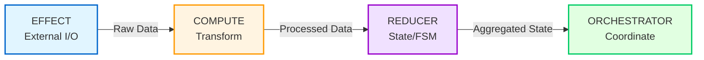

> **Navigation**: [Home](../INDEX.md) > Reference > Node Archetypes

# Node Archetypes Reference

ONEX organizes all processing into four node archetypes. This reference provides complete documentation for each type.

> **Note**: For authoritative coding rules and standards, see [CLAUDE.md](../../CLAUDE.md). This documentation provides explanations and examples that supplement those rules.

## Quick Reference

| Archetype | Contract Type | Base Class | Purpose | Side Effects |
|-----------|---------------|------------|---------|--------------|
| **EFFECT** | `EFFECT_GENERIC` | `NodeEffect` | External I/O operations | Yes |
| **COMPUTE** | `COMPUTE_GENERIC` | `NodeCompute` | Pure transformations | None |
| **REDUCER** | `REDUCER_GENERIC` | `NodeReducer` | FSM state + intent emission | None |
| **ORCHESTRATOR** | `ORCHESTRATOR_GENERIC` | `NodeOrchestrator` | Workflow coordination | Publishes events |

## ModelHandlerOutput Constraints

Each node kind has strict constraints on which output fields are allowed. These are enforced at construction time by `ModelHandlerOutput`.

| Node Kind | `result` | `events[]` | `intents[]` | `projections[]` |
|-----------|----------|------------|-------------|------------------|
| **COMPUTE** | Required | Forbidden | Forbidden | Forbidden |
| **EFFECT** | Forbidden | Allowed | Forbidden | Forbidden |
| **REDUCER** | Forbidden | Forbidden | Forbidden | Allowed |
| **ORCHESTRATOR** | Forbidden | Allowed | Allowed | Forbidden |

Setting a forbidden field raises `ModelOnexError` at construction time. See [Handler Output Constraints](../../CLAUDE.md#handler-output-constraints).

## Data Flow Architecture



**Data Flow Direction**: Unidirectional left-to-right, no backwards dependencies.

## Directory Structure

Every node follows this structure:

```
nodes/<node_name>/
├── contract.yaml     # ONEX contract (required)
├── node.py          # Node class implementation (required)
├── models/          # Node-specific Pydantic models
│   ├── __init__.py
│   └── model_*.py
└── handlers/        # Handler implementations (optional)
    └── handler_*.py
```

---

## EFFECT Archetype

### Purpose

EFFECT nodes handle **external I/O operations** - any interaction with systems outside the ONEX runtime boundary.

### When to Use

- Database operations (PostgreSQL, Qdrant, Redis)
- HTTP/API calls to external services
- File system read/write operations
- Message queue interactions (Kafka, RabbitMQ)
- Service discovery (Consul, Kubernetes)
- Secret management (Vault)

### Base Class

```python
from omnibase_core.nodes import NodeEffect
```

### Example Implementation

**`contract.yaml`**:
```yaml
contract_version:
  major: 1
  minor: 0
  patch: 0
node_version: "1.0.0"
name: "node_user_storage_effect"
node_type: "EFFECT_GENERIC"
description: "Storage operations for user records."

input_model:
  name: "ModelStorageRequest"
  module: "myapp.nodes.node_user_storage_effect.models"

output_model:
  name: "ModelStorageResult"
  module: "myapp.nodes.node_user_storage_effect.models"

# Capability-oriented naming (what it does, not what it uses)
capabilities:
  - name: "user.storage"
    description: "Store, query, update, and delete user records"
  - name: "user.storage.query"
  - name: "user.storage.upsert"

# External I/O operations
io_operations:
  - operation: "store_user"
    description: "Persist a user record"
    input_fields:
      - record: "ModelUserRecord"
      - correlation_id: "UUID | None"
    output_fields:
      - result: "ModelUpsertResult"
    idempotent: true

  - operation: "query_user"
    description: "Query user by user_id"
    input_fields:
      - user_id: "str"
    output_fields:
      - record: "ModelUserRecord | None"
    idempotent: true

# Error handling configuration
error_handling:
  retry_policy:
    max_retries: 3
    exponential_base: 2
    retry_on:
      - "ConnectionError"
      - "TimeoutError"
  circuit_breaker:
    enabled: true
    failure_threshold: 5
    reset_timeout_seconds: 60
```

**`node.py`**:
```python
"""User storage effect node for database operations."""

from __future__ import annotations

from typing import TYPE_CHECKING

from omnibase_core.nodes import NodeEffect

if TYPE_CHECKING:
    from omnibase_core.models.container.model_onex_container import ModelONEXContainer


class NodeUserStorageEffect(NodeEffect):
    """Effect node for user storage operations.

    Capability: user.storage

    This node handles all external database interactions for user records.
    Behavior is driven by contract.yaml configuration.

    Supported backends:
        - PostgreSQL (default)
        - Mock (for testing)
    """

    def __init__(self, container: ModelONEXContainer) -> None:
        """Initialize the storage effect node."""
        super().__init__(container)


__all__ = ["NodeUserStorageEffect"]
```

### Key Characteristics

1. **Capability-Oriented Naming**: Name by what it does ("user.storage"), not technology ("postgres")
2. **Idempotent Operations**: Mark operations as idempotent for safe retries
3. **Error Handling**: Configure circuit breakers and retry policies in contract
4. **Connection Pooling**: Use container-provided connection pools for efficiency
5. **Correlation IDs**: Always include correlation IDs in external calls for tracing

### Real Examples in Codebase

| Node | Path | Capability |
|------|------|------------|
| `NodeEffect` | `omnibase_core/nodes/node_effect.py` | Base class for all EFFECT nodes |

For production EFFECT node implementations, see `omnibase_infra` repository (database writers, API clients, message publishers).

---

## COMPUTE Archetype

### Purpose

COMPUTE nodes perform **pure transformations** - deterministic computations with no side effects.

### When to Use

- Data validation and rule enforcement
- Format conversion and mapping
- Business rule evaluation
- Parsing and serialization
- Algorithm execution
- Price calculations and aggregations

### Base Class

```python
from omnibase_core.nodes import NodeCompute
```

### Example Implementation

**`contract.yaml`**:
```yaml
contract_version:
  major: 1
  minor: 0
  patch: 0
node_version: "1.0.0"
name: "node_data_validator"
node_type: "COMPUTE_GENERIC"
description: "Validates data structures against schema rules."

input_model:
  name: "ModelValidationRequest"
  module: "myapp.nodes.node_data_validator.models"

output_model:
  name: "ModelValidationResult"
  module: "myapp.nodes.node_data_validator.models"

capabilities:
  - name: "data_validation"
  - name: "schema_enforcement"
  - name: "error_reporting"

# Validation rules (contract-driven)
validation_rules:
  - rule_id: "VAL-001"
    name: "Required Fields Check"
    severity: "ERROR"
    description: "Verify all required fields are present"
    detection_strategy:
      type: "field_presence"
      required_fields:
        - "user_id"
        - "email"
        - "created_at"

  - rule_id: "VAL-002"
    name: "Email Format Validation"
    severity: "ERROR"
    description: "Verify email follows valid format"
    detection_strategy:
      type: "regex_pattern"
      field: "email"
      pattern: "^[a-zA-Z0-9_.+-]+@[a-zA-Z0-9-]+\\.[a-zA-Z0-9-.]+$"
```

**`node.py`**:
```python
"""Data validator compute node for schema validation."""

from __future__ import annotations

from typing import TYPE_CHECKING

from omnibase_core.nodes import NodeCompute

if TYPE_CHECKING:
    from omnibase_core.models.container.model_onex_container import ModelONEXContainer


class NodeDataValidator(NodeCompute):
    """Data validator - COMPUTE_GENERIC node.

    Validates data structures against schema rules:
    - VAL-001: Required fields check
    - VAL-002: Email format validation

    Pure computation - no side effects.
    Same input always produces same output.
    """

    def __init__(self, container: ModelONEXContainer) -> None:
        """Initialize the validator node."""
        super().__init__(container)


__all__ = ["NodeDataValidator"]
```

### Key Characteristics

1. **Referential Transparency**: Same input always produces same output
2. **No I/O**: Cannot access databases, APIs, or file system
3. **Deterministic**: Results are predictable and testable
4. **Caching Friendly**: Pure functions enable aggressive caching
5. **Parallel Safe**: Can be safely parallelized without coordination

### Real Examples in Codebase

| Node | Path | Purpose |
|------|------|---------|
| `NodeCompute` | `omnibase_core/nodes/node_compute.py` | Base class for all COMPUTE nodes |

For production COMPUTE node implementations, see `omnibase_infra` repository (data validators, format converters, rule engines).

---

## REDUCER Archetype

### Purpose

REDUCER nodes manage **state aggregation** via FSM (Finite State Machine) and emit intents for effect execution.

### When to Use

- Workflow state management
- Event sourcing patterns
- Multi-step process tracking
- Decision making based on accumulated state
- Aggregating data from multiple sources

### Base Class

```python
from omnibase_core.nodes import NodeReducer
```

### Example Implementation

**`contract.yaml`**:
```yaml
contract_version:
  major: 1
  minor: 0
  patch: 0
node_version: "1.0.0"
name: "node_order_processing_reducer"
node_type: "REDUCER_GENERIC"
description: "FSM-driven reducer for order processing state transitions."

input_model:
  name: "ModelReducerInput"
  module: "omnibase_core.models.reducer.model_reducer_input"

output_model:
  name: "ModelReducerOutput"
  module: "omnibase_core.models.reducer.model_reducer_output"

# FSM State Machine (Single Source of Truth)
state_machine:
  state_machine_name: "order_processing_fsm"
  initial_state: "idle"

  states:
    - state_name: "idle"
      description: "Waiting for order event"
      entry_actions: []
      exit_actions: []

    - state_name: "pending"
      description: "Order placed, awaiting payment"
      entry_actions:
        - "emit_payment_intent"

    - state_name: "confirmed"
      description: "Payment confirmed, ready for fulfillment"
      entry_actions:
        - "emit_fulfillment_intent"

    - state_name: "completed"
      description: "Order fulfilled successfully"
      is_terminal: true

    - state_name: "failed"
      description: "Order failed - requires intervention"
      is_terminal: true

  transitions:
    - from_state: "idle"
      to_state: "pending"
      trigger: "order_placed"
      conditions:
        - expression: "order_id is_present"
          required: true
      actions:
        - action_name: "build_payment_intent"
          action_type: "intent_emission"

    - from_state: "pending"
      to_state: "confirmed"
      trigger: "payment_confirmed"

    - from_state: "confirmed"
      to_state: "completed"
      trigger: "order_fulfilled"

    - from_state: "*"
      to_state: "failed"
      trigger: "error_received"

# Intent emission configuration
intent_emission:
  enabled: true
  intents:
    - intent_type: "payment.process"
      target_pattern: "payment://orders/{order_id}"
      payload_model: "ModelPaymentRequest"
      payload_module: "myapp.nodes.reducers.models"

    - intent_type: "fulfillment.start"
      target_pattern: "fulfillment://orders/{order_id}"
      payload_model: "ModelFulfillmentRequest"
      payload_module: "myapp.nodes.reducers.models"

# Idempotency configuration
idempotency:
  enabled: true
  strategy: "event_id_tracking"
  description: "Track processed event_ids to prevent duplicate processing"
```

**`node.py`**:
```python
"""Order processing reducer with FSM-driven state transitions."""

from __future__ import annotations

from typing import TYPE_CHECKING

from omnibase_core.nodes import NodeReducer

if TYPE_CHECKING:
    from omnibase_core.models.container.model_onex_container import ModelONEXContainer


class NodeOrderProcessingReducer(NodeReducer):
    """Order processing reducer - FSM state transitions driven by contract.yaml.

    All state transition logic, intent emission, and validation are driven
    entirely by the contract.yaml FSM configuration.

    Pattern:
        reduce(state, event) -> (new_state, intents)

    FSM Flow:
        1. Receive order event (trigger: order_placed)
        2. FSM transitions idle -> pending (emits payment intent)
        3. Receive payment confirmation (trigger: payment_confirmed)
        4. FSM transitions pending -> confirmed (emits fulfillment intent)
        5. Receive fulfillment confirmation (trigger: order_fulfilled)
        6. FSM transitions confirmed -> completed
        7. On errors, FSM transitions to failed state
    """

    def __init__(self, container: ModelONEXContainer) -> None:
        """Initialize the reducer."""
        super().__init__(container)


__all__ = ["NodeOrderProcessingReducer"]
```

### State Model Pattern

Reducer state models must be **immutable** with `with_*` transition methods:

```python
from pydantic import BaseModel, ConfigDict
from uuid import UUID


class ModelOrderState(BaseModel):
    """Immutable state for order processing FSM."""

    model_config = ConfigDict(frozen=True, extra="forbid", from_attributes=True)

    status: str = "idle"
    payment_confirmed: bool = False
    fulfillment_confirmed: bool = False
    last_processed_event_id: UUID | None = None

    def with_payment_confirmed(self, event_id: UUID) -> "ModelOrderState":
        """Return NEW instance with payment_confirmed=True."""
        return ModelOrderState(
            status="confirmed",
            payment_confirmed=True,
            fulfillment_confirmed=self.fulfillment_confirmed,
            last_processed_event_id=event_id,
        )

    def is_duplicate_event(self, event_id: UUID) -> bool:
        """Check if event was already processed (idempotency)."""
        return self.last_processed_event_id == event_id
```

### Key Characteristics

1. **Pure Function**: `reduce(state, event) -> (new_state, intents)` - no side effects
2. **FSM-Driven**: All transitions defined in contract, not Python
3. **Immutable State**: State models are frozen, use `with_*` methods for transitions
4. **Intent Emission**: Emit intents for Effect layer to execute
5. **Idempotency**: Track event_ids to prevent duplicate processing

### Real Examples in Codebase

| Node | Path | FSM |
|------|------|-----|
| `NodeReducer` | `omnibase_core/nodes/node_reducer.py` | Base class with FSM support |

For production REDUCER node implementations, see `omnibase_infra` repository (order processing reducers, metrics aggregators, workflow state machines).

---

## ORCHESTRATOR Archetype

### Purpose

ORCHESTRATOR nodes coordinate **workflows** by routing events to handlers and managing multi-step execution.

### When to Use

- Multi-handler workflows
- Event coordination
- Publishing events (ONLY orchestrators can publish)
- Routing intents to effects
- Parallel execution coordination

### Base Class

```python
from omnibase_core.nodes import NodeOrchestrator
```

### Critical Constraint: ORCHESTRATOR Cannot Return Results

**ORCHESTRATOR nodes CANNOT return typed results** - they can only emit **events** and **intents**. Only COMPUTE nodes return typed results. This architectural constraint ensures clear separation of concerns.

```python
from omnibase_core.enums.enum_node_kind import EnumNodeKind
from omnibase_core.models.dispatch.model_handler_output import ModelHandlerOutput

# CORRECT - Orchestrator emits events and intents
output = ModelHandlerOutput[None](
    node_kind=EnumNodeKind.ORCHESTRATOR,
    events=[...],   # Workflow state change events
    intents=[...],  # Side effect requests
    result=None,    # Must be None for ORCHESTRATOR
)

# WRONG - Orchestrator cannot return result
output = ModelHandlerOutput[dict](
    node_kind=EnumNodeKind.ORCHESTRATOR,
    result={"status": "done"},  # ERROR: ORCHESTRATOR cannot set result!
)
# Raises: ModelOnexError: ORCHESTRATOR cannot set result - use events[] and intents[] only.
```

### Example Implementation

**`contract.yaml`**:
```yaml
contract_version:
  major: 1
  minor: 0
  patch: 0
node_version: "1.0.0"
name: "node_order_workflow_orchestrator"
node_type: "ORCHESTRATOR_GENERIC"
description: "Coordinates the order processing workflow."

input_model:
  name: "ModelOrchestratorInput"
  module: "omnibase_core.models.orchestrator.model_orchestrator_input"

output_model:
  name: "ModelOrchestratorOutput"
  module: "omnibase_core.models.orchestrator"

# Workflow definition with execution graph
workflow_coordination:
  workflow_definition:
    workflow_metadata:
      workflow_name: "order_processing_workflow"
      workflow_version: { major: 1, minor: 0, patch: 0 }
      description: "End-to-end order processing"

    execution_graph:
      nodes:
        - node_id: "receive_order"
          node_type: EFFECT_GENERIC
          description: "Receive order event"
          step_config:
            event_pattern: ["order-placed.*"]

        - node_id: "validate_order"
          node_type: COMPUTE_GENERIC
          depends_on: ["receive_order"]
          description: "Validate order data"

        - node_id: "compute_state"
          node_type: REDUCER_GENERIC
          depends_on: ["validate_order"]
          description: "FSM transition and intent computation"

        - node_id: "process_payment"
          node_type: EFFECT_GENERIC
          depends_on: ["compute_state"]
          description: "Process payment"
          step_config:
            intent_filter: "payment.*"

        - node_id: "start_fulfillment"
          node_type: EFFECT_GENERIC
          depends_on: ["process_payment"]
          description: "Start fulfillment"
          step_config:
            intent_filter: "fulfillment.*"

    coordination_rules:
      execution_mode: sequential
      failure_recovery_strategy: retry
      max_retries: 3
      timeout_ms: 30000
      checkpointing:
        enabled: true
        checkpoint_after_steps: ["compute_state"]

# Handler routing (event -> handler mapping)
handler_routing:
  routing_strategy: "payload_type_match"
  handlers:
    - event_model:
        name: "ModelOrderPlacedEvent"
        module: "myapp.models.events"
      handler:
        name: "HandlerOrderPlaced"
        module: "myapp.nodes.node_order_workflow_orchestrator.handlers"
      output_events:
        - "ModelOrderValidated"

# Events published to message bus
published_events:
  - topic: "{env}.{namespace}.orders.evt.order-validated.v1"
    event_type: "OrderValidated"
  - topic: "{env}.{namespace}.orders.evt.order-completed.v1"
    event_type: "OrderCompleted"

# Intent routing to effect nodes
intent_consumption:
  intent_routing_table:
    "payment.process": "node_payment_effect"
    "fulfillment.start": "node_fulfillment_effect"
```

**`node.py`**:
```python
"""Order workflow orchestrator for coordinating order processing."""

from __future__ import annotations

from typing import TYPE_CHECKING

from omnibase_core.nodes import NodeOrchestrator

if TYPE_CHECKING:
    from omnibase_core.models.container.model_onex_container import ModelONEXContainer


class NodeOrderWorkflowOrchestrator(NodeOrchestrator):
    """Declarative orchestrator for order processing workflow.

    All behavior is defined in contract.yaml - no custom logic here.
    Handler routing is driven entirely by the contract.

    Workflow:
        1. Receive order event
        2. Validate order data
        3. Call reducer to compute intents
        4. Execute payment intent via effect node
        5. Execute fulfillment intent via effect node
        6. Publish completion event

    Only orchestrators may publish events to the message bus.
    """

    def __init__(self, container: ModelONEXContainer) -> None:
        """Initialize with container dependency injection."""
        super().__init__(container)


__all__ = ["NodeOrderWorkflowOrchestrator"]
```

### Key Characteristics

1. **ONLY Node Type That Publishes Events**: Handlers return events, orchestrators publish
2. **Cannot Return Results**: Use events[] and intents[] only, result must be None
3. **Workflow Coordination**: Define execution graphs with dependencies
4. **Handler Routing**: Map event types to handler implementations
5. **Intent Routing**: Route intents to appropriate effect nodes
6. **No FSM Logic**: Orchestrators coordinate, reducers own state

### Real Examples in Codebase

| Node | Path | Workflow |
|------|------|----------|
| `NodeOrchestrator` | `omnibase_core/nodes/node_orchestrator.py` | Base class with workflow support |

For production ORCHESTRATOR node implementations, see `omnibase_infra` repository (pipeline orchestrators, saga coordinators).

---

## Summary: When to Use Each Archetype

| Scenario | Archetype | Reason |
|----------|-----------|--------|
| Call external API | EFFECT | External I/O |
| Store data in database | EFFECT | External I/O |
| Validate input data | COMPUTE | Pure transformation |
| Transform data format | COMPUTE | Pure transformation |
| Track workflow state | REDUCER | FSM-driven state |
| Emit intents for backends | REDUCER | Intent emission |
| Coordinate multi-step workflow | ORCHESTRATOR | Workflow coordination |
| Publish events to message bus | ORCHESTRATOR | Only type that can publish |

## Node Classification Enums

ONEX uses two node classification enums with different purposes:

| Enum | Purpose | Values |
|------|---------|--------|
| **EnumNodeKind** | Architectural role (pipeline routing) | `EFFECT`, `COMPUTE`, `REDUCER`, `ORCHESTRATOR`, `RUNTIME_HOST` |
| **EnumNodeType** | Implementation type (discovery/matching) | `COMPUTE_GENERIC`, `EFFECT_GENERIC`, `REDUCER_GENERIC`, `ORCHESTRATOR_GENERIC`, etc. |

**Relationship**: Multiple `EnumNodeType` values map to each `EnumNodeKind`.

## Related Documentation

| Topic | Document |
|-------|----------|
| **Coding standards** | [CLAUDE.md](../../CLAUDE.md) - **authoritative source** for all rules |
| Architecture overview | [ONEX Four-Node Architecture](../architecture/ONEX_FOUR_NODE_ARCHITECTURE.md) |
| Node types guide | [Node Types](../guides/node-building/02_NODE_TYPES.md) |
| COMPUTE tutorial | [COMPUTE Node Tutorial](../guides/node-building/03_COMPUTE_NODE_TUTORIAL.md) |
| EFFECT tutorial | [EFFECT Node Tutorial](../guides/node-building/04_EFFECT_NODE_TUTORIAL.md) |
| REDUCER tutorial | [REDUCER Node Tutorial](../guides/node-building/05_REDUCER_NODE_TUTORIAL.md) |
| ORCHESTRATOR tutorial | [ORCHESTRATOR Node Tutorial](../guides/node-building/06_ORCHESTRATOR_NODE_TUTORIAL.md) |
| Container types | [Container Types](../architecture/CONTAINER_TYPES.md) |
| Execution shapes | [Canonical Execution Shapes](../architecture/CANONICAL_EXECUTION_SHAPES.md) |
