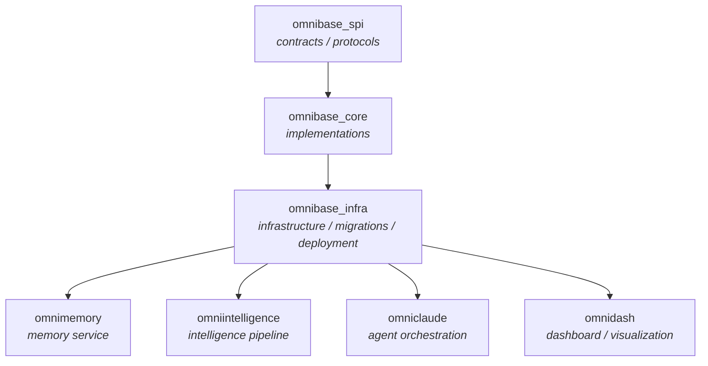

> **Navigation**: [Home](../INDEX.md) > [Standards](onex_terminology.md) > Merge Dependency Graph

# Cross-Repo Merge Dependency Graph

> **Version**: 1.0.0
> **Last Updated**: 2026-02-24
> **Status**: Canonical Reference
> **Purpose**: Cross-repo merge ordering for coordinated multi-repo releases
> **Ticket**: OMN-2290

---

## Table of Contents

1. [Overview](#overview)
2. [Dependency Graph](#dependency-graph)
3. [When Ordering Matters](#when-ordering-matters)
4. [When Ordering Doesn't Matter](#when-ordering-doesnt-matter)
5. [Merge Ordering Rules](#merge-ordering-rules)
6. [High-Throughput Day Protocol](#high-throughput-day-protocol)
7. [Common Scenarios](#common-scenarios)
8. [Related Documentation](#related-documentation)

---

## Overview

On high-throughput days (e.g., Feb 15 with 27 PRs across 7 repos), merge ordering is critical.
SPI contracts must land before infra migrations that depend on them. Intelligence code must release
before infra activation PRs that bump its version. This document makes that ordering explicit.

The dependency graph below defines the **canonical merge order** for coordinated multi-repo
releases. Violating this order can cause version skew, broken migrations, or failed deployments.

---

## Dependency Graph

### Text Representation

```
omnibase_spi (contracts/protocols)
  └── omnibase_core (implementations)
       └── omnibase_infra (infrastructure, migrations, deployment)
            ├── omnimemory (memory service)
            ├── omniintelligence (intelligence pipeline)
            ├── omniclaude (agent orchestration)
            └── omnidash (dashboard/visualization)
```

### Mermaid Diagram



### Layer Summary

| Layer | Repos | Role |
|-------|-------|------|
| **L0 — Contracts** | `omnibase_spi` | Pydantic protocols, SPI interfaces, shared type contracts |
| **L1 — Core** | `omnibase_core` | Concrete implementations of L0 contracts, shared models |
| **L2 — Infra** | `omnibase_infra` | Infrastructure services, DB migrations, Kafka config, deployment |
| **L3 — Services** | `omnimemory`, `omniintelligence`, `omniclaude`, `omnidash` | Application services that depend on L2 infra |

---

## When Ordering Matters

Merge ordering is **required** when a change in a upstream repo creates a dependency that
downstream repos must satisfy before or at the same time.

### 1. SPI Contract Changes (L0 → L1)

**Trigger**: A PR in `omnibase_spi` adds, renames, or removes a protocol method, field, or type.

**Why ordering matters**: `omnibase_core` implements those contracts. If the `omnibase_core`
implementation PR merges before the SPI contract PR, the implementation references a contract
that doesn't exist on `main` yet, breaking any consumer that imports from `omnibase_spi`.

**Rule**: Merge `omnibase_spi` PR first, then `omnibase_core` implementation PR.

---

### 2. Core Model Changes (L1 → L2)

**Trigger**: A PR in `omnibase_core` changes a shared model (field add/remove, type change,
rename) that `omnibase_infra` references in a migration, handler, or config extractor.

**Why ordering matters**: If the infra migration runs against a schema defined by the old
`omnibase_core` model, the migration may produce incorrect column types, missing fields,
or failed validators.

**Rule**: Merge `omnibase_core` PR first, then `omnibase_infra` migration PR.

---

### 3. Version Bumps (L2 → L3)

**Trigger**: An `omnibase_infra` PR bumps the pinned version of a service (`omnimemory`,
`omniintelligence`, etc.) in a deployment manifest or Docker Compose file.

**Why ordering matters**: The bumped version must already be available (merged and tagged on
`main`) before the infra activation PR merges. Otherwise the deployment references a tag that
doesn't exist.

**Rule**: Merge the service PR first (so the tag is created), then merge the infra activation PR.

---

### 4. Schema Migrations (L2 → L3)

**Trigger**: An `omnibase_infra` PR adds a DB migration that a service (e.g., `omnimemory`)
depends on for a new feature.

**Why ordering matters**: If the service PR merges before the migration runs, the service will
attempt to read/write columns that don't exist yet in the target database.

**Rule**: Merge `omnibase_infra` migration PR first, then the service feature PR.

---

### 5. Kafka Topic/Realm Changes (L2 → L3)

**Trigger**: A new Kafka topic or realm is defined in `omnibase_infra` contracts that a
service begins publishing or consuming.

**Why ordering matters**: If the service starts publishing to a topic before the topic is
created in the broker config (via infra PR), the messages will be dropped or rejected.

**Rule**: Merge `omnibase_infra` topic-definition PR first, then the service PR that uses it.

---

## When Ordering Doesn't Matter

Merge ordering is **not required** when changes are fully independent across repos.

### Independent Feature Work

- A PR in `omnimemory` adds a new retrieval algorithm that doesn't change any shared model,
  Kafka topic, or DB schema. Can merge in any order relative to PRs in other repos.

- A PR in `omnidash` updates the UI for an existing API endpoint. No shared contract changes.
  Can merge in any order.

- A PR in `omniclaude` adds a new skill implementation that reads from existing Kafka topics
  and existing DB tables. No schema or contract changes. Can merge in any order.

### Additive-Only Contract Changes

- A PR in `omnibase_spi` adds an **entirely new** protocol that no existing repo implements yet.
  Downstream repos haven't updated to use it yet. Can merge in any order relative to service PRs
  that aren't implementing that protocol yet.

### Documentation and Configuration Only

- A PR that modifies only `docs/`, `README.md`, `.github/`, or CI configuration with no
  semantic changes to code, models, or contracts. Can merge in any order.

---

## Merge Ordering Rules

These rules apply to coordinated multi-repo release batches (e.g., a feature spanning multiple
repos in the same sprint).

### Rule 1: Merge bottom-up by layer

Always merge in ascending layer order (L0 before L1 before L2 before L3). Never merge a
downstream layer before an upstream dependency it relies on.

### Rule 2: Verify upstream CI is green before downstream merges

Before merging a downstream PR, confirm the upstream PR has a green CI run on `main`
(not just the feature branch). This ensures the downstream PR's import is valid against
the canonical version.

### Rule 3: Tag before activation

For version-bump activations in `omnibase_infra`, verify the upstream repo's release tag
exists on GitHub (`gh release list --repo OmniNode-ai/<repo>`) before merging the infra
activation PR.

### Rule 4: Migration before feature

For features that depend on new DB columns or tables, the `omnibase_infra` migration PR
must merge and the migration must be confirmed run in the target environment before the
service feature PR merges.

### Rule 5: Pin versions explicitly

When `omnibase_infra` references a service version, pin to an exact version (e.g.,
`v1.4.2`) rather than a branch or `latest`. This eliminates ambiguity about which commit
the activation targets.

### Rule 6: Document the dependency in the PR description

When a PR is order-dependent, state it explicitly in the PR description:

```
**Merge Order**: This PR must merge AFTER omnibase_spi#<N> is merged.
**Depends on**: omnibase_spi PR #<N> (contract change for ModelFoo)
```

---

## High-Throughput Day Protocol

When more than 10 PRs are open across multiple repos on the same day:

1. **List all PRs by layer**: Group open PRs by their repo's layer (L0/L1/L2/L3).

2. **Identify cross-layer dependencies**: For each L1+ PR, check whether it references
   an unreleased change from an upstream layer.

3. **Create a merge order list**: Document the intended merge sequence as a numbered list
   in the #engineering Slack channel before beginning merges.

4. **Merge in sequence**: Do not merge a downstream PR until the upstream dependency
   shows green CI on `main`.

5. **Hold parallel service PRs until L2 is stable**: If `omnibase_infra` has a pending
   migration, hold all L3 service PRs that depend on that migration until infra merges
   and migration is confirmed applied.

---

## Common Scenarios

### Scenario A: New SPI protocol with implementation and deployment

```
1. Merge: omnibase_spi  — new ModelFooProtocol (L0)
2. Merge: omnibase_core — ModelFooImpl implementing ModelFooProtocol (L1)
3. Merge: omnibase_infra — migration creating foo table (L2)
4. Merge: omnimemory    — NodeFoo consuming ModelFooImpl (L3)
```

### Scenario B: Intelligence service version bump

```
1. Merge: omniintelligence — feature PR (new node, tests passing) (L3)
   → Creates tag v1.5.0 on release
2. Merge: omnibase_infra   — bump omniintelligence to v1.5.0 in manifests (L2)
```

### Scenario C: Dashboard consuming new Kafka topic

```
1. Merge: omnibase_infra — define new topic onex.evt.dashboard.metric.v1 (L2)
   → Topic created in broker
2. Merge: omnidash       — subscribe to onex.evt.dashboard.metric.v1 (L3)
```

### Scenario D: Independent parallel service work (no ordering needed)

```
Merge in any order:
- omnimemory   — add BM25 retrieval (no schema change)
- omniclaude   — new skill (uses existing topics)
- omnidash     — new chart (uses existing API)
```

---

## Related Documentation

| Topic | Document |
|-------|----------|
| CI/CD Standards | `docs/standards/CI_CD_STANDARDS.md` |
| Core-infra boundary | `docs/decisions/ADR-005-core-infra-dependency-boundary.md` |
| Standard doc layout | `docs/standards/STANDARD_DOC_LAYOUT.md` |
| ONEX topic taxonomy | `docs/standards/onex_topic_taxonomy.md` |
| ONEX terminology | `docs/standards/onex_terminology.md` |

---

**Document Version**: 1.0.0
**Created**: 2026-02-24
**Author**: ONEX Framework Team
**Linear Ticket**: OMN-2290
