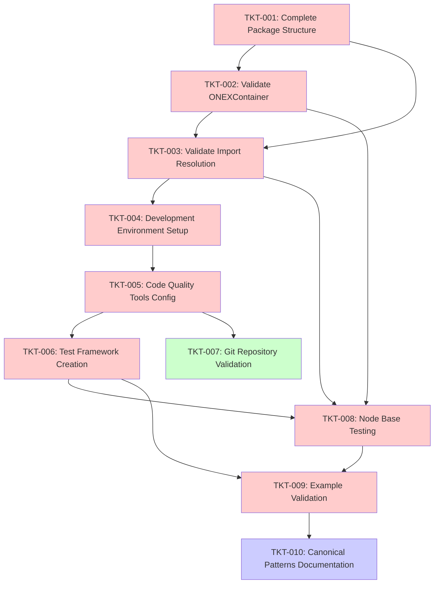

# EPIC-001 Dependency Analysis and Critical Path

## Overview
This document provides comprehensive dependency analysis for EPIC-001: Core Framework Stabilization, including critical path identification, parallel work opportunities, and risk assessment for optimal ticket execution.

## Ticket Dependency Graph

## Critical Path Analysis

### Primary Critical Path (46 hours total)
**TKT-001 → TKT-002 → TKT-003 → TKT-004 → TKT-005 → TKT-006 → TKT-008 → TKT-009**

| Ticket | Estimated Hours | Cumulative Hours | Blocking Factor |
|--------|----------------|------------------|-----------------|
| TKT-001 | 2h | 2h | High (blocks 2 tickets) |
| TKT-002 | 4h | 6h | High (blocks 3 tickets) |
| TKT-003 | 6h | 12h | High (blocks 2 tickets) |
| TKT-004 | 4h | 16h | Medium (blocks 2 tickets) |
| TKT-005 | 6h | 22h | Medium (blocks 2 tickets) |
| TKT-006 | 12h | 34h | High (blocks 2 tickets) |
| TKT-008 | 16h | 50h | High (blocks 1 ticket) |
| TKT-009 | 14h | 64h | Medium (blocks 1 ticket) |

### Secondary Path (10 hours total)
**TKT-007 → TKT-010**
- TKT-007 (Git validation): 2h
- TKT-010 (Documentation): 8h

## Parallel Execution Opportunities

### Phase 1 Parallelization
- **TKT-007 (Git Repository Validation)** can run in parallel with Phase 1-2 tickets
- No dependencies on critical path items
- Low risk, can be executed by different team member

### Phase 2 Optimization
- **TKT-004** and **TKT-007** can be executed simultaneously
- **TKT-005** preparation work can start during **TKT-004** execution

### Phase 3 Preparation
- **TKT-010** preparation (research, outline) can start during **TKT-008** execution
- Documentation structure can be defined while validation is in progress

## Risk Assessment by Phase

### Phase 1 Risks (Critical Path)
**TKT-001: Complete Package Structure**
- Risk Level: LOW
- Impact: HIGH (blocks multiple tickets)
- Mitigation: Simple fix, likely just one missing `__init__.py`

**TKT-002: Validate ONEXContainer Cleanup** 
- Risk Level: LOW-MEDIUM
- Impact: HIGH (architectural foundation)
- Mitigation: Container appears clean, mostly validation work

**TKT-003: Validate Import Resolution**
- Risk Level: MEDIUM
- Impact: HIGH (blocks development environment)
- Mitigation: Complex import issues require systematic approach

### Phase 2 Risks (Development Infrastructure)
**TKT-004: Development Environment Setup**
- Risk Level: MEDIUM
- Impact: MEDIUM
- Mitigation: Poetry/git dependency may have auth issues

**TKT-005: Code Quality Tools Config**
- Risk Level: MEDIUM  
- Impact: MEDIUM
- Mitigation: Protocol patterns may confuse static analysis tools

**TKT-006: Test Framework Creation**
- Risk Level: MEDIUM-HIGH
- Impact: HIGH
- Mitigation: Complex async testing, needs careful architecture

### Phase 3 Risks (Validation & Testing)
**TKT-008: Node Base Testing**
- Risk Level: HIGH
- Impact: HIGH  
- Mitigation: Complex integration testing, requires robust framework

**TKT-009: Example Validation**
- Risk Level: MEDIUM
- Impact: MEDIUM
- Mitigation: Examples may need updates for current architecture

## Optimization Recommendations

### Sprint Planning Strategy
**Sprint 1: Foundation (2 weeks)**
- TKT-001 (2h) - Day 1
- TKT-002 (4h) - Day 1-2  
- TKT-003 (6h) - Day 2-3
- TKT-007 (2h) - Parallel with TKT-003
- TKT-004 (4h) - Day 4

**Sprint 2: Infrastructure (2 weeks)**  
- TKT-005 (6h) - Week 1
- TKT-006 (12h) - Week 1-2

**Sprint 3: Validation (2 weeks)**
- TKT-008 (16h) - Week 1-2
- TKT-009 (14h) - Start preparation during TKT-008

**Sprint 4: Documentation (1 week)**
- TKT-010 (8h) - Week 1

### Resource Allocation
**Senior Developer (Critical Path)**
- TKT-002, TKT-003, TKT-006, TKT-008 (highest complexity)

**Mid-Level Developer (Supporting Work)**  
- TKT-001, TKT-004, TKT-005, TKT-009

**Junior Developer (Documentation & Validation)**
- TKT-007, TKT-010 (with senior review)

### Bottleneck Management
**Primary Bottlenecks:**
1. **TKT-003 (Import Resolution)** - 6h, blocks development setup
2. **TKT-006 (Test Framework)** - 12h, blocks all validation work  
3. **TKT-008 (Node Testing)** - 16h, blocks example validation

**Mitigation Strategies:**
1. Allocate most experienced developer to bottleneck tickets
2. Begin preparation work for downstream tickets during bottleneck execution
3. Create detailed task breakdown for large tickets (TKT-006, TKT-008)

## Success Criteria Validation

### Epic Success Criteria Mapping
- [x] **ONEXContainer uses pure protocol-based resolution** → TKT-002
- [x] **Complete package structure with proper `__init__.py` files** → TKT-001  
- [x] **Python packaging configured with pyproject.toml** → Already complete
- [x] **Git repository properly initialized** → TKT-007
- [x] **Development environment setup** → TKT-004
- [x] **Test framework validates all base classes** → TKT-006, TKT-008
- [x] **Code quality tools configured** → TKT-005
- [x] **Example node implementations validated** → TKT-009

### Quality Gates
Each phase includes comprehensive validation:
- **Phase 1**: Import validation, container functionality
- **Phase 2**: Environment reproducibility, tool effectiveness  
- **Phase 3**: Test coverage >90%, example functionality

## Timeline Estimation

### Optimal Timeline (with parallel execution)
- **Phase 1**: 3 days (with TKT-007 parallel)
- **Phase 2**: 7 days  
- **Phase 3**: 10 days
- **Total**: 20 working days (4 weeks)

### Conservative Timeline (sequential execution)
- **Phase 1**: 4 days
- **Phase 2**: 8 days
- **Phase 3**: 12 days  
- **Total**: 24 working days (5 weeks)

### Risk Buffer Recommendations
- Add 20% buffer for complex tickets (TKT-003, TKT-006, TKT-008)
- Plan for 1-2 day buffer between phases for validation
- Reserve 2-3 days at end for integration issues

## Integration Points

### External Dependencies
- **omnibase-spi v0.0.2**: Required for TKT-002, TKT-004
- **Poetry configuration**: Critical for TKT-004, TKT-005
- **Git repository access**: Required for TKT-004, TKT-007

### Internal Integration Points
- **Base classes + Container**: TKT-002 ↔ TKT-008
- **Test framework + Quality tools**: TKT-005 ↔ TKT-006
- **Examples + Documentation**: TKT-009 ↔ TKT-010

## Monitoring and Metrics

### Progress Tracking KPIs
- **Velocity**: Hours completed per day
- **Quality**: Test coverage percentage increase
- **Blockers**: Time spent on dependency resolution
- **Parallel efficiency**: Parallel vs sequential timeline delta

### Risk Indicators
- **Import errors** during TKT-003: High risk indicator
- **Test coverage <85%** during TKT-008: Quality risk
- **Example failures** during TKT-009: Architecture risk

This analysis provides the foundation for optimal EPIC-001 execution with clear dependency management, risk mitigation, and parallel execution opportunities.